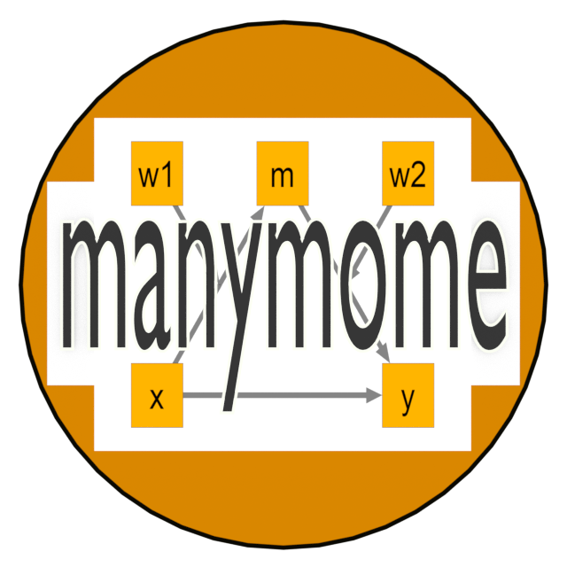

<!-- badges: start -->
[](https://lifecycle.r-lib.org/articles/stages.html#stable)
[](https://www.repostatus.org/#active)
[](https://CRAN.R-project.org/package=manymome)
[](https://cran.r-project.org/package=manymome)
[](https://r-pkg.org/pkg/manymome)
[](https://github.com/sfcheung/manymome)
[](https://github.com/sfcheung/manymome/commits/main)
[](https://github.com/sfcheung/manymome/actions/workflows/R-CMD-check.yaml)
<!-- badges: end -->

(Version 0.1.9.2, updated on 2023-03-11, [release history](https://sfcheung.github.io/manymome/news/index.html))

# manymome  

Functions for estimating indirect effects, conditional indirect
effects, and conditional effects in a model with
moderation, mediation, and/or moderated mediation fitted
by structural equation modelling (SEM) or estimated
by multiple regression.

# What Can It Do?

- Compute an unstandardized or *standardized* *indirect* *effect* or
  *conditional* *indirect* *effect* in a path model.

- Form the *bootstrap* *confidence* *interval* for this effect.

# Advantages

- **A Simpler Workflow**

No need to define any parameters or similar
code when
fitting a model in `lavaan::sem()`. Just focus on fitting
the model first. After a model has
been selected, users can compute the effect for nearly any path, from
nearly any variable, to nearly any other variables, conditional on
nearly any moderators,
and at any levels of the moderators.
(See `vignette("manymome")` for details.)

- **Supports Both SEM-Based and Regression-Based Analysis**

Supports structural equation models fitted by `lavaan::sem()` or by
path models fitted by regression using `lm()`, although the
focus of this package is on structural equation models.
The interface of the main functions are nearly the same for
both approaches.

- **Flexible in the Form of Models**

No limit on the number of predictors, mediators, and
outcome variables, other than those by `lavaan::sem()` and `lm()`.

- **Supports Standardized Effects**

Can estimate standardized indirect effects and standardized
conditional indirect effects without the need to standardize
the variables. The  bootstrap confidence intervals for standardized
effects correctly take into account the sampling variation
of the standardizers (the standard deviations of the predictor
and the outcome variable).

- **Supports Missing Data**

Supports dataset with missing data
through `lavaan::sem()` with full information maximum likelihood (`fiml`).

- **Supports Numeric and Categorical Moderators**

Supports numeric and
categorical moderators. It has a function (`factor2var()`) for the easy
creation of dummy variables in `lavaan::sem()`, and can also capitalize on
the native support of categorical moderators in `lm()`.

- **Less Time for Bootstrapping**

Bootstrapping, which can be time consuming, can
be conducted just once. The main functions for computing indirect effects
and conditional indirect effects can be called as many times as needed without redoing
bootstrapping because they can reuse pregenerated bootstrap
estimates (see `vignette("manymome")` and `vignette("do_boot")`).

- **Supports Latent Variables Mediation**

Supports indirect effects among
latent variables for models fitted by `lavaan::sem()` (see
`vignette("med_lav")`).

# Limitations

Despite the aforementioned advantages, the current version of
`manymome` has the following limitations:

- Does not (officially) support categorical predictors.

- Does not support multisample models (although `lavaan` does).

- Does not support multilevel models (although `lavaan` does).

- Only supports nonparametric bootstrapping and percentile
confidence interval. Does not support other methods such as
Monte Carlo confidence interval or parametric bootstrapping.

- Only supports OLS estimation when `lm()` is used.

We would add more to this list (suggestions are welcomed by
adding [GitHub issues](#issues)) so that users (and we) know when
other tools should be used instead of `manymome`, or whether
we can address these limitations in `manymome` in the future.

# How To Use It?

A good starting point is the Get-Started article (`vignette("manymome")`).

There are also [articles](https://sfcheung.github.io/manymome/articles/index.html) (vignettes) on
special topics, such as how to use `mod_levels()` to set
the levels of the moderators. More will be added.

# Homepage

For more information on this package, please visit its GitHub page:

https://sfcheung.github.io/manymome/

# Installation

The stable version at CRAN can be installed by `install.packages()`:

```{r}
install.packages("manymome")
```

The latest developmental version at GitHub can be installed by `remotes::install_github()`:

```{r}
remotes::install_github("sfcheung/manymome")
```

# Background

We developed the package [`stdmod`](https://sfcheung.github.io/stdmod/)
in 2021 for moderated regression. We included a function
(`stdmod::stdmod_lavaan()`)
for standardized moderation effect in path models fitted
by `lavaan::sem()`. However, in practice, path models nearly
always included indirect effects and so moderated mediation
is common in path models. Moreover, `stdmod` is intended for
moderated regression, not for structural equation modeling. We
thought perhaps we could develop a more general tool for
models fitted by structural equation modelling based on
the interface we used in `stdmod::stdmod_lavaan()`. In our own
projects, we also need to estimate indirect effects in models
frequently. Large sample sizes with missing data are also
common to us, for which bootstrapping is slow even with parallel
processing. Therefore, we developed `manymome` to address these
needs.

# Issues

If you have any suggestions and found any bugs or limitations, please feel
feel to open a GitHub issue. Thanks.

https://github.com/sfcheung/manymome/issues