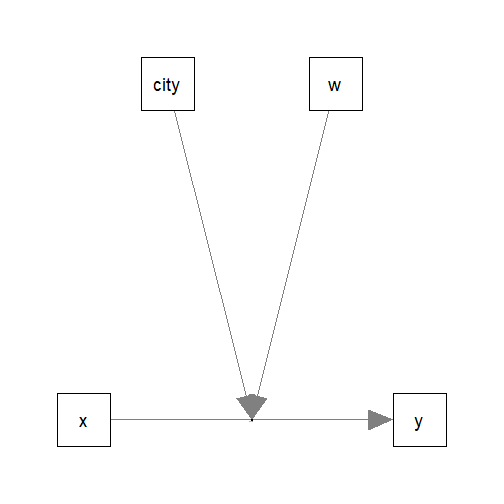

# Moderated Regression: Numerical and Categorical Moderators

## Introduction

This article is part of a series of brief illustrations of how to use
[`cond_effects()`](https://sfcheung.github.io/manymome/reference/cond_indirect.md)
from the package [manymome](https://sfcheung.github.io/manymome/)
(Cheung & Cheung, 2024) to estimate the conditional effects when the
model parameters are estimated by ordinary least squares (OLS) multiple
regression using [`lm()`](https://rdrr.io/r/stats/lm.html). For
moderated mediation tested by OLS regression, please refer to [this
article](https://sfcheung.github.io/manymome/articles/mome_lm.md).

(Articles in this series had duplicated sections to make each of them
self-contained.)

## Data Set and Model

This is the sample data set used for illustration:

``` r

library(manymome)
dat <- data_mod_cat_num_2w
print(head(dat), digits = 3)
#>      x    w    y   c1   c2   city
#> 1 17.4 19.2 18.4 22.5 27.6 City A
#> 2 18.0 18.1 30.8 24.1 17.5 City A
#> 3 19.1 22.7 17.7 29.0 12.0 City A
#> 4 19.5 13.7 24.2 24.6 18.4 City A
#> 5 16.6 24.3 22.0 22.2 20.8 City A
#> 6 17.9 15.6 21.3 24.1 19.8 City A
```

This dataset has 6 variables:

- one outcome variable (`y`),

- one predictor (`x`),

- one numerical moderator (`w`).

- one categorical moderator (`city`),

- two control variables (`c1` and `c2`).

The moderator `city` has two possible values: `"City A"` and `"City B"`.

Models with only numerical moderators or only categorical moderators
have been covered in other articles of this series. Therefore, only two
models will be considered: a model with no three-way interaction and a
model with three-way interaction.

## One Numerical Moderator and One Categorical Moderator

Suppose this is the model being fitted, with control variables omitted
from the plot for readability:



Model

### Fit by Regression

The path parameters can be estimated by multiple regression using
[`lm()`](https://rdrr.io/r/stats/lm.html):

``` r

lm_y <- lm(
  y ~ w*x + city*x + c1 + c2,
  data = dat
)
```

These are the estimates of the regression coefficients of the paths:

``` r

summary(lm_y)
#> 
#> Call:
#> lm(formula = y ~ w * x + city * x + c1 + c2, data = dat)
#> 
#> Residuals:
#>     Min      1Q  Median      3Q     Max 
#> -8.9852 -2.6831 -0.2673  2.8285 12.6873 
#> 
#> Coefficients:
#>              Estimate Std. Error t value Pr(>|t|)    
#> (Intercept)  40.71044    8.09286   5.030 1.12e-06 ***
#> w            -1.32342    0.36592  -3.617 0.000381 ***
#> x            -1.42616    0.42465  -3.358 0.000945 ***
#> cityCity B   -8.43872    4.81058  -1.754 0.080992 .  
#> c1           -0.04418    0.06852  -0.645 0.519863    
#> c2            0.22908    0.06722   3.408 0.000797 ***
#> w:x           0.08828    0.02020   4.370 2.03e-05 ***
#> x:cityCity B  0.57437    0.26404   2.175 0.030832 *  
#> ---
#> Signif. codes:  0 '***' 0.001 '**' 0.01 '*' 0.05 '.' 0.1 ' ' 1
#> 
#> Residual standard error: 4.169 on 192 degrees of freedom
#> Multiple R-squared:  0.4438, Adjusted R-squared:  0.4235 
#> F-statistic: 21.89 on 7 and 192 DF,  p-value: < 2.2e-16
```

### Conditional Effects

We can now use
[`cond_effects()`](https://sfcheung.github.io/manymome/reference/cond_indirect.md)
to estimate the effects of `x` on `y` for different levels of `w` and
different cities.

(Refer to
[`vignette("manymome")`](https://sfcheung.github.io/manymome/articles/manymome.md)
and the help page of
[`cond_effects()`](https://sfcheung.github.io/manymome/reference/cond_indirect.md)
on the arguments.)

``` r

out <- cond_effects(
  wlevels = c("city", "w"),
  x = "x",
  y = "y",
  fit = lm_y
)
out
#> 
#> == Conditional effects ==
#> 
#>  Path: x -> y
#>  Conditional on moderator(s): city, w
#>  Moderator(s) represented by: cityCity B, w
#>  Computation Formula:
#>    (b.y~x + (b.w:x)*(w) + (b.x:cityCity B)*(cityCity B))
#> 
#> 
#>   [city]     [w] (cityCity B)    (w)    ind    SE   Stat pvalue Sig  CI.lo CI.hi
#> 1 City A M+1.0SD            0 24.200  0.710 0.267  2.660  0.008 **   0.184 1.237
#> 2 City A M-1.0SD            0 13.353 -0.247 0.247 -1.001  0.318     -0.735 0.240
#> 3 City B M+1.0SD            1 24.200  1.285 0.151  8.491  0.000 ***  0.986 1.583
#> 4 City B M-1.0SD            1 13.353  0.327 0.170  1.927  0.055     -0.008 0.662
#> 
#>  - [SE] are regression standard errors.
#>  - [Stat] are the t statistics used to test the effects.
#>  - [pvalue] are p-values computed from 'Stat'.
#>  - [Sig]: 0 '***' 0.001 '**' 0.01 '*' 0.05 ' ' 1.
#>  - [CI.lo to CI.hi] are 95.0% confidence interval computed from regression standard errors.
#>  - The 'ind' column shows the conditional effects.
#>   - Call 'print_all_cond_indirect_effects()' to print the detailed outputs of all levels.
```

The column `ind` shows the effects of `x` on `y` for combinations of the
levels of the moderators.

IMPORTANT: Even though this model does not have a three-way interaction,
the conditional effects still need to consider *both* moderators. It is
because the effect of `x` depends on *all* moderators, whether there is
a higher-order interaction or not.

If one or more moderators are omitted, a *warning message* will be
issued. This is an example:

``` r

cond_effects(
  wlevels = "w",
  x = "x",
  y = "y",
  fit = lm_y
)
#> Warning in (function (xi, yi, yiname, digits = 3, y, wvalues = NULL, warn = TRUE, : cityCity B modelled as moderator(s)
#> for the path from y~x to y but not included in 'wvalues'. They will be set to zero in computing the conditional effect,
#> which may not be meaningful. Please check.
#> Warning in (function (xi, yi, yiname, digits = 3, y, wvalues = NULL, warn = TRUE, : cityCity B modelled as moderator(s)
#> for the path from y~x to y but not included in 'wvalues'. They will be set to zero in computing the conditional effect,
#> which may not be meaningful. Please check.
#> Warning in (function (xi, yi, yiname, digits = 3, y, wvalues = NULL, warn = TRUE, : cityCity B modelled as moderator(s)
#> for the path from y~x to y but not included in 'wvalues'. They will be set to zero in computing the conditional effect,
#> which may not be meaningful. Please check.
#> 
#> == Conditional effects ==
#> 
#>  Path: x -> y
#>  Conditional on moderator(s): w
#>  Moderator(s) represented by: w
#>  Computation Formula:
#>    (b.y~x + (b.w:x)*(w) + (b.x:cityCity B)*(cityCity B))
#> 
#> 
#>       [w]    (w)    ind    SE   Stat pvalue Sig  CI.lo CI.hi
#> 1 M+1.0SD 24.200  0.710 0.267  2.660  0.008  **  0.184 1.237
#> 2 Mean    18.777  0.231 0.233  0.994  0.321     -0.228 0.691
#> 3 M-1.0SD 13.353 -0.247 0.247 -1.001  0.318     -0.735 0.240
#> 
#>  - [SE] are regression standard errors.
#>  - [Stat] are the t statistics used to test the effects.
#>  - [pvalue] are p-values computed from 'Stat'.
#>  - [Sig]: 0 '***' 0.001 '**' 0.01 '*' 0.05 ' ' 1.
#>  - [CI.lo to CI.hi] are 95.0% confidence interval computed from regression standard errors.
#>  - The 'ind' column shows the conditional effects.
#>   - Call 'print_all_cond_indirect_effects()' to print the detailed outputs of all levels.
```

NOTE: The standard error (`SE`) and related results are computed using
the pick-a-point approach by Rogosa (1980).

### Plotting the Conditional Effects

The output of
[`cond_effects()`](https://sfcheung.github.io/manymome/reference/cond_indirect.md)
has a `plot` method for plotting the conditional effects:

``` r

plot(out)
```


Conventional Plot of Conditional Effects

By default, the lines span the range of one standard deviation below and
above the mean of the predictor.

The plot can be customized in a lot of ways. Please refer to the help
page of
[`plot.cond_indirect_effects()`](https://sfcheung.github.io/manymome/reference/plot.cond_indirect_effects.md)
for available options.

For two or more moderators, it is not easy to visualize the conditional
effects if all lines are plotted on the same graph.

The argument `facet_grid_cols` can be used to plot the effect of one
moderator for each level of the other moderator.

In this case, it is natural to plot the moderating effect of `w` in each
city:

``` r

plot(out,
     facet_grid_cols = "city")
```


Conventional Plot of Conditional Effects (by city)

Note that, without three-way interaction, the *moderating effect* of `w`
is the same in all cities. The lines are different simply because the
effect of `x` depends on *both* `w` and `city`. They do *not* denote a
three-way interaction (because it is not in the regression model).

#### Tumble Plot

If the distribution of the `x` variable may vary for different levels of
the moderators, a version of *tumble graph* proposed by Bodner (2016)
can be plotted by adding `graph_type = "tumble"`:

``` r

plot(out,
     facet_grid_cols = "city",
     graph_type = "tumble")
```


Tumble Plot of Conditional Effects (by city)

In this example, the distributions of `x` for the two cities are
different: The standard deviations of `x` are larger in City B.
Therefore, the tumble graph is more appropriate than the conventional
graph.

### Standardized Conditional Effects

Although OLS can be used to estimate and test the unstandardized
effects, it is inappropriate for forming the confidence intervals for
the standardized effects. See Yuan & Chan (2011) on the issue of
standardized regression coefficients.

To form nonparametric bootstrap confidence intervals for effects to be
computed, add `boot_ci = TRUE`, `R` to the number of bootstrap samples
(should be 5000 or even 10000, for multiple regression), and `seed` (set
it to an integer to ensure the results are reproducible).

The standardized conditional effects from `x` to `y` conditional on `w`
and `city` can be estimated by setting `standardized_x` and
`standardized_y` to `TRUE`.

This is the output:

``` r

std <- cond_effects(
  wlevels = c("city", "w"),
  x = "x",
  y = "y",
  fit = lm_y,
  boot_ci = TRUE,
  R = 5000,
  seed = 54532,
  standardized_x = TRUE,
  standardized_y = TRUE
)
#> 19 processes started to run bootstrapping.
std
#> 
#> == Conditional effects ==
#> 
#>  Path: x -> y
#>  Conditional on moderator(s): city, w
#>  Moderator(s) represented by: cityCity B, w
#>  Computation Formula:
#>    (b.y~x + (b.w:x)*(w) + (b.x:cityCity B)*(cityCity B))*sd_x/sd_y
#> 
#> 
#>   [city]     [w] (cityCity B)    (w)    std  CI.lo CI.hi Sig    ind
#> 1 City A M+1.0SD            0 24.200  0.383  0.090 0.679 Sig  0.710
#> 2 City A M-1.0SD            0 13.353 -0.133 -0.492 0.194     -0.247
#> 3 City B M+1.0SD            1 24.200  0.692  0.538 0.851 Sig  1.285
#> 4 City B M-1.0SD            1 13.353  0.176 -0.016 0.350      0.327
#> 
#>  - [CI.lo to CI.hi] are 95.0% percentile confidence intervals by nonparametric bootstrapping with 5000
#>    samples.
#>  - std: The standardized conditional effects. 
#>  - ind: The unstandardized conditional effects.
#>   - Call 'print_all_cond_indirect_effects()' to print the detailed outputs of all levels.
```

#### Plot Standardized Conditional Effects

The [`plot()`](https://rdrr.io/r/graphics/plot.default.html) method can
also be used on the standardized conditional effects, although the only
differences are the values displayed on the axes:

``` r

plot(std,
     facet_grid_cols = "city",
     graph_type = "tumble")
```


Tumble Plot of Standardized Conditional Effects (by city)

## One Numerical Moderator and One Categorical Moderator, with Three-Way Interaction

Suppose that we suspect that the two moderators interact with each
other. That is, the moderating effect of `w` on the effect of `x` may
not be the same in the two cities.

The steps demonstrated above can also be used in this regression model:

``` r

lm_y_city_x_w <- lm(
  y ~ x*city*w + c1 + c2,
  data = dat
)
```

These are the estimates of the regression coefficients of this model:

``` r

summary(lm_y_city_x_w)
#> 
#> Call:
#> lm(formula = y ~ x * city * w + c1 + c2, data = dat)
#> 
#> Residuals:
#>     Min      1Q  Median      3Q     Max 
#> -8.5552 -2.6543 -0.2097  2.5379 13.0804 
#> 
#> Coefficients:
#>                Estimate Std. Error t value Pr(>|t|)    
#> (Intercept)     8.00474   13.73622   0.583 0.560754    
#> x               0.56284    0.74693   0.754 0.452058    
#> cityCity B     33.04780   15.79870   2.092 0.037785 *  
#> w               0.55856    0.71716   0.779 0.437037    
#> c1             -0.04241    0.06614  -0.641 0.522120    
#> c2              0.23012    0.06622   3.475 0.000632 ***
#> x:cityCity B   -2.02718    0.87260  -2.323 0.021229 *  
#> x:w            -0.02640    0.04021  -0.657 0.512205    
#> cityCity B:w   -2.33308    0.82853  -2.816 0.005377 ** 
#> x:cityCity B:w  0.14589    0.04601   3.171 0.001773 ** 
#> ---
#> Signif. codes:  0 '***' 0.001 '**' 0.01 '*' 0.05 '.' 0.1 ' ' 1
#> 
#> Residual standard error: 4.022 on 190 degrees of freedom
#> Multiple R-squared:  0.4876, Adjusted R-squared:  0.4634 
#> F-statistic: 20.09 on 9 and 190 DF,  p-value: < 2.2e-16
```

The three-way interaction term, `x:city City B:w`, is significant,
suggesting a three-way interaction.

### Conditional Effects

The function
[`cond_effects()`](https://sfcheung.github.io/manymome/reference/cond_indirect.md)
can be used in exactly the same way, whether the moderators interact
with each other or not:

``` r

out_city_x_w <- cond_effects(
  wlevels = c("city", "w"),
  x = "x",
  y = "y",
  fit = lm_y_city_x_w
)
out_city_x_w
#> 
#> == Conditional effects ==
#> 
#>  Path: x -> y
#>  Conditional on moderator(s): city, w
#>  Moderator(s) represented by: cityCity B, w
#>  Computation Formula:
#>    (b.y~x + (b.x:cityCity B)*(cityCity B) + (b.x:w)*(w) + (b.x:cityCity B:w)*(cityCity B*w))
#> 
#> 
#>   [city]     [w] (cityCity B)    (w)    ind    SE   Stat pvalue Sig  CI.lo CI.hi
#> 1 City A M+1.0SD            0 24.200 -0.076 0.344 -0.221  0.825     -0.754 0.602
#> 2 City A M-1.0SD            0 13.353  0.210 0.285  0.738  0.461     -0.352 0.772
#> 3 City B M+1.0SD            1 24.200  1.427 0.156  9.170  0.000 ***  1.120 1.734
#> 4 City B M-1.0SD            1 13.353  0.131 0.176  0.745  0.457     -0.216 0.479
#> 
#>  - [SE] are regression standard errors.
#>  - [Stat] are the t statistics used to test the effects.
#>  - [pvalue] are p-values computed from 'Stat'.
#>  - [Sig]: 0 '***' 0.001 '**' 0.01 '*' 0.05 ' ' 1.
#>  - [CI.lo to CI.hi] are 95.0% confidence interval computed from regression standard errors.
#>  - The 'ind' column shows the conditional effects.
#>   - Call 'print_all_cond_indirect_effects()' to print the detailed outputs of all levels.
```

The results show that, within one standard deviation of the mean of `w`,
`x` has significant effects only in City B.

### Plotting the Conditional Effects

These are the tumble plots of the conditional effects, with
`facet_grid_cols` set:

``` r

plot(out_city_x_w,
     facet_grid_cols = "city",
     graph_type = "tumble")
```


Tumble Plot of Conditional Effects (By City)

### Standardized Conditional Effects

This is the output of the standardized conditional effects, with
bootstrap confidence intervals:

``` r

std_city_x_w <- cond_effects(
  wlevels = c("city", "w"),
  x = "x",
  y = "y",
  fit = lm_y_city_x_w,
  boot_ci = TRUE,
  R = 5000,
  seed = 54532,
  standardized_x = TRUE,
  standardized_y = TRUE
)
#> 19 processes started to run bootstrapping.
std_city_x_w
#> 
#> == Conditional effects ==
#> 
#>  Path: x -> y
#>  Conditional on moderator(s): city, w
#>  Moderator(s) represented by: cityCity B, w
#>  Computation Formula:
#>    (b.y~x + (b.x:cityCity B)*(cityCity B) + (b.x:w)*(w) + (b.x:cityCity B:w)*(cityCity B*w))*sd_x/sd_y
#> 
#> 
#>   [city]     [w] (cityCity B)    (w)    std  CI.lo CI.hi Sig    ind
#> 1 City A M+1.0SD            0 24.200 -0.041 -0.458 0.343     -0.076
#> 2 City A M-1.0SD            0 13.353  0.113 -0.372 0.433      0.210
#> 3 City B M+1.0SD            1 24.200  0.769  0.626 0.925 Sig  1.427
#> 4 City B M-1.0SD            1 13.353  0.071 -0.127 0.216      0.131
#> 
#>  - [CI.lo to CI.hi] are 95.0% percentile confidence intervals by nonparametric bootstrapping with 5000
#>    samples.
#>  - std: The standardized conditional effects. 
#>  - ind: The unstandardized conditional effects.
#>   - Call 'print_all_cond_indirect_effects()' to print the detailed outputs of all levels.
```

These are the plots of the standardized conditional effects, with
`facet_grid_cols` set:

``` r

plot(std_city_x_w,
     facet_grid_cols = "city",
     graph_type = "tumble")
```


Tumble Plot of Standardized Conditional Effects (By City)

## Other Moderated Regression Models

The function
[`cond_effects()`](https://sfcheung.github.io/manymome/reference/cond_indirect.md)
has no limit on the number of moderators and the number of predictors
with their effects moderated.

The demonstrations of other moderated regression models can be found in
the [list of
articles](https://sfcheung.github.io/manymome/articles/index.html#moderated-regression).

The levels for the moderators are controlled by
[`mod_levels()`](https://sfcheung.github.io/manymome/reference/mod_levels.md)
and related functions in the same way whether a model is fitted by
[`lavaan::sem()`](https://rdrr.io/pkg/lavaan/man/sem.html) or
[`lm()`](https://rdrr.io/r/stats/lm.html). Please refer to other
articles (e.g.,
[`vignette("manymome")`](https://sfcheung.github.io/manymome/articles/manymome.md)
and
[`vignette("mod_levels")`](https://sfcheung.github.io/manymome/articles/mod_levels.md))
on how to estimate effects in other models analyzed by multiple
regression.

## References

Bodner, T. E. (2016). Tumble graphs: Avoiding misleading end point
extrapolation when graphing interactions from a moderated multiple
regression analysis. *Journal of Educational and Behavioral Statistics*,
*41*(6), 593–604. <https://doi.org/10.3102/1076998616657080>

Cheung, S. F., & Cheung, S.-H. (2024). *Manymome*: An R package for
computing the indirect effects, conditional effects, and conditional
indirect effects, standardized or unstandardized, and their bootstrap
confidence intervals, in many (though not all) models. *Behavior
Research Methods*, *56*(5), 4862–4882.
<https://doi.org/10.3758/s13428-023-02224-z>

Rogosa, D. (1980). Comparing nonparallel regression lines.
*Psychological Bulletin*, *88*(2), 307–321.
<https://doi.org/10.1037/0033-2909.88.2.307>

Yuan, K.-H., & Chan, W. (2011). Biases and standard errors of
standardized regression coefficients. *Psychometrika*, *76*(4), 670–690.
<https://doi.org/10.1007/s11336-011-9224-6>
