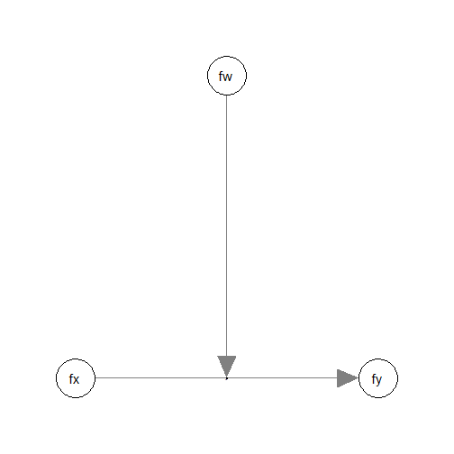
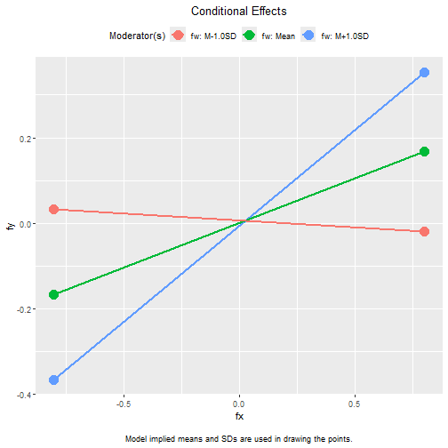
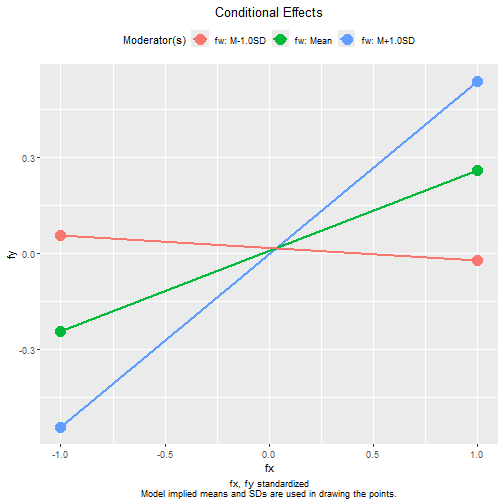

# Latent Variable Moderation by SAM

## Introduction

This article is a brief illustration of how to use
[`cond_indirect_effects()`](https://sfcheung.github.io/manymome/reference/cond_indirect.md)
from the package [manymome](https://sfcheung.github.io/manymome/)
(Cheung & Cheung, 2024) to estimate the conditional effects of a latent
variable when its effect is moderated by another latent variable, given
the model parameters are estimated by the SAM
(structural-after-measurement) method by Rosseel et al. (2025).

## Data Set and Model

This is the sample data set used for illustration:

``` r

library(manymome)
dat <- data_sem_mome
print(head(dat), digits = 3)
#>       x1      x2     x3      x4     w1     w2     w3     w4     m1     m2
#> 1  0.594  0.3010  0.836  0.1931  2.354  0.185  0.851  1.145  0.636  0.528
#> 2 -0.656 -0.0448  0.687  0.0455 -1.838 -0.724 -0.157 -1.078 -1.198 -0.675
#> 3  0.302 -0.0953  0.347 -0.2332  0.744 -0.734  1.855  0.264  0.257 -0.159
#> 4 -2.022 -0.1876 -1.483 -0.6256 -0.519  0.202  0.727  0.382 -0.517 -1.221
#> 5  0.922  0.1873  0.381 -0.0365 -1.779 -0.992 -2.368 -1.089 -0.163 -0.982
#> 6  0.873  1.9889  0.956  1.2211  0.680  0.437  1.750  0.940  1.329  0.573
#>       m3      m4     y1     y2     y3      y4
#> 1  0.280  0.3634 -0.239  0.924  0.168  0.8163
#> 2 -1.124  0.0211  0.408 -1.062 -0.281 -0.0422
#> 3 -0.294 -0.6764 -0.138  0.914  0.177  0.7359
#> 4 -0.340  0.4333 -0.552  0.334 -0.172  0.1154
#> 5 -0.978 -0.0132 -1.268 -1.430 -0.696 -1.5051
#> 6  1.591  0.4417 -0.284 -0.124 -0.351  0.7251
```

This dataset has indicators of the following four latent variables: one
predictor (`fx`), one mediators (`fm`), one outcome variable (`fy`), and
one moderator (`fw`).

Only the latent variables `fx`, `fx`, and `fy` will be used in this
illustration.

Suppose this is the model being fitted:



plot of chunk mo_sam_draw_model

The path from `fx` to `fy` is moderated by `fw`, the moderator.

If this model is fitted to the scale scores, then a product term `fx:fw`
is used to model the moderation.

If the model is for the latent variables, the new approach, SAM
(structural-after-measurement), presented in Rosseel et al. (2025) can
be used, using the function
[`sam()`](https://rdrr.io/pkg/lavaan/man/sam.html) from `lavaan`. This
is the model syntax:

``` r

mod <- "
# Measurement model:
fx =~ x1 + x2 + x3 + x4
fw =~ w1 + w2 + w3 + w4
fy =~ y1 + y2 + y3 + y4

# Structural model:
fy ~ fx + fw + fx:fw
"
```

The moderation effect is modelled by `fx:fw`. To fit this model by SAM,
use [`sam()`](https://rdrr.io/pkg/lavaan/man/sam.html) from `lavaan`. As
recommended by Rosseel et al. (2025), nonparametric bootstrapping will
be used to compute the standard errors and form the confidence
intervals.

``` r

fit <- sam(
  model = mod,
  data = data_sem_mome,
  se = "bootstrap",
  bootstrap.args = list(
    R = 2000
  ),
  iseed = 2345,
  parallel = "snow",
  ncpus = 20
)
```

For details on the SAM approach, consult Rosseel et al. (2025) and
Rosseel & Loh (2024).

This is a summary of the results:

``` r

summary(fit,
        ci = TRUE)
#> This is lavaan 0.6-21 -- using the SAM approach to SEM
#> 
#>   SAM method                                     LOCAL
#>   Mapping matrix M method                           ML
#>   Number of measurement blocks                       3
#>   Estimator measurement part                        ML
#>   Estimator  structural part                        ML
#> 
#>   Number of observations                           500
#> 
#> Summary Information Measurement + Structural:
#> 
#>   Block Latent Nind Chisq Df
#>       1     fw    4 3.416  2
#>       2     fx    4 1.782  2
#>       3     fy    4 2.332  2
#> 
#>   Model-based reliability latent variables:
#> 
#>      fx    fw    fy
#>   0.887 0.881 0.831
#> 
#>   Summary Information Structural part:
#> 
#>   chisq df cfi rmsea srmr
#>       0  0   1     0    0
#> 
#> Parameter Estimates:
#> 
#>   Standard errors                            Bootstrap
#>   Number of requested bootstrap draws             2000
#>   Number of successful bootstrap draws            2000
#> 
#> Regressions:
#>                    Estimate  Std.Err  z-value  P(>|z|) ci.lower ci.upper
#>   fy ~                                                                  
#>     fx                0.208    0.045    4.622    0.000    0.120    0.296
#>     fw               -0.008    0.042   -0.183    0.855   -0.090    0.074
#>     fx:fw             0.288    0.058    5.000    0.000    0.184    0.413
#> 
#> Covariances:
#>                    Estimate  Std.Err  z-value  P(>|z|) ci.lower ci.upper
#>   fx ~~                                                                 
#>     fw               -0.016    0.033   -0.486    0.627   -0.083    0.047
#>     fx:fw            -0.005    0.049   -0.109    0.913   -0.100    0.091
#>   fw ~~                                                                 
#>     fx:fw             0.036    0.045    0.814    0.415   -0.055    0.121
#> 
#> Intercepts:
#>                    Estimate  Std.Err  z-value  P(>|z|) ci.lower ci.upper
#>     fx:fw            -0.016    0.033   -0.486    0.627   -0.083    0.047
#> 
#> Variances:
#>                    Estimate  Std.Err  z-value  P(>|z|) ci.lower ci.upper
#>     fx                0.643    0.064    9.989    0.000    0.520    0.772
#>     fw                0.695    0.065   10.667    0.000    0.564    0.826
#>    .fy                0.381    0.039    9.741    0.000    0.302    0.458
#>     fx:fw             0.436    0.089    4.913    0.000    0.288    0.624
```

## Generating Bootstrap Estimates (Optional)

Although bootstrapping has already been conducted when calling
[`sam()`](https://rdrr.io/pkg/lavaan/man/sam.html), it is recommended to
call
[`do_boot()`](https://sfcheung.github.io/manymome/reference/do_boot.md)
to compute additional statistics, such as implied variances and
covariances, to be used in other functions in `manymome`. Otherwise,
this step needs to be repeated every time those functions are called.

``` r

boot_out <- do_boot(fit)
```

Because bootstrap estimates have already been stored, only the output of
[`sam()`](https://rdrr.io/pkg/lavaan/man/sam.html) is sufficient.

## Conditional Effects

We can now use
[`cond_effects()`](https://sfcheung.github.io/manymome/reference/cond_indirect.md)
to estimate the effect of `fx` on `fy` for different levels of the
moderator (`fw`) and form their bootstrap confidence intervals.
Information stored by
[`do_boot()`](https://sfcheung.github.io/manymome/reference/do_boot.md)
can be reused. There is no need to repeat the resampling.

Suppose we want to estimate the conditional effects from `fx` to `fy`,
conditional on `fw`:

(Refer to
[`vignette("manymome")`](https://sfcheung.github.io/manymome/articles/manymome.md)
and the help page of
[`cond_effects()`](https://sfcheung.github.io/manymome/reference/cond_indirect.md)
on the arguments.)

``` r

out_xy_on_w <- cond_effects(
  wlevels = "fw",
  x = "fx",
  y = "fy",
  fit = fit,
  boot_ci = TRUE,
  boot_out = boot_out
)
out_xy_on_w
#> 
#> == Conditional effects ==
#> 
#>  Path: fx -> fy
#>  Conditional on moderator(s): fw
#>  Moderator(s) represented by: fw
#> 
#>      [fw]   (fw)    ind  CI.lo CI.hi Sig
#> 1 M+1.0SD  0.834  0.448  0.322 0.593 Sig
#> 2 Mean     0.000  0.208  0.120 0.296 Sig
#> 3 M-1.0SD -0.834 -0.032 -0.154 0.092    
#> 
#>  - [CI.lo to CI.hi] are 95.0% percentile confidence intervals by
#>    nonparametric bootstrapping with 2000 samples.
#>  - The 'ind' column shows the conditional effects.
#> 
```

When `fw` is one standard deviation below mean, the indirect effect is
-0.032, with 95% confidence interval \[-0.154, 0.092\].

When `fw` is one standard deviation above mean, the indirect effect is
0.448, with 95% confidence interval \[0.322, 0.593\].

## Standardized Conditional Indirect effects

The standardized conditional indirect effect from `fx` to `fy`
conditional on `fw` can be estimated by setting `standardized_x` and
`standardized_y` to `TRUE`:

``` r

std_xy_on_w <- cond_effects(
  wlevels = "fw",
  x = "fx",
  y = "fy",
  fit = fit,
  boot_ci = TRUE,
  boot_out = boot_out,
  standardized_x = TRUE,
  standardized_y = TRUE
)
std_xy_on_w
#> 
#> == Conditional effects ==
#> 
#>  Path: fx -> fy
#>  Conditional on moderator(s): fw
#>  Moderator(s) represented by: fw
#> 
#>      [fw]   (fw)    std  CI.lo CI.hi Sig    ind
#> 1 M+1.0SD  0.834  0.539  0.405 0.696 Sig  0.448
#> 2 Mean     0.000  0.250  0.147 0.345 Sig  0.208
#> 3 M-1.0SD -0.834 -0.038 -0.187 0.112     -0.032
#> 
#>  - [CI.lo to CI.hi] are 95.0% percentile confidence intervals by
#>    nonparametric bootstrapping with 2000 samples.
#>  - std: The standardized conditional effects. 
#>  - ind: The unstandardized conditional effects.
#> 
```

When `fw` is one standard deviation below mean, the standardized
indirect effect is -0.038, with 95% confidence interval \[-0.187,
0.112\].

When `fw` is one standard deviation above mean, the indirect effect is
0.539, with 95% confidence interval \[0.405, 0.696\].

## Plotting the Conditional Effects

The [`plot()`](https://rdrr.io/r/graphics/plot.default.html) method can
be used on the output of
[`cond_effects()`](https://sfcheung.github.io/manymome/reference/cond_indirect.md).

This is the plot of the conditional effects:

``` r

plot(out_xy_on_w)
```



plot of chunk plot_cond

This is the plot of the standardized conditional effects:

``` r

plot(std_xy_on_w)
```



plot of chunk plot_std

The two plots are *expected* to be identical except for the values on
the axes. It is because they differ merely only the units of the
variables, one standardized and one unstandardized.

Please the [help
page](https://sfcheung.github.io/manymome/reference/plot.cond_indirect_effects.html)
of the [`plot()`](https://rdrr.io/r/graphics/plot.default.html) method
for the output of
[`cond_effects()`](https://sfcheung.github.io/manymome/reference/cond_indirect.md)
on how to customize the plot.

## Reference(s)

Cheung, S. F., & Cheung, S.-H. (2024). *Manymome*: An R package for
computing the indirect effects, conditional effects, and conditional
indirect effects, standardized or unstandardized, and their bootstrap
confidence intervals, in many (though not all) models. *Behavior
Research Methods*, *56*(5), 4862–4882.
<https://doi.org/10.3758/s13428-023-02224-z>

Rosseel, Y., Burghgraeve, E., Loh, W. W., & Schermelleh-Engel, K.
(2025). Structural after measurement (SAM) approaches for accommodating
latent quadratic and interaction effects. *Behavior Research Methods*,
*57*(4), 101. <https://doi.org/10.3758/s13428-024-02532-y>

Rosseel, Y., & Loh, W. W. (2024). A structural after measurement
approach to structural equation modeling. *Psychological Methods*,
*29*(3), 561–588. <https://doi.org/10.1037/met0000503>
