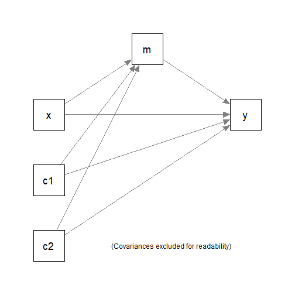
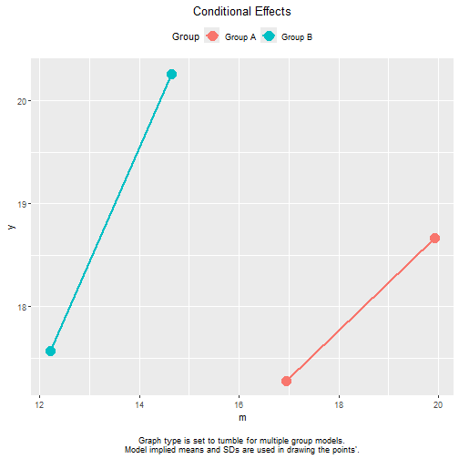

# Introduction

This article is a brief illustration of how to use
[manymome](https://sfcheung.github.io/manymome/index.html)
([Cheung & Cheung, 2024](https://doi.org/10.3758/s13428-023-02224-z))
to compute and test indirect effects
in a multigroup model fitted by
`lavaan`. [^mgver]

This article only focuses on issues specific
to multigroup models. Readers are assumed to have basic
understanding on using `manymome`.
Please refer to
the [Get Started](https://sfcheung.github.io/manymome/articles/manymome.html)
guide for a full introduction, and
[this section](https://sfcheung.github.io/manymome/articles/manymome.html#mediation-only)
on an illustration on a mediation model.

[^mgver]: Support for multigroup model was introduced
in Version 0.1.14.2.

# Model

This is the sample data set that comes with the package:


``` r
library(manymome)
dat <- data_med_mg
print(head(dat), digits = 3)
#>       x    m    y     c1   c2   group
#> 1 10.11 17.0 17.4 1.9864 5.90 Group A
#> 2  9.75 16.6 17.5 0.7748 4.37 Group A
#> 3  9.81 17.9 14.9 0.0973 6.96 Group A
#> 4 10.15 19.7 18.0 2.3974 5.75 Group A
#> 5 10.30 17.7 20.7 3.2225 5.84 Group A
#> 6 10.01 18.9 20.7 2.3631 4.51 Group A
```

Suppose this is the model being fitted, with `c1` and
`c2` the control variables. The grouping variable is `group`,
with two possible values, `"Group A"` and `"Group B"`.



# Fitting the Model

We first fit this multigroup model in
`lavaan::sem()` as usual. There is
no need to label any parameters because
`manymome` will extract the parameters
automatically.


``` r
mod_med <-
"
m ~ x + c1 + c2
y ~ m + x + c1 + c2
"
fit <- sem(model = mod_med,
           data = dat,
           fixed.x = FALSE,
           group = "group")
```

These are the estimates of the paths:


``` r
summary(fit,
        estimates = TRUE)
#> lavaan 0.6-19 ended normally after 1 iteration
#> 
#>   Estimator                                         ML
#>   Optimization method                           NLMINB
#>   Number of model parameters                        40
#> 
#>   Number of observations per group:                   
#>     Group A                                        100
#>     Group B                                        150
#> 
#> Model Test User Model:
#>                                                       
#>   Test statistic                                 0.000
#>   Degrees of freedom                                 0
#>   Test statistic for each group:
#>     Group A                                      0.000
#>     Group B                                      0.000
#> 
#> Parameter Estimates:
#> 
#>   Standard errors                             Standard
#>   Information                                 Expected
#>   Information saturated (h1) model          Structured
#> 
#> 
#> Group 1 [Group A]:
#> 
#> Regressions:
#>                    Estimate  Std.Err  z-value  P(>|z|)
#>   m ~                                                 
#>     x                 0.880    0.093    9.507    0.000
#>     c1                0.264    0.104    2.531    0.011
#>     c2               -0.316    0.095   -3.315    0.001
#>   y ~                                                 
#>     m                 0.465    0.190    2.446    0.014
#>     x                 0.321    0.243    1.324    0.186
#>     c1                0.285    0.204    1.395    0.163
#>     c2               -0.228    0.191   -1.195    0.232
#> 
#> Covariances:
#>                    Estimate  Std.Err  z-value  P(>|z|)
#>   x ~~                                                
#>     c1               -0.080    0.107   -0.741    0.459
#>     c2               -0.212    0.121   -1.761    0.078
#>   c1 ~~                                               
#>     c2               -0.071    0.104   -0.677    0.499
#> 
#> Intercepts:
#>                    Estimate  Std.Err  z-value  P(>|z|)
#>    .m                10.647    1.156    9.211    0.000
#>    .y                 6.724    2.987    2.251    0.024
#>     x                 9.985    0.111   90.313    0.000
#>     c1                2.055    0.097   21.214    0.000
#>     c2                4.883    0.107   45.454    0.000
#> 
#> Variances:
#>                    Estimate  Std.Err  z-value  P(>|z|)
#>    .m                 1.006    0.142    7.071    0.000
#>    .y                 3.633    0.514    7.071    0.000
#>     x                 1.222    0.173    7.071    0.000
#>     c1                0.939    0.133    7.071    0.000
#>     c2                1.154    0.163    7.071    0.000
#> 
#> 
#> Group 2 [Group B]:
#> 
#> Regressions:
#>                    Estimate  Std.Err  z-value  P(>|z|)
#>   m ~                                                 
#>     x                 0.597    0.081    7.335    0.000
#>     c1                0.226    0.087    2.610    0.009
#>     c2               -0.181    0.078   -2.335    0.020
#>   y ~                                                 
#>     m                 1.110    0.171    6.492    0.000
#>     x                 0.264    0.199    1.330    0.183
#>     c1               -0.016    0.186   -0.088    0.930
#>     c2               -0.072    0.165   -0.437    0.662
#> 
#> Covariances:
#>                    Estimate  Std.Err  z-value  P(>|z|)
#>   x ~~                                                
#>     c1                0.102    0.079    1.299    0.194
#>     c2               -0.050    0.087   -0.574    0.566
#>   c1 ~~                                               
#>     c2                0.109    0.083    1.313    0.189
#> 
#> Intercepts:
#>                    Estimate  Std.Err  z-value  P(>|z|)
#>    .m                 7.862    0.924    8.511    0.000
#>    .y                 1.757    2.356    0.746    0.456
#>     x                10.046    0.082  121.888    0.000
#>     c1                2.138    0.078   27.515    0.000
#>     c2                5.088    0.087   58.820    0.000
#> 
#> Variances:
#>                    Estimate  Std.Err  z-value  P(>|z|)
#>    .m                 0.998    0.115    8.660    0.000
#>    .y                 4.379    0.506    8.660    0.000
#>     x                 1.019    0.118    8.660    0.000
#>     c1                0.906    0.105    8.660    0.000
#>     c2                1.122    0.130    8.660    0.000
```

# Generate Bootstrap estimates

We can use `do_boot()` to generate
the bootstrap estimates first
(see [this article](https://sfcheung.github.io/manymome/articles/do_boot.html)
for an illustration on this function).
The argument `ncores` can be omitted
if the default value is acceptable.


``` r
fit_boot_out <- do_boot(fit = fit,
                        R = 5000,
                        seed = 53253,
                        ncores = 8)
#> 8 processes started to run bootstrapping.
```

# Estimate Indirect Effects

## Estimate Each Effect by `indirect_effect()`

The function `indirect_effect()` can be used to as usual
to estimate an indirect effect
and form its bootstrapping or Monte Carlo
confidence interval along a path in a model
that starts with any numeric variable, ends with
any numeric variable, through any numeric variable(s).
A detailed illustration can be found in
[this section](https://sfcheung.github.io/manymome/articles/manymome.html#est_indirect).

For a multigroup model, the only
difference is that users need to specify
the group using the argument `group`.
It can be set to the group label
as used in `lavaan` (`"Group A"`
or `"Group B"` in this example)
or the group number used in `lavaan`


``` r
ind_gpA <- indirect_effect(x = "x",
                           y = "y",
                           m = "m",
                           fit = fit,
                           group = "Group A",
                           boot_ci = TRUE,
                           boot_out = fit_boot_out)
```

This is the output:


``` r
ind_gpA
#> 
#> == Indirect Effect  ==
#>                                             
#>  Path:               Group A[1]: x -> m -> y
#>  Indirect Effect:    0.409                  
#>  95.0% Bootstrap CI: [0.096 to 0.753]       
#> 
#> Computation Formula:
#>   (b.m~x)*(b.y~m)
#> 
#> Computation:
#>   (0.87989)*(0.46481)
#> 
#> 
#> Percentile confidence interval formed by nonparametric bootstrapping
#> with 5000 bootstrap samples.
#> 
#> Coefficients of Component Paths:
#>  Path Coefficient
#>   m~x       0.880
#>   y~m       0.465
#> 
#> NOTE:
#> - The group label is printed before each path.
#> - The group number in square brackets is the number used internally in
#>   lavaan.
```

The indirect effect from `x` to `y` through `m` in
`"Group A"` is 0.409,
with a 95% confidence interval of
[0.096, 0.753],
significantly different from zero (*p* < .05).

We illustrate computing the indirect effect in
`"Group B"`, using group number:


``` r
ind_gpB <- indirect_effect(x = "x",
                           y = "y",
                           m = "m",
                           fit = fit,
                           group = 2,
                           boot_ci = TRUE,
                           boot_out = fit_boot_out)
```

This is the output:


``` r
ind_gpB
#> 
#> == Indirect Effect  ==
#>                                             
#>  Path:               Group B[2]: x -> m -> y
#>  Indirect Effect:    0.663                  
#>  95.0% Bootstrap CI: [0.411 to 0.959]       
#> 
#> Computation Formula:
#>   (b.m~x)*(b.y~m)
#> 
#> Computation:
#>   (0.59716)*(1.11040)
#> 
#> 
#> Percentile confidence interval formed by nonparametric bootstrapping
#> with 5000 bootstrap samples.
#> 
#> Coefficients of Component Paths:
#>  Path Coefficient
#>   m~x       0.597
#>   y~m       1.110
#> 
#> NOTE:
#> - The group label is printed before each path.
#> - The group number in square brackets is the number used internally in
#>   lavaan.
```

The indirect effect from `x` to `y` through `m` in
`"Group B"` is 0.663,
with a 95% confidence interval of
[0.096, 0.753],
also significantly different from zero (*p* < .05).

## Treating Group as a "Moderator"

Instead of computing the indirect effects one-by-one,
we can also treat the grouping variable as
a "moderator" and use
`cond_indirect_effects()` to compute
the indirect effects along a path for
all groups. The detailed illustration
of this function can be found [here](https://sfcheung.github.io/manymome/articles/manymome.html#conditional-indirect-effects).
When use on a multigroup model,
wwe can omit the argument `wlevels`.
The function will automatically identify
all groups in a model, and compute
the indirect effect of the requested
path in each model.


``` r
ind <- cond_indirect_effects(x = "x",
                             y = "y",
                             m = "m",
                             fit = fit,
                             boot_ci = TRUE,
                             boot_out = fit_boot_out)
```

This is the output:


``` r
ind
#> 
#> == Conditional indirect effects ==
#> 
#>  Path: x -> m -> y
#>  Conditional on group(s): Group A[1], Group B[2]
#> 
#>     Group Group_ID   ind CI.lo CI.hi Sig   m~x   y~m
#> 1 Group A        1 0.409 0.096 0.753 Sig 0.880 0.465
#> 2 Group B        2 0.663 0.411 0.959 Sig 0.597 1.110
#> 
#>  - [CI.lo to CI.hi] are 95.0% percentile confidence intervals by
#>    nonparametric bootstrapping with 5000 samples.
#>  - The 'ind' column shows the indirect effects.
#>  - 'm~x','y~m' is/are the path coefficient(s) along the path conditional
#>    on the group(s).
```

The results are identical to those computed
individually using `indirect_effect()`. Using
`cond_indirect_effects()` is convenient when
the number of groups is more than two.

# Compute and Test Between-Group difference

There are several ways to compute and test
the difference in indirect effects between
two groups.

## Using the Math Operator `-`

The math operator `-` (described [here](https://sfcheung.github.io/manymome/reference/math_indirect.html))
can be used if the indirect effects
have been computed individually by
`indirect_effect()`. We have already
computed the path `x->m->y` before
for the two groups. Let us compute the
differences:


``` r
ind_diff <- ind_gpB - ind_gpA
ind_diff
#> 
#> == Indirect Effect  ==
#>                                              
#>  Path:                Group B[2]: x -> m -> y
#>  Path:                Group A[1]: x -> m -> y
#>  Function of Effects: 0.254                  
#>  95.0% Bootstrap CI:  [-0.173 to 0.685]      
#> 
#> Computation of the Function of Effects:
#>  (Group B[2]: x->m->y)
#> -(Group A[1]: x->m->y) 
#> 
#> 
#> Percentile confidence interval formed by nonparametric bootstrapping
#> with 5000 bootstrap samples.
#> 
#> NOTE:
#> - The group label is printed before each path.
#> - The group number in square brackets is the number used internally in
#>   lavaan.
```

The difference in indirect effects from `x` to `y` through `m`
is 0.254,
with a 95% confidence interval of
[-0.173, 0.685],
not significantly different from zero (*p* < .05). Therefore,
we conclude that the two groups are not significantly
different on the indirect effects.

## Using `cond_indirect_diff()`

If the indirect effects are computed using
`cond_indirect_effects()`, we can use the function
`cond_indirect_diff()` to compute the difference
(described [here](https://sfcheung.github.io/manymome/reference/cond_indirect_diff.html))
This is more convenient than using the math
operator when the number of groups is
greater than two.

Let us use `cond_indirect_diff()` on the
output of `cond_indirect_effects()`:


``` r
ind_diff2 <- cond_indirect_diff(ind,
                                from = 1,
                                to = 2)
ind_diff2
#> 
#> == Conditional indirect effects ==
#> 
#>  Path: x -> m -> y
#>  Conditional on group(s): Group B[2], Group A[1]
#> 
#>     Group Group_ID   ind CI.lo CI.hi Sig   m~x   y~m
#> 1 Group B        2 0.663 0.411 0.959 Sig 0.597 1.110
#> 2 Group A        1 0.409 0.096 0.753 Sig 0.880 0.465
#> 
#> == Difference in Conditional Indirect Effect ==
#> 
#> Levels: 
#>        Group      
#> To:    Group B [2]
#> From:  Group A [1]
#> 
#> Levels compared: Group B [2] - Group A [1]
#> 
#> Change in Indirect Effect:
#> 
#>        x y Change  CI.lo CI.hi
#> Change x y  0.254 -0.173 0.685
#> 
#>  - [CI.lo, CI.hi]: 95% percentile confidence interval.
```

The convention is `to` row minus `from` row.
Though may sound not intuitive, the printout
always states clearly which group is subtracted
from which group. The results are identical
to those using the math operator.

# Advanced Skills

## Standardized Indirect Effects

Standardized indirect effects can be computed
as for single-group models (described [here](https://sfcheung.github.io/manymome/articles/manymome.html#standardized-indirect-effect)),
by setting `standardized_x` and/or `standardized_y`.
This is an example:


``` r
std_gpA <- indirect_effect(x = "x",
                           y = "y",
                           m = "m",
                           fit = fit,
                           group = "Group A",
                           boot_ci = TRUE,
                           boot_out = fit_boot_out,
                           standardized_x = TRUE,
                           standardized_y = TRUE)
std_gpA
#> 
#> == Indirect Effect (Both 'x' and 'y' Standardized) ==
#>                                             
#>  Path:               Group A[1]: x -> m -> y
#>  Indirect Effect:    0.204                  
#>  95.0% Bootstrap CI: [0.049 to 0.366]       
#> 
#> Computation Formula:
#>   (b.m~x)*(b.y~m)*sd_x/sd_y
#> 
#> Computation:
#>   (0.87989)*(0.46481)*(1.10557)/(2.21581)
#> 
#> 
#> Percentile confidence interval formed by nonparametric bootstrapping
#> with 5000 bootstrap samples.
#> 
#> Coefficients of Component Paths:
#>  Path Coefficient
#>   m~x       0.880
#>   y~m       0.465
#> 
#> NOTE:
#> - The effects of the component paths are from the model, not
#>   standardized.
#> - SD(s) in the selected group is/are used in standardiziation.
#> - The group label is printed before each path.
#> - The group number in square brackets is the number used internally in
#>   lavaan.
```


``` r
std_gpB <- indirect_effect(x = "x",
                           y = "y",
                           m = "m",
                           fit = fit,
                           group = "Group B",
                           boot_ci = TRUE,
                           boot_out = fit_boot_out,
                           standardized_x = TRUE,
                           standardized_y = TRUE)
std_gpB
#> 
#> == Indirect Effect (Both 'x' and 'y' Standardized) ==
#>                                             
#>  Path:               Group B[2]: x -> m -> y
#>  Indirect Effect:    0.259                  
#>  95.0% Bootstrap CI: [0.166 to 0.360]       
#> 
#> Computation Formula:
#>   (b.m~x)*(b.y~m)*sd_x/sd_y
#> 
#> Computation:
#>   (0.59716)*(1.11040)*(1.00943)/(2.58386)
#> 
#> 
#> Percentile confidence interval formed by nonparametric bootstrapping
#> with 5000 bootstrap samples.
#> 
#> Coefficients of Component Paths:
#>  Path Coefficient
#>   m~x       0.597
#>   y~m       1.110
#> 
#> NOTE:
#> - The effects of the component paths are from the model, not
#>   standardized.
#> - SD(s) in the selected group is/are used in standardiziation.
#> - The group label is printed before each path.
#> - The group number in square brackets is the number used internally in
#>   lavaan.
```

In `"Group A"`, the (completely) standardized indirect effect
from `x` to `y` through `m` is
0.204. In
`"Group B"`, this effect is
0.259.

Note that, unlike single-group model, in multigroup models,
the standardized indirect effect in a group uses the
the standard deviations of `x`- and `y`-variables in this group
to do the standardization. Therefore, two groups can have
different unstandardized
effects on a path but similar standardized effects on the
same path, or have similar unstandardized effects on a path
but different standardized effects on this path. This is a
known phenomenon in multigroup structural equation model.

The difference in the two completely standardized indirect
effects can computed and tested using the math operator `-`:


``` r
std_diff <- std_gpB - std_gpA
std_diff
#> 
#> == Indirect Effect (Both 'x' and 'y' Standardized) ==
#>                                              
#>  Path:                Group B[2]: x -> m -> y
#>  Path:                Group A[1]: x -> m -> y
#>  Function of Effects: 0.055                  
#>  95.0% Bootstrap CI:  [-0.133 to 0.245]      
#> 
#> Computation of the Function of Effects:
#>  (Group B[2]: x->m->y)
#> -(Group A[1]: x->m->y) 
#> 
#> 
#> Percentile confidence interval formed by nonparametric bootstrapping
#> with 5000 bootstrap samples.
#> 
#> NOTE:
#> - The group label is printed before each path.
#> - The group number in square brackets is the number used internally in
#>   lavaan.
```

The difference in completely standardized indirect effects
from `x` to `y` through `m`
is 0.055,
with a 95% confidence interval of
[-0.133, 0.245],
not significantly different from zero (*p* < .05). Therefore,
we conclude that the two groups are also not significantly
different on the completely standardized indirect effects.

The function `cond_indirect_effects()` and
`cond_indirect_diff()` can also be used with standardization:


``` r
std <- cond_indirect_effects(x = "x",
                             y = "y",
                             m = "m",
                             fit = fit,
                             boot_ci = TRUE,
                             boot_out = fit_boot_out,
                             standardized_x = TRUE,
                             standardized_y = TRUE)
std
#> 
#> == Conditional indirect effects ==
#> 
#>  Path: x -> m -> y
#>  Conditional on group(s): Group A[1], Group B[2]
#> 
#>     Group Group_ID   std CI.lo CI.hi Sig   m~x   y~m   ind
#> 1 Group A        1 0.204 0.049 0.366 Sig 0.880 0.465 0.409
#> 2 Group B        2 0.259 0.166 0.360 Sig 0.597 1.110 0.663
#> 
#>  - [CI.lo to CI.hi] are 95.0% percentile confidence intervals by
#>    nonparametric bootstrapping with 5000 samples.
#>  - std: The standardized indirect effects. 
#>  - ind: The unstandardized indirect effects.
#>  - 'm~x','y~m' is/are the path coefficient(s) along the path conditional
#>    on the group(s).
```


``` r
std_diff2 <- cond_indirect_diff(std,
                                from = 1,
                                to = 2)
std_diff2
#> 
#> == Conditional indirect effects ==
#> 
#>  Path: x -> m -> y
#>  Conditional on group(s): Group B[2], Group A[1]
#> 
#>     Group Group_ID   std CI.lo CI.hi Sig   m~x   y~m   ind
#> 1 Group B        2 0.259 0.166 0.360 Sig 0.597 1.110 0.663
#> 2 Group A        1 0.204 0.049 0.366 Sig 0.880 0.465 0.409
#> 
#> == Difference in Conditional Indirect Effect ==
#> 
#> Levels: 
#>        Group      
#> To:    Group B [2]
#> From:  Group A [1]
#> 
#> Levels compared: Group B [2] - Group A [1]
#> 
#> Change in Indirect Effect:
#> 
#>        x y Change  CI.lo CI.hi
#> Change x y  0.055 -0.133 0.245
#> 
#>  - [CI.lo, CI.hi]: 95% percentile confidence interval.
#>  - x standardized.
#>  - y standardized.
```

The results, again, are identical to those using
`indirect_effect()` and the math operator `-`.

## Finding All Indirect Paths in a Multigroup Model

Suppose a model which has more than one, or has many,
indirect paths, is fitted to this dataset:


``` r
dat2 <- data_med_complicated_mg
print(head(dat2), digits = 2)
#>     m11   m12     m2     y1     y2    x1     x2    c1      c2   group
#> 1  1.05  1.17  0.514  0.063  1.027  1.82 -0.365 0.580 -0.3221 Group A
#> 2 -0.48  0.71  0.366 -1.278 -1.442  0.18 -0.012 0.620 -0.8751 Group A
#> 3 -1.18 -2.01 -0.044 -0.177  0.152  0.32 -0.403 0.257 -0.1078 Group A
#> 4  3.64  1.47 -0.815  1.309  0.052  0.98  0.139 0.054  1.2495 Group A
#> 5 -0.41 -0.38 -1.177 -0.151  0.255 -0.36 -1.637 0.275  0.0078 Group A
#> 6  0.18 -1.00 -0.119 -0.588  0.036 -0.53  0.349 0.618 -0.4073 Group A
```


We first fit this model in `lavaan`:


``` r
mod2 <-
"
m11 ~ x1 + x2
m12 ~ m11 + x1 + x2
m2 ~ x1 + x2
y1 ~ m2 + m12 + m11 + x1 + x2
y2 ~ m2 + m12 + m11 + x1 + x2
"
fit2 <- sem(mod2, data = dat2, group = "group")
```

The function `all_indirect_paths()` can be used on a
multigroup model to identify indirect paths. The search
can be restricted by setting arguments such as
`x`, `y`, and `exclude` (see the [help page](file:///C:/GitHub/manymome/docs/reference/all_indirect_paths.html)
for details).

For example, the following identify all paths from `x1`
to `y1`:


``` r
paths_x1_y1 <- all_indirect_paths(fit = fit2,
                                  x = "x1",
                                  y = "y1")
```

If the `group` argument is not specified, it will automatically
identify all paths in all groups, as shown in the printout:


``` r
paths_x1_y1
#> Call: 
#> all_indirect_paths(fit = fit2, x = "x1", y = "y1")
#> Path(s): 
#>   path                          
#> 1 Group A.x1 -> m11 -> m12 -> y1
#> 2 Group A.x1 -> m11 -> y1       
#> 3 Group A.x1 -> m12 -> y1       
#> 4 Group A.x1 -> m2 -> y1        
#> 5 Group B.x1 -> m11 -> m12 -> y1
#> 6 Group B.x1 -> m11 -> y1       
#> 7 Group B.x1 -> m12 -> y1       
#> 8 Group B.x1 -> m2 -> y1
```

We can then use `many_indirect_effects()` to
compute the indirect effects for all paths identified:


``` r
all_ind_x1_y1 <- many_indirect_effects(paths_x1_y1,
                                       fit = fit2)
all_ind_x1_y1
#> 
#> ==  Indirect Effect(s)   ==
#>                                   ind
#> Group A.x1 -> m11 -> m12 -> y1  0.079
#> Group A.x1 -> m11 -> y1         0.106
#> Group A.x1 -> m12 -> y1        -0.043
#> Group A.x1 -> m2 -> y1         -0.000
#> Group B.x1 -> m11 -> m12 -> y1  0.000
#> Group B.x1 -> m11 -> y1         0.024
#> Group B.x1 -> m12 -> y1        -0.000
#> Group B.x1 -> m2 -> y1          0.004
#> 
#>  - The 'ind' column shows the indirect effects.
#> 
```

Bootstrapping and Monte Carlo confidence intervals can
be formed in the same way they are formed for single-group
models.

## Computing, Testing, and Plotting Conditional Effects

Though the focus is on indirect effect,
the main functions in `manymome` can also be used for
computing and plotting the effects along the direct path
between two variables. That is, we can focus on the
moderating effect of group on a direct path.

For example, in the simple mediation model examined
above, suppose we are interested in the between-group
difference in the path from `m` to `y`, the "b path".
We can first
compute the conditional effect using `cond_indirect_effects()`,
without setting the mediator:


``` r
path1 <- cond_indirect_effects(x = "m",
                               y = "y",
                               fit = fit,
                               boot_ci = TRUE,
                               boot_out = fit_boot_out)
path1
#> 
#> == Conditional effects ==
#> 
#>  Path: m -> y
#>  Conditional on group(s): Group A[1], Group B[2]
#> 
#>     Group Group_ID   ind CI.lo CI.hi Sig
#> 1 Group A        1 0.465 0.110 0.819 Sig
#> 2 Group B        2 1.110 0.765 1.475 Sig
#> 
#>  - [CI.lo to CI.hi] are 95.0% percentile confidence intervals by
#>    nonparametric bootstrapping with 5000 samples.
#>  - The 'ind' column shows the direct effects.
#> 
```

The difference between the two paths can be tested
using bootstrapping confidence interval using
`cond_indirect_diff()`:


``` r
path1_diff <- cond_indirect_diff(path1,
                                 from = 1,
                                 to = 2)
path1_diff
#> 
#> == Conditional effects ==
#> 
#>  Path: m -> y
#>  Conditional on group(s): Group B[2], Group A[1]
#> 
#>     Group Group_ID   ind CI.lo CI.hi Sig
#> 1 Group B        2 1.110 0.765 1.475 Sig
#> 2 Group A        1 0.465 0.110 0.819 Sig
#> 
#> == Difference in Conditional Indirect Effect ==
#> 
#> Levels: 
#>        Group      
#> To:    Group B [2]
#> From:  Group A [1]
#> 
#> Levels compared: Group B [2] - Group A [1]
#> 
#> Change in Indirect Effect:
#> 
#>        x y Change CI.lo CI.hi
#> Change m y  0.646 0.148 1.152
#> 
#>  - [CI.lo, CI.hi]: 95% percentile confidence interval.
```

Based on bootstrapping, the effect of `m` on `y`
in `"Group B"` is significantly greater than that
in `"Group A"` (*p* < .05). (This is compatible
with the conclusion on the indirect effects because
two groups can have no difference on `ab` even if
they differ on `a` and/or `b`.)

The `plot` method for the output
of `cond_indirect_effects()` can also be used
for multigroup models:



Note that, for multigroup models, the *tumble*
graph proposed by @bodner_tumble_2016 will
always be used. The position of a line for
a group is determined by the model implied
means and SDs of this group. If no equality
constraints imposed, these means and SDs are
close to the sample means and SDs.
For example,
the line segment of `"Group A"` is far to the right
because `"Group A"` has a larger mean of `m` than
`"Group B"`.

These are the model implied means and SDs:


``` r
# Model implied means
lavInspect(fit, "mean.ov")
#> $`Group A`
#>      m      y      x     c1     c2 
#> 18.434 17.973  9.985  2.055  4.883 
#> 
#> $`Group B`
#>      m      y      x     c1     c2 
#> 13.423 18.915 10.046  2.138  5.088

# Model implied SDs
tmp <- lavInspect(fit, "cov.ov")
sqrt(diag(tmp[["Group A"]]))
#>         m         y         x        c1        c2 
#> 1.4916076 2.2158085 1.1055723 0.9687943 1.0741628
sqrt(diag(tmp[["Group B"]]))
#>         m         y         x        c1        c2 
#> 1.2142143 2.5838604 1.0094330 0.9518064 1.0594076
```

It would be misleading if the two lines are plotted on the
same horizontal position, assuming incorrectly that the ranges
of `m` are similar in the two groups.

The vertical positions of the two lines are similarly determined
by the distributions of other predictors in each
group (the control variables
and `x` in this example).

Details of the `plot` method can be found
in the [help page](https://sfcheung.github.io/manymome/reference/plot.cond_indirect_effects.html).

# Final Remarks

There are some limitations on the support
for multigroup models. Currently,
multiple imputation is not supported.
Moreover, most functions do not (yet)
support multigroup models with
within-group moderators, except for
`cond_indirect()`. We would appreciate
users to report issues discovered when
using [manymome](https://sfcheung.github.io/manymome/index.html)
on multigroup models at [GitHub](https://github.com/sfcheung/manymome/issues).

# Reference(s)
