# Introduction

This article is part of a series of
brief illustrations of how
to use
`cond_effects()`
from the package
[manymome](https://sfcheung.github.io/manymome/)
([Cheung & Cheung, 2024](https://doi.org/10.3758/s13428-023-02224-z))
to estimate the conditional
effects
when the model parameters are estimate by
ordinary least squares (OLS) multiple regression
using `lm()`. For moderated mediation
tested by OLS regression, please refer
to [this article](./mome_lm.html).

# Data Set and Model

This is the sample data set used for
illustration:


``` r
library(manymome)
dat <- data_mod_2w
print(head(dat), digits = 3)
#>      y    x   w1   w2   c1   c2
#> 1 3.96 4.78 6.11 4.22 3.82 7.80
#> 2 6.15 6.27 6.20 2.98 7.09 5.47
#> 3 4.62 4.90 5.82 5.20 4.98 6.70
#> 4 7.28 6.61 6.95 4.21 5.97 5.31
#> 5 6.19 6.71 7.01 5.70 6.20 5.67
#> 6 7.19 6.69 9.45 4.75 4.78 6.39
```

This dataset has 6 variables:
one outcome variable (`y`),
one predictor (`x`),
two moderators (`w1`, `w2`),
and two control variables (`c1` and `c2`).

We will start with a model with only one
moderator.

## One Moderator

Suppose this is the model being fitted,
with control variables omitted from the
plot for readability:

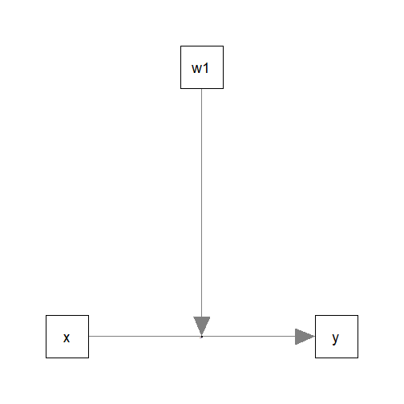

## Fit by Regression

The path parameters
can be estimated by two multiple regression models:


``` r
lm_y_w1 <- lm(y ~ w1*x + c1 + c2, dat)
```

These are the estimates of the regression coefficient
of the paths:


``` r
summary(lm_y_w1)
#> 
#> Call:
#> lm(formula = y ~ w1 * x + c1 + c2, data = dat)
#> 
#> Residuals:
#>      Min       1Q   Median       3Q      Max 
#> -2.06989 -0.52821  0.00169  0.47599  2.13184 
#> 
#> Coefficients:
#>             Estimate Std. Error t value Pr(>|t|)    
#> (Intercept) 14.08656    2.41388   5.836 2.22e-08 ***
#> w1          -1.64679    0.33923  -4.855 2.48e-06 ***
#> x           -2.54673    0.45039  -5.655 5.53e-08 ***
#> c1           0.09003    0.05413   1.663   0.0979 .  
#> c2           0.20577    0.04572   4.501 1.16e-05 ***
#> w1:x         0.40037    0.06230   6.426 9.91e-10 ***
#> ---
#> Signif. codes:  0 '***' 0.001 '**' 0.01 '*' 0.05 '.' 0.1 ' ' 1
#> 
#> Residual standard error: 0.7985 on 194 degrees of freedom
#> Multiple R-squared:  0.5349,	Adjusted R-squared:  0.5229 
#> F-statistic: 44.63 on 5 and 194 DF,  p-value: < 2.2e-16
```

## Generating Bootstrap Estimates

Although OLS can be used to estimate and
test the
unstandardized effects, it is inappropriate
for forming the confidence intervals for the
standardized effects (see
Yuan & Chan, 2011, on the issue on standardized
regression coefficients). Therefore,
we will introduce how to generate
nonparametric bootstrap estimates in this guide.

To form nonparametric bootstrap confidence interval for
effects to be computed, `do_boot()` can be used
to generate bootstrap estimates for all regression
coefficients first. These estimates can be reused for
any effects to be estimated.


``` r
boot_out_lm_y_w1 <- do_boot(
  lm_y_w1,
  R = 5000,
  seed = 54532
)
#> 19 processes started to run bootstrapping.
```

Please see `vignette("do_boot")` or
the help page of `do_boot()` on how
to use this function.

## Conditional Effects

We can now use `cond_effects()` to
estimate the effect of `x` on `y` for
different levels of the moderator (`w`).

Suppose we want to estimate the
effect from `x` to `y`,
conditional on `w1`:

(Refer to `vignette("manymome")` and the help page
of `cond_effects()` on the arguments.)


``` r
out_xy_on_w1 <- cond_effects(
  wlevels = "w1",
  x = "x",
  y = "y",
  fit = lm_y_w1
)
out_xy_on_w1
#> 
#> == Conditional effects ==
#> 
#>  Path: x -> y
#>  Conditional on moderator(s): w1
#>  Moderator(s) represented by: w1
#> 
#>      [w1]  (w1)    ind    SE   Stat pvalue Sig  CI.lo CI.hi
#> 1 M+1.0SD 7.942  0.633 0.094  6.750  0.000 ***  0.448 0.818
#> 2 Mean    6.878  0.207 0.080  2.590  0.010 *    0.049 0.365
#> 3 M-1.0SD 5.813 -0.219 0.113 -1.940  0.054     -0.442 0.004
#> 
#>  - [SE] are regression standard errors.
#>  - [Stat] are the t statistics used to test the effects.
#>  - [pvalue] are p-values computed from 'Stat'.
#>  - [Sig]: 0 '***' 0.001 '**' 0.01 '*' 0.05 ' ' 1.
#>  - [CI.lo to CI.hi] are 95.0% confidence interval computed from
#>    regression standard errors.
#>  - The 'ind' column shows the conditional effects.
#> 
```

The column `ind` show the effects of
`x` on `y` for different levels of `w1`.

When `w1` is one standard deviation
below mean, the effect of `x1` is
-0.219,
with 95% confidence interval
[-0.442, 0.004].

When `w1` is one standard deviation
above mean, the effect of `x1` is
0.633,
with 95% confidence interval
[0.448, 0.818].

## Plotting the Conditional Effects

The output of `cond_effects()` has a `plot`
method for plotting the conditional effects:


``` r
plot(out_xy_on_w1)
```

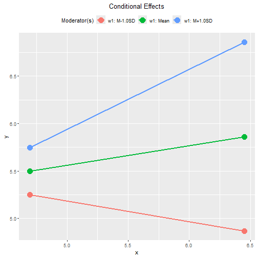

By default, the lines
span the range of one standard deviation below
and above the mean of the `x` variable.
If the distribution
of the `x` variable may vary for different
levels of the moderators, a version of
*tumble graph* proposed by Bodner (2016)
can be plotted by adding `graph_type = "tumble"`:


``` r
plot(out_xy_on_w1,
     graph_type = "tumble")
```

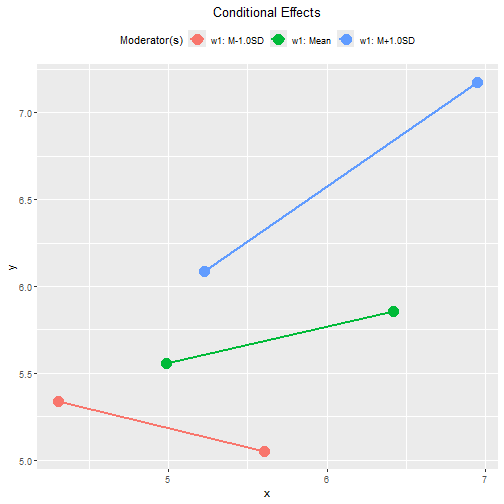

In this example, the distribution of the predictor
vary as the level of the moderator changes:
lower with a smaller variation when `w1` is
one standard deviation below its mean,
and higher with a larger variation when
`w1` is one standard deviation above its
mean.

Therefore, the tumble graph is a better
way to visualize the moderating effect
of `w1`.

The plot can be customized in a lot of way.
Please refer to the help page of
`plot.cond_indirect_effects()` for available
options.

## Standardized Conditional Effects

The standardized conditional
effect from `x` to `y` conditional
on `w1`
can be estimated by setting
`standardized_x` and `standardized_y` to `TRUE`,
with bootstrap estimates from `do_boot()`
used to from bootstrap confidence
intervals:


``` r
std_xy_on_w1 <- cond_effects(
  wlevels = "w1",
  x = "x",
  y = "y",
  fit = lm_y_w1,
  boot_ci = TRUE,
  boot_out = boot_out_lm_y_w1,
  standardized_x = TRUE,
  standardized_y = TRUE
)
std_xy_on_w1
#> 
#> == Conditional effects ==
#> 
#>  Path: x -> y
#>  Conditional on moderator(s): w1
#>  Moderator(s) represented by: w1
#> 
#>      [w1]  (w1)    std  CI.lo CI.hi Sig    ind
#> 1 M+1.0SD 7.942  0.481  0.357 0.616 Sig  0.633
#> 2 Mean    6.878  0.157  0.040 0.277 Sig  0.207
#> 3 M-1.0SD 5.813 -0.167 -0.342 0.011     -0.219
#> 
#>  - [CI.lo to CI.hi] are 95.0% percentile confidence intervals by
#>    nonparametric bootstrapping with 5000 samples.
#>  - std: The standardized conditional effects. 
#>  - ind: The unstandardized conditional effects.
#> 
```

When `w1` is one standard deviation below
its mean, the standardized effect is
-0.167,
with 95% confidence interval
[-0.342, 0.011].

When `w` is one standard deviation above
its mean, the standardized effect is
0.481,
with 95% confidence interval
[0.357, 0.616].

The `plot()` method can also be used
on the standardized conditional effects,
although the only differences are the
values displayed on the axes:


``` r
plot(std_xy_on_w1)
```

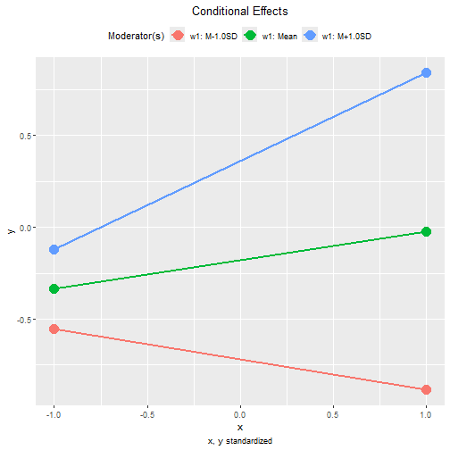

This is the tumble graph:


``` r
plot(std_xy_on_w1,
     graph_type = "tumble")
```

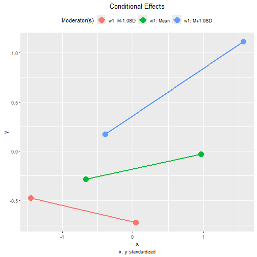

# Two Moderators

Suppose we would like to examine the
moderating effects of two moderators,
`w1` and `w2`, on the effect of `x` on
`y`. This is the model being fitted,
with control variables omitted from the
plot for readability:

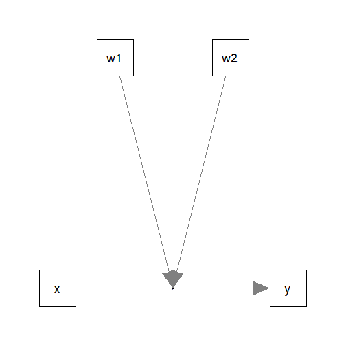

The path parameters
can be estimated by the following multiple
regression model:


``` r
lm_y_w1w2 <- lm(y ~ x*w1 + x*w2 + c1 + c2, dat)
```

These are the estimates of the regression coefficient
of the paths:


``` r
summary(lm_y_w1w2)
#> 
#> Call:
#> lm(formula = y ~ x * w1 + x * w2 + c1 + c2, data = dat)
#> 
#> Residuals:
#>      Min       1Q   Median       3Q      Max 
#> -1.90899 -0.51558 -0.02173  0.52914  2.10963 
#> 
#> Coefficients:
#>             Estimate Std. Error t value Pr(>|t|)    
#> (Intercept) 11.70420    2.63634   4.440 1.52e-05 ***
#> x           -2.00026    0.49146  -4.070 6.86e-05 ***
#> w1          -1.67718    0.33375  -5.025 1.15e-06 ***
#> w2           0.66854    0.38362   1.743   0.0830 .  
#> c1           0.09245    0.05293   1.747   0.0823 .  
#> c2           0.19396    0.04482   4.328 2.42e-05 ***
#> x:w1         0.40409    0.06123   6.599 3.93e-10 ***
#> x:w2        -0.14497    0.06700  -2.164   0.0317 *  
#> ---
#> Signif. codes:  0 '***' 0.001 '**' 0.01 '*' 0.05 '.' 0.1 ' ' 1
#> 
#> Residual standard error: 0.7792 on 192 degrees of freedom
#> Multiple R-squared:  0.5617,	Adjusted R-squared:  0.5457 
#> F-statistic: 35.15 on 7 and 192 DF,  p-value: < 2.2e-16
```

## Generating Bootstrap Estimates

The bootstrap estimates can be generated
in exactly the same way:


``` r
boot_out_lm_w1w2 <- do_boot(
  lm_y_w1w2,
  R = 5000,
  seed = 54532
)
#> 19 processes started to run bootstrapping.
```

## Conditional Effects

The function `cond_effects()` can be
used again, even with two moderators:


``` r
out_xy_on_w1w2 <- cond_effects(
  wlevels = c("w1", "w2"),
  x = "x",
  y = "y",
  fit = lm_y_w1w2
)
out_xy_on_w1w2
#> 
#> == Conditional effects ==
#> 
#>  Path: x -> y
#>  Conditional on moderator(s): w1, w2
#>  Moderator(s) represented by: w1, w2
#> 
#>      [w1]    [w2]  (w1)  (w2)    ind    SE   Stat pvalue Sig  CI.lo  CI.hi
#> 1 M+1.0SD M+1.0SD 7.942 4.829  0.509 0.107  4.744  0.000 ***  0.297  0.721
#> 2 M+1.0SD M-1.0SD 7.942 2.897  0.789 0.117  6.722  0.000 ***  0.557  1.020
#> 3 M-1.0SD M+1.0SD 5.813 4.829 -0.351 0.130 -2.694  0.008 **  -0.608 -0.094
#> 4 M-1.0SD M-1.0SD 5.813 2.897 -0.071 0.126 -0.566  0.572     -0.319  0.177
#> 
#>  - [SE] are regression standard errors.
#>  - [Stat] are the t statistics used to test the effects.
#>  - [pvalue] are p-values computed from 'Stat'.
#>  - [Sig]: 0 '***' 0.001 '**' 0.01 '*' 0.05 ' ' 1.
#>  - [CI.lo to CI.hi] are 95.0% confidence interval computed from
#>    regression standard errors.
#>  - The 'ind' column shows the conditional effects.
#> 
```

The column `ind` show the effects of
`x` on `y` for different levels of `w1`
and `w2`.

## Plotting the Conditional Effects

The `plot()` method can be used directly
even with two moderators:


``` r
plot(out_xy_on_w1w2)
```

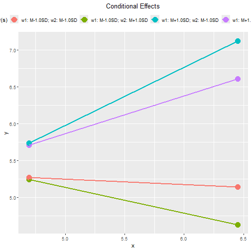

This plot is not easy to read when the
model has two or more moderators.
The argument
`facet_grid_cols` can be used to generate
one plot for each level of one of the moderators,
presented in one row, side-by-side.

For example, supposed we would like to
generate one graph for each level of `w2`,
we add `facet_grid_cols = "w2"`:


``` r
plot(out_xy_on_w1w2,
     facet_grid_cols = "w2")
```

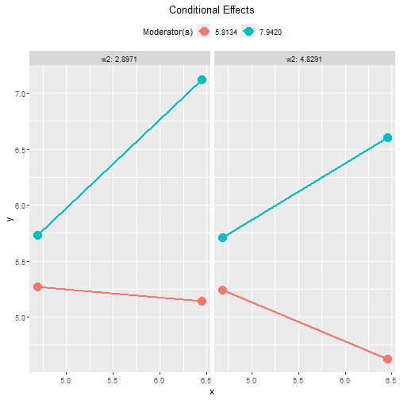

We can do the same for `w1`:


``` r
plot(out_xy_on_w1w2,
     facet_grid_cols = "w1")
```

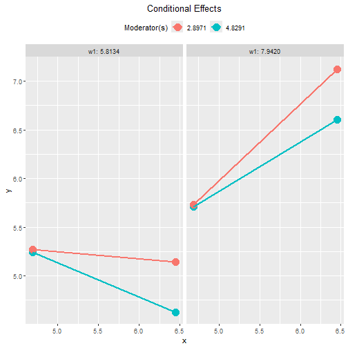

We can also use `graph_type = "tumble"`
to generate tumble graphs:


``` r
plot(out_xy_on_w1w2,
     facet_grid_cols = "w2",
     graph_type = "tumble")
```

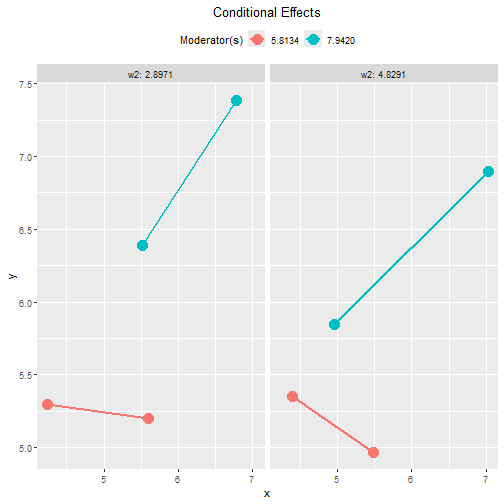

We can do the same for `w1`:


``` r
plot(out_xy_on_w1w2,
     facet_grid_cols = "w1",
     graph_type = "tumble")
```

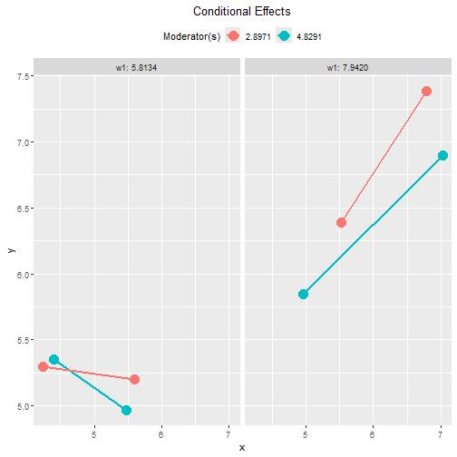

## Standardized Conditional Effects

The standardized conditional
effect from `x` to `y` conditional
on `w1` and `w2`
can be estimated by setting
`standardized_x` and `standardized_y` to `TRUE`:


``` r
std_xy_on_w1w2 <- cond_effects(
  wlevels = c("w1", "w2"),
  x = "x",
  y = "y",
  fit = lm_y_w1w2,
  boot_ci = TRUE,
  boot_out = boot_out_lm_w1w2,
  standardized_x = TRUE,
  standardized_y = TRUE
)
std_xy_on_w1w2
#> 
#> == Conditional effects ==
#> 
#>  Path: x -> y
#>  Conditional on moderator(s): w1, w2
#>  Moderator(s) represented by: w1, w2
#> 
#>      [w1]    [w2]  (w1)  (w2)    std  CI.lo  CI.hi Sig    ind
#> 1 M+1.0SD M+1.0SD 7.942 4.829  0.387  0.232  0.536 Sig  0.509
#> 2 M+1.0SD M-1.0SD 7.942 2.897  0.599  0.437  0.799 Sig  0.789
#> 3 M-1.0SD M+1.0SD 5.813 4.829 -0.267 -0.479 -0.075 Sig -0.351
#> 4 M-1.0SD M-1.0SD 5.813 2.897 -0.054 -0.249  0.149     -0.071
#> 
#>  - [CI.lo to CI.hi] are 95.0% percentile confidence intervals by
#>    nonparametric bootstrapping with 5000 samples.
#>  - std: The standardized conditional effects. 
#>  - ind: The unstandardized conditional effects.
#> 
```

The `plot()` method can also be used
on the standardized conditional effects:


``` r
plot(std_xy_on_w1w2,
     facet_grid_cols = "w2")
```

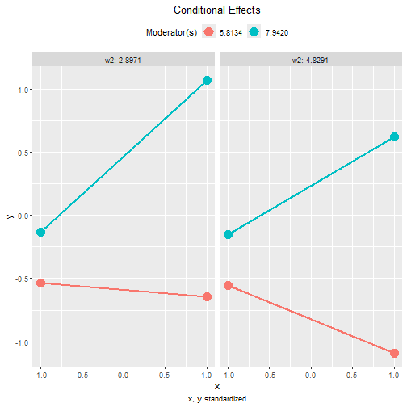


``` r
plot(std_xy_on_w1w2,
     facet_grid_cols = "w1")
```

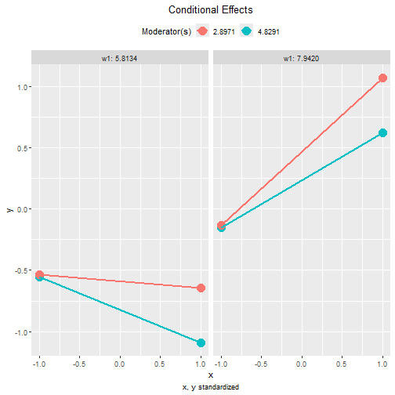

These are the tumble graphs:


``` r
plot(std_xy_on_w1w2,
     facet_grid_cols = "w2",
     graph_type = "tumble")
```

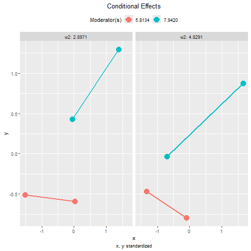


``` r
plot(std_xy_on_w1w2,
     facet_grid_cols = "w1",
     graph_type = "tumble")
```

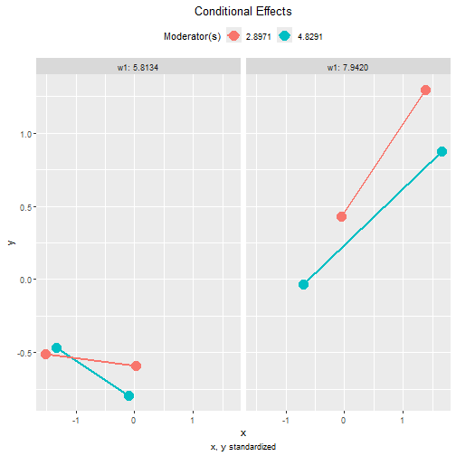


# Other Moderated Regression Models

The function `cond_effects()` has no limit
on the number of moderators and the number
of predictors with their effects moderated.

The demonstrations of other moderated
regression models can be found from
the [list of articles](./index.html#moderated-regression).

The levels
for the moderators are controlled by `mod_levels()`
and related functions in the same way whether a
model is fitted by `lavaan::sem()` or `lm()`.
Please refer to other articles (e.g.,
`vignette("manymome")` and `vignette("mod_levels")`)
on how to estimate effects in other model analyzed by
multiple regression.


# References

Bodner, T. E. (2016). Tumble graphs:
Avoiding misleading end point
extrapolation when graphing interactions
from a moderated multiple
regression analysis.
*Journal of Educational and Behavioral Statistics, 41*(6),
593--604. https://doi.org/10.3102/1076998616657080

Cheung, S. F., & Cheung, S.-H. (2024).
*manymome*: An R package for computing
the indirect effects, conditional
effects, and conditional indirect
effects, standardized or unstandardized,
and their bootstrap confidence intervals,
in many (though not all) models.
*Behavior Research Methods, 56*(5),
4862--4882.
https://doi.org/10.3758/s13428-023-02224-z

Yuan, K.-H., & Chan, W. (2011). Biases
and standard errors of standardized
regression coefficients.
*Psychometrika, 76*(4), 670--690.
https://doi.org/10.1007/s11336-011-9224-6
