# Introduction

This article is part of a series of
brief illustrations of how
to use
`cond_effects()`
from the package
[manymome](https://sfcheung.github.io/manymome/)
[@cheung_manymome_2024]
to estimate the conditional
effects
when the model parameters are estimate by
ordinary least squares (OLS) multiple regression
using `lm()`. For moderated mediation
tested by OLS regression, please refer
to [this article](./mome_lm.html).

(Articles in this series had duplicated
sections, to make each of them self-contained.)

# Data Set and Model

This is the sample data set used for
illustration:


``` r
library(manymome)
dat <- data_mod_2w
print(head(dat), digits = 3)
#>      y    x   w1   w2   c1   c2
#> 1 3.85 5.00 6.11 4.22 3.82 7.80
#> 2 6.58 6.75 6.20 2.98 7.09 5.47
#> 3 4.89 5.29 5.82 5.20 4.98 6.70
#> 4 8.06 6.79 6.95 4.21 5.97 5.31
#> 5 7.50 6.88 7.01 5.70 6.20 5.67
#> 6 5.92 5.63 9.45 4.75 4.78 6.39
```

This dataset has 6 variables:

- one outcome variable (`y`),

- one predictor (`x`),

- two moderators (`w1`, `w2`),

- two control variables (`c1` and `c2`).

We will start with a model with only one
moderator.

## One Moderator

Suppose this is the model being fitted,
with control variables omitted from the
plot for readability:

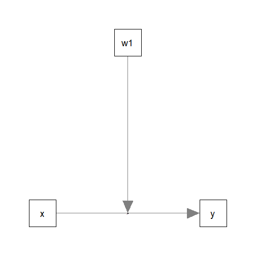

## Fit by Regression

The path parameters
can be estimated by multiple regression
using `lm()`:


``` r
lm_y_w1 <- lm(
  y ~ w1*x + c1 + c2,
  data = dat
)
```

These are the estimates of the regression coefficient
of the paths:


``` r
summary(lm_y_w1)
#> 
#> Call:
#> lm(formula = y ~ w1 * x + c1 + c2, data = dat)
#> 
#> Residuals:
#>      Min       1Q   Median       3Q      Max 
#> -2.29074 -0.62350 -0.05257  0.64493  2.60438 
#> 
#> Coefficients:
#>             Estimate Std. Error t value Pr(>|t|)    
#> (Intercept)  6.14284    3.32593   1.847 0.066277 .  
#> w1          -0.52086    0.46251  -1.126 0.261486    
#> x           -0.95008    0.60613  -1.567 0.118636    
#> c1           0.08857    0.06496   1.363 0.174331    
#> c2           0.18836    0.05498   3.426 0.000747 ***
#> w1:x         0.18154    0.08380   2.166 0.031508 *  
#> ---
#> Signif. codes:  0 '***' 0.001 '**' 0.01 '*' 0.05 '.' 0.1 ' ' 1
#> 
#> Residual standard error: 0.9566 on 194 degrees of freedom
#> Multiple R-squared:  0.3322,	Adjusted R-squared:  0.315 
#> F-statistic:  19.3 on 5 and 194 DF,  p-value: 1.41e-15
```

## Conditional Effects

We can now use `cond_effects()` to
estimate the effect of `x` on `y` for
different levels of the moderator (`w1`).

Suppose we want to estimate the
effect from `x` to `y`,
conditional on `w1`:

(Refer to `vignette("manymome")` and the help page
of `cond_effects()` on the arguments.)


``` r
out_xy_on_w1 <- cond_effects(
  wlevels = "w1",
  x = "x",
  y = "y",
  fit = lm_y_w1
)
out_xy_on_w1
#> 
#> == Conditional effects ==
#> 
#>  Path: x -> y
#>  Conditional on moderator(s): w1
#>  Moderator(s) represented by: w1
#> 
#>      [w1]  (w1)   ind    SE  Stat pvalue Sig  CI.lo CI.hi
#> 1 M+1.0SD 7.942 0.492 0.101 4.853  0.000 ***  0.292 0.692
#> 2 Mean    6.878 0.299 0.082 3.643  0.000 ***  0.137 0.460
#> 3 M-1.0SD 5.813 0.105 0.138 0.762  0.447     -0.167 0.378
#> 
#>  - [SE] are regression standard errors.
#>  - [Stat] are the t statistics used to test the effects.
#>  - [pvalue] are p-values computed from 'Stat'.
#>  - [Sig]: 0 '***' 0.001 '**' 0.01 '*' 0.05 ' ' 1.
#>  - [CI.lo to CI.hi] are 95.0% confidence interval computed from
#>    regression standard errors.
#>  - The 'ind' column shows the conditional effects.
#> 
```

The column `ind` show the effects of
`x` on `y` for different levels of `w1`.

When `w1` is one standard deviation
below mean, the effect of `x1` is
0.105,
with 95% confidence interval
[-0.167, 0.378].

When `w1` is one standard deviation
above mean, the effect of `x1` is
0.492,
with 95% confidence interval
[0.292, 0.692].


NOTE: The standard error (`SE`) and
related results are computed using
the pick-a-point approach by
@rogosa_comparing_1980.

## Plotting the Conditional Effects

### Conventional Plot

The output of `cond_effects()` has a `plot`
method for plotting the conditional effects
(also called simple effects):


``` r
plot(out_xy_on_w1)
```

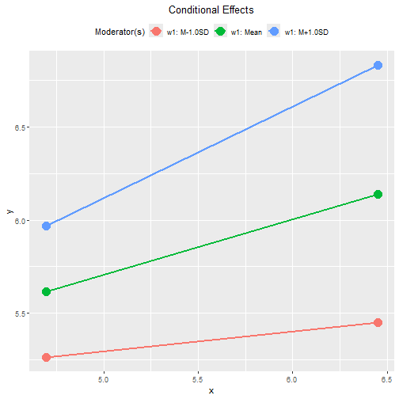

By default, the lines
span the range of one standard deviation below
and above the mean of the `x` variable.

The plot can be customized in a lot of way.
Please refer to the help page of
`plot.cond_indirect_effects()` for available
options.

### Tumble Plot

If the distribution
of the `x` variable may vary for different
levels of the moderators, a version of
*tumble graph* proposed by @bodner_tumble_2016
can be plotted by adding `graph_type = "tumble"`:


``` r
plot(out_xy_on_w1,
     graph_type = "tumble")
```

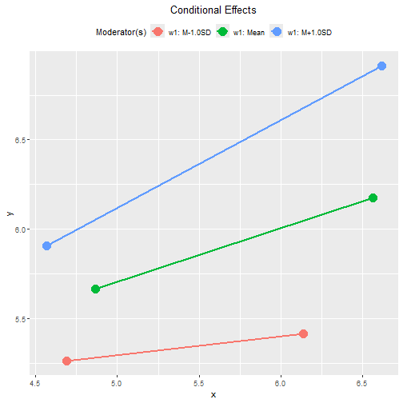

In this example, the distribution of the predictor
vary slightly as the level of the moderator changes:

- lower with a smaller variation when `w1` is
one standard deviation below its mean, and

- higher with a larger variation when
`w1` is one standard deviation above its
mean.

Therefore, the tumble graph is a better
way to visualize the moderating effect
of `w1`.

## Standardized Conditional Effects


Although OLS can be used to estimate and
test the
unstandardized effects, it is inappropriate
for forming the confidence intervals for the
standardized effects. See
@yuan_biases_2011 on the issue on standardized
regression coefficients.

To form nonparametric bootstrap confidence interval for
effects to be computed, add `boot_ci = TRUE`,
`R` to the number of bootstrap samples
(should be 5000 or even 10000, for
multiple regression), and `seed` (set
it to an integer to ensure the results are
reproducible).

The standardized conditional
effect from `x` to `y` conditional
on `w1`
can be estimated by setting
`standardized_x` and `standardized_y` to `TRUE`.


``` r
std_xy_on_w1 <- cond_effects(
  wlevels = "w1",
  x = "x",
  y = "y",
  fit = lm_y_w1,
  boot_ci = TRUE,
  R = 5000,
  seed = 54532,
  standardized_x = TRUE,
  standardized_y = TRUE
)
#> 19 processes started to run bootstrapping.
std_xy_on_w1
#> 
#> == Conditional effects ==
#> 
#>  Path: x -> y
#>  Conditional on moderator(s): w1
#>  Moderator(s) represented by: w1
#> 
#>      [w1]  (w1)   std  CI.lo CI.hi Sig   ind
#> 1 M+1.0SD 7.942 0.374  0.204 0.518 Sig 0.492
#> 2 Mean    6.878 0.227  0.094 0.352 Sig 0.299
#> 3 M-1.0SD 5.813 0.080 -0.136 0.280     0.105
#> 
#>  - [CI.lo to CI.hi] are 95.0% percentile confidence intervals by
#>    nonparametric bootstrapping with 5000 samples.
#>  - std: The standardized conditional effects. 
#>  - ind: The unstandardized conditional effects.
#> 
```

When `w1` is one standard deviation below
its mean, the standardized effect is
0.080,
with 95% confidence interval
[-0.136, 0.280].

When `w` is one standard deviation above
its mean, the standardized effect is
0.374,
with 95% confidence interval
[0.204, 0.518].

### Plot Standardized Conditional Effects

The `plot()` method can also be used
on the standardized conditional effects,
although the only differences are the
values displayed on the axes:


``` r
plot(std_xy_on_w1)
```

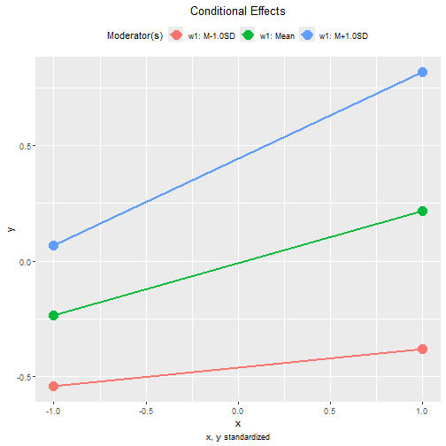

This is the tumble graph:


``` r
plot(std_xy_on_w1,
     graph_type = "tumble")
```

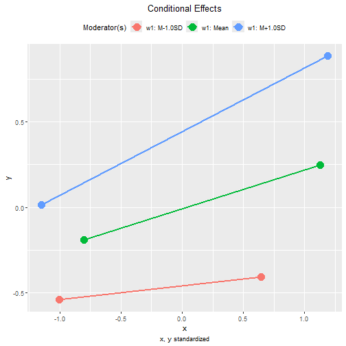

# Two Moderators

Suppose we would like to examine the
moderating effects of two moderators,
`w1` and `w2`, on the effect of `x` on
`y`. This is the model being fitted,
with control variables omitted from the
plot for readability:

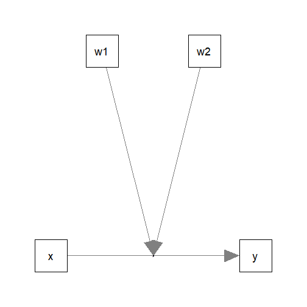

The path parameters
can be estimated by the following multiple
regression model:


``` r
lm_y_w1w2 <- lm(
  y ~ x*w1 + x*w2 + c1 + c2,
  data = dat
)
```

These are the estimates of the regression coefficient
of the paths:


``` r
summary(lm_y_w1w2)
#> 
#> Call:
#> lm(formula = y ~ x * w1 + x * w2 + c1 + c2, data = dat)
#> 
#> Residuals:
#>      Min       1Q   Median       3Q      Max 
#> -2.29403 -0.65294 -0.01277  0.64934  2.58194 
#> 
#> Coefficients:
#>             Estimate Std. Error t value Pr(>|t|)    
#> (Intercept)  6.88344    3.64126   1.890 0.060210 .  
#> x           -1.17277    0.66638  -1.760 0.080015 .  
#> w1          -0.57214    0.46589  -1.228 0.220932    
#> w2          -0.08857    0.49859  -0.178 0.859190    
#> c1           0.08432    0.06481   1.301 0.194794    
#> c2           0.19407    0.05509   3.523 0.000534 ***
#> x:w1         0.19117    0.08432   2.267 0.024482 *  
#> x:w2         0.03787    0.08633   0.439 0.661378    
#> ---
#> Signif. codes:  0 '***' 0.001 '**' 0.01 '*' 0.05 '.' 0.1 ' ' 1
#> 
#> Residual standard error: 0.9529 on 192 degrees of freedom
#> Multiple R-squared:  0.3442,	Adjusted R-squared:  0.3203 
#> F-statistic:  14.4 on 7 and 192 DF,  p-value: 5.341e-15
```

Although `w2` does not significantly moderate
the effect of `x`, we still proceed to examine
its moderating effect, just for illustration.

## Conditional Effects

The function `cond_effects()` can be
used again, even with two moderators:


``` r
out_xy_on_w1w2 <- cond_effects(
  wlevels = c("w1", "w2"),
  x = "x",
  y = "y",
  fit = lm_y_w1w2
)
out_xy_on_w1w2
#> 
#> == Conditional effects ==
#> 
#>  Path: x -> y
#>  Conditional on moderator(s): w1, w2
#>  Moderator(s) represented by: w1, w2
#> 
#>      [w1]    [w2]  (w1)  (w2)   ind    SE  Stat pvalue Sig  CI.lo CI.hi
#> 1 M+1.0SD M+1.0SD 7.942 4.829 0.528 0.122 4.343  0.000 ***  0.288 0.768
#> 2 M+1.0SD M-1.0SD 7.942 2.897 0.455 0.141 3.220  0.002 **   0.176 0.734
#> 3 M-1.0SD M+1.0SD 5.813 4.829 0.121 0.163 0.744  0.458     -0.201 0.444
#> 4 M-1.0SD M-1.0SD 5.813 2.897 0.048 0.159 0.303  0.762     -0.266 0.363
#> 
#>  - [SE] are regression standard errors.
#>  - [Stat] are the t statistics used to test the effects.
#>  - [pvalue] are p-values computed from 'Stat'.
#>  - [Sig]: 0 '***' 0.001 '**' 0.01 '*' 0.05 ' ' 1.
#>  - [CI.lo to CI.hi] are 95.0% confidence interval computed from
#>    regression standard errors.
#>  - The 'ind' column shows the conditional effects.
#> 
```

The column `ind` show the effects of
`x` on `y` for different levels of `w1`
and `w2`.

IMPORTANT: Even though this model does not
have three-way interaction, the conditional
effects still need to consider *both*
moderators. It is because the effect of
`x` depends on *all* moderators, whether
there is a higher order interaction or not.

If one or more moderators are omitted,
a *warning message* will be issued. This
is an example:


``` r
cond_effects(
  wlevels = "w1",
  x = "x",
  y = "y",
  fit = lm_y_w1w2
)
#> Warning in (function (xi, yi, yiname, digits = 3, y, wvalues = NULL, warn =
#> TRUE, : w2 modelled as moderator(s) for the path from y~x to y but not included
#> in 'wvalues'. They will be set to zero in computing the conditional effect,
#> which may not be meaningful. Please check.
#> Warning in (function (xi, yi, yiname, digits = 3, y, wvalues = NULL, warn =
#> TRUE, : w2 modelled as moderator(s) for the path from y~x to y but not included
#> in 'wvalues'. They will be set to zero in computing the conditional effect,
#> which may not be meaningful. Please check.
#> Warning in (function (xi, yi, yiname, digits = 3, y, wvalues = NULL, warn =
#> TRUE, : w2 modelled as moderator(s) for the path from y~x to y but not included
#> in 'wvalues'. They will be set to zero in computing the conditional effect,
#> which may not be meaningful. Please check.
#> 
#> == Conditional effects ==
#> 
#>  Path: x -> y
#>  Conditional on moderator(s): w1
#>  Moderator(s) represented by: w1
#> 
#>      [w1]  (w1)    ind    SE   Stat pvalue Sig  CI.lo CI.hi
#> 1 M+1.0SD 7.942  0.346 0.363  0.951  0.343     -0.371 1.062
#> 2 Mean    6.878  0.142 0.349  0.407  0.684     -0.546 0.831
#> 3 M-1.0SD 5.813 -0.061 0.357 -0.172  0.864     -0.766 0.643
#> 
#>  - [SE] are regression standard errors.
#>  - [Stat] are the t statistics used to test the effects.
#>  - [pvalue] are p-values computed from 'Stat'.
#>  - [Sig]: 0 '***' 0.001 '**' 0.01 '*' 0.05 ' ' 1.
#>  - [CI.lo to CI.hi] are 95.0% confidence interval computed from
#>    regression standard errors.
#>  - The 'ind' column shows the conditional effects.
#> 
```

## Plotting the Conditional Effects

### Conventional Plots

The `plot()` method can be used directly
even with two moderators:


``` r
plot(out_xy_on_w1w2)
```

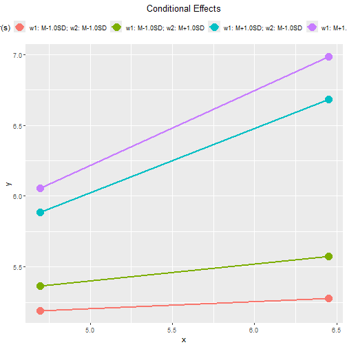


This plot is not easy to read when the
model has two or more moderators.
The argument
`facet_grid_cols` can be used to generate
one plot for each level of one of the moderators,
presented in one row, side-by-side.

For example, supposed we would like to
generate one graph for each level of `w2`,
we add `facet_grid_cols = "w2"`:


``` r
plot(out_xy_on_w1w2,
     facet_grid_cols = "w2")
```

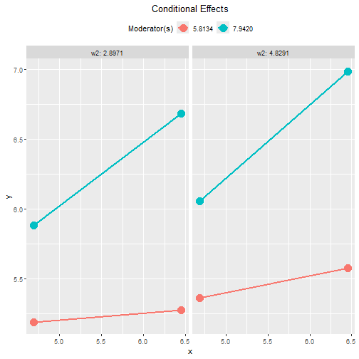

We can do the same for `w1`:


``` r
plot(out_xy_on_w1w2,
     facet_grid_cols = "w1")
```

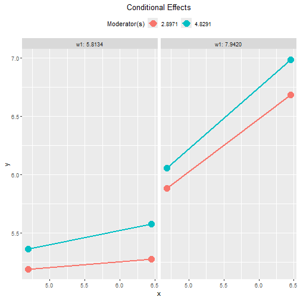

### Tumble Plots

We can also use `graph_type = "tumble"`
to generate tumble graphs:


``` r
plot(out_xy_on_w1w2,
     facet_grid_cols = "w2",
     graph_type = "tumble")
```

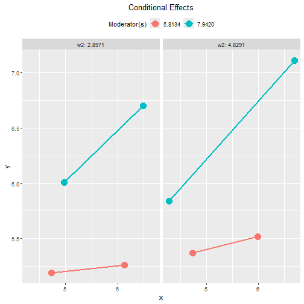

We can do the same for `w1`:


``` r
plot(out_xy_on_w1w2,
     facet_grid_cols = "w1",
     graph_type = "tumble")
```

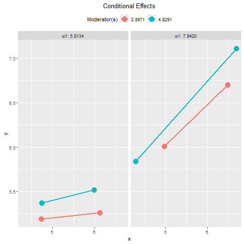

## Standardized Conditional Effects

The standardized conditional
effect from `x` to `y` conditional
on `w1` and `w2`
can be estimated by setting
`standardized_x` and `standardized_y` to `TRUE`,
with bootstrap confidence intervals:


``` r
std_xy_on_w1w2 <- cond_effects(
  wlevels = c("w1", "w2"),
  x = "x",
  y = "y",
  fit = lm_y_w1w2,
  boot_ci = TRUE,
  R = 5000,
  seed = 54532,
  standardized_x = TRUE,
  standardized_y = TRUE
)
#> 19 processes started to run bootstrapping.
std_xy_on_w1w2
#> 
#> == Conditional effects ==
#> 
#>  Path: x -> y
#>  Conditional on moderator(s): w1, w2
#>  Moderator(s) represented by: w1, w2
#> 
#>      [w1]    [w2]  (w1)  (w2)   std  CI.lo CI.hi Sig   ind
#> 1 M+1.0SD M+1.0SD 7.942 4.829 0.402  0.203 0.560 Sig 0.528
#> 2 M+1.0SD M-1.0SD 7.942 2.897 0.346  0.143 0.586 Sig 0.455
#> 3 M-1.0SD M+1.0SD 5.813 4.829 0.092 -0.169 0.323     0.121
#> 4 M-1.0SD M-1.0SD 5.813 2.897 0.037 -0.210 0.264     0.048
#> 
#>  - [CI.lo to CI.hi] are 95.0% percentile confidence intervals by
#>    nonparametric bootstrapping with 5000 samples.
#>  - std: The standardized conditional effects. 
#>  - ind: The unstandardized conditional effects.
#> 
```

The `plot()` method can also be used
on the standardized conditional effects:


``` r
plot(std_xy_on_w1w2,
     facet_grid_cols = "w2")
```

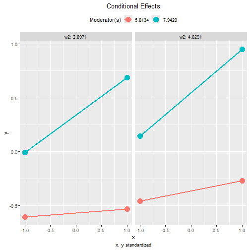


``` r
plot(std_xy_on_w1w2,
     facet_grid_cols = "w1")
```

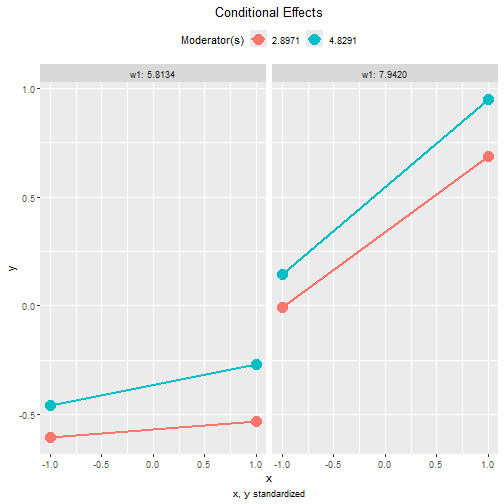

These are the tumble graphs:


``` r
plot(std_xy_on_w1w2,
     facet_grid_cols = "w2",
     graph_type = "tumble")
```

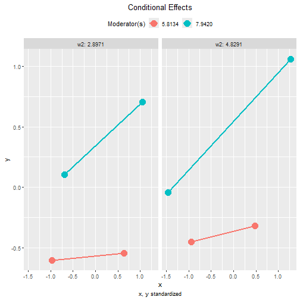


``` r
plot(std_xy_on_w1w2,
     facet_grid_cols = "w1",
     graph_type = "tumble")
```

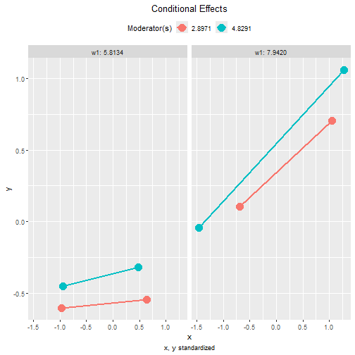

# Two Moderators, with Three-Way Interaction

Suppose that we suspect that the two
moderators interact with each
other. That is, the moderating effect of `w1` on
the effect of `x` may not be the same for
different levels of `w2`, or the moderating
effect of `w2` on
the effect of `x` may depend on the level
of `w1`.

The steps demonstrated above can also be used
in this regression model:


``` r
lm_y_w1_x_w2 <- lm(
  y ~ w1*w2*x + c1 + c2,
  data = dat
)
```

These are the estimates of the regression coefficient
of this model:


``` r
summary(lm_y_w1_x_w2)
#> 
#> Call:
#> lm(formula = y ~ w1 * w2 * x + c1 + c2, data = dat)
#> 
#> Residuals:
#>      Min       1Q   Median       3Q      Max 
#> -2.27658 -0.63668 -0.03106  0.61117  2.55406 
#> 
#> Coefficients:
#>              Estimate Std. Error t value Pr(>|t|)    
#> (Intercept) -23.46400   14.16783  -1.656  0.09934 .  
#> w1            3.68387    1.98858   1.853  0.06550 .  
#> w2            7.85339    3.63294   2.162  0.03189 *  
#> x             4.46108    2.56813   1.737  0.08399 .  
#> c1            0.08359    0.06427   1.301  0.19500    
#> c2            0.19658    0.05465   3.597  0.00041 ***
#> w1:w2        -1.11035    0.50635  -2.193  0.02953 *  
#> w1:x         -0.59907    0.35889  -1.669  0.09672 .  
#> w2:x         -1.43247    0.65486  -2.187  0.02993 *  
#> w1:w2:x       0.20562    0.09102   2.259  0.02501 *  
#> ---
#> Signif. codes:  0 '***' 0.001 '**' 0.01 '*' 0.05 '.' 0.1 ' ' 1
#> 
#> Residual standard error: 0.9449 on 190 degrees of freedom
#> Multiple R-squared:  0.3618,	Adjusted R-squared:  0.3316 
#> F-statistic: 11.97 on 9 and 190 DF,  p-value: 7.009e-15
```

The significant three-way interaction
term, `w1:w2:x`, suggests that, although
`w2` does not moderate the effect of `x`
on `y`, it does moderate the moderating
effect of `w1`.


## Conditional Effects

The function `cond_effects()` can be
used in exactly the same way, whether
the moderators interact with each other
or not:


``` r
out_xy_on_w1_x_w2 <- cond_effects(
  wlevels = c("w1", "w2"),
  x = "x",
  y = "y",
  fit = lm_y_w1_x_w2
)
out_xy_on_w1_x_w2
#> 
#> == Conditional effects ==
#> 
#>  Path: x -> y
#>  Conditional on moderator(s): w1, w2
#>  Moderator(s) represented by: w1, w2
#> 
#>      [w1]    [w2]  (w1)  (w2)    ind    SE   Stat pvalue Sig  CI.lo CI.hi
#> 1 M+1.0SD M+1.0SD 7.942 4.829  0.672 0.137  4.903  0.000 ***  0.402 0.942
#> 2 M+1.0SD M-1.0SD 7.942 2.897  0.284 0.161  1.768  0.079     -0.033 0.602
#> 3 M-1.0SD M+1.0SD 5.813 4.829 -0.167 0.207 -0.806  0.421     -0.574 0.241
#> 4 M-1.0SD M-1.0SD 5.813 2.897  0.292 0.191  1.530  0.128     -0.084 0.667
#> 
#>  - [SE] are regression standard errors.
#>  - [Stat] are the t statistics used to test the effects.
#>  - [pvalue] are p-values computed from 'Stat'.
#>  - [Sig]: 0 '***' 0.001 '**' 0.01 '*' 0.05 ' ' 1.
#>  - [CI.lo to CI.hi] are 95.0% confidence interval computed from
#>    regression standard errors.
#>  - The 'ind' column shows the conditional effects.
#> 
```

As shown above, among the levels examined,
`x` has a significant effect on `y`
only when both `w1` and `w2` are one
standard deviation above their means.

## Plotting the Conditional Effects

These are the tumble plots of the conditional effects,
with `facet_grid_cols` set:


``` r
plot(out_xy_on_w1_x_w2,
     facet_grid_cols = "w2",
     graph_type = "tumble")
```

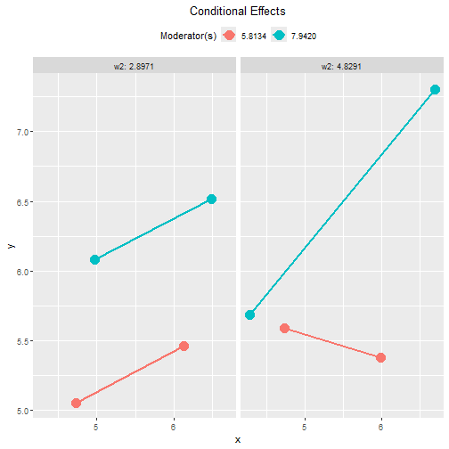


``` r
plot(out_xy_on_w1_x_w2,
     facet_grid_cols = "w1",
     graph_type = "tumble")
```

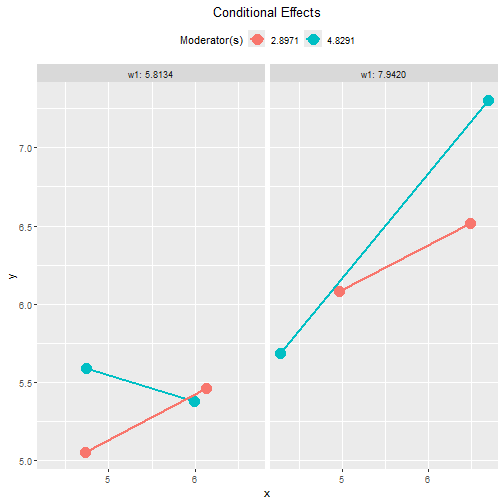

## Standardized Conditional Effects

This is the output of the standardized
conditional effects, with bootstrap
confidence intervals:


``` r
std_xy_on_w1_x_w2 <- cond_effects(
  wlevels = c("w1", "w2"),
  x = "x",
  y = "y",
  fit = lm_y_w1_x_w2,
  boot_ci = TRUE,
  R = 5000,
  seed = 54532,
  standardized_x = TRUE,
  standardized_y = TRUE
)
#> 19 processes started to run bootstrapping.
std_xy_on_w1_x_w2
#> 
#> == Conditional effects ==
#> 
#>  Path: x -> y
#>  Conditional on moderator(s): w1, w2
#>  Moderator(s) represented by: w1, w2
#> 
#>      [w1]    [w2]  (w1)  (w2)    std  CI.lo CI.hi Sig    ind
#> 1 M+1.0SD M+1.0SD 7.942 4.829  0.511  0.360 0.760 Sig  0.672
#> 2 M+1.0SD M-1.0SD 7.942 2.897  0.216 -0.015 0.456      0.284
#> 3 M-1.0SD M+1.0SD 5.813 4.829 -0.127 -0.462 0.177     -0.167
#> 4 M-1.0SD M-1.0SD 5.813 2.897  0.222 -0.062 0.501      0.292
#> 
#>  - [CI.lo to CI.hi] are 95.0% percentile confidence intervals by
#>    nonparametric bootstrapping with 5000 samples.
#>  - std: The standardized conditional effects. 
#>  - ind: The unstandardized conditional effects.
#> 
```

The `plot()` method can also be used
on the standardized conditional effects,
in the presence of three-way interaction:


``` r
plot(std_xy_on_w1_x_w2,
     facet_grid_cols = "w2",
     graph_type = "tumble")
```

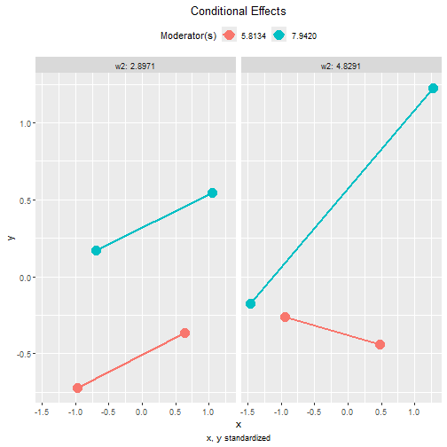


``` r
plot(std_xy_on_w1_x_w2,
     facet_grid_cols = "w1",
     graph_type = "tumble")
```

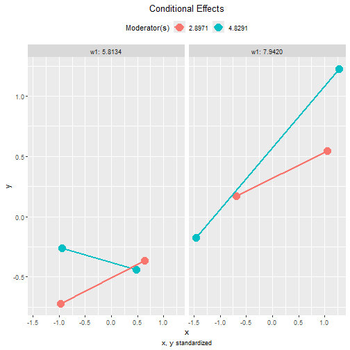


# Other Moderated Regression Models

The function `cond_effects()` has no limit
on the number of moderators and the number
of predictors with their effects moderated.

The demonstrations of other moderated
regression models can be found from
the [list of articles](./index.html#moderated-regression).

The levels
for the moderators are controlled by `mod_levels()`
and related functions in the same way whether a
model is fitted by `lavaan::sem()` or `lm()`.
Please refer to other articles (e.g.,
`vignette("manymome")` and `vignette("mod_levels")`)
on how to estimate effects in other model analyzed by
multiple regression.


# References
