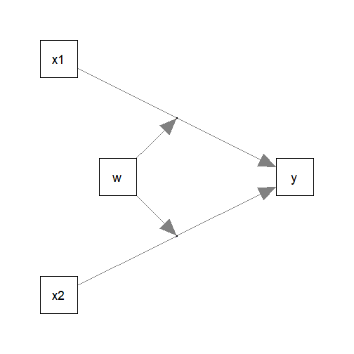
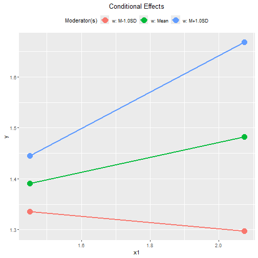
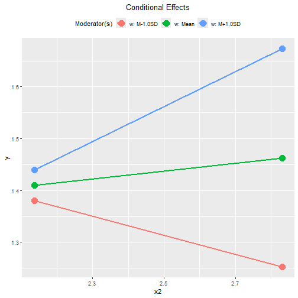
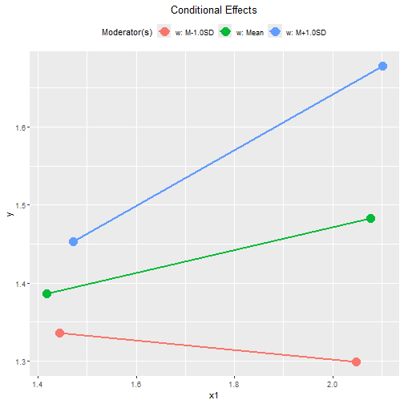
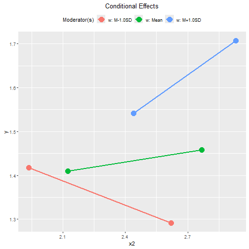
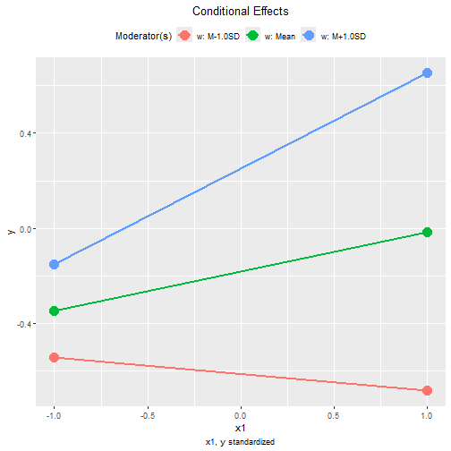
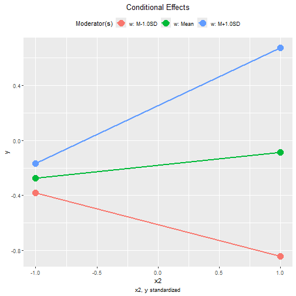
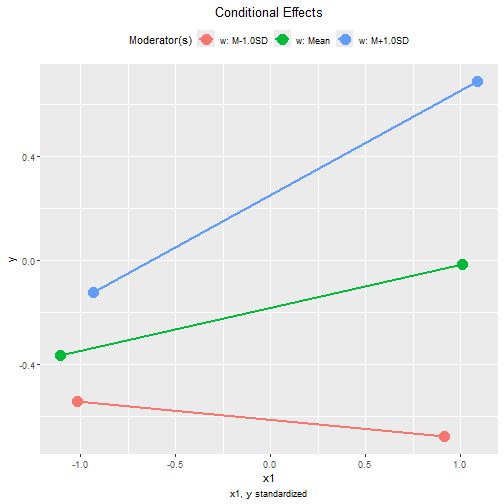
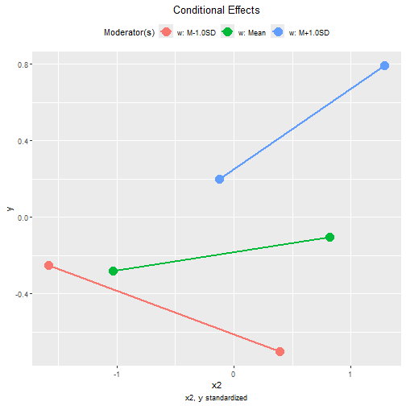

# Introduction

This article is part of a series of
brief illustrations of how
to use
`cond_effects()`
from the package
[manymome](https://sfcheung.github.io/manymome/)
[@cheung_manymome_2024]
to estimate the conditional
effects
when the model parameters are estimate by
ordinary least squares (OLS) multiple regression
using `lm()`. For moderated mediation
tested by OLS regression, please refer
to [this article](./mome_lm.html).

(Articles in this series had duplicated
sections, to make each of them self-contained.)

# Data Set and Model

This is the sample data set used for
illustration:


``` r
library(manymome)
dat <- data_mod_2x1w
print(head(dat), digits = 3)
#>      y   x1   x2    w   c1   c2
#> 1 2.05 1.80 2.75 2.09 1.83 1.60
#> 2 1.41 1.87 2.78 1.94 1.31 1.22
#> 3 1.94 1.74 3.06 2.39 1.50 1.29
#> 4 0.84 1.73 2.56 1.13 1.41 1.18
#> 5 1.33 0.95 2.86 1.32 1.45 1.11
#> 6 1.31 2.12 2.82 1.67 1.66 1.36
```

This dataset has 6 variables:

- one outcome variable (`y`),

- two predictors (`x1`, `x2`),

- one moderator (`w`),

- two control variables (`c1` and `c2`).

Suppose this is the model being fitted,
with control variables omitted from the
plot for readability:



## Fit by Regression

The path parameters
can be estimated by multiple regression
using `lm()`:


``` r
lm_y <- lm(
  y ~ w*x1 + w*x2 + c1 + c2,
  data = dat
)
```

These are the estimates of the regression coefficient
of the paths:


``` r
summary(lm_y)
#> 
#> Call:
#> lm(formula = y ~ w * x1 + w * x2 + c1 + c2, data = dat)
#> 
#> Residuals:
#>      Min       1Q   Median       3Q      Max 
#> -0.46049 -0.12989 -0.00299  0.11899  0.54333 
#> 
#> Coefficients:
#>             Estimate Std. Error t value Pr(>|t|)    
#> (Intercept)  3.91686    0.46699   8.387 1.06e-14 ***
#> w           -1.94839    0.25990  -7.497 2.35e-12 ***
#> x1          -0.63573    0.18248  -3.484 0.000612 ***
#> x2          -0.89621    0.13362  -6.707 2.16e-10 ***
#> c1           0.17521    0.05892   2.974 0.003318 ** 
#> c2           0.12061    0.05786   2.085 0.038421 *  
#> w:x1         0.45617    0.10450   4.365 2.07e-05 ***
#> w:x2         0.56611    0.07950   7.121 2.09e-11 ***
#> ---
#> Signif. codes:  0 '***' 0.001 '**' 0.01 '*' 0.05 '.' 0.1 ' ' 1
#> 
#> Residual standard error: 0.2023 on 192 degrees of freedom
#> Multiple R-squared:  0.4886,	Adjusted R-squared:   0.47 
#> F-statistic: 26.21 on 7 and 192 DF,  p-value: < 2.2e-16
```

## Conditional Effects

We can now use `cond_effects()` to
estimate the effects of `x1` and `x2`
on `y` for
different levels of the moderator (`w`).

### Conditional Effects of `x1`

Suppose we want to estimate the
effect from `x1` to `y`,
conditional on `w`:

(Refer to `vignette("manymome")` and the help page
of `cond_effects()` on the arguments.)


``` r
out1 <- cond_effects(
  wlevels = "w",
  x = "x1",
  y = "y",
  fit = lm_y
)
out1
#> 
#> == Conditional effects ==
#> 
#>  Path: x1 -> y
#>  Conditional on moderator(s): w
#>  Moderator(s) represented by: w
#> 
#>       [w]   (w)    ind    SE   Stat pvalue Sig  CI.lo CI.hi
#> 1 M+1.0SD 2.176  0.357 0.069  5.168  0.000 ***  0.221 0.493
#> 2 Mean    1.717  0.148 0.047  3.160  0.002 **   0.055 0.240
#> 3 M-1.0SD 1.258 -0.062 0.065 -0.953  0.342     -0.189 0.066
#> 
#>  - [SE] are regression standard errors.
#>  - [Stat] are the t statistics used to test the effects.
#>  - [pvalue] are p-values computed from 'Stat'.
#>  - [Sig]: 0 '***' 0.001 '**' 0.01 '*' 0.05 ' ' 1.
#>  - [CI.lo to CI.hi] are 95.0% confidence interval computed from
#>    regression standard errors.
#>  - The 'ind' column shows the conditional effects.
#> 
```

The column `ind` show the effects of
`x1` on `y` for different levels of `w`.

When `w` is one standard deviation
below mean, the effect of `x1` is
-0.062,
with 95% confidence interval
[-0.189, 0.066].

When `w` is one standard deviation
above mean, the effect of `x1` is
0.357,
with 95% confidence interval
[0.221, 0.493].


NOTE: The standard error (`SE`) and
related results are computed using
the pick-a-point approach by
@rogosa_comparing_1980.

### Conditional Effects of `x2`

The step to compute the conditional
effects for the other predictor, `x2`,
is similar:


``` r
out2 <- cond_effects(
  wlevels = "w",
  x = "x2",
  y = "y",
  fit = lm_y
)
out2
#> 
#> == Conditional effects ==
#> 
#>  Path: x2 -> y
#>  Conditional on moderator(s): w
#>  Moderator(s) represented by: w
#> 
#>       [w]   (w)    ind    SE   Stat pvalue Sig  CI.lo  CI.hi
#> 1 M+1.0SD 2.176  0.336 0.069  4.862  0.000 ***  0.200  0.472
#> 2 Mean    1.717  0.076 0.050  1.505  0.134     -0.024  0.175
#> 3 M-1.0SD 1.258 -0.184 0.055 -3.363  0.001 *** -0.292 -0.076
#> 
#>  - [SE] are regression standard errors.
#>  - [Stat] are the t statistics used to test the effects.
#>  - [pvalue] are p-values computed from 'Stat'.
#>  - [Sig]: 0 '***' 0.001 '**' 0.01 '*' 0.05 ' ' 1.
#>  - [CI.lo to CI.hi] are 95.0% confidence interval computed from
#>    regression standard errors.
#>  - The 'ind' column shows the conditional effects.
#> 
```

When `w` is one standard deviation
below mean, the effect of `x2` is
-0.184,
with 95% confidence interval
[-0.292, -0.076].

When `w` is one standard deviation
above mean, the effect of `x2` is
0.336,
with 95% confidence interval
[0.200, 0.472].

## Plotting the Conditional Effects

### Conventional Plot

The output of `cond_effects()` has a `plot`
method for plotting the conditional effects:


``` r
plot(out1)
```




``` r
plot(out2)
```



By default, the lines
span the range of one standard deviation below
and above the mean of the predictor.

The plot can be customized in a lot of way.
Please refer to the help page of
`plot.cond_indirect_effects()` for available
options.

### Tumble Plot

If the distribution
of the `x` variable may vary for different
levels of the moderators, a version of
*tumble graph* proposed by @bodner_tumble_2016
can be plotted by adding `graph_type = "tumble"`:


``` r
plot(out1,
     graph_type = "tumble")
```



In this example, the distributions of `x1`
for the three levels of moderator `w`
are similar.


``` r
plot(out2,
     graph_type = "tumble")
```



The distributions of `x2`
vary as the level of the moderator `w` changes:

- the mean of `x2` is lower when `w` is
one standard deviation below its mean,
and,

- the mean of `x2` is higher when
`w` is one standard deviation above its
mean.

Therefore, the tumble graph is a better
way to visualize the moderating effect
of `w` on the effect of `x2`. For `x1`,
the conventional graph is sufficient.

## Standardized Conditional Effects


Although OLS can be used to estimate and
test the
unstandardized effects, it is inappropriate
for forming the confidence intervals for the
standardized effects. See
@yuan_biases_2011 on the issue on standardized
regression coefficients.

To form nonparametric bootstrap confidence interval for
effects to be computed, add `boot_ci = TRUE`,
`R` to the number of bootstrap samples
(should be 5000 or even 10000, for
multiple regression), and `seed` (set
it to an integer to ensure the results are
reproducible).

The standardized conditional
effect from `x1` and `x2` to `y` conditional
on `w`
can be estimated by setting
`standardized_x` and `standardized_y` to `TRUE`.

This is the output for `x1`:


``` r
std1 <- cond_effects(
  wlevels = "w",
  x = "x1",
  y = "y",
  fit = lm_y,
  boot_ci = TRUE,
  R = 5000,
  seed = 54532,
  standardized_x = TRUE,
  standardized_y = TRUE
)
#> 19 processes started to run bootstrapping.
std1
#> 
#> == Conditional effects ==
#> 
#>  Path: x1 -> y
#>  Conditional on moderator(s): w
#>  Moderator(s) represented by: w
#> 
#>       [w]   (w)    std  CI.lo CI.hi Sig    ind
#> 1 M+1.0SD 2.176  0.401  0.267 0.533 Sig  0.357
#> 2 Mean    1.717  0.166  0.077 0.254 Sig  0.148
#> 3 M-1.0SD 1.258 -0.069 -0.191 0.060     -0.062
#> 
#>  - [CI.lo to CI.hi] are 95.0% percentile confidence intervals by
#>    nonparametric bootstrapping with 5000 samples.
#>  - std: The standardized conditional effects. 
#>  - ind: The unstandardized conditional effects.
#> 
```

When `w` is one standard deviation below
its mean, the standardized effect of `x1` is
-0.069,
with 95% confidence interval
[-0.191, 0.060].

When `w` is one standard deviation above
its mean, the standardized effect of `x1` is
0.401,
with 95% confidence interval
[0.267, 0.533].

This is the output for `x2`:


``` r
std2 <- cond_effects(
  wlevels = "w",
  x = "x2",
  y = "y",
  fit = lm_y,
  boot_ci = TRUE,
  R = 5000,
  seed = 54532,
  standardized_x = TRUE,
  standardized_y = TRUE
)
#> 19 processes started to run bootstrapping.
std2
#> 
#> == Conditional effects ==
#> 
#>  Path: x2 -> y
#>  Conditional on moderator(s): w
#>  Moderator(s) represented by: w
#> 
#>       [w]   (w)    std  CI.lo  CI.hi Sig    ind
#> 1 M+1.0SD 2.176  0.420  0.265  0.586 Sig  0.336
#> 2 Mean    1.717  0.095 -0.026  0.211      0.076
#> 3 M-1.0SD 1.258 -0.230 -0.362 -0.104 Sig -0.184
#> 
#>  - [CI.lo to CI.hi] are 95.0% percentile confidence intervals by
#>    nonparametric bootstrapping with 5000 samples.
#>  - std: The standardized conditional effects. 
#>  - ind: The unstandardized conditional effects.
#> 
```

When `w` is one standard deviation below
its mean, the standardized effect of `x2` is
-0.230,
with 95% confidence interval
[-0.362, -0.104].

When `w` is one standard deviation above
its mean, the standardized effect of `x2` is
0.420,
with 95% confidence interval
[0.265, 0.586].

### Plot Standardized Conditional Effects

The `plot()` method can also be used
on the standardized conditional effects,
although the only differences are the
values displayed on the axes:


``` r
plot(std1)
```




``` r
plot(std2)
```



These are the tumble graphs:


``` r
plot(std1,
     graph_type = "tumble")
```




``` r
plot(std2,
     graph_type = "tumble")
```




# Other Moderated Regression Models

The function `cond_effects()` has no limit
on the number of moderators and the number
of predictors with their effects moderated.

The demonstrations of other moderated
regression models can be found from
the [list of articles](./index.html#moderated-regression).

The levels
for the moderators are controlled by `mod_levels()`
and related functions in the same way whether a
model is fitted by `lavaan::sem()` or `lm()`.
Please refer to other articles (e.g.,
`vignette("manymome")` and `vignette("mod_levels")`)
on how to estimate effects in other model analyzed by
multiple regression.


# References
