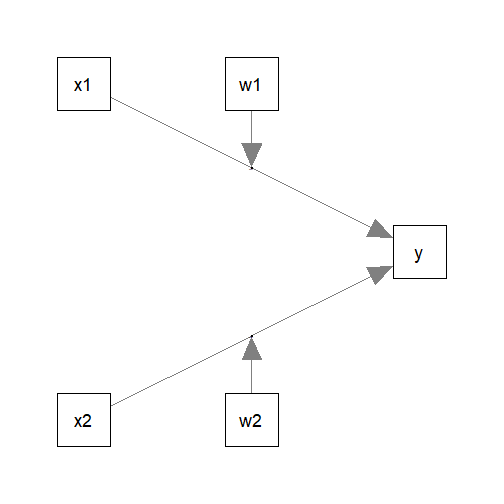
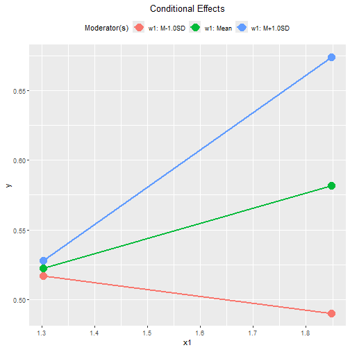
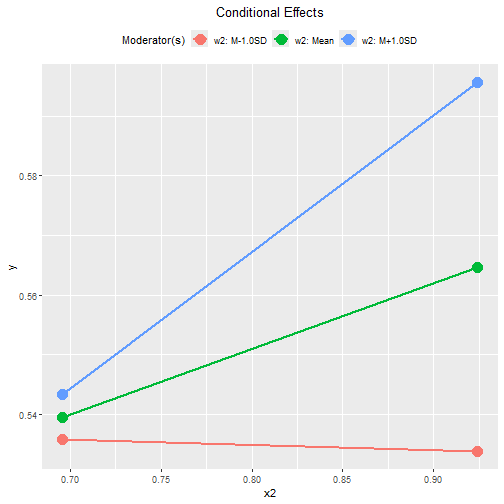
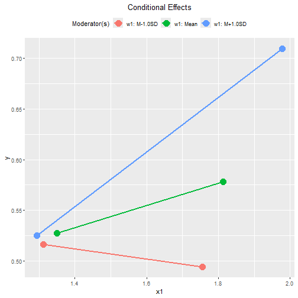
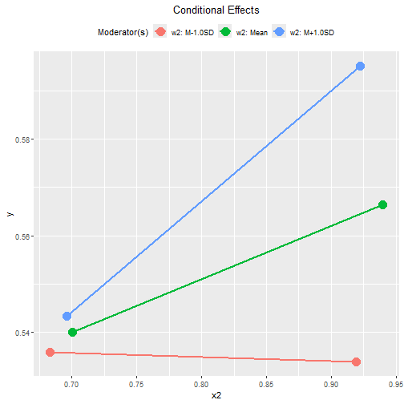
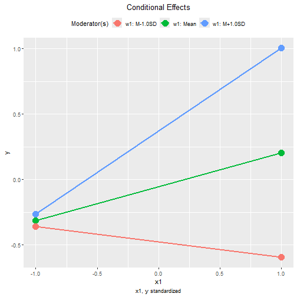
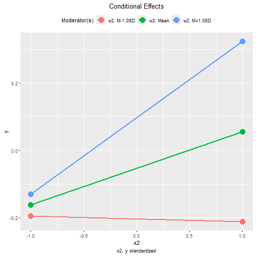
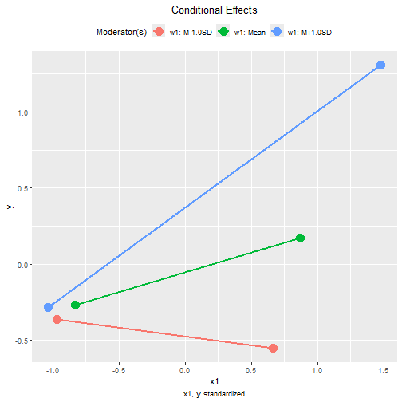
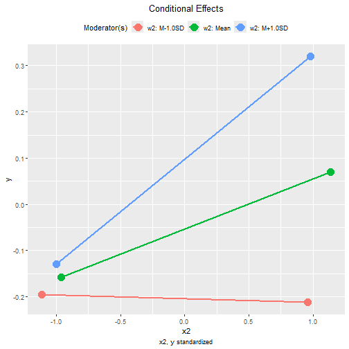

# Introduction

This article is part of a series of
brief illustrations of how
to use
`cond_effects()`
from the package
[manymome](https://sfcheung.github.io/manymome/)
[@cheung_manymome_2024]
to estimate the conditional
effects
when the model parameters are estimate by
ordinary least squares (OLS) multiple regression
using `lm()`. For moderated mediation
tested by OLS regression, please refer
to [this article](./mome_lm.html).

(Articles in this series had duplicated
sections, to make each of them self-contained.)

# Data Set and Model

This is the sample data set used for
illustration:


``` r
library(manymome)
dat <- data_mod_2x2w
print(head(dat), digits = 3)
#>      y   x1   x2   w1   w2   c1   c2
#> 1 0.46 1.55 0.73 2.06 1.13 2.69 0.43
#> 2 0.49 1.54 0.78 2.29 1.56 3.47 0.15
#> 3 0.69 1.45 0.96 1.98 1.91 2.75 0.43
#> 4 0.83 1.81 1.07 2.52 1.60 3.00 0.51
#> 5 0.53 1.36 0.70 1.83 0.98 3.79 0.62
#> 6 0.51 1.78 0.92 1.94 1.66 1.80 0.56
```

This dataset has 7 variables:

- one outcome variable (`y`),

- two predictors (`x1`, `x2`),

- two moderators (`w1`, `w2`),

- two control variables (`c1` and `c2`).

Suppose this is the model being fitted,
with control variables omitted from the
plot for readability:



## Fit by Regression

The path parameters
can be estimated by multiple regression
using `lm()`:


``` r
lm_y <- lm(
  y ~ w1*x1 + w2*x2 + c1 + c2,
  data = dat
)
```

These are the estimates of the regression coefficient
of the paths:


``` r
summary(lm_y)
#> 
#> Call:
#> lm(formula = y ~ w1 * x1 + w2 * x2 + c1 + c2, data = dat)
#> 
#> Residuals:
#>       Min        1Q    Median        3Q       Max 
#> -0.210561 -0.046282 -0.000192  0.045746  0.217473 
#> 
#> Coefficients:
#>              Estimate Std. Error t value Pr(>|t|)    
#> (Intercept)  2.234274   0.294081   7.597 1.31e-12 ***
#> w1          -0.797684   0.120573  -6.616 3.62e-10 ***
#> x1          -1.167658   0.160032  -7.296 7.70e-12 ***
#> w2          -0.236512   0.128024  -1.847   0.0662 .  
#> x2          -0.364031   0.215891  -1.686   0.0934 .  
#> c1           0.006922   0.010930   0.633   0.5273    
#> c2          -0.058162   0.052763  -1.102   0.2717    
#> w1:x1        0.628532   0.074538   8.432 8.18e-15 ***
#> w2:x2        0.356141   0.158749   2.243   0.0260 *  
#> ---
#> Signif. codes:  0 '***' 0.001 '**' 0.01 '*' 0.05 '.' 0.1 ' ' 1
#> 
#> Residual standard error: 0.07412 on 191 degrees of freedom
#> Multiple R-squared:  0.6038,	Adjusted R-squared:  0.5872 
#> F-statistic: 36.38 on 8 and 191 DF,  p-value: < 2.2e-16
```

## Conditional Effects

We can now use `cond_effects()` to
estimate the effects of `x1` and `x2`
on `y` for
different levels of the moderators, `w1` and `w2`.

### Conditional Effects of `x1`

Suppose we want to estimate the
effect from `x1` to `y`,
conditional on `w1`:

(Refer to `vignette("manymome")` and the help page
of `cond_effects()` on the arguments.)


``` r
out1 <- cond_effects(
  wlevels = "w1",
  x = "x1",
  y = "y",
  fit = lm_y
)
out1
#> 
#> == Conditional effects ==
#> 
#>  Path: x1 -> y
#>  Conditional on moderator(s): w1
#>  Moderator(s) represented by: w1
#> 
#>      [w1]  (w1)    ind    SE   Stat pvalue Sig  CI.lo CI.hi
#> 1 M+1.0SD 2.285  0.269 0.023 11.801  0.000 ***  0.224 0.313
#> 2 Mean    2.032  0.110 0.021  5.222  0.000 ***  0.068 0.151
#> 3 M-1.0SD 1.779 -0.050 0.033 -1.513  0.132     -0.114 0.015
#> 
#>  - [SE] are regression standard errors.
#>  - [Stat] are the t statistics used to test the effects.
#>  - [pvalue] are p-values computed from 'Stat'.
#>  - [Sig]: 0 '***' 0.001 '**' 0.01 '*' 0.05 ' ' 1.
#>  - [CI.lo to CI.hi] are 95.0% confidence interval computed from
#>    regression standard errors.
#>  - The 'ind' column shows the conditional effects.
#> 
```

The column `ind` show the effects of
`x1` on `y` for different levels of `w1`.

When `w1` is one standard deviation
below mean, the effect of `x1` is
-0.050,
with 95% confidence interval
[-0.114, 0.015].

When `w1` is one standard deviation
above mean, the effect of `x1` is
0.269,
with 95% confidence interval
[0.224, 0.313].


NOTE: The standard error (`SE`) and
related results are computed using
the pick-a-point approach by
@rogosa_comparing_1980.


### Conditional Effects of `x2`

The step to compute the conditional
effects for the other predictor, `x2`,
for different levels of `w2`
is similar:


``` r
out2 <- cond_effects(
  wlevels = "w2",
  x = "x2",
  y = "y",
  fit = lm_y
)
out2
#> 
#> == Conditional effects ==
#> 
#>  Path: x2 -> y
#>  Conditional on moderator(s): w2
#>  Moderator(s) represented by: w2
#> 
#>      [w2]  (w2)    ind    SE   Stat pvalue Sig  CI.lo CI.hi
#> 1 M+1.0SD 1.666  0.229 0.071  3.218  0.002  **  0.089 0.370
#> 2 Mean    1.332  0.110 0.047  2.358  0.019  *   0.018 0.203
#> 3 M-1.0SD 0.998 -0.008 0.070 -0.120  0.904     -0.147 0.130
#> 
#>  - [SE] are regression standard errors.
#>  - [Stat] are the t statistics used to test the effects.
#>  - [pvalue] are p-values computed from 'Stat'.
#>  - [Sig]: 0 '***' 0.001 '**' 0.01 '*' 0.05 ' ' 1.
#>  - [CI.lo to CI.hi] are 95.0% confidence interval computed from
#>    regression standard errors.
#>  - The 'ind' column shows the conditional effects.
#> 
```

When `w2` is one standard deviation
below mean, the effect of `x2` is
-0.008,
with 95% confidence interval
[-0.147, 0.130].

When `w2` is one standard deviation
above mean, the effect of `x2` is
0.229,
with 95% confidence interval
[0.089, 0.370].

## Plotting the Conditional Effects

### Conventional Plot

The output of `cond_effects()` has a `plot`
method for plotting the conditional effects:


``` r
plot(out1)
```




``` r
plot(out2)
```



By default, the lines
span the range of one standard deviation below
and above the mean of the predictor.

The plot can be customized in a lot of way.
Please refer to the help page of
`plot.cond_indirect_effects()` for available
options.

### Tumble Plot

If the distribution
of the `x` variable may vary for different
levels of the moderators, a version of
*tumble graph* proposed by @bodner_tumble_2016
can be plotted by adding `graph_type = "tumble"`:


``` r
plot(out1,
     graph_type = "tumble")
```



The distributions of `x1`
vary as the level of the moderator `w1` changes:
the mean of `x1` is lower and the
standard deviation smaller when `w1` is
one standard deviation below its mean,
and has higher mean and larger standard
deviation when
`w1` is one standard deviation above its
mean.

Therefore, the tumble graph is a better
way to visualize the moderating effect
of `w1` on the effect of `x1`.


``` r
plot(out2,
     graph_type = "tumble")
```



In this example, the distributions of `x2`
for the three levels of moderator `w2`
are similar.  For `x2`,
the conventional graph is sufficient.

## Standardized Conditional Effects


Although OLS can be used to estimate and
test the
unstandardized effects, it is inappropriate
for forming the confidence intervals for the
standardized effects. See
@yuan_biases_2011 on the issue on standardized
regression coefficients.

To form nonparametric bootstrap confidence interval for
effects to be computed, add `boot_ci = TRUE`,
`R` to the number of bootstrap samples
(should be 5000 or even 10000, for
multiple regression), and `seed` (set
it to an integer to ensure the results are
reproducible).

The standardized conditional
effects from `x1` and `x2` to `y` conditional
on `w1` and `w2`
can be estimated by setting
`standardized_x` and `standardized_y` to `TRUE`.

This is the output for `x1`:


``` r
std1 <- cond_effects(
  wlevels = "w1",
  x = "x1",
  y = "y",
  fit = lm_y,
  boot_ci = TRUE,
  R = 5000,
  seed = 54532,
  standardized_x = TRUE,
  standardized_y = TRUE
)
#> 19 processes started to run bootstrapping.
std1
#> 
#> == Conditional effects ==
#> 
#>  Path: x1 -> y
#>  Conditional on moderator(s): w1
#>  Moderator(s) represented by: w1
#> 
#>      [w1]  (w1)    std  CI.lo CI.hi Sig    ind
#> 1 M+1.0SD 2.285  0.635  0.529 0.741 Sig  0.269
#> 2 Mean    2.032  0.259  0.158 0.350 Sig  0.110
#> 3 M-1.0SD 1.779 -0.117 -0.272 0.029     -0.050
#> 
#>  - [CI.lo to CI.hi] are 95.0% percentile confidence intervals by
#>    nonparametric bootstrapping with 5000 samples.
#>  - std: The standardized conditional effects. 
#>  - ind: The unstandardized conditional effects.
#> 
```

When `w1` is one standard deviation below
its mean, the standardized effect of `x1` is
-0.117,
with 95% confidence interval
[-0.272, 0.029].

When `w1` is one standard deviation above
its mean, the standardized effect of `x1` is
0.635,
with 95% confidence interval
[0.529, 0.741].

This is the output for `x2`:


``` r
std2 <- cond_effects(
  wlevels = "w2",
  x = "x2",
  y = "y",
  fit = lm_y,
  boot_ci = TRUE,
  R = 5000,
  seed = 54532,
  standardized_x = TRUE,
  standardized_y = TRUE
)
#> 19 processes started to run bootstrapping.
std2
#> 
#> == Conditional effects ==
#> 
#>  Path: x2 -> y
#>  Conditional on moderator(s): w2
#>  Moderator(s) represented by: w2
#> 
#>      [w2]  (w2)    std  CI.lo CI.hi Sig    ind
#> 1 M+1.0SD 1.666  0.227  0.111 0.344 Sig  0.229
#> 2 Mean    1.332  0.109  0.030 0.196 Sig  0.110
#> 3 M-1.0SD 0.998 -0.008 -0.132 0.136     -0.008
#> 
#>  - [CI.lo to CI.hi] are 95.0% percentile confidence intervals by
#>    nonparametric bootstrapping with 5000 samples.
#>  - std: The standardized conditional effects. 
#>  - ind: The unstandardized conditional effects.
#> 
```

When `w2` is one standard deviation below
its mean, the standardized effect of `x2` is
-0.008,
with 95% confidence interval
[-0.132, 0.136].

When `w2` is one standard deviation above
its mean, the standardized effect of `x2` is
0.227,
with 95% confidence interval
[0.111, 0.344].

### Conventional Plot Standardized Conditional Effects

The `plot()` method can also be used
on the standardized conditional effects,
although the only differences are the
values displayed on the axes:


``` r
plot(std1)
```




``` r
plot(std2)
```



### Tumble Plot Standardized Conditional Effects

These are the tumble graphs:


``` r
plot(std1,
     graph_type = "tumble")
```




``` r
plot(std2,
     graph_type = "tumble")
```




# Other Moderated Regression Models

The function `cond_effects()` has no limit
on the number of moderators and the number
of predictors with their effects moderated.

The demonstrations of other moderated
regression models can be found from
the [list of articles](./index.html#moderated-regression).

The levels
for the moderators are controlled by `mod_levels()`
and related functions in the same way whether a
model is fitted by `lavaan::sem()` or `lm()`.
Please refer to other articles (e.g.,
`vignette("manymome")` and `vignette("mod_levels")`)
on how to estimate effects in other model analyzed by
multiple regression.


# References
