# Introduction

This article is part of a series of
brief illustrations of how
to use
`cond_effects()`
from the package
[manymome](https://sfcheung.github.io/manymome/)
[@cheung_manymome_2024]
to estimate the conditional
effects
when the model parameters are estimate by
ordinary least squares (OLS) multiple regression
using `lm()`. For moderated mediation
tested by OLS regression, please refer
to [this article](./mome_lm.html).

(Articles in this series had duplicated
sections, to make each of them self-contained.)

# Data Set and Model

This is the sample data set used for
illustration:


``` r
library(manymome)
dat <- data_mod_cat_2w
print(head(dat), digits = 3)
#>      x    y   c1   c2      gp   site
#> 1 19.8 24.5 29.5 10.2 Control Site 1
#> 2 24.0 21.6 15.3 10.3 Control Site 1
#> 3 28.4 24.7 29.4 20.4 Control Site 1
#> 4 39.7 26.9 32.4 16.7 Control Site 1
#> 5 33.4 21.1 36.5 10.2 Control Site 1
#> 6 22.7 23.8 27.9 23.5 Control Site 1
```

This dataset has 6 variables:

- one outcome variable (`y`),

- one predictor (`x`),

- two categorical moderators (`gp`, `site`),

- two control variables (`c1` and `c2`).

The moderator `gp` has two possible
values: `"Control"` and `"Treatment"`.

The moderator `site` has three possible
values: `"Site 1"`, `"Site 2"`, and
`"Site 3"`.

We will first consider two models, each
with only one of the two moderators.

# One Categorical Moderator: Two Categories

Suppose this is the model being fitted,
with control variables omitted from the
plot for readability:

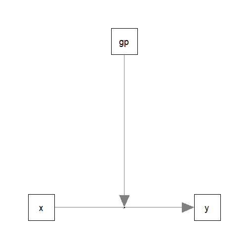

## Fit by Regression

The path parameters
can be estimated by multiple regression
using `lm()`:


``` r
lm_y_gp <- lm(
  y ~ gp*x + c1 + c2,
  data = dat
)
```

These are the estimates of the regression coefficient
of the paths:


``` r
summary(lm_y_gp)
#> 
#> Call:
#> lm(formula = y ~ gp * x + c1 + c2, data = dat)
#> 
#> Residuals:
#>      Min       1Q   Median       3Q      Max 
#> -10.8400  -2.6594  -0.2263   2.6201  15.5956 
#> 
#> Coefficients:
#>               Estimate Std. Error t value Pr(>|t|)    
#> (Intercept)   20.26140    1.49550  13.548  < 2e-16 ***
#> gpTreatment   -4.96460    1.09316  -4.542 6.77e-06 ***
#> x             -0.02738    0.03674  -0.745    0.456    
#> c1            -0.02833    0.03843  -0.737    0.461    
#> c2             0.39637    0.04438   8.932  < 2e-16 ***
#> gpTreatment:x  0.34746    0.04953   7.015 6.31e-12 ***
#> ---
#> Signif. codes:  0 '***' 0.001 '**' 0.01 '*' 0.05 '.' 0.1 ' ' 1
#> 
#> Residual standard error: 4.093 on 594 degrees of freedom
#> Multiple R-squared:  0.2698,	Adjusted R-squared:  0.2636 
#> F-statistic: 43.89 on 5 and 594 DF,  p-value: < 2.2e-16
```

## Conditional Effects

We can now use `cond_effects()` to
estimate the effects of `x`
on `y` for
different categories of the moderator `gp`.

(Refer to `vignette("manymome")` and the help page
of `cond_effects()` on the arguments.)


``` r
out_gp <- cond_effects(
  wlevels = "gp",
  x = "x",
  y = "y",
  fit = lm_y_gp
)
out_gp
#> 
#> == Conditional effects ==
#> 
#>  Path: x -> y
#>  Conditional on moderator(s): gp
#>  Moderator(s) represented by: gpTreatment
#> 
#>        [gp] (gpTreatment)    ind    SE   Stat pvalue Sig  CI.lo CI.hi
#> 1 Control               0 -0.027 0.037 -0.745  0.456     -0.100 0.045
#> 2 Treatment             1  0.320 0.033  9.655  0.000 ***  0.255 0.385
#> 
#>  - [SE] are regression standard errors.
#>  - [Stat] are the t statistics used to test the effects.
#>  - [pvalue] are p-values computed from 'Stat'.
#>  - [Sig]: 0 '***' 0.001 '**' 0.01 '*' 0.05 ' ' 1.
#>  - [CI.lo to CI.hi] are 95.0% confidence interval computed from regression standard errors.
#>  - The 'ind' column shows the conditional effects.
#> 
```

The column `ind` show the effects of
`x` on `y` for different categories of `gp`.

In the group `"Control"`, the effect of `x` is
-0.027,
with 95% confidence interval
[-0.100, 0.045].


In the group `"Treatment"`, the effect of `x` is
0.320,
with 95% confidence interval
[0.255, 0.385].


NOTE: The standard error (`SE`) and
related results are computed using
the pick-a-point approach by
@rogosa_comparing_1980.

## Plotting the Conditional Effects

The output of `cond_effects()` has a `plot`
method for plotting the conditional effects:


``` r
plot(out_gp)
```

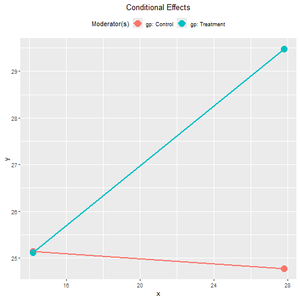

By default, the lines
span the range of one standard deviation below
and above the mean of the predictor.

The plot can be customized in a lot of way.
Please refer to the help page of
`plot.cond_indirect_effects()` for available
options.

### Tumble Plot

If the distribution
of the `x` variable may vary for different
levels of the moderators, a version of
*tumble graph* proposed by @bodner_tumble_2016
can be plotted by adding `graph_type = "tumble"`:


``` r
plot(out_gp,
     graph_type = "tumble")
```

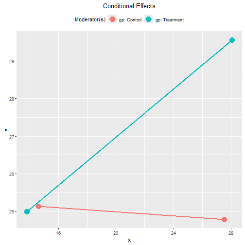

In this example, the distributions of `x`
for the groups
are similar.

## Standardized Conditional Effects


Although OLS can be used to estimate and
test the
unstandardized effects, it is inappropriate
for forming the confidence intervals for the
standardized effects. See
@yuan_biases_2011 on the issue on standardized
regression coefficients.

To form nonparametric bootstrap confidence interval for
effects to be computed, add `boot_ci = TRUE`,
`R` to the number of bootstrap samples
(should be 5000 or even 10000, for
multiple regression), and `seed` (set
it to an integer to ensure the results are
reproducible).

The standardized conditional
effects from `x` to `y` conditional
on `gp`
can be estimated by setting
`standardized_x` and `standardized_y` to `TRUE`.

This is the output:


``` r
std_gp <- cond_effects(
  wlevels = "gp",
  x = "x",
  y = "y",
  fit = lm_y_gp,
  boot_ci = TRUE,
  R = 5000,
  seed = 54532,
  standardized_x = TRUE,
  standardized_y = TRUE
)
#> 19 processes started to run bootstrapping.
std_gp
#> 
#> == Conditional effects ==
#> 
#>  Path: x -> y
#>  Conditional on moderator(s): gp
#>  Moderator(s) represented by: gpTreatment
#> 
#>        [gp] (gpTreatment)    std  CI.lo CI.hi Sig    ind
#> 1 Control               0 -0.039 -0.130 0.048     -0.027
#> 2 Treatment             1  0.457  0.363 0.551 Sig  0.320
#> 
#>  - [CI.lo to CI.hi] are 95.0% percentile confidence intervals by nonparametric bootstrapping with 5000
#>    samples.
#>  - std: The standardized conditional effects. 
#>  - ind: The unstandardized conditional effects.
#> 
```

In the group `"Control"`, the standardized effect of `x` is
-0.039,
with 95% confidence interval
[-0.130, 0.048].

In the group `"Treatment"`, the standardized effect of `x` is
0.457,
with 95% confidence interval
[0.363, 0.551].

### Plot Standardized Conditional Effects

The `plot()` method can also be used
on the standardized conditional effects,
although the only differences are the
values displayed on the axes:


``` r
plot(std_gp)
```

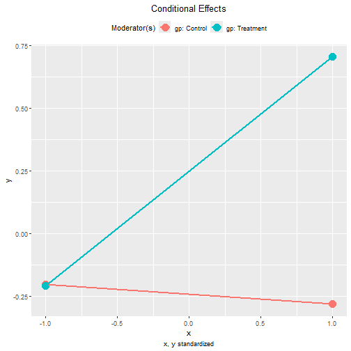


``` r
plot(std_gp,
     graph_type = "tumble")
```

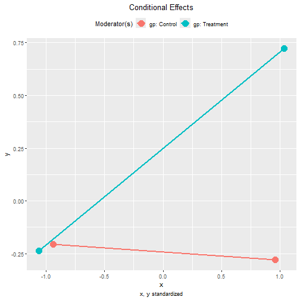

# One Categorical Moderator: Three Categories

The steps demonstrated above can be used
for a categorical moderator with any number
of levels.

Suppose this is the model being fitted,
with control variables omitted from the
plot for readability:


## Fit by Regression

The path parameters
can be estimated by a multiple regression model:


``` r
lm_y_site <- lm(
  y ~ site*x + c1 + c2,
  data = dat
)
```

These are the estimates of the regression coefficient
of the paths:


``` r
summary(lm_y_site)
#> 
#> Call:
#> lm(formula = y ~ site * x + c1 + c2, data = dat)
#> 
#> Residuals:
#>      Min       1Q   Median       3Q      Max 
#> -12.2398  -3.0852   0.2666   2.7867  17.3110 
#> 
#> Coefficients:
#>              Estimate Std. Error t value Pr(>|t|)    
#> (Intercept)  19.01557    1.99047   9.553  < 2e-16 ***
#> siteSite 2   -6.89570    2.15974  -3.193 0.001484 ** 
#> siteSite 3    1.30350    1.76713   0.738 0.461027    
#> x             0.10205    0.05877   1.737 0.082989 .  
#> c1           -0.03133    0.04062  -0.771 0.440934    
#> c2            0.35831    0.04681   7.655 7.91e-14 ***
#> siteSite 2:x  0.32975    0.08710   3.786 0.000169 ***
#> siteSite 3:x -0.08913    0.08673  -1.028 0.304478    
#> ---
#> Signif. codes:  0 '***' 0.001 '**' 0.01 '*' 0.05 '.' 0.1 ' ' 1
#> 
#> Residual standard error: 4.317 on 592 degrees of freedom
#> Multiple R-squared:  0.1905,	Adjusted R-squared:  0.1809 
#> F-statistic:  19.9 on 7 and 592 DF,  p-value: < 2.2e-16
```

## Conditional Effects

The function `cond_effects()` will determine
the number of categories automatically:


``` r
out_site <- cond_effects(
  wlevels = "site",
  x = "x",
  y = "y",
  fit = lm_y_site
)
out_site
#> 
#> == Conditional effects ==
#> 
#>  Path: x -> y
#>  Conditional on moderator(s): site
#>  Moderator(s) represented by: siteSite 2, siteSite 3
#> 
#>   [site] (siteSite 2) (siteSite 3)   ind    SE  Stat pvalue Sig  CI.lo CI.hi
#> 1 Site 1            0            0 0.102 0.059 1.737  0.083     -0.013 0.217
#> 2 Site 2            1            0 0.432 0.064 6.715  0.000 ***  0.306 0.558
#> 3 Site 3            0            1 0.013 0.064 0.203  0.840     -0.112 0.138
#> 
#>  - [SE] are regression standard errors.
#>  - [Stat] are the t statistics used to test the effects.
#>  - [pvalue] are p-values computed from 'Stat'.
#>  - [Sig]: 0 '***' 0.001 '**' 0.01 '*' 0.05 ' ' 1.
#>  - [CI.lo to CI.hi] are 95.0% confidence interval computed from regression standard errors.
#>  - The 'ind' column shows the conditional effects.
#> 
```

In the site `"Site 1"`, the effect of `x` is
0.102,
with 95% confidence interval
[-0.013, 0.217].

In the site `"Site 2"`, the effect of `x` is
0.432,
with 95% confidence interval
[0.306, 0.558].

In the site `"Site 3"`, the effect of `x` is
0.013,
with 95% confidence interval
[-0.112, 0.138].


## Plotting the Conditional Effects

These are the plots of the conditional effects:


``` r
plot(out_site)
```

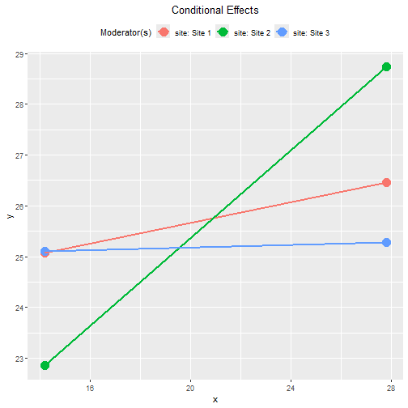


``` r
plot(out_site,
     graph_type = "tumble")
```

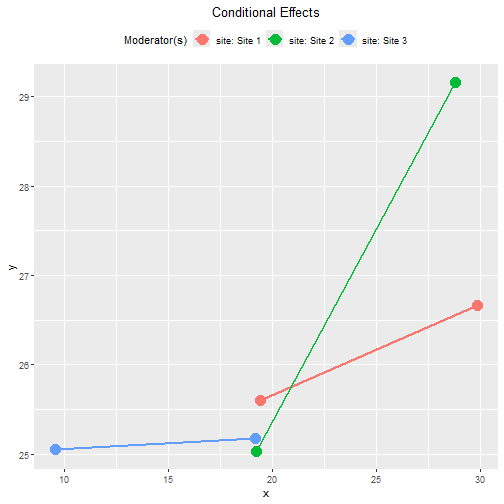

This example demonstrates the advantage of
the tumble graph. The distribution of
`x` in `"Site 3"` has a mean lower than
those in the other two sites. The
conventional plot using the same range
of `x` in all three groups will give
the incorrect impression of a cross-over
of the lines
in the *samples* (though it is possible that
such a cross-over of the lines happens in the
*populations*).

## Standardized Conditional Effects

This is the output of the standardized
conditional effects, with bootstrap
confidence intervals:


``` r
std_site <- cond_effects(
  wlevels = "site",
  x = "x",
  y = "y",
  fit = lm_y_site,
  boot_ci = TRUE,
  R = 5000,
  seed = 54532,
  standardized_x = TRUE,
  standardized_y = TRUE
)
#> 19 processes started to run bootstrapping.
std_site
#> 
#> == Conditional effects ==
#> 
#>  Path: x -> y
#>  Conditional on moderator(s): site
#>  Moderator(s) represented by: siteSite 2, siteSite 3
#> 
#>   [site] (siteSite 2) (siteSite 3)   std  CI.lo CI.hi Sig   ind
#> 1 Site 1            0            0 0.146 -0.023 0.317     0.102
#> 2 Site 2            1            0 0.616  0.414 0.818 Sig 0.432
#> 3 Site 3            0            1 0.018 -0.157 0.201     0.013
#> 
#>  - [CI.lo to CI.hi] are 95.0% percentile confidence intervals by nonparametric bootstrapping with 5000
#>    samples.
#>  - std: The standardized conditional effects. 
#>  - ind: The unstandardized conditional effects.
#> 
```

### Plot Standardized Conditional Effects

These are the plots of the standardized
conditional effects:


``` r
plot(std_site)
```

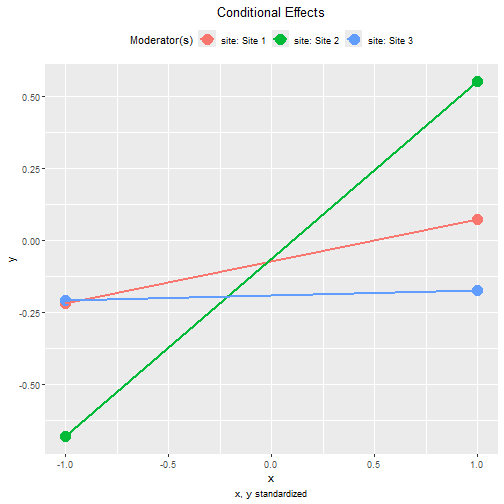


``` r
plot(std_site,
     graph_type = "tumble")
```

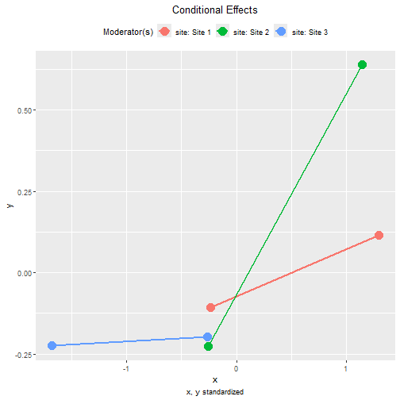

# Two Categorical Moderators

The steps demonstrated above can be used
in a regression model with any number of
moderators.

Suppose this is the model being fitted,
with control variables omitted from the
plot for readability, both `gp` and `site`
included, but no interaction between them:

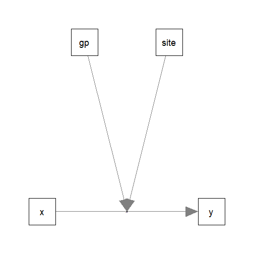

## Fit by Regression

We first fit the regression model as usual:


``` r
lm_y_gp_site <- lm(
  y ~ gp*x + site*x + c1 + c2,
  data = dat
)
```

These are the estimates of the regression coefficient
of the paths:


``` r
summary(lm_y_gp_site)
#> 
#> Call:
#> lm(formula = y ~ gp * x + site * x + c1 + c2, data = dat)
#> 
#> Residuals:
#>      Min       1Q   Median       3Q      Max 
#> -11.4604  -2.5856  -0.0874   2.5927  14.1720 
#> 
#> Coefficients:
#>               Estimate Std. Error t value Pr(>|t|)    
#> (Intercept)   21.09442    1.89659  11.122  < 2e-16 ***
#> gpTreatment   -5.24348    1.07451  -4.880 1.37e-06 ***
#> x             -0.08388    0.05955  -1.409 0.159472    
#> siteSite 2    -6.51680    2.00106  -3.257 0.001192 ** 
#> siteSite 3     1.39984    1.64547   0.851 0.395268    
#> c1            -0.01832    0.03766  -0.486 0.626860    
#> c2             0.38081    0.04345   8.764  < 2e-16 ***
#> gpTreatment:x  0.35510    0.04857   7.312 8.64e-13 ***
#> x:siteSite 2   0.31277    0.08070   3.876 0.000118 ***
#> x:siteSite 3  -0.08921    0.08091  -1.103 0.270626    
#> ---
#> Signif. codes:  0 '***' 0.001 '**' 0.01 '*' 0.05 '.' 0.1 ' ' 1
#> 
#> Residual standard error: 3.999 on 590 degrees of freedom
#> Multiple R-squared:  0.3077,	Adjusted R-squared:  0.2971 
#> F-statistic: 29.13 on 9 and 590 DF,  p-value: < 2.2e-16
```

## Conditional Effects

The function `cond_effects()` can be used
for any number of moderators, as long as
they are listed in `wlevels`:


``` r
out_gp_site <- cond_effects(
  wlevels = c("gp", "site"),
  x = "x",
  y = "y",
  fit = lm_y_gp_site
)
out_gp_site
#> 
#> == Conditional effects ==
#> 
#>  Path: x -> y
#>  Conditional on moderator(s): gp, site
#>  Moderator(s) represented by: gpTreatment, siteSite 2, siteSite 3
#> 
#>        [gp] [site] (gpTreatment) (siteSite 2) (siteSite 3)    ind    SE   Stat pvalue Sig  CI.lo  CI.hi
#> 1 Control   Site 1             0            0            0 -0.084 0.060 -1.409  0.159     -0.201  0.033
#> 2 Control   Site 2             0            1            0  0.229 0.065  3.527  0.000 ***  0.101  0.356
#> 3 Control   Site 3             0            0            1 -0.173 0.067 -2.592  0.010 **  -0.304 -0.042
#> 4 Treatment Site 1             1            0            0  0.271 0.060  4.543  0.000 ***  0.154  0.388
#> 5 Treatment Site 2             1            1            0  0.584 0.064  9.146  0.000 ***  0.459  0.709
#> 6 Treatment Site 3             1            0            1  0.182 0.062  2.936  0.003 **   0.060  0.304
#> 
#>  - [SE] are regression standard errors.
#>  - [Stat] are the t statistics used to test the effects.
#>  - [pvalue] are p-values computed from 'Stat'.
#>  - [Sig]: 0 '***' 0.001 '**' 0.01 '*' 0.05 ' ' 1.
#>  - [CI.lo to CI.hi] are 95.0% confidence interval computed from regression standard errors.
#>  - The 'ind' column shows the conditional effects.
#> 
```

IMPORTANT: Even though this model does not
have three-way interaction, the conditional
effects still need to consider *both*
moderators. It is because the effect of
`x` depends on *all* moderators, whether
there is higher order interaction or not.

If one or more moderators are omitted,
a *warning message* will be issued. This
is an example:


``` r
cond_effects(
  wlevels = "gp",
  x = "x",
  y = "y",
  fit = lm_y_gp_site
)
#> Warning in (function (xi, yi, yiname, digits = 3, y, wvalues = NULL, warn = TRUE, : siteSite 2, siteSite 3 modelled as
#> moderator(s) for the path from y~x to y but not included in 'wvalues'. They will be set to zero in computing the
#> conditional effect, which may not be meaningful. Please check.
#> Warning in (function (xi, yi, yiname, digits = 3, y, wvalues = NULL, warn = TRUE, : siteSite 2, siteSite 3 modelled as
#> moderator(s) for the path from y~x to y but not included in 'wvalues'. They will be set to zero in computing the
#> conditional effect, which may not be meaningful. Please check.
#> 
#> == Conditional effects ==
#> 
#>  Path: x -> y
#>  Conditional on moderator(s): gp
#>  Moderator(s) represented by: gpTreatment
#> 
#>        [gp] (gpTreatment)    ind    SE   Stat pvalue Sig  CI.lo CI.hi
#> 1 Control               0 -0.084 0.060 -1.409  0.159     -0.201 0.033
#> 2 Treatment             1  0.271 0.060  4.543  0.000 ***  0.154 0.388
#> 
#>  - [SE] are regression standard errors.
#>  - [Stat] are the t statistics used to test the effects.
#>  - [pvalue] are p-values computed from 'Stat'.
#>  - [Sig]: 0 '***' 0.001 '**' 0.01 '*' 0.05 ' ' 1.
#>  - [CI.lo to CI.hi] are 95.0% confidence interval computed from regression standard errors.
#>  - The 'ind' column shows the conditional effects.
#> 
```

## Plotting the Conditional Effects

### Conventional Plots

These are the plots of the conditional effects:


``` r
plot(out_gp_site)
```

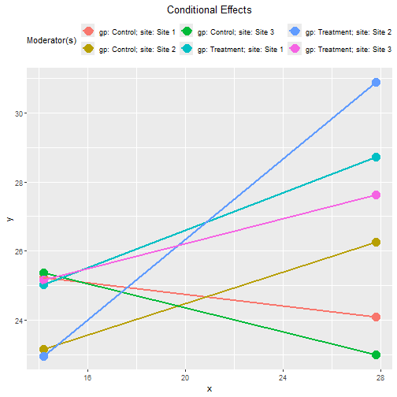

For two or more moderators, it is not
easy to visualize the conditional effects
if all lines are plotted on the same graph.

The argument `facet_grid_cols` can be used
to plot the effect of one moderator for
each category of the other moderator.

This is the plot of effects for `"Control"`
and `"Treatment"`:


``` r
plot(out_gp_site,
     facet_grid_cols = "gp")
```

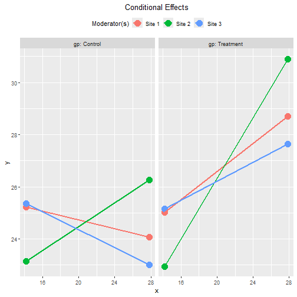

This is the plot of effects for each site:


``` r
plot(out_gp_site,
     facet_grid_cols = "site")
```

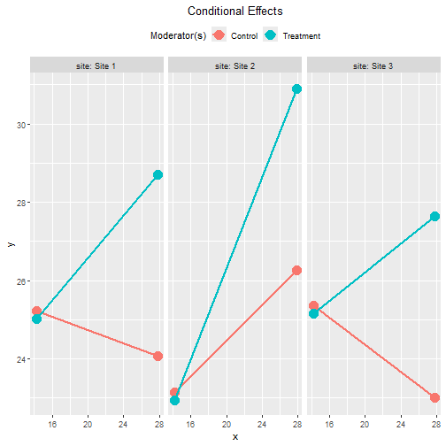

Note that, without three-way interaction,
the *moderating effect* of `gp` is the same
in all three sites, and the *moderating effect*
of `site` is the same in all two
groups. The six lines are different simply
because the effect of `x` depends on *both*
`gp` and `site`. They do *not* denote
three-way interaction (because it is not in the
regression model).

### Tumble Plots

We already know the distributions of `x`
are not the same in all three sites.
Therefore, the tumble graph is a better
way to visualize the effects:


``` r
plot(out_gp_site,
     facet_grid_cols = "gp",
     graph_type = "tumble")
```

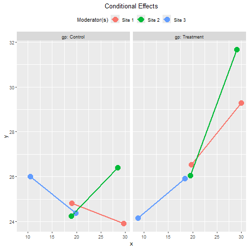


``` r
plot(out_gp_site,
     facet_grid_cols = "site",
     graph_type = "tumble")
```

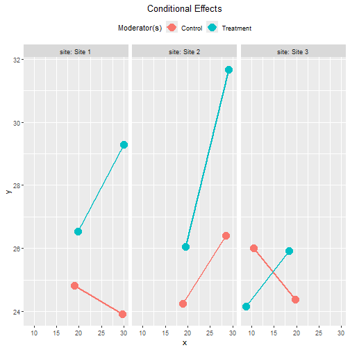

## Standardized Conditional Effects

This is the output of the standardized
conditional effects, with bootstrap
confidence intervals:


``` r
std_gp_site <- cond_effects(
  wlevels = c("gp", "site"),
  x = "x",
  y = "y",
  fit = lm_y_gp_site,
  boot_ci = TRUE,
  R = 5000,
  seed = 54532,
  standardized_x = TRUE,
  standardized_y = TRUE
)
#> 19 processes started to run bootstrapping.
std_gp_site
#> 
#> == Conditional effects ==
#> 
#>  Path: x -> y
#>  Conditional on moderator(s): gp, site
#>  Moderator(s) represented by: gpTreatment, siteSite 2, siteSite 3
#> 
#>        [gp] [site] (gpTreatment) (siteSite 2) (siteSite 3)    std  CI.lo  CI.hi Sig    ind
#> 1 Control   Site 1             0            0            0 -0.120 -0.275  0.035     -0.084
#> 2 Control   Site 2             0            1            0  0.327  0.153  0.495 Sig  0.229
#> 3 Control   Site 3             0            0            1 -0.247 -0.460 -0.027 Sig -0.173
#> 4 Treatment Site 1             1            0            0  0.387  0.220  0.549 Sig  0.271
#> 5 Treatment Site 2             1            1            0  0.833  0.650  1.009 Sig  0.584
#> 6 Treatment Site 3             1            0            1  0.260  0.068  0.466 Sig  0.182
#> 
#>  - [CI.lo to CI.hi] are 95.0% percentile confidence intervals by nonparametric bootstrapping with 5000
#>    samples.
#>  - std: The standardized conditional effects. 
#>  - ind: The unstandardized conditional effects.
#> 
```

### Tumble Plots of Standardized Conditional Effects

These are the plots of the standardized
conditional effects, with `facet_grid_cols`
set:


``` r
plot(std_gp_site,
     facet_grid_cols = "gp",
     graph_type = "tumble")
```

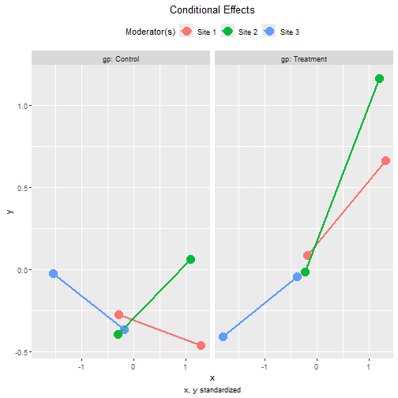


``` r
plot(std_gp_site,
     facet_grid_cols = "site",
     graph_type = "tumble")
```

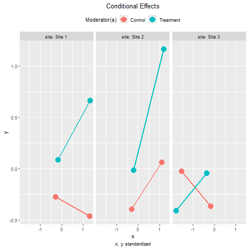

# Two Categorical Moderators, with Three-Way Interaction

Suppose that we suspect that the two
categorical moderators interact with each
other. That is, the group difference in
the effect of `x` may not be the same in
all three sites, or the site difference
in the effect of `x` may not be the same
in the two groups.

The steps demonstrated above can also be used
in this regression model:


``` r
lm_y_gp_x_site <- lm(
  y ~ x*site*gp + c1 + c2,
  data = dat
)
```

The test of the difference between this
model and the previous model with no three-way
interaction supports that this model fits
better:


``` r
anova(
  lm_y_gp_site,
  lm_y_gp_x_site
)
#> Analysis of Variance Table
#> 
#> Model 1: y ~ gp * x + site * x + c1 + c2
#> Model 2: y ~ x * site * gp + c1 + c2
#>   Res.Df    RSS Df Sum of Sq      F    Pr(>F)    
#> 1    590 9436.6                                  
#> 2    586 9108.5  4    328.07 5.2766 0.0003516 ***
#> ---
#> Signif. codes:  0 '***' 0.001 '**' 0.01 '*' 0.05 '.' 0.1 ' ' 1
```

These are the estimates of the regression coefficient
of this model:


``` r
summary(lm_y_gp_x_site)
#> 
#> Call:
#> lm(formula = y ~ x * site * gp + c1 + c2, data = dat)
#> 
#> Residuals:
#>      Min       1Q   Median       3Q      Max 
#> -11.0954  -2.5367  -0.0151   2.4875  14.3118 
#> 
#> Coefficients:
#>                           Estimate Std. Error t value Pr(>|t|)    
#> (Intercept)              22.077128   2.213474   9.974  < 2e-16 ***
#> x                        -0.128074   0.074369  -1.722  0.08557 .  
#> siteSite 2               -5.276352   2.748471  -1.920  0.05538 .  
#> siteSite 3               -3.063916   2.296016  -1.334  0.18258    
#> gpTreatment              -8.501074   2.708983  -3.138  0.00179 ** 
#> c1                       -0.002987   0.037316  -0.080  0.93622    
#> c2                        0.385877   0.042952   8.984  < 2e-16 ***
#> x:siteSite 2              0.222148   0.112091   1.982  0.04796 *  
#> x:siteSite 3              0.154193   0.113159   1.363  0.17352    
#> x:gpTreatment             0.453702   0.107574   4.218 2.86e-05 ***
#> siteSite 2:gpTreatment   -1.970235   3.954140  -0.498  0.61848    
#> siteSite 3:gpTreatment    8.743721   3.254470   2.687  0.00742 ** 
#> x:siteSite 2:gpTreatment  0.157510   0.159449   0.988  0.32364    
#> x:siteSite 3:gpTreatment -0.485461   0.160220  -3.030  0.00255 ** 
#> ---
#> Signif. codes:  0 '***' 0.001 '**' 0.01 '*' 0.05 '.' 0.1 ' ' 1
#> 
#> Residual standard error: 3.943 on 586 degrees of freedom
#> Multiple R-squared:  0.3317,	Adjusted R-squared:  0.3169 
#> F-statistic: 22.38 on 13 and 586 DF,  p-value: < 2.2e-16
```

## Conditional Effects

The function `cond_effects()` can be
used in exactly the same way, whether
the moderators interact with each other
or not:


``` r
out_gp_x_site <- cond_effects(
  wlevels = c("site", "gp"),
  x = "x",
  y = "y",
  fit = lm_y_gp_x_site
)
out_gp_x_site
#> 
#> == Conditional effects ==
#> 
#>  Path: x -> y
#>  Conditional on moderator(s): site, gp
#>  Moderator(s) represented by: siteSite 2, siteSite 3, gpTreatment
#> 
#>   [site]      [gp] (siteSite 2) (siteSite 3) (gpTreatment)    ind    SE   Stat pvalue Sig  CI.lo CI.hi
#> 1 Site 1 Control              0            0             0 -0.128 0.074 -1.722  0.086     -0.274 0.018
#> 2 Site 1 Treatment            0            0             1  0.326 0.078  4.190  0.000 ***  0.173 0.478
#> 3 Site 2 Control              1            0             0  0.094 0.084  1.122  0.262     -0.071 0.259
#> 4 Site 2 Treatment            1            0             1  0.705 0.083  8.543  0.000 ***  0.543 0.867
#> 5 Site 3 Control              0            1             0  0.026 0.085  0.307  0.759     -0.141 0.193
#> 6 Site 3 Treatment            0            1             1 -0.006 0.082 -0.069  0.945     -0.167 0.156
#> 
#>  - [SE] are regression standard errors.
#>  - [Stat] are the t statistics used to test the effects.
#>  - [pvalue] are p-values computed from 'Stat'.
#>  - [Sig]: 0 '***' 0.001 '**' 0.01 '*' 0.05 ' ' 1.
#>  - [CI.lo to CI.hi] are 95.0% confidence interval computed from regression standard errors.
#>  - The 'ind' column shows the conditional effects.
#> 
```

## Plotting the Conditional Effects

These are the tumble plots of the conditional effects,
with `facet_grid_cols` set:


``` r
plot(out_gp_x_site,
     facet_grid_cols = "gp",
     graph_type = "tumble")
```

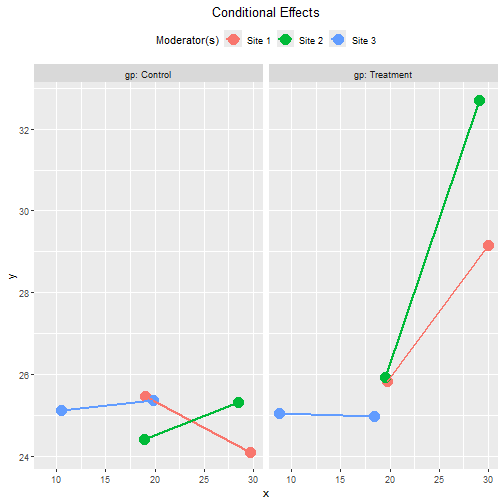


``` r
plot(out_gp_x_site,
     facet_grid_cols = "site",
     graph_type = "tumble")
```

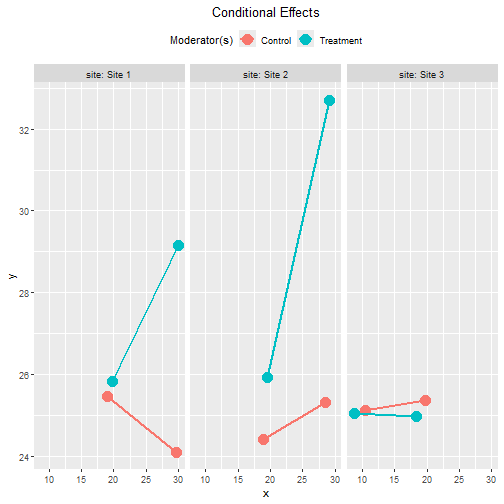

## Standardized Conditional Effects

This is the output of the standardized
conditional effects, with bootstrap
confidence intervals:


``` r
std_gp_x_site <- cond_effects(
  wlevels = c("gp", "site"),
  x = "x",
  y = "y",
  fit = lm_y_gp_x_site,
  boot_ci = TRUE,
  R = 5000,
  seed = 54532,
  standardized_x = TRUE,
  standardized_y = TRUE
)
#> 19 processes started to run bootstrapping.
std_gp_x_site
#> 
#> == Conditional effects ==
#> 
#>  Path: x -> y
#>  Conditional on moderator(s): gp, site
#>  Moderator(s) represented by: gpTreatment, siteSite 2, siteSite 3
#> 
#>        [gp] [site] (gpTreatment) (siteSite 2) (siteSite 3)    std  CI.lo CI.hi Sig    ind
#> 1 Control   Site 1             0            0            0 -0.183 -0.374 0.003     -0.128
#> 2 Control   Site 2             0            1            0  0.134 -0.045 0.298      0.094
#> 3 Control   Site 3             0            0            1  0.037 -0.252 0.316      0.026
#> 4 Treatment Site 1             1            0            0  0.465  0.226 0.692 Sig  0.326
#> 5 Treatment Site 2             1            1            0  1.006  0.740 1.269 Sig  0.705
#> 6 Treatment Site 3             1            0            1 -0.008 -0.229 0.231     -0.006
#> 
#>  - [CI.lo to CI.hi] are 95.0% percentile confidence intervals by nonparametric bootstrapping with 5000
#>    samples.
#>  - std: The standardized conditional effects. 
#>  - ind: The unstandardized conditional effects.
#> 
```

These are the plots of the standardized
conditional effects, with `facet_grid_cols`
set:


``` r
plot(std_gp_x_site,
     facet_grid_cols = "gp",
     graph_type = "tumble")
```

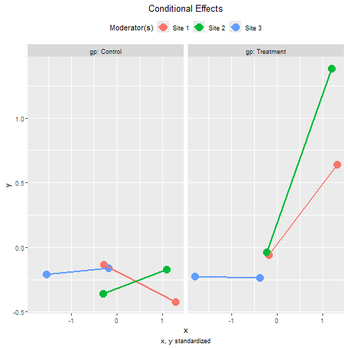


``` r
plot(std_gp_x_site,
     facet_grid_cols = "site",
     graph_type = "tumble")
```

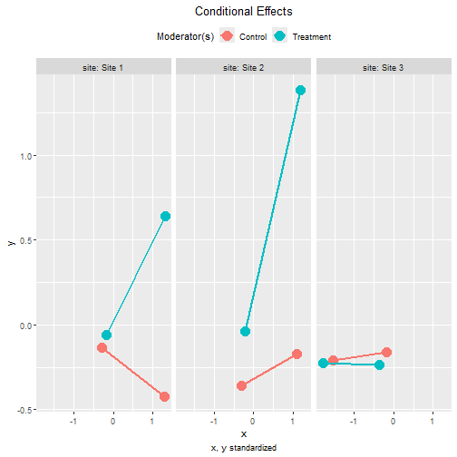


# Other Moderated Regression Models

The function `cond_effects()` has no limit
on the number of moderators and the number
of predictors with their effects moderated.

The demonstrations of other moderated
regression models can be found from
the [list of articles](./index.html#moderated-regression).

The levels
for the moderators are controlled by `mod_levels()`
and related functions in the same way whether a
model is fitted by `lavaan::sem()` or `lm()`.
Please refer to other articles (e.g.,
`vignette("manymome")` and `vignette("mod_levels")`)
on how to estimate effects in other model analyzed by
multiple regression.


# References

Bodner, T. E. (2016). Tumble graphs:
Avoiding misleading end point
extrapolation when graphing interactions
from a moderated multiple
regression analysis.
*Journal of Educational and Behavioral Statistics, 41*(6),
593--604. https://doi.org/10.3102/1076998616657080

Cheung, S. F., & Cheung, S.-H. (2024).
*manymome*: An R package for computing
the indirect effects, conditional
effects, and conditional indirect
effects, standardized or unstandardized,
and their bootstrap confidence intervals,
in many (though not all) models.
*Behavior Research Methods, 56*(5),
4862--4882.
https://doi.org/10.3758/s13428-023-02224-z

Yuan, K.-H., & Chan, W. (2011). Biases
and standard errors of standardized
regression coefficients.
*Psychometrika, 76*(4), 670--690.
https://doi.org/10.1007/s11336-011-9224-6
