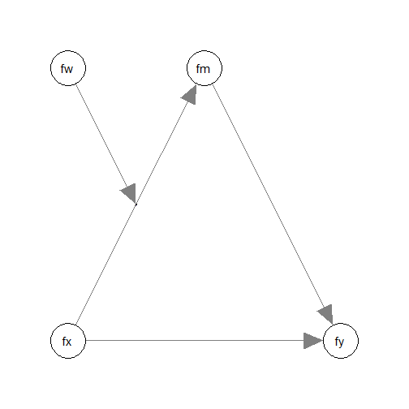

** WORK-IN-PROGRESS. Not Ready **

# Introduction

This article is a brief illustration of how
to use
`cond_indirect_effects()`
from the package
[manymome](https://sfcheung.github.io/manymome/)
([Cheung & Cheung, 2024](https://doi.org/10.3758/s13428-023-02224-z))
to estimate the conditional
indirect effects among latent variables
when the model parameters are estimate by
the SAM (structural-after-measurement)
method by @rosseel_structural_2025.

# Data Set and Model

This is the sample data set used for
illustration:


``` r
library(manymome)
dat <- data_sem_mome
print(head(dat), digits = 3)
#>       x1     x2      x3    x4      w1     w2      w3     w4     m1      m2
#> 1  0.785  1.255 -0.9689 1.179  0.0666 -1.879  1.0733 -1.163  0.854  0.0390
#> 2  0.995  0.387  0.0896 0.850  0.3381 -0.172  1.1265 -1.386 -0.683 -0.2716
#> 3  1.330 -0.261  0.0165 0.261  0.6057  1.032  1.0500  0.392  0.925  0.9005
#> 4 -0.509  1.782  1.7882 0.190  0.7921 -0.987  0.0893  0.186  0.115 -0.4747
#> 5  1.789 -0.210  0.9374 2.040  0.3904  0.370  0.2053  1.949 -0.466  0.0853
#> 6 -1.366  0.331  0.0692 0.366 -0.7207 -0.840 -0.6328 -1.061 -0.705 -1.3889
#>       m3      m4     y1     y2     y3      y4
#> 1  0.685  0.0384 -1.589  0.355  1.196  0.3196
#> 2 -0.845 -1.7383 -0.524  0.465 -0.643  0.9140
#> 3  0.598  0.3927  0.338 -0.932 -0.565 -0.6387
#> 4  0.658  0.6711 -0.697 -0.827 -0.435  0.0642
#> 5  0.973  0.2478 -0.417  2.041 -0.117  1.7897
#> 6  0.750 -0.3885  1.726  1.115  0.554  0.8903
```

This dataset has indicators of the following
four latent variables:
one predictor (`fx`),
one mediators (`fm`),
one outcome variable (`fy`), and
one moderator (`fw`).

Suppose this is the model being fitted:



The path from `fx` to `fm` is moderated
by `fw`, the moderator.

If this model is fitted to the scale
scores, then a product term `fx:fw` is
used to model the moderation.

If the model is for the latent variables,
the new approach, SAM (structural-after-measurement),
presented in @rosseel_structural_2025
can be used, using the function `sam()`
from `lavaan`. This is the model syntax:


``` r
mod <- "
# Measurement model:
fx =~ x1 + x2 + x3 + x4
fw =~ w1 + w2 + w3 + w4
fm =~ m1 + m2 + m3 + m4
fy =~ y1 + y2 + y3 + y4

# Structural model:
fm ~ fx + fw + fx:fw
fy ~ fm + fx
"
```

The moderation effect is modelled by
`fx:fw`. To fit this model by SAM, use
`sam()` from `lavaan`:


``` r
fit <- sam(
  model = mod,
  data = data_sem_mome
)
```

For details on the SAM approach, consult
@rosseel_structural_2025 and
@rosseel_structural_2024.

# Generating Bootstrap Estimates

To form nonparametric bootstrap confidence interval for
effects to be computed, `do_boot()` can be used
to generate bootstrap estimates for all the
parameter estimates first.
These estimates can be reused for
any effects to be estimated.


Please see `vignette("do_boot")` or
the help page of `do_boot()` on how
to use this function. In real research,
`R`, the number of bootstrap samples,
should be set to 2000 or even 5000.
The argument `ncores` can usually be omitted
unless users want to manually control
the number of CPU cores used in
parallel processing.

# Conditional Indirect Effects

We can now use `cond_indirect_effects()` to
estimate the indirect effects for
different levels of the moderator (`fw`) and
form their
bootstrap confidence interval. By reusing
the generated bootstrap
estimates, there is no need to repeat the
resampling.

Suppose we want to estimate the indirect
effect from `fx` to `fy` through `fm`,
conditional on `fw`:

(Refer to `vignette("manymome")` and the help page
of `cond_indirect_effects()` on the arguments.)


``` r
out_xmy_on_w <- cond_indirect_effects(
  wlevels = "fw",
  x = "fx",
  y = "fy",
  m = "fm",
  fit = fit,
  boot_ci = TRUE,
  boot_out = boot_out
)
out_xmy_on_w
#> 
#> == Conditional indirect effects ==
#> 
#>  Path: fx -> fm -> fy
#>  Conditional on moderator(s): fw
#>  Moderator(s) represented by: fw
#> 
#>      [fw]   (fw)   ind  CI.lo CI.hi Sig fm~fx fy~fm
#> 1 M+1.0SD  0.664 0.238 -0.030 0.825     0.486 0.488
#> 2 Mean    -0.000 0.164 -0.019 0.615     0.335 0.488
#> 3 M-1.0SD -0.664 0.090 -0.009 0.382     0.184 0.488
#> 
#>  - [CI.lo to CI.hi] are 95.0% percentile confidence intervals by
#>    nonparametric bootstrapping with 100 samples.
#>  - The 'ind' column shows the conditional indirect effects.
#>  - 'fm~fx','fy~fm' is/are the path coefficient(s) along the path
#>    conditional on the moderator(s).
```

When `fw` is one standard deviation
below mean, the indirect effect is
0.090,
with 95% confidence interval
[-0.009, 0.382].

When `fw` is one standard deviation
above mean, the indirect effect is
0.238,
with 95% confidence interval
[-0.030, 0.825].

Note that any conditional indirect path in the model can be
estimated this way. There is no limit on the path
to be estimated, as long
as all required path coefficients are in the model.
`cond_indirect_effects()` will also check whether a path is valid.
However, for complicated models, structural
equation modelling may be a more flexible approach
than multiple regression.

# Index of Moderated Mediation

The function `index_of_mome()` can be used to compute
the index of moderated mediation of `fw` on the
path `fx -> fm -> fy`:

(Refer to `vignette("manymome")` and the help page
of `index_of_mome()` on the arguments.)


``` r
out_mome <- index_of_mome(
  x = "fx",
  y = "fy",
  m = "fm",
  w = "fw",
  fit = fit,
  boot_ci = TRUE,
  boot_out = boot_out
)
out_mome
#> 
#> == Conditional indirect effects ==
#> 
#>  Path: fx -> fm -> fy
#>  Conditional on moderator(s): fw
#>  Moderator(s) represented by: fw
#> 
#>   [fw] (fw)   ind  CI.lo CI.hi Sig fm~fx fy~fm
#> 1    1    1 0.275 -0.035 0.930     0.563 0.488
#> 2    0    0 0.164 -0.019 0.615     0.335 0.488
#> 
#> == Index of Moderated Mediation ==
#> 
#> Levels compared: Row 1 - Row 2
#> 
#>        x  y Index  CI.lo CI.hi
#> Index fx fy 0.111 -0.015 0.318
#> 
#>  - [CI.lo, CI.hi]: 95% percentile confidence interval.
```

In this model, the index of moderated mediation is
0.111,
with 95% bootstrap confidence interval
[-0.015, 0.318].
The indirect effect of `fx` on `fy` through `fm`
significantly changes when
`fw` increases by one unit.

# Standardized Conditional Indirect effects

The standardized conditional indirect
effect from `fx` to `fy` through `fm` conditional
on `fw`
can be estimated by setting
`standardized_x` and `standardized_y` to `TRUE`:


``` r
std_xmy_on_w <- cond_indirect_effects(
  wlevels = "fw",
  x = "fx",
  y = "fy",
  m = "fm",
  fit = fit,
  boot_ci = TRUE,
  boot_out = boot_out,
  standardized_x = TRUE,
  standardized_y = TRUE
)
std_xmy_on_w
#> 
#> == Conditional indirect effects ==
#> 
#>  Path: fx -> fm -> fy
#>  Conditional on moderator(s): fw
#>  Moderator(s) represented by: fw
#> 
#>      [fw]   (fw)   std  CI.lo CI.hi Sig fm~fx fy~fm   ind
#> 1 M+1.0SD  0.664 0.275 -0.035 1.034     0.486 0.488 0.238
#> 2 Mean     0.000 0.189 -0.023 0.772     0.335 0.488 0.164
#> 3 M-1.0SD -0.664 0.104 -0.011 0.510     0.184 0.488 0.090
#> 
#>  - [CI.lo to CI.hi] are 95.0% percentile confidence intervals by
#>    nonparametric bootstrapping with 100 samples.
#>  - std: The standardized conditional indirect effects. 
#>  - ind: The unstandardized conditional indirect effects.
#>  - 'fm~fx','fy~fm' is/are the path coefficient(s) along the path
#>    conditional on the moderator(s).
```

The standardized indirect effect is
0.104,
with 95% confidence interval
[-0.011, 0.510].

# More Complicated Models

After the path coefficients are estimated, `cond_indirect_effects()`,
`indirect_effect()`,
and related functions are used in the same way as
for models fitted by `lavaan::sem()`. The levels
for the moderators are controlled by `mod_levels()`
and related functions in the same way whether a
model is fitted by `lavaan::sem()` or `lavaan::sem()`.
Please refer to other articles (e.g.,
`vignette("manymome")` and `vignette("mod_levels")`)
on how to estimate effects in other model analyzed by
multiple regression.

# Reference(s)
