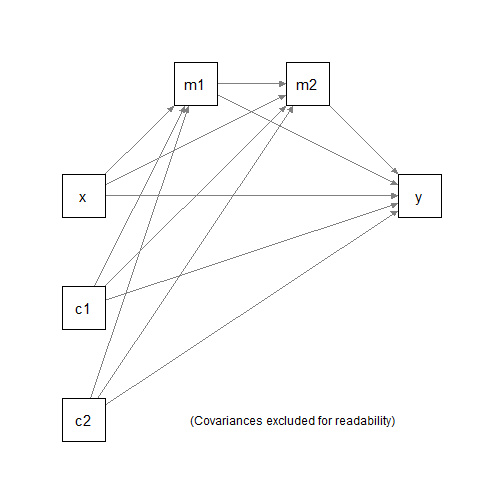

# Introduction

This article is a brief illustration of how to use
the new all-in-one "quick" functions from
[manymome](https://sfcheung.github.io/manymome/index.html)
([Cheung & Cheung, 2024](https://doi.org/10.3758/s13428-023-02224-z))
to fit the regression models and
compute and test indirect effects in
one step.

The following sections on the three
models, simple mediation model,
serial mediation model, and parallel
mediation model has sections duplicated,
to make each section self-contained.

# Simple Mediation Model

This is the sample data set that comes
with the package for this example:


``` r
library(manymome)
dat <- data_med
print(head(dat), digits = 3)
#>       x    m    y   c1   c2
#> 1  9.93 17.9 20.7 1.43 6.10
#> 2  8.33 17.9 22.9 2.94 3.83
#> 3 10.33 17.8 22.1 3.01 5.77
#> 4 11.20 20.0 25.1 3.12 4.65
#> 5 11.89 22.1 28.5 4.44 3.96
#> 6  8.20 17.0 20.7 2.50 3.76
```

Suppose we would like to fit a simple
mediation model with only one mediator,
with `c1` and `c2` as the control
variables.


We would to fit the two regression models

- `m ~ x + c1 + c2`

- `y ~ m + x + c1 + c2`

and the compute and test the indirect
effect along the path `x -> m -> y`
using nonparametric bootstrapping.

## Analysis

We can do that in one single step using
`q_simple_mediation()`:


``` r
out_simple <- q_simple_mediation(x = "x",
                                 y = "y",
                                 m = "m",
                                 cov = c("c2", "c1"),
                                 data = data_med,
                                 R = 5000,
                                 seed = 1234)
```

These are the arguments:

- `x`: The name of the predictor ("x" variable).

- `y`: The name of the outcome ("y" variable).

- `m`: The name of the mediator ("m" variable).

- `cov`: The name(s) of the control variable(s)
  (covariate(s)). By default, they predict both
  the mediator and the outcome.

- `data`: The data frame for the model.

- `R`: The number of bootstrap samples.
  Should be at least 5000 but can be
  larger for stable results.

- `seed`: The seed for the random number
  generator. Should always be set to an
  integer to make the results reproducible.

The computation may take some time to run but should
be at most one or two minutes for contemporary
computers.

## Results

We can then just print the output:


``` r
out_simple
#> 
#> =============== Simple Mediation Model ===============
#> 
#> Call:
#> 
#> q_simple_mediation(x = "x", y = "y", m = "m", cov = c("c2", "c1"), 
#>     data = data_med, R = 5000, seed = 1234)
#> 
#> ===================================================
#> |                Basic Information                |
#> ===================================================
#> 
#> Predictor(x): x
#> Outcome(y): y
#> Mediator(s)(m): m
#> Model: Simple Mediation Model
#> 
#> The regression models fitted:
#> 
#> m ~ x + c2 + c1
#> y ~ m + x + c2 + c1
#> 
#> The number of cases included: 100 
#> 
#> ===================================================
#> |               Regression Results                |
#> ===================================================
#> 
#> 
#> Model:
#> m ~ x + c2 + c1
#> 
#>             Estimate   CI.lo   CI.hi   betaS Std. Error t value Pr(>|t|) Sig
#> (Intercept)   9.6894  7.8636 11.5152  0.0000     0.9198 10.5344   0.0000 ***
#> x             0.9347  0.7742  1.0951  0.7536     0.0808 11.5632   0.0000 ***
#> c2           -0.1684 -0.3730  0.0361 -0.1070     0.1030 -1.6343   0.1055    
#> c1            0.1978  0.0454  0.3502  0.1676     0.0768  2.5759   0.0115   *
#> Signif. codes:   0 '***' 0.001 '**' 0.01 '*' 0.05 '.' 0.1 ' ' 1 
#> - BetaS are standardized coefficients with (a) only numeric variables
#>   standardized and (b) product terms formed after standardization.
#>   Variable(s) standardized is/are: m, x, c2, c1
#> - CI.lo and CI.hi are the 95.0% confidence levels of 'Estimate'
#>   computed from the t values and standard errors.
#> R-square = 0.598. Adjusted R-square = 0.586. F(3, 96) = 47.622, p < .001
#> 
#> Model:
#> y ~ m + x + c2 + c1
#> 
#>             Estimate   CI.lo   CI.hi   betaS Std. Error t value Pr(>|t|) Sig
#> (Intercept)   4.4152 -2.1393 10.9698  0.0000     3.3016  1.3373   0.1843    
#> m             0.7847  0.2894  1.2800  0.4079     0.2495  3.1450   0.0022  **
#> x             0.5077 -0.0992  1.1145  0.2128     0.3057  1.6608   0.1000    
#> c2           -0.1544 -0.6614  0.3526 -0.0510     0.2554 -0.6045   0.5470    
#> c1            0.1405 -0.2448  0.5258  0.0619     0.1941  0.7239   0.4709    
#> Signif. codes:   0 '***' 0.001 '**' 0.01 '*' 0.05 '.' 0.1 ' ' 1 
#> - BetaS are standardized coefficients with (a) only numeric variables
#>   standardized and (b) product terms formed after standardization.
#>   Variable(s) standardized is/are: y, m, x, c2, c1
#> - CI.lo and CI.hi are the 95.0% confidence levels of 'Estimate'
#>   computed from the t values and standard errors.
#> R-square = 0.358. Adjusted R-square = 0.331. F(4, 95) = 13.220, p < .001
#> 
#> ===================================================
#> |             Indirect Effect Results             |
#> ===================================================
#> 
#> ==  Indirect Effect(s)   ==
#>                ind  CI.lo  CI.hi Sig pvalue     SE
#> x -> m -> y 0.7334 0.3051 1.1965 Sig 0.0012 0.2273
#> 
#>  - [CI.lo to CI.hi] are 95.0% percentile confidence intervals by
#>    nonparametric bootstrapping with 5000 samples.
#>  - [pvalue] are asymmetric bootstrap p-values.
#>  - [SE] are standard errors.
#>  - The 'ind' column shows the indirect effects.
#>  
#> ==  Indirect Effect(s) (x-variable(s) Standardized)  ==
#>                std  CI.lo  CI.hi Sig pvalue     SE
#> x -> m -> y 0.7739 0.3223 1.2653 Sig 0.0012 0.2429
#> 
#>  - [CI.lo to CI.hi] are 95.0% percentile confidence intervals by
#>    nonparametric bootstrapping with 5000 samples.
#>  - [pvalue] are asymmetric bootstrap p-values.
#>  - [SE] are standard errors.
#>  - std: The partially standardized indirect effects. 
#>  - x-variable(s) standardized.
#>  
#> ==  Indirect Effect(s) (y-variable(s) Standardized)  ==
#>                std  CI.lo  CI.hi Sig pvalue     SE
#> x -> m -> y 0.2914 0.1262 0.4686 Sig 0.0012 0.0864
#> 
#>  - [CI.lo to CI.hi] are 95.0% percentile confidence intervals by
#>    nonparametric bootstrapping with 5000 samples.
#>  - [pvalue] are asymmetric bootstrap p-values.
#>  - [SE] are standard errors.
#>  - std: The partially standardized indirect effects. 
#>  - y-variable(s) standardized.
#>  
#> ==  Indirect Effect(s) (Both x-variable(s) and y-variable(s) Standardized)  ==
#>                std  CI.lo  CI.hi Sig pvalue     SE
#> x -> m -> y 0.3074 0.1313 0.4876 Sig 0.0012 0.0912
#> 
#>  - [CI.lo to CI.hi] are 95.0% percentile confidence intervals by
#>    nonparametric bootstrapping with 5000 samples.
#>  - [pvalue] are asymmetric bootstrap p-values.
#>  - [SE] are standard errors.
#>  - std: The standardized indirect effects.
#>  
#> ===================================================
#> |              Direct Effect Results              |
#> ===================================================
#> 
#> ==   Effect(s)   ==
#>           ind   CI.lo  CI.hi Sig pvalue     SE
#> x -> y 0.5077 -0.1436 1.1418     0.1292 0.3297
#> 
#>  - [CI.lo to CI.hi] are 95.0% percentile confidence intervals by
#>    nonparametric bootstrapping with 5000 samples.
#>  - [pvalue] are asymmetric bootstrap p-values.
#>  - [SE] are standard errors.
#>  - The 'ind' column shows the  effects.
#>  
#> ==   Effect(s) (x-variable(s) Standardized)  ==
#>           std   CI.lo  CI.hi Sig pvalue     SE
#> x -> y 0.5357 -0.1571 1.2035     0.1292 0.3426
#> 
#>  - [CI.lo to CI.hi] are 95.0% percentile confidence intervals by
#>    nonparametric bootstrapping with 5000 samples.
#>  - [pvalue] are asymmetric bootstrap p-values.
#>  - [SE] are standard errors.
#>  - std: The partially standardized  effects. 
#>  - x-variable(s) standardized.
#>  
#> ==   Effect(s) (y-variable(s) Standardized)  ==
#>           std   CI.lo  CI.hi Sig pvalue     SE
#> x -> y 0.2017 -0.0571 0.4590     0.1292 0.1319
#> 
#>  - [CI.lo to CI.hi] are 95.0% percentile confidence intervals by
#>    nonparametric bootstrapping with 5000 samples.
#>  - [pvalue] are asymmetric bootstrap p-values.
#>  - [SE] are standard errors.
#>  - std: The partially standardized  effects. 
#>  - y-variable(s) standardized.
#>  
#> ==   Effect(s) (Both x-variable(s) and y-variable(s) Standardized)  ==
#>           std   CI.lo  CI.hi Sig pvalue     SE
#> x -> y 0.2128 -0.0612 0.4754     0.1292 0.1365
#> 
#>  - [CI.lo to CI.hi] are 95.0% percentile confidence intervals by
#>    nonparametric bootstrapping with 5000 samples.
#>  - [pvalue] are asymmetric bootstrap p-values.
#>  - [SE] are standard errors.
#>  - std: The standardized  effects.
#>  
#> ===================================================
#> |                      Notes                      |
#> ===================================================
#> 
#> - For reference, the bootstrap confidence interval (and bootstrap
#>   p-value, if requested) of the (unstandardize) direct effect is also
#>   reported. The bootstrap p-value and the OLS t-statistic p-value can
#>   be different.
#> - For the direct effects with either 'x'-variable or 'y'-variable, or
#>   both, standardized, it is recommended to use the bootstrap confidence
#>   intervals, which take into account the sampling error of the sample
#>   standard deviations.
#> - The asymmetric bootstrap value for an effect is the same whether x
#>   and/or y is/are standardized.
```

These are the main sections of the
default results:

### Basic Information

The variables, the models, and the
number of cases. Listwise deletion is
used and only cases without missing data
on all variables in the models are
used.

### Regression Results

This part is simply the usual outputs
of regression analysis conducted by
`lm()`.

### Indirect Effect Results

By default, this section prints the estimated
indirect effect, confidence interval,
and asymmetric bootstrap *p*-value.

Four sections will be printed:

- The original indirect effect.

- The indirect effect with the predictor
  ("x") standardized.

- The indirect effect with the outcome
  ("y") standardized.

- The indirect effect with both the predictor
  ("x") and the outcome ("y") standardized,
  also called the *completely*
  *standardized* *indirect* *effect* or
  simply the *standardized* *indirect*
  *effect*.

These four versions of the results are
printed by default such that users can
select and interpret sections as they
see fit.

### Direct Effect Results

By default, this section prints the estimated
direct effect (from the predictor "x" to
the outcome "y", not mediated), confidence interval,
and asymmetric bootstrap *p*-value.

The OLS *t*-test of the direct effect is
already available in section *Regression Results*.
The bootstrap results are printed in
case users prefer using the same
confidence interval method for all
the effects.

# Serial Mediation Model

(Some sections are copied from the
previous section to make this section
self-contained and readers do not need
to refer to the sections on other models.)

This is the sample data set that comes
with the package for this example:


``` r
library(manymome)
dat <- data_serial
print(head(dat), digits = 3)
#>       x   m1    m2     y        c1   c2
#> 1 12.12 20.6  9.33  9.00  0.109262 6.01
#> 2  9.81 18.2  9.47 11.56 -0.124014 6.42
#> 3 10.11 20.3 10.05  9.35  4.278608 5.34
#> 4 10.07 19.7 10.17 11.41  1.245356 5.59
#> 5 11.91 20.5 10.05 14.26 -0.000932 5.34
#> 6  9.13 16.5  8.93 10.01  1.802727 5.91
```

Suppose we would like to fit a serial
mediation model with two mediators,
with `c1` and `c2` as the control
variables.



We would to fit three regression models:

- `m1 ~ x + c1 + c2`

- `m2 ~ m1 + x + c1 + c2`

- `y ~ m1 + m2 + x + c1 + c2`

and the compute and test the following
indirect effects:

- `x -> m1 -> m2 -> y`

- `x -> m1 -> y`

- `x -> m2 -> y`

using nonparametric bootstrapping.

## Analysis

We can do that in one single step using
`q_serial_mediation()`:


``` r
out_serial <- q_serial_mediation(x = "x",
                                 y = "y",
                                 m = c("m1", "m2"),
                                 cov = c("c2", "c1"),
                                 data = data_serial,
                                 R = 5000,
                                 seed = 1234)
```

These are the arguments:

- `x`: The name of the predictor ("x" variable).

- `y`: The name of the outcome ("y" variable).

- `m`: A vector of the names of the mediators
  ("m" variables). The order of the names represents
  the order of the mediators, from the
  first name to the last name. Therefore,
  if the path is `x -> m1 -> m2 -> y`,
  set this to `c("m1", "m2")`.

- `cov`: The name(s) of the control variable(s)
  (covariate(s)). By default, they predict all
  the mediators and the outcome.

- `data`: The data frame for the model.

- `R`: The number of bootstrap samples.
  Should be at least 5000 but can be
  larger for stable results.

- `seed`: The seed for the random number
  generator. Should always be set to an
  integer to make the results reproducible.

The computation will take longer to run
for a serial mediation model, and can
be a few minutes if `R` is large.

## Results

We can then just print the output:


``` r
out_serial
#> 
#> =============== Serial Mediation Model ===============
#> 
#> Call:
#> 
#> q_serial_mediation(x = "x", y = "y", m = c("m1", "m2"), cov = c("c2", 
#>     "c1"), data = data_serial, R = 5000, seed = 1234)
#> 
#> ===================================================
#> |                Basic Information                |
#> ===================================================
#> 
#> Predictor(x): x
#> Outcome(y): y
#> Mediator(s)(m): m1, m2
#> Model: Serial Mediation Model
#> 
#> The regression models fitted:
#> 
#> m1 ~ x + c2 + c1
#> m2 ~ x + m1 + c2 + c1
#> y ~ m1 + m2 + x + c2 + c1
#> 
#> The number of cases included: 100 
#> 
#> ===================================================
#> |               Regression Results                |
#> ===================================================
#> 
#> 
#> Model:
#> m1 ~ x + c2 + c1
#> 
#>             Estimate   CI.lo   CI.hi   betaS Std. Error t value Pr(>|t|) Sig
#> (Intercept)  10.8157  8.5453 13.0861 -0.0000     1.1438  9.4560   0.0000 ***
#> x             0.8224  0.6354  1.0095  0.6493     0.0942  8.7274   0.0000 ***
#> c2           -0.1889 -0.3730 -0.0047 -0.1534     0.0928 -2.0355   0.0446   *
#> c1            0.1715 -0.0086  0.3515  0.1423     0.0907  1.8906   0.0617   .
#> Signif. codes:   0 '***' 0.001 '**' 0.01 '*' 0.05 '.' 0.1 ' ' 1 
#> - BetaS are standardized coefficients with (a) only numeric variables
#>   standardized and (b) product terms formed after standardization.
#>   Variable(s) standardized is/are: m1, x, c2, c1
#> - CI.lo and CI.hi are the 95.0% confidence levels of 'Estimate'
#>   computed from the t values and standard errors.
#> R-square = 0.477. Adjusted R-square = 0.461. F(3, 96) = 29.235, p < .001
#> 
#> Model:
#> m2 ~ x + m1 + c2 + c1
#> 
#>             Estimate   CI.lo  CI.hi   betaS Std. Error t value Pr(>|t|) Sig
#> (Intercept)   3.5194  0.3692 6.6696 -0.0000     1.5868  2.2179   0.0289   *
#> x            -0.1161 -0.3662 0.1340 -0.1036     0.1260 -0.9216   0.3591    
#> m1            0.4208  0.2185 0.6230  0.4758     0.1019  4.1300   0.0001 ***
#> c2           -0.1619 -0.3497 0.0259 -0.1487     0.0946 -1.7120   0.0902   .
#> c1            0.2775  0.0945 0.4606  0.2603     0.0922  3.0096   0.0033  **
#> Signif. codes:   0 '***' 0.001 '**' 0.01 '*' 0.05 '.' 0.1 ' ' 1 
#> - BetaS are standardized coefficients with (a) only numeric variables
#>   standardized and (b) product terms formed after standardization.
#>   Variable(s) standardized is/are: m2, x, m1, c2, c1
#> - CI.lo and CI.hi are the 95.0% confidence levels of 'Estimate'
#>   computed from the t values and standard errors.
#> R-square = 0.341. Adjusted R-square = 0.313. F(4, 95) = 12.290, p < .001
#> 
#> Model:
#> y ~ m1 + m2 + x + c2 + c1
#> 
#>             Estimate   CI.lo   CI.hi   betaS Std. Error t value Pr(>|t|) Sig
#> (Intercept)   9.4679  2.3021 16.6336  0.0000     3.6090  2.6234   0.0102   *
#> m1           -0.4353 -0.9226  0.0519 -0.2620     0.2454 -1.7740   0.0793   .
#> m2            0.5208  0.0690  0.9725  0.2772     0.2275  2.2888   0.0243   *
#> x             0.4929 -0.0643  1.0500  0.2342     0.2806  1.7562   0.0823   .
#> c2           -0.0960 -0.5190  0.3269 -0.0469     0.2130 -0.4509   0.6531    
#> c1            0.0988 -0.3261  0.5238  0.0493     0.2140  0.4618   0.6453    
#> Signif. codes:   0 '***' 0.001 '**' 0.01 '*' 0.05 '.' 0.1 ' ' 1 
#> - BetaS are standardized coefficients with (a) only numeric variables
#>   standardized and (b) product terms formed after standardization.
#>   Variable(s) standardized is/are: y, m1, m2, x, c2, c1
#> - CI.lo and CI.hi are the 95.0% confidence levels of 'Estimate'
#>   computed from the t values and standard errors.
#> R-square = 0.091. Adjusted R-square = 0.043. F(5, 94) = 1.893, p = 0.103
#> 
#> ===================================================
#> |             Indirect Effect Results             |
#> ===================================================
#> 
#> ==  Indirect Effect(s)   ==
#>                        ind   CI.lo   CI.hi Sig pvalue     SE
#> x -> m1 -> m2 -> y  0.1802  0.0260  0.3838 Sig 0.0172 0.0922
#> x -> m1 -> y       -0.3580 -0.7063 -0.0010 Sig 0.0488 0.1768
#> x -> m2 -> y       -0.0605 -0.2527  0.1019     0.4608 0.0875
#> 
#>  - [CI.lo to CI.hi] are 95.0% percentile confidence intervals by
#>    nonparametric bootstrapping with 5000 samples.
#>  - [pvalue] are asymmetric bootstrap p-values.
#>  - [SE] are standard errors.
#>  - The 'ind' column shows the indirect effects.
#>  
#> ==  Indirect Effect(s) (x-variable(s) Standardized)  ==
#>                        std   CI.lo   CI.hi Sig pvalue     SE
#> x -> m1 -> m2 -> y  0.1721  0.0236  0.3697 Sig 0.0172 0.0889
#> x -> m1 -> y       -0.3419 -0.6865 -0.0010 Sig 0.0488 0.1714
#> x -> m2 -> y       -0.0577 -0.2434  0.0939     0.4608 0.0835
#> 
#>  - [CI.lo to CI.hi] are 95.0% percentile confidence intervals by
#>    nonparametric bootstrapping with 5000 samples.
#>  - [pvalue] are asymmetric bootstrap p-values.
#>  - [SE] are standard errors.
#>  - std: The partially standardized indirect effects. 
#>  - x-variable(s) standardized.
#>  
#> ==  Indirect Effect(s) (y-variable(s) Standardized)  ==
#>                        std   CI.lo   CI.hi Sig pvalue     SE
#> x -> m1 -> m2 -> y  0.0897  0.0134  0.1874 Sig 0.0172 0.0448
#> x -> m1 -> y       -0.1782 -0.3446 -0.0005 Sig 0.0488 0.0861
#> x -> m2 -> y       -0.0301 -0.1284  0.0493     0.4608 0.0435
#> 
#>  - [CI.lo to CI.hi] are 95.0% percentile confidence intervals by
#>    nonparametric bootstrapping with 5000 samples.
#>  - [pvalue] are asymmetric bootstrap p-values.
#>  - [SE] are standard errors.
#>  - std: The partially standardized indirect effects. 
#>  - y-variable(s) standardized.
#>  
#> ==  Indirect Effect(s) (Both x-variable(s) and y-variable(s) Standardized)  ==
#>                        std   CI.lo   CI.hi Sig pvalue     SE
#> x -> m1 -> m2 -> y  0.0856  0.0124  0.1805 Sig 0.0172 0.0431
#> x -> m1 -> y       -0.1701 -0.3286 -0.0005 Sig 0.0488 0.0832
#> x -> m2 -> y       -0.0287 -0.1221  0.0453     0.4608 0.0414
#> 
#>  - [CI.lo to CI.hi] are 95.0% percentile confidence intervals by
#>    nonparametric bootstrapping with 5000 samples.
#>  - [pvalue] are asymmetric bootstrap p-values.
#>  - [SE] are standard errors.
#>  - std: The standardized indirect effects.
#>  
#> ===================================================
#> |          Total Indirect Effect Results          |
#> ===================================================
#> 
#> == Indirect Effect  ==
#>                                          
#>  Path:                x -> m1 -> m2 -> y 
#>  Path:                x -> m1 -> y       
#>  Path:                x -> m2 -> y       
#>  Function of Effects: -0.2383            
#>  95.0% Bootstrap CI:  [-0.5836 to 0.0956]
#>  Bootstrap p-value:   0.1592             
#>  Bootstrap SE:        0.1679             
#> 
#> Computation of the Function of Effects:
#>  ((x->m1->m2->y)
#> +(x->m1->y))
#> +(x->m2->y) 
#> 
#> 
#> Percentile confidence interval formed by nonparametric bootstrapping
#> with 5000 bootstrap samples.
#> Standard error (SE) based on nonparametric bootstrapping with 5000
#> bootstrap samples.
#> 
#> 
#> == Indirect Effect ('x' Standardized) ==
#>                                          
#>  Path:                x -> m1 -> m2 -> y 
#>  Path:                x -> m1 -> y       
#>  Path:                x -> m2 -> y       
#>  Function of Effects: -0.2275            
#>  95.0% Bootstrap CI:  [-0.5603 to 0.0890]
#>  Bootstrap p-value:   0.1592             
#>  Bootstrap SE:        0.1619             
#> 
#> Computation of the Function of Effects:
#>  ((x->m1->m2->y)
#> +(x->m1->y))
#> +(x->m2->y) 
#> 
#> 
#> Percentile confidence interval formed by nonparametric bootstrapping
#> with 5000 bootstrap samples.
#> Standard error (SE) based on nonparametric bootstrapping with 5000
#> bootstrap samples.
#> 
#> 
#> == Indirect Effect ('y' Standardized) ==
#>                                          
#>  Path:                x -> m1 -> m2 -> y 
#>  Path:                x -> m1 -> y       
#>  Path:                x -> m2 -> y       
#>  Function of Effects: -0.1186            
#>  95.0% Bootstrap CI:  [-0.2867 to 0.0485]
#>  Bootstrap p-value:   0.1592             
#>  Bootstrap SE:        0.0832             
#> 
#> Computation of the Function of Effects:
#>  ((x->m1->m2->y)
#> +(x->m1->y))
#> +(x->m2->y) 
#> 
#> 
#> Percentile confidence interval formed by nonparametric bootstrapping
#> with 5000 bootstrap samples.
#> Standard error (SE) based on nonparametric bootstrapping with 5000
#> bootstrap samples.
#> 
#> 
#> == Indirect Effect (Both 'x' and 'y' Standardized) ==
#>                                          
#>  Path:                x -> m1 -> m2 -> y 
#>  Path:                x -> m1 -> y       
#>  Path:                x -> m2 -> y       
#>  Function of Effects: -0.1132            
#>  95.0% Bootstrap CI:  [-0.2764 to 0.0455]
#>  Bootstrap p-value:   0.1592             
#>  Bootstrap SE:        0.0800             
#> 
#> Computation of the Function of Effects:
#>  ((x->m1->m2->y)
#> +(x->m1->y))
#> +(x->m2->y) 
#> 
#> 
#> Percentile confidence interval formed by nonparametric bootstrapping
#> with 5000 bootstrap samples.
#> Standard error (SE) based on nonparametric bootstrapping with 5000
#> bootstrap samples.
#> 
#> 
#> ===================================================
#> |              Direct Effect Results              |
#> ===================================================
#> 
#> ==   Effect(s)   ==
#>           ind   CI.lo  CI.hi Sig pvalue     SE
#> x -> y 0.4929 -0.0698 1.0292     0.0884 0.2817
#> 
#>  - [CI.lo to CI.hi] are 95.0% percentile confidence intervals by
#>    nonparametric bootstrapping with 5000 samples.
#>  - [pvalue] are asymmetric bootstrap p-values.
#>  - [SE] are standard errors.
#>  - The 'ind' column shows the  effects.
#>  
#> ==   Effect(s) (x-variable(s) Standardized)  ==
#>           std   CI.lo  CI.hi Sig pvalue     SE
#> x -> y 0.4706 -0.0610 0.9876     0.0884 0.2698
#> 
#>  - [CI.lo to CI.hi] are 95.0% percentile confidence intervals by
#>    nonparametric bootstrapping with 5000 samples.
#>  - [pvalue] are asymmetric bootstrap p-values.
#>  - [SE] are standard errors.
#>  - std: The partially standardized  effects. 
#>  - x-variable(s) standardized.
#>  
#> ==   Effect(s) (y-variable(s) Standardized)  ==
#>           std   CI.lo  CI.hi Sig pvalue     SE
#> x -> y 0.2452 -0.0364 0.5009     0.0884 0.1373
#> 
#>  - [CI.lo to CI.hi] are 95.0% percentile confidence intervals by
#>    nonparametric bootstrapping with 5000 samples.
#>  - [pvalue] are asymmetric bootstrap p-values.
#>  - [SE] are standard errors.
#>  - std: The partially standardized  effects. 
#>  - y-variable(s) standardized.
#>  
#> ==   Effect(s) (Both x-variable(s) and y-variable(s) Standardized)  ==
#>           std   CI.lo  CI.hi Sig pvalue     SE
#> x -> y 0.2342 -0.0318 0.4772     0.0884 0.1310
#> 
#>  - [CI.lo to CI.hi] are 95.0% percentile confidence intervals by
#>    nonparametric bootstrapping with 5000 samples.
#>  - [pvalue] are asymmetric bootstrap p-values.
#>  - [SE] are standard errors.
#>  - std: The standardized  effects.
#>  
#> ===================================================
#> |                      Notes                      |
#> ===================================================
#> 
#> - For reference, the bootstrap confidence interval (and bootstrap
#>   p-value, if requested) of the (unstandardize) direct effect is also
#>   reported. The bootstrap p-value and the OLS t-statistic p-value can
#>   be different.
#> - For the direct effects with either 'x'-variable or 'y'-variable, or
#>   both, standardized, it is recommended to use the bootstrap confidence
#>   intervals, which take into account the sampling error of the sample
#>   standard deviations.
#> - The asymmetric bootstrap value for an effect is the same whether x
#>   and/or y is/are standardized.
```

These are the main sections of the
default results:

### Basic Information

The variables, the models, and the
number of cases. Listwise deletion is
used and only cases without missing data
on all variables in the models are
used.

### Regression Results

This part is simply the usual outputs
of regression analysis conducted by
`lm()`.

### Indirect Effect Results

By default, this section prints the estimated
indirect effects, confidence intervals,
and asymmetric bootstrap *p*-values.

Four sections will be printed:

- The original indirect effects.

- The indirect effects with the predictor
  ("x") standardized.

- The indirect effects with the outcome
  ("y") standardized.

- The indirect effects with both the predictor
  ("x") and the outcome ("y") standardized,
  also called the *completely*
  *standardized* *indirect* *effects* or
  simply the *standardized* *indirect*
  *effects*.

These four versions of the results are
printed by default such that users can
select and interpret sections as they
see fit.

### Total Indirect Effect Results

By default, this section prints the estimated
*total* indirect effects, confidence intervals,
and asymmetric bootstrap *p*-values.

The total indirect effect in a serial
mediation model is the sum of all
indirect effects from the predictor
("x") to the outcome ("y").

Four sections will be printed:

- The original total indirect effect.

- The total indirect effects with the predictor
  ("x") standardized.

- The total indirect effects with the outcome
  ("y") standardized.

- The total indirect effects with both the predictor
  ("x") and the outcome ("y") standardized,
  also called the *completely*
  *standardized* *total* *indirect* *effects* or
  simply the *standardized* *total* *indirect*
  *effects*.

These four versions of the results are
printed by default such that users can
select and interpret sections as they
see fit.

### Direct Effect Results

By default, this section prints the estimated
direct effect (from the predictor "x" to
the outcome "y", not mediated), confidence interval,
and asymmetric bootstrap *p*-value.

The OLS *t*-test of the direct effect is
already available in section *Regression Results*.
The bootstrap results are printed in
case users prefer using the same
confidence interval method for all
the effects.

# Parallel Mediation Model

(Some sections are copied from the
previous sections to make this section
self-contained and readers do not need
to refer to the sections on other models.)

This is the sample data set that comes
with the package for this example:


``` r
library(manymome)
dat <- data_parallel
print(head(dat), digits = 3)
#>      x   m1   m2    y   c1   c2
#> 1 9.65 20.8 8.98 16.9 2.39 4.01
#> 2 9.01 18.3 6.52 16.0 2.59 5.98
#> 3 9.34 18.0 6.27 20.1 2.67 4.17
#> 4 9.27 16.6 5.45 12.1 2.02 3.82
#> 5 9.85 18.3 6.85 15.6 3.80 4.38
#> 6 9.15 18.2 7.17 15.4 3.69 5.28
```

Suppose we would like to fit a parallel
mediation model with two mediators,
with `c1` and `c2` as the control
variables.


We would to fit three regression models:

- `m1 ~ x + c1 + c2`

- `m2 ~ x + c1 + c2`

- `y ~ m1 + m2 + x + c1 + c2`

and the compute and test the following
indirect effects:

- `x -> m1 -> y`

- `x -> m2 -> y`

using nonparametric bootstrapping.

## Analysis

We can do that in one single step using
`q_parallel_mediation()`:


``` r
out_parallel <- q_parallel_mediation(x = "x",
                                     y = "y",
                                     m = c("m1", "m2"),
                                     cov = c("c2", "c1"),
                                     data = data_parallel,
                                     R = 5000,
                                     seed = 1234)
```

These are the arguments:

- `x`: The name of the predictor ("x" variable).

- `y`: The name of the outcome ("y" variable).

- `m`: A vector of the names of the mediators
  ("m" variables). For a parallel mediation
  model, the order of the mediators does not
  matter.

- `cov`: The name(s) of the control variable(s)
  (covariate(s)). By default, they predict all
  the mediators and the outcome.

- `data`: The data frame for the model.

- `R`: The number of bootstrap samples.
  Should be at least 5000 but can be
  larger for stable results.

- `seed`: The seed for the random number
  generator. Should always be set to an
  integer to make the results reproducible.

The computation will take longer to run
for a parallel mediation model, and can
be a few minutes if `R` is large.

## Results

We can then just print the output:


``` r
out_parallel
#> 
#> =============== Parallel Mediation Model ===============
#> 
#> Call:
#> 
#> q_parallel_mediation(x = "x", y = "y", m = c("m1", "m2"), cov = c("c2", 
#>     "c1"), data = data_parallel, R = 5000, seed = 1234)
#> 
#> ===================================================
#> |                Basic Information                |
#> ===================================================
#> 
#> Predictor(x): x
#> Outcome(y): y
#> Mediator(s)(m): m1, m2
#> Model: Parallel Mediation Model
#> 
#> The regression models fitted:
#> 
#> m1 ~ x + c2 + c1
#> m2 ~ x + c2 + c1
#> y ~ m1 + m2 + x + c2 + c1
#> 
#> The number of cases included: 100 
#> 
#> ===================================================
#> |               Regression Results                |
#> ===================================================
#> 
#> 
#> Model:
#> m1 ~ x + c2 + c1
#> 
#>             Estimate   CI.lo   CI.hi   betaS Std. Error t value Pr(>|t|) Sig
#> (Intercept)   9.3926  6.6132 12.1720 -0.0000     1.4002  6.7081   0.0000 ***
#> x             0.8769  0.6498  1.1040  0.6049     0.1144  7.6647   0.0000 ***
#> c2           -0.0929 -0.3362  0.1503 -0.0595     0.1225 -0.7584   0.4501    
#> c1            0.2519  0.0309  0.4728  0.1742     0.1113  2.2630   0.0259   *
#> Signif. codes:   0 '***' 0.001 '**' 0.01 '*' 0.05 '.' 0.1 ' ' 1 
#> - BetaS are standardized coefficients with (a) only numeric variables
#>   standardized and (b) product terms formed after standardization.
#>   Variable(s) standardized is/are: m1, x, c2, c1
#> - CI.lo and CI.hi are the 95.0% confidence levels of 'Estimate'
#>   computed from the t values and standard errors.
#> R-square = 0.439. Adjusted R-square = 0.422. F(3, 96) = 25.082, p < .001
#> 
#> Model:
#> m2 ~ x + c2 + c1
#> 
#>             Estimate   CI.lo   CI.hi   betaS Std. Error t value Pr(>|t|) Sig
#> (Intercept)   4.3796  1.7071  7.0520  0.0000     1.3463  3.2530   0.0016  **
#> x             0.2968  0.0784  0.5151  0.2516     0.1100  2.6977   0.0082  **
#> c2           -0.3125 -0.5464 -0.0786 -0.2457     0.1178 -2.6517   0.0094  **
#> c1            0.2746  0.0621  0.4870  0.2334     0.1070  2.5655   0.0118   *
#> Signif. codes:   0 '***' 0.001 '**' 0.01 '*' 0.05 '.' 0.1 ' ' 1 
#> - BetaS are standardized coefficients with (a) only numeric variables
#>   standardized and (b) product terms formed after standardization.
#>   Variable(s) standardized is/are: m2, x, c2, c1
#> - CI.lo and CI.hi are the 95.0% confidence levels of 'Estimate'
#>   computed from the t values and standard errors.
#> R-square = 0.217. Adjusted R-square = 0.193. F(3, 96) = 8.875, p < .001
#> 
#> Model:
#> y ~ m1 + m2 + x + c2 + c1
#> 
#>             Estimate   CI.lo  CI.hi   betaS Std. Error t value Pr(>|t|) Sig
#> (Intercept)   2.6562 -3.6518 8.9641  0.0000     3.1770  0.8361   0.4052    
#> m1            0.4864  0.1071 0.8658  0.3016     0.1911  2.5459   0.0125   *
#> m2            0.4713  0.0767 0.8658  0.2378     0.1987  2.3718   0.0197   *
#> x             0.2911 -0.2438 0.8260  0.1245     0.2694  1.0807   0.2826    
#> c2           -0.0321 -0.4970 0.4327 -0.0127     0.2341 -0.1372   0.8912    
#> c1           -0.0526 -0.4806 0.3755 -0.0225     0.2156 -0.2438   0.8079    
#> Signif. codes:   0 '***' 0.001 '**' 0.01 '*' 0.05 '.' 0.1 ' ' 1 
#> - BetaS are standardized coefficients with (a) only numeric variables
#>   standardized and (b) product terms formed after standardization.
#>   Variable(s) standardized is/are: y, m1, m2, x, c2, c1
#> - CI.lo and CI.hi are the 95.0% confidence levels of 'Estimate'
#>   computed from the t values and standard errors.
#> R-square = 0.283. Adjusted R-square = 0.245. F(5, 94) = 7.420, p < .001
#> 
#> ===================================================
#> |             Indirect Effect Results             |
#> ===================================================
#> 
#> ==  Indirect Effect(s)   ==
#>                 ind  CI.lo  CI.hi Sig pvalue     SE
#> x -> m1 -> y 0.4266 0.1106 0.8068 Sig 0.0112 0.1778
#> x -> m2 -> y 0.1399 0.0066 0.3488 Sig 0.0332 0.0907
#> 
#>  - [CI.lo to CI.hi] are 95.0% percentile confidence intervals by
#>    nonparametric bootstrapping with 5000 samples.
#>  - [pvalue] are asymmetric bootstrap p-values.
#>  - [SE] are standard errors.
#>  - The 'ind' column shows the indirect effects.
#>  
#> ==  Indirect Effect(s) (x-variable(s) Standardized)  ==
#>                 std  CI.lo  CI.hi Sig pvalue     SE
#> x -> m1 -> y 0.4279 0.1066 0.8273 Sig 0.0112 0.1823
#> x -> m2 -> y 0.1403 0.0060 0.3500 Sig 0.0332 0.0914
#> 
#>  - [CI.lo to CI.hi] are 95.0% percentile confidence intervals by
#>    nonparametric bootstrapping with 5000 samples.
#>  - [pvalue] are asymmetric bootstrap p-values.
#>  - [SE] are standard errors.
#>  - std: The partially standardized indirect effects. 
#>  - x-variable(s) standardized.
#>  
#> ==  Indirect Effect(s) (y-variable(s) Standardized)  ==
#>                 std  CI.lo  CI.hi Sig pvalue     SE
#> x -> m1 -> y 0.1819 0.0501 0.3390 Sig 0.0112 0.0726
#> x -> m2 -> y 0.0596 0.0030 0.1427 Sig 0.0332 0.0368
#> 
#>  - [CI.lo to CI.hi] are 95.0% percentile confidence intervals by
#>    nonparametric bootstrapping with 5000 samples.
#>  - [pvalue] are asymmetric bootstrap p-values.
#>  - [SE] are standard errors.
#>  - std: The partially standardized indirect effects. 
#>  - y-variable(s) standardized.
#>  
#> ==  Indirect Effect(s) (Both x-variable(s) and y-variable(s) Standardized)  ==
#>                 std  CI.lo  CI.hi Sig pvalue     SE
#> x -> m1 -> y 0.1825 0.0479 0.3389 Sig 0.0112 0.0746
#> x -> m2 -> y 0.0598 0.0028 0.1436 Sig 0.0332 0.0371
#> 
#>  - [CI.lo to CI.hi] are 95.0% percentile confidence intervals by
#>    nonparametric bootstrapping with 5000 samples.
#>  - [pvalue] are asymmetric bootstrap p-values.
#>  - [SE] are standard errors.
#>  - std: The standardized indirect effects.
#>  
#> ===================================================
#> |          Total Indirect Effect Results          |
#> ===================================================
#> 
#> == Indirect Effect  ==
#>                                         
#>  Path:                x -> m1 -> y      
#>  Path:                x -> m2 -> y      
#>  Function of Effects: 0.5664            
#>  95.0% Bootstrap CI:  [0.2215 to 1.0202]
#>  Bootstrap p-value:   0.0012            
#>  Bootstrap SE:        0.1989            
#> 
#> Computation of the Function of Effects:
#>  (x->m1->y)
#> +(x->m2->y) 
#> 
#> 
#> Percentile confidence interval formed by nonparametric bootstrapping
#> with 5000 bootstrap samples.
#> Standard error (SE) based on nonparametric bootstrapping with 5000
#> bootstrap samples.
#> 
#> 
#> == Indirect Effect ('x' Standardized) ==
#>                                         
#>  Path:                x -> m1 -> y      
#>  Path:                x -> m2 -> y      
#>  Function of Effects: 0.5682            
#>  95.0% Bootstrap CI:  [0.2159 to 1.0249]
#>  Bootstrap p-value:   0.0012            
#>  Bootstrap SE:        0.2062            
#> 
#> Computation of the Function of Effects:
#>  (x->m1->y)
#> +(x->m2->y) 
#> 
#> 
#> Percentile confidence interval formed by nonparametric bootstrapping
#> with 5000 bootstrap samples.
#> Standard error (SE) based on nonparametric bootstrapping with 5000
#> bootstrap samples.
#> 
#> 
#> == Indirect Effect ('y' Standardized) ==
#>                                         
#>  Path:                x -> m1 -> y      
#>  Path:                x -> m2 -> y      
#>  Function of Effects: 0.2415            
#>  95.0% Bootstrap CI:  [0.1014 to 0.4101]
#>  Bootstrap p-value:   0.0012            
#>  Bootstrap SE:        0.0771            
#> 
#> Computation of the Function of Effects:
#>  (x->m1->y)
#> +(x->m2->y) 
#> 
#> 
#> Percentile confidence interval formed by nonparametric bootstrapping
#> with 5000 bootstrap samples.
#> Standard error (SE) based on nonparametric bootstrapping with 5000
#> bootstrap samples.
#> 
#> 
#> == Indirect Effect (Both 'x' and 'y' Standardized) ==
#>                                         
#>  Path:                x -> m1 -> y      
#>  Path:                x -> m2 -> y      
#>  Function of Effects: 0.2423            
#>  95.0% Bootstrap CI:  [0.0975 to 0.4172]
#>  Bootstrap p-value:   0.0012            
#>  Bootstrap SE:        0.0805            
#> 
#> Computation of the Function of Effects:
#>  (x->m1->y)
#> +(x->m2->y) 
#> 
#> 
#> Percentile confidence interval formed by nonparametric bootstrapping
#> with 5000 bootstrap samples.
#> Standard error (SE) based on nonparametric bootstrapping with 5000
#> bootstrap samples.
#> 
#> 
#> ===================================================
#> |              Direct Effect Results              |
#> ===================================================
#> 
#> ==   Effect(s)   ==
#>           ind   CI.lo  CI.hi Sig pvalue     SE
#> x -> y 0.2911 -0.1886 0.7405     0.2264 0.2346
#> 
#>  - [CI.lo to CI.hi] are 95.0% percentile confidence intervals by
#>    nonparametric bootstrapping with 5000 samples.
#>  - [pvalue] are asymmetric bootstrap p-values.
#>  - [SE] are standard errors.
#>  - The 'ind' column shows the  effects.
#>  
#> ==   Effect(s) (x-variable(s) Standardized)  ==
#>           std   CI.lo  CI.hi Sig pvalue     SE
#> x -> y 0.2920 -0.1918 0.7122     0.2264 0.2309
#> 
#>  - [CI.lo to CI.hi] are 95.0% percentile confidence intervals by
#>    nonparametric bootstrapping with 5000 samples.
#>  - [pvalue] are asymmetric bootstrap p-values.
#>  - [SE] are standard errors.
#>  - std: The partially standardized  effects. 
#>  - x-variable(s) standardized.
#>  
#> ==   Effect(s) (y-variable(s) Standardized)  ==
#>           std   CI.lo  CI.hi Sig pvalue     SE
#> x -> y 0.1241 -0.0810 0.3190     0.2264 0.1017
#> 
#>  - [CI.lo to CI.hi] are 95.0% percentile confidence intervals by
#>    nonparametric bootstrapping with 5000 samples.
#>  - [pvalue] are asymmetric bootstrap p-values.
#>  - [SE] are standard errors.
#>  - std: The partially standardized  effects. 
#>  - y-variable(s) standardized.
#>  
#> ==   Effect(s) (Both x-variable(s) and y-variable(s) Standardized)  ==
#>           std   CI.lo  CI.hi Sig pvalue     SE
#> x -> y 0.1245 -0.0816 0.3121     0.2264 0.1002
#> 
#>  - [CI.lo to CI.hi] are 95.0% percentile confidence intervals by
#>    nonparametric bootstrapping with 5000 samples.
#>  - [pvalue] are asymmetric bootstrap p-values.
#>  - [SE] are standard errors.
#>  - std: The standardized  effects.
#>  
#> ===================================================
#> |                      Notes                      |
#> ===================================================
#> 
#> - For reference, the bootstrap confidence interval (and bootstrap
#>   p-value, if requested) of the (unstandardize) direct effect is also
#>   reported. The bootstrap p-value and the OLS t-statistic p-value can
#>   be different.
#> - For the direct effects with either 'x'-variable or 'y'-variable, or
#>   both, standardized, it is recommended to use the bootstrap confidence
#>   intervals, which take into account the sampling error of the sample
#>   standard deviations.
#> - The asymmetric bootstrap value for an effect is the same whether x
#>   and/or y is/are standardized.
```

These are the main sections of the
default results:

### Basic Information

The variables, the models, and the
number of cases. Listwise deletion is
used and only cases without missing data
on all variables in the models are
used.

### Regression Results

This part is simply the usual outputs
of regression analysis conducted by
`lm()`.

### Indirect Effect Results

By default, this section prints the estimated
indirect effects, confidence intervals,
and asymmetric bootstrap *p*-values.

Four sections will be printed:

- The original indirect effects.

- The indirect effects with the predictor
  ("x") standardized.

- The indirect effects with the outcome
  ("y") standardized.

- The indirect effects with both the predictor
  ("x") and the outcome ("y") standardized,
  also called the *completely*
  *standardized* *indirect* *effects* or
  simply the *standardized* *indirect*
  *effects*.

These four versions of the results are
printed by default such that users can
select and interpret sections as they
see fit.

### Total Indirect Effect Results

By default, this section prints the estimated
*total* indirect effects, confidence intervals,
and asymmetric bootstrap *p*-values.

The total indirect effect in a parallel
mediation model is the sum of all
indirect effects from the predictor
("x") to the outcome ("y").

Four sections will be printed:

- The original total indirect effect.

- The total indirect effects with the predictor
  ("x") standardized.

- The total indirect effects with the outcome
  ("y") standardized.

- The total indirect effects with both the predictor
  ("x") and the outcome ("y") standardized,
  also called the *completely*
  *standardized* *total* *indirect* *effects* or
  simply the *standardized* *total* *indirect*
  *effects*.

These four versions of the results are
printed by default such that users can
select and interpret sections as they
see fit.

### Direct Effect Results

By default, this section prints the estimated
direct effect (from the predictor "x" to
the outcome "y", not mediated), confidence interval,
and asymmetric bootstrap *p*-value.

The OLS *t*-test of the direct effect is
already available in section *Regression Results*.
The bootstrap results are printed in
case users prefer using the same
confidence interval method for all
the effects.

# Additional Issues

## Number of Mediators

Both `q_serial_mediation()` and
`q_parallel_mediation()` have no inherent
limitation on the number of mediators,
other than that of `stats::lm()`.

## Customize Control Variables

If the control variables for the
regress models are different, we can
set `cov` to a named list. The names are
the variables with control variables,
and the element under each name is
a character vector of the control variables.

For example,

- If we set `cov` to `list(m1 = "c1", m2 = "c2", y = c("c1", "c2"))`,
  then only `c1` is included in predicting `m1`,
  only `c2` is included in predicting `m2`,
  while both `c1` and `c2` are included
  in predicting `y`.

If this is a serial mediation model,
then the three models are:

- `m1 ~ x + c1`

- `m2 ~ m1 + x + c2`

- `y ~ m1 + m2 + c1 + c2`

A variable that does not appear in the
list does not have control variables.

This is how the call to `q_serial_mediation()`
should be:

```r
out_serial_v2 <- q_serial_mediation(x = "x",
                                    y = "y",
                                    m = c("m1", "m2"),
                                    cov = list(m1 = "c1",
                                               m2 = "c2",
                                               y = c("c1", "c2")),
                                    data = data_serial,
                                    R = 5000,
                                    seed = 1234)
```

## Customize The Printout

The `print` method of the output of
the quick mediation functions have
arguments for customizing the output.
These are arguments that likely may be
used:

- `digits`: The number of digits after
  the decimal place for most reults.
  Default is 4.

- `pvalue_digits`: The number of digits
  after the decimal place for *p*-values.
  Default is 4.

See the help page of `print.q_mediation()`
for other arguments.

## Speed and Parallel Processing

By default, parallel processing is used.
If this failed for some reasons,
add `parallel` to `FALSE`. It will take
longer to run but should still be just
one to two minutes in typical models.

## Progress Bar

BY default, a progress bar will be displayed
when doing bootstrapping. This can be
disabled by adding `progress = FALSE`.

## Workflow

The quick functions are simply functions
to do the following tasks internally:

- Fit all the models by OLS regression
  using [stats::lm()].

- Call `all_indirect_paths()` to
  identify all indirect paths.

- Call `many_indirect_effects()` to
 compute all indirect effects and
 form their confidence intervals.

- Call `total_indirect_effect()` to
 compute the total indirect effect.

Therefore, all the tasks they do can be
done manually by the functions above.
These quick functions are developed just
as convenient functions to do all these
tasks in one call.

See this
[article](https://sfcheung.github.io/manymome/articles/med_lm.html)
for computing and testing indirect effects
for more complicated models.

# Final Remarks

For details on the quick functions,
pleaes refer to the help page of
`q_mediation()`.

