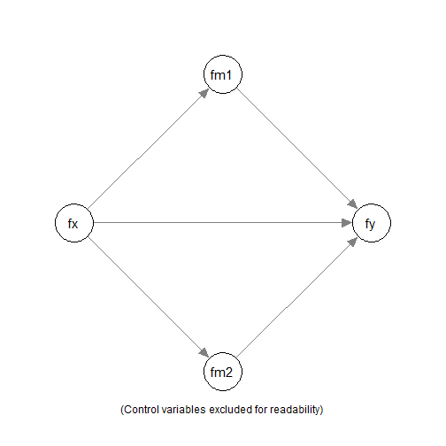

** Work-In-Progress: Not Ready **

# Introduction

This article is a brief illustration of how to use
the all-in-one "quick" functions from
[manymome](https://sfcheung.github.io/manymome/index.html)
([Cheung & Cheung, 2024](https://doi.org/10.3758/s13428-023-02224-z))
to fit a structural model and
compute and test indirect effects in
one step.

It is similar to using them on observed
scores, such as scaled scores, as
illustrated in [this article](./q_mediation.html).
However, that approach does not take into
account measurement errors, which can
be done if a construct is measured by
several indicators.

This article demonstrates how to fit
a model and test indirect effects when
some of the constructs are latent variables
measured by multiple indicators, with the
measurement error taken into account using
structural equation modeling (SEM).

NOTE: This is part of a series of similar articles
with duplicated sections, each dedicated
to one form of models.

# Data Set

The sample dataset `data_indicators`
will be used in this illustration.


``` r
library(manymome)
dat <- data_indicators
print(round(head(dat), 2))
#>     x_1   x_2   x_3  x_4  m1_1  m1_2  m1_3  m1_4  m2_1  m2_2  m2_3  m2_4  m3_1
#> 1 -0.15  2.39  0.70 0.31  0.30  1.06 -0.23  0.58 -0.16 -0.09  0.38 -0.89  0.58
#> 2 -1.25  0.59 -2.42 1.27 -0.21 -1.86 -1.78 -1.75 -2.32 -0.84 -1.19 -0.50 -1.95
#> 3 -0.02 -0.82 -0.49 0.48  0.85 -0.19  2.17  0.49  1.49  2.05 -0.84 -0.29  2.59
#> 4  0.24 -1.13 -1.27 1.81 -0.50 -0.91 -2.01  0.41  0.30  1.22 -1.10 -0.33  1.86
#> 5  0.08  1.36  0.32 0.16  1.19  0.34  1.48  0.64  0.43  1.90 -1.08  1.33  3.43
#> 6 -2.20 -1.77 -1.38 0.54  0.31 -1.88  0.16  0.20 -2.74 -2.74 -1.36 -1.06 -0.61
#>    m3_2  m3_3  m3_4   y_1   y_2   y_3   y_4  c1_1  c1_2  c1_3  c1_4  c2_1  c2_2
#> 1 -0.12  2.40  2.05 -2.89 -1.33 -1.83  2.11  0.70  0.09 -2.25  0.27 -1.24 -0.60
#> 2 -2.71 -3.50 -2.26 -1.49 -2.13 -0.24  2.34  0.22  0.70 -0.28  1.43 -0.05 -2.23
#> 3  2.80 -0.16  2.28  1.80 -0.56  1.55 -0.90  1.29 -0.08  1.91  1.26 -0.68 -1.04
#> 4  0.95  1.32  1.09 -0.10  0.28 -2.11  0.56 -1.90 -0.61 -0.75 -2.30 -1.80  0.28
#> 5  2.82  2.91  1.56  2.53  1.92  2.62 -2.18  1.51  2.84  2.88  2.42 -0.85 -0.54
#> 6 -0.90  0.52  1.14  0.58 -1.91  0.71  1.20  1.50 -1.79  1.08  0.17 -1.53 -3.94
#>    c2_3  c2_4     x    m1    m2    m3     y    c1    c2
#> 1 -1.69 -1.52  0.66  0.43 -0.19  1.23 -2.04 -0.30 -1.26
#> 2 -2.93 -2.10 -1.09 -1.40 -1.21 -2.60 -1.55  0.52 -1.83
#> 3 -0.89 -0.09 -0.45  0.83  0.60  1.88  0.92  1.09 -0.68
#> 4  0.07  0.62 -0.99 -0.75  0.02  1.31 -0.62 -1.39 -0.21
#> 5 -2.72 -2.63  0.40  0.91  0.64  2.68  2.31  2.41 -1.69
#> 6 -2.48 -0.73 -1.47 -0.30 -1.98  0.04 -0.45  0.24 -2.17
```

For illustration, only the following variables
will be used:

- `x_1`, `x_2`, `x_3`, and `x_4`:
  The indicators
  of `fx`, the predictor.
  The indicator `x_4` is a reverse items.

- `m1_1`, `m1_2`, `m1_3`, and `m1_4`:
  The indicators
  of `fm1`, the first mediator.

- `m2_1`, `m2_2`, `m2_3`, and `m2_4`:
  The indicators
  of `fm2`, the second mediator.

- `y_1`, `y_2`, `y_3`, and `y_4`:
  The indicators
  of `fy`, the outcome variable.
  The indicator `y_4` is a reverse items.

- `c1_1`, `c1_2`, `c1_3`, and `c1_4`:
  The indicators
  of `fc1`, a control variable.

- `c2`:
  An observed control variable. To
  illustrate mixing latent and observed
  variables in a model.

# Parallel Mediation Model

Suppose we would like to fit a simple
mediation model with two mediators,
`fm1` and `fm2`,
with `fc1` and `c2` as the control
variables.



We would to fit the model above,
and compute and test the indirect
effects along the paths
`fx -> fm1 -> y` and `fx -> fm2 -> y`
using nonparametric bootstrapping.

# Analysis

We can do that in one single step using
`q_parallel_mediation()`:


``` r
out <- q_parallel_mediation(
  x = "fx",
  y = "fy",
  m = c("fm1", "fm2"),
  cov = c("fc1", "c2"),
  indicators = list(
    fx = c("x_1", "x_2", "x_3", "-x_4"),
    fy = c("y_1", "y_2", "y_3", "-y_4"),
    fm1 = c("m1_1", "m1_2", "m1_3", "m1_4"),
    fm2 = c("m2_1", "m2_2", "m2_3", "m2_4"),
    fc1 = c("c1_1", "c1_2", "c1_3", "c1_4")
  ),
  fit_method = "sem",
  indicator_method = "measurement_model",
  data = dat,
  R = 5000,
  seed = 1234
)
```

These are the arguments:

- `x`: The name of the predictor ("x" variable).

- `y`: The name of the outcome ("y" variable).

- `m`: A vector of the names of the mediators
  ("m" variables). For a parallel mediation
  model, the order of the mediators does not
  matter.

- `cov`: The name(s) of the control variable(s)
  (covariate(s)). By default, they predict both
  the mediator and the outcome.

- `indicators`: The indicators for latent
  variables. It should be a named list of
  variable names. The name of each element
  is the name of the latent variable. If
  an indicator is a reverse item, add
  a minus sign, `-`, before its name. It
  will be reverse-coded (multiplied by `-1`)
  before fitting the model. If a variable
  in `x`, `y`, `m`, or `cov` is not one
  of the latent factor, it is an observed
  variable.

- `fit_method` and `indicator_method`:
  To fit a model with the measurement part,
  using the information from `indicators`,
  set `fit_method` to `"sem"` and
  `indicator_method` to `"measurement_model"`

- `data`: The data frame for the model.

- `R`: The number of bootstrap samples.
  Should be at least 5000 but can be
  larger for stable results.

- `seed`: The seed for the random number
  generator. Should always be set to an
  integer to make the results reproducible.

The computation may take some time to run but should
be at most one or two minutes for contemporary
computers.

# Results

We can then just print the output:


``` r
out
```


The printout is long. They will be
discussed section-by-section below.

These are the main sections of the
default results:

## Basic Information

This is the section `Basic Information`:


```
#> ===================================================
#> |                Basic Information                |
#> ===================================================
#> 
#> Predictor(x): fx
#> Outcome(y): fy
#> Mediator(s)(m): fm1, fm2
#> Model: Parallel Mediation Model
#> Indicators Method: Fit a measurement model
#> 
#> The path model fitted:
#> 
#> fm1 ~ fx + fc1 + c2
#> fm2 ~ fx + fc1 + c2
#> fy ~ fm1 + fm2 + fx + fc1 + c2
#> fx =~ x_1 + x_2 + x_3 + x_4
#> fy =~ y_1 + y_2 + y_3 + y_4
#> fm1 =~ m1_1 + m1_2 + m1_3 + m1_4
#> fm2 =~ m2_1 + m2_2 + m2_3 + m2_4
#> fc1 =~ c1_1 + c1_2 + c1_3 + c1_4 
#> 
#> The original number of cases: 600 
#> The number of cases in the analysis: 600 
#> Missing data handling: FIML (full information maximum likelihood)
```

It shows the variables, the models, and the
number of cases. It also shows the
measurement model in the model, in
`lavaan` syntax:

- The name on the left-hand side of `=~`
  is the latent variable.

- The name on the right-hand side of `=~`,
  joined by `+`, are the indicators.

When the model is fitted by SEM, the default
method to handle missing data is
full-information maximum likelihood (FIML).

## Indicator Information


```
#> ===================================================
#> |              Indicator Information              |
#> ===================================================
#> 
#> The indicators for the following variable(s):
#> 
#> fx: x_1, x_2, x_3, -x_4
#> fy: y_1, y_2, y_3, -y_4
#> fm1: m1_1, m1_2, m1_3, m1_4
#> fm2: m2_1, m2_2, m2_3, m2_4
#> fc1: c1_1, c1_2, c1_3, c1_4
#> 
#> Note:
#> - '-' denotes revserse-coded items.
#> 
#> The standardized factor loadings:
#> 
#> fx: 
#> Reliability: 0.7216
#>     Loading
#> x_1  0.5675
#> x_2  0.5902
#> x_3  0.6654
#> x_4  0.6802
#> 
#> fy: 
#> Reliability: 0.8812
#>     Loading
#> y_1  0.8308
#> y_2  0.7786
#> y_3  0.8039
#> y_4  0.8097
#> 
#> fm1: 
#> Reliability: 0.7751
#>      Loading
#> m1_1  0.6904
#> m1_2  0.6282
#> m1_3  0.7205
#> m1_4  0.6742
#> 
#> fm2: 
#> Reliability: 0.6630
#>      Loading
#> m2_1  0.6081
#> m2_2  0.5265
#> m2_3  0.5432
#> m2_4  0.6160
#> 
#> fc1: 
#> Reliability: 0.7149
#>      Loading
#> c1_1  0.6034
#> c1_2  0.6588
#> c1_3  0.5558
#> c1_4  0.6608
#> 
#> Note:
#> - Revserse-coded items have been reverse-coded when estimating the
#>   loadings.
#> - If the loading of an item is negative, its coding (revserse or
#>   non-reverse) may be incorrect.
#> - Reliability estimated by omage coefficients.
```

The section `Indicator Information` shows
results related to each latent factor:

- The indicators for each latent variable.

- The *standardized* factor loadings from
  the SEM results.

    - Note that, after recoding, all
      loadings should be positive. If
      any loading is negative, it may be
      a reverse indicator not specified
      in `indicators`.

- The reliability coefficient for each
  latent factor, based on the factor loadings.
  Omega coefficient is used, computed by
  `semTools::compRelSEM()`.

## Model Fit

The section `Structural Equation Modeling Results`
print the results from `lavaan` for the model.


```
#> Model Test User Model:
#>                                                       
#>   Test statistic                               175.086
#>   Degrees of freedom                               178
#>   P-value (Chi-square)                           0.548
#> 
#> Model Test Baseline Model:
#> 
#>   Test statistic                              3674.693
#>   Degrees of freedom                               210
#>   P-value                                        0.000
#> 
#> User Model versus Baseline Model:
#> 
#>   Comparative Fit Index (CFI)                    1.000
#>   Tucker-Lewis Index (TLI)                       1.001
#> 
#> Root Mean Square Error of Approximation:
#> 
#>   RMSEA                                          0.000
#>   Confidence interval - lower                    0.000
#>   Confidence interval - upper                    0.017
#>   P-value H_0: RMSEA <= 0.050                    1.000
#>   P-value H_0: RMSEA >= 0.080                    0.000
#> 
#> Standardized Root Mean Square Residual:
#> 
#>   SRMR                                           0.030
```

First, results on goodness-of-fit are printed:

- `Model Test User Model` reports the
  model $\chi^2$ and its *df* and *p*-value.

- Basic fit measures (CFI, TLI, RMSEA,
  and SRMR) are also printed.

## Regression Results

The next few sections print the
regression coefficients when predicting
the mediator (`fm` in this model) and
the outcome variable (`fy` in this model).

These are the results in predicting `fm`:


```
#>  ---------------- 
#>  Predicting fm1 : 
#>  ---------------- 
#> 
#> Model:
#>  fm1 ~ fx + fc1 + c2 
#>             Estimate   CI.lo   CI.hi   betaS Std. Error z value Pr(>|z|)    
#> (Intercept)   0.0000  0.0000  0.0000    ----     0.0000    ----     ----    
#> fx            0.6759  0.4757  0.8761  0.4839     0.1021   6.618   <2e-16 ***
#> fc1           0.0795 -0.0778  0.2368  0.0601     0.0803   0.990    0.322    
#> c2            0.0455 -0.0462  0.1371  0.0421     0.0468   0.972    0.331    
#> ---
#> Signif. codes:  0 '***' 0.001 '**' 0.01 '*' 0.05 '.' 0.1 ' ' 1
#> 
#> R-square:  0.2653 
#> 
#> Chi-Squared Difference Test for the R-square
#> 
#>       Df   AIC   BIC  Chisq Chisq diff Df diff Pr(>Chisq)    
#> fit1 178 38135 38451 175.09                                  
#> fit0 181 38234 38537 280.27     105.18       3  < 2.2e-16 ***
#> ---
#> Signif. codes:  0 '***' 0.001 '**' 0.01 '*' 0.05 '.' 0.1 ' ' 1
#> 
#> - BetaS are standardized coefficients with (a) only numeric variables
#>   standardized and (b) product terms formed after standardization.
#>   Variable(s) standardized is/are: fm1, fx, fc1, c2
#> - CI.lo and CI.hi are the 95.0% confidence levels of 'Estimate'
#>   computed from the z values and standard errors.
#> 
#>  ---------------- 
#>  Predicting fm2 : 
#>  ---------------- 
#> 
#> Model:
#>  fm2 ~ fx + fc1 + c2 
#>             Estimate   CI.lo   CI.hi   betaS Std. Error z value Pr(>|z|)    
#> (Intercept)   0.0000  0.0000  0.0000    ----     0.0000    ----     ----    
#> fx            0.4583  0.2944  0.6222  0.4271     0.0836   5.480   <2e-16 ***
#> fc1           0.0525 -0.0808  0.1858  0.0517     0.0680   0.772    0.440    
#> c2            0.0442 -0.0342  0.1226  0.0533     0.0400   1.106    0.269    
#> ---
#> Signif. codes:  0 '***' 0.001 '**' 0.01 '*' 0.05 '.' 0.1 ' ' 1
#> 
#> R-square:  0.2075 
#> 
#> Chi-Squared Difference Test for the R-square
#> 
#>       Df   AIC   BIC  Chisq Chisq diff Df diff Pr(>Chisq)    
#> fit1 178 38135 38451 175.09                                  
#> fit0 181 38198 38502 244.81     69.721       3  4.897e-15 ***
#> ---
#> Signif. codes:  0 '***' 0.001 '**' 0.01 '*' 0.05 '.' 0.1 ' ' 1
#> 
#> - BetaS are standardized coefficients with (a) only numeric variables
#>   standardized and (b) product terms formed after standardization.
#>   Variable(s) standardized is/are: fm2, fx, fc1, c2
#> - CI.lo and CI.hi are the 95.0% confidence levels of 'Estimate'
#>   computed from the z values and standard errors.
```

These are the results in predicting `y`:


```
#>  --------------- 
#>  Predicting fy : 
#>  --------------- 
#> 
#> Model:
#>  fy ~ fm1 + fm2 + fx + fc1 + c2 
#>             Estimate   CI.lo   CI.hi   betaS Std. Error z value Pr(>|z|)    
#> (Intercept)   0.0000  0.0000  0.0000    ----     0.0000    ----     ----    
#> fm1           0.5005  0.3488  0.6522  0.3546     0.0774   6.466   <2e-16 ***
#> fm2           0.5904  0.3818  0.7990  0.3213     0.1064   5.547   <2e-16 ***
#> fx            0.2035 -0.0553  0.4622  0.1032     0.1320   1.541   0.1233    
#> fc1           0.3114  0.1253  0.4975  0.1670     0.0949   3.280   0.0010 ***
#> c2            0.1349  0.0264  0.2433  0.0884     0.0553   2.437   0.0148 *  
#> ---
#> Signif. codes:  0 '***' 0.001 '**' 0.01 '*' 0.05 '.' 0.1 ' ' 1
#> 
#> R-square:  0.4751 
#> 
#> Chi-Squared Difference Test for the R-square
#> 
#>       Df   AIC   BIC  Chisq Chisq diff Df diff Pr(>Chisq)    
#> fit1 178 38135 38451 175.09                                  
#> fit0 183 38387 38682 437.86     262.78       5  < 2.2e-16 ***
#> ---
#> Signif. codes:  0 '***' 0.001 '**' 0.01 '*' 0.05 '.' 0.1 ' ' 1
#> 
#> - BetaS are standardized coefficients with (a) only numeric variables
#>   standardized and (b) product terms formed after standardization.
#>   Variable(s) standardized is/are: fy, fm1, fm2, fx, fc1, c2
#> - CI.lo and CI.hi are the 95.0% confidence levels of 'Estimate'
#>   computed from the z values and standard errors.
```

The results from `lavaan::sem()` are
reformatted to make them similar to those
by regression analysis.

If desired, the output of `lavaan::sem()`
can be extracted from the output by
`get_fit()`.

## Indirect Effect Results

By default, this section prints the estimated
indirect effect, confidence interval,
and asymmetric bootstrap *p*-value.

Four sections will be printed:

- The original indirect effect.


```
#> == Indirect Effect(s) ==
#> 
#>                    ind  CI.lo  CI.hi Sig pvalue     SE
#> fx -> fm1 -> fy 0.3383 0.2231 0.4808 Sig 0.0000 0.0663
#> fx -> fm2 -> fy 0.2705 0.1586 0.4138 Sig 0.0000 0.0657
#> 
#>  - [CI.lo to CI.hi] are 95.0% percentile confidence intervals by
#>    nonparametric bootstrapping with 5000 samples.
#>  - [pvalue] are asymmetric bootstrap p-values.
#>  - [SE] are standard errors.
#>  - The 'ind' column shows the indirect effect(s).
```

- The indirect effect with the predictor ("x") standardized.


```
#> == Indirect Effect(s) (x-variable(s) Standardized) ==
#> 
#>                    std  CI.lo  CI.hi Sig pvalue     SE
#> fx -> fm1 -> fy 0.2426 0.1621 0.3362 Sig 0.0000 0.0440
#> fx -> fm2 -> fy 0.1940 0.1152 0.2920 Sig 0.0000 0.0455
#> 
#>  - [CI.lo to CI.hi] are 95.0% percentile confidence intervals by
#>    nonparametric bootstrapping with 5000 samples.
#>  - [pvalue] are asymmetric bootstrap p-values.
#>  - [SE] are standard errors.
#>  - std: The partially standardized indirect effect(s).
#>  - x-variable(s) standardized.
```

- The indirect effect with the outcome ("y") standardized.


```
#> == Indirect Effect(s) (y-variable(s) Standardized) ==
#> 
#>                    std  CI.lo  CI.hi Sig pvalue     SE
#> fx -> fm1 -> fy 0.2393 0.1586 0.3385 Sig 0.0000 0.0471
#> fx -> fm2 -> fy 0.1914 0.1140 0.2932 Sig 0.0000 0.0455
#> 
#>  - [CI.lo to CI.hi] are 95.0% percentile confidence intervals by
#>    nonparametric bootstrapping with 5000 samples.
#>  - [pvalue] are asymmetric bootstrap p-values.
#>  - [SE] are standard errors.
#>  - std: The partially standardized indirect effect(s).
#>  - y-variable(s) standardized.
```

- The indirect effect with both `x` and `y` standardized.


```
#> == Indirect Effect(s) (Both x-variable(s) and y-variable(s) Standardized) ==
#> 
#>                    std  CI.lo  CI.hi Sig pvalue     SE
#> fx -> fm1 -> fy 0.1716 0.1152 0.2375 Sig 0.0000 0.0310
#> fx -> fm2 -> fy 0.1372 0.0820 0.2057 Sig 0.0000 0.0314
#> 
#>  - [CI.lo to CI.hi] are 95.0% percentile confidence intervals by
#>    nonparametric bootstrapping with 5000 samples.
#>  - [pvalue] are asymmetric bootstrap p-values.
#>  - [SE] are standard errors.
#>  - std: The standardized indirect effect(s).
```

The indirect effect with both the predictor
("x") and the outcome ("y") standardized,
also called the *completely*
*standardized* *indirect* *effect* or
simply the *standardized* *indirect*
*effect*.

These four versions of the results are
printed by default so that users can
select and interpret sections as they
see fit.

## Total Indirect Effect Results

The section `Total Indirect Effects Resutls`
prints the estimated
*total* indirect effects, confidence intervals,
and asymmetric bootstrap *p*-values.


```
#> |          Total Indirect Effect Results          |
#> ===================================================
#> 
#> ----------------------------------------------------------------
#> 
#> == Indirect Effect  ==
#>                                         
#>  Path:                fx -> fm1 -> fy   
#>  Path:                fx -> fm2 -> fy   
#>  Function of Effects: 0.6088            
#>  95.0% Bootstrap CI:  [0.4365 to 0.8299]
#>  Bootstrap p-value:   0.0000            
#>  Bootstrap SE:        0.0998            
#> 
#> Computation of the Function of Effects:
#>  (fx->fm1->fy)
#> +(fx->fm2->fy) 
#> 
#> 
#> Percentile confidence interval formed by nonparametric bootstrapping
#> with 5000 bootstrap samples.
#> Standard error (SE) based on nonparametric bootstrapping with 5000
#> bootstrap samples.
#> 
#> 
#> ----------------------------------------------------------------
#> 
#> == Indirect Effect ('fx' Standardized) ==
#>                                         
#>  Path:                fx -> fm1 -> fy   
#>  Path:                fx -> fm2 -> fy   
#>  Function of Effects: 0.4366            
#>  95.0% Bootstrap CI:  [0.3187 to 0.5735]
#>  Bootstrap p-value:   0.0000            
#>  Bootstrap SE:        0.0656            
#> 
#> Computation of the Function of Effects:
#>  (fx->fm1->fy)
#> +(fx->fm2->fy) 
#> 
#> 
#> Percentile confidence interval formed by nonparametric bootstrapping
#> with 5000 bootstrap samples.
#> Standard error (SE) based on nonparametric bootstrapping with 5000
#> bootstrap samples.
#> 
#> 
#> ----------------------------------------------------------------
#> 
#> == Indirect Effect ('fy' Standardized) ==
#>                                         
#>  Path:                fx -> fm1 -> fy   
#>  Path:                fx -> fm2 -> fy   
#>  Function of Effects: 0.4307            
#>  95.0% Bootstrap CI:  [0.3114 to 0.5811]
#>  Bootstrap p-value:   0.0000            
#>  Bootstrap SE:        0.0693            
#> 
#> Computation of the Function of Effects:
#>  (fx->fm1->fy)
#> +(fx->fm2->fy) 
#> 
#> 
#> Percentile confidence interval formed by nonparametric bootstrapping
#> with 5000 bootstrap samples.
#> Standard error (SE) based on nonparametric bootstrapping with 5000
#> bootstrap samples.
#> 
#> 
#> ----------------------------------------------------------------
#> 
#> == Indirect Effect (Both 'fx' and 'fy' Standardized) ==
#>                                         
#>  Path:                fx -> fm1 -> fy   
#>  Path:                fx -> fm2 -> fy   
#>  Function of Effects: 0.3089            
#>  95.0% Bootstrap CI:  [0.2266 to 0.4022]
#>  Bootstrap p-value:   0.0000            
#>  Bootstrap SE:        0.0449            
#> 
#> Computation of the Function of Effects:
#>  (fx->fm1->fy)
#> +(fx->fm2->fy) 
#> 
#> 
#> Percentile confidence interval formed by nonparametric bootstrapping
#> with 5000 bootstrap samples.
#> Standard error (SE) based on nonparametric bootstrapping with 5000
#> bootstrap samples.
```

The total indirect effect in a parallel
mediation model is the sum of all
indirect effects from the predictor
("x") to the outcome ("y").

Four sections will be printed:

- The original total indirect effect.

- The total indirect effects with the predictor
  ("x") standardized.

- The total indirect effects with the outcome
  ("y") standardized.

- The total indirect effects with both the predictor
  ("x") and the outcome ("y") standardized,
  also called the *completely*
  *standardized* *total* *indirect* *effects* or
  simply the *standardized* *total* *indirect*
  *effects*.

These four versions of the results are
printed by default such that users can
select and interpret sections as they
see fit.

## Direct Effect Results

The section `Direct Effect Results` prints the estimated
direct effect (from the predictor "x" to
the outcome "y", not mediated), confidence interval,
and asymmetric bootstrap *p*-value.


```
#> ===================================================
#> |              Direct Effect Results              |
#> ===================================================
#> 
#> ----------------------------------------------------------------
#> 
#> == Effect(s) ==
#> 
#>             ind   CI.lo  CI.hi Sig pvalue     SE
#> fx -> fy 0.2035 -0.0640 0.4823     0.1348 0.1399
#> 
#>  - [CI.lo to CI.hi] are 95.0% percentile confidence intervals by
#>    nonparametric bootstrapping with 5000 samples.
#>  - [pvalue] are asymmetric bootstrap p-values.
#>  - [SE] are standard errors.
#>  - The 'ind' column shows the effect(s).
#>  
#> ----------------------------------------------------------------
#> 
#> == Effect(s) (x-variable(s) Standardized) ==
#> 
#>             std   CI.lo  CI.hi Sig pvalue     SE
#> fx -> fy 0.1459 -0.0473 0.3389     0.1348 0.0984
#> 
#>  - [CI.lo to CI.hi] are 95.0% percentile confidence intervals by
#>    nonparametric bootstrapping with 5000 samples.
#>  - [pvalue] are asymmetric bootstrap p-values.
#>  - [SE] are standard errors.
#>  - std: The partially standardized effect(s).
#>  - x-variable(s) standardized.
#>  
#> ----------------------------------------------------------------
#> 
#> == Effect(s) (y-variable(s) Standardized) ==
#> 
#>             std   CI.lo  CI.hi Sig pvalue     SE
#> fx -> fy 0.1439 -0.0486 0.3402     0.1348 0.0989
#> 
#>  - [CI.lo to CI.hi] are 95.0% percentile confidence intervals by
#>    nonparametric bootstrapping with 5000 samples.
#>  - [pvalue] are asymmetric bootstrap p-values.
#>  - [SE] are standard errors.
#>  - std: The partially standardized effect(s).
#>  - y-variable(s) standardized.
#>  
#> ----------------------------------------------------------------
#> 
#> == Effect(s) (Both x-variable(s) and y-variable(s) Standardized) ==
#> 
#>             std   CI.lo  CI.hi Sig pvalue     SE
#> fx -> fy 0.1032 -0.0335 0.2390     0.1348 0.0695
#> 
#>  - [CI.lo to CI.hi] are 95.0% percentile confidence intervals by
#>    nonparametric bootstrapping with 5000 samples.
#>  - [pvalue] are asymmetric bootstrap p-values.
#>  - [SE] are standard errors.
```

The *z*-test of the direct effect is
already available in section
*Structural Equation Modeling Results*.
The bootstrap results are printed in
case users prefer using the same
confidence interval method for all
the effects.

# Additional Issues

## Customize Control Variables

If the control variables for the
regression models are different, we can
set `cov` to a named list. The names are
the variables with control variables,
and the element under each name is
a character vector of the control variables.

For example,

- If we set `cov` to `list(m1 = "c1", m2 = "c2", y = c("c1", "c2"))`,
  then only `c1` is included in predicting `m1`,
  only `c2` is included in predicting `m2`,
  while both `c1` and `c2` are included
  in predicting `y`.

A variable that does not appear in the
list does not have control variables.

## Customize The Printout

The `print` method of the output of
the quick mediation functions have
arguments for customizing the output.
These are arguments that likely may be
used:

- `digits`: The number of digits after
  the decimal place for most results.
  Default is 4.

- `pvalue_digits`: The number of digits
  after the decimal place for *p*-values.
  Default is 4.

See the help page of `print.q_mediation()`
for other arguments.

## Speed and Parallel Processing

By default, parallel processing is used.
If this failed for some reasons,
add `parallel` to `FALSE`. It will take
longer to run but should still be just
one to two minutes in typical models.

## Progress Bar

By default, a progress bar will be displayed
when doing bootstrapping. This can be
disabled by adding `progress = FALSE`.

## Workflow

The quick functions are simply functions
to do the following tasks internally:

- Fit all the models by SEM
  using `lavaan::sem()`.

- Call `all_indirect_paths()` to
  identify all indirect paths.

- Call `many_indirect_effects()` to
 compute all indirect effects and
 form their confidence intervals.

- Call `total_indirect_effect()` to
 compute the total indirect effect.

Therefore, all the tasks they do can be
done manually by the functions above.
These all-in-one functions are developed just
as convenient functions to do all these
tasks in one call.

See this
[article](./med_lav.html)
for computing and testing indirect effects
for more complicated models.

# Final Remarks

For details on the all-in-one functions,
please refer to the help page of
`q_mediation()`.

