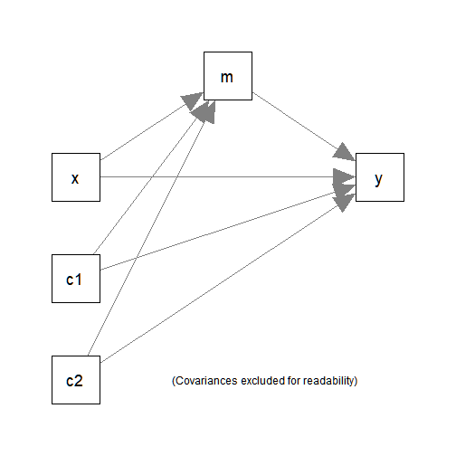

# Introduction

This article is a brief illustration of how
to use `do_boot()` from the package
[manymome](https://sfcheung.github.io/manymome/index.html)
([Cheung & Cheung, 2023](https://doi.org/10.3758/s13428-023-02224-z))
to generate bootstrap estimates for
`indirect_effect()` and `cond_indirect_effects()` to
form bootstrap confidence intervals.

Although `indirect_effect()` and `cond_indirect_effects()`
can also be used to generate bootstrap estimates
when they are called (see `vignette("manymome")`), there
may be situations in which users prefer generating
the bootstrap estimates first before calling `indirect_effect()`
and `cond_indirect_effects()`. `do_boot()` is for
this purpose.

# The Workflow

The following workflow will be demonstrated;

1. Fit the model as usual.

2. Use `do_boot()` to generate the bootstrap estimates.

3. Call other functions (e.g, `indirect_effect()`
   and `cond_indirect_effects()`) to compute the desired
   effects and form bootstrap confidence intervals.

# Demonstration: `lavaan::sem()`

## Fit a Model by `lavaan::sem()`

The data set for illustration:


``` r
library(manymome)
dat <- data_med
head(dat)
#>           x        m        y       c1       c2
#> 1  9.931992 17.89644 20.73893 1.426513 6.103290
#> 2  8.331493 17.92150 22.91594 2.940388 3.832698
#> 3 10.327471 17.83178 22.14201 3.012678 5.770532
#> 4 11.196969 20.01750 25.05038 3.120056 4.654931
#> 5 11.887811 22.08645 28.47312 4.440018 3.959033
#> 6  8.198297 16.95198 20.73549 2.495083 3.763712
```

It has one predictor (`x`), one mediator (`m`),
one outcome variable (`y`), and two control
variables (`c1` and `c2`).

This simple mediation model with two
control variables (`c1` and `c2`)
will be fitted:



We first fit the model by `lavaan::sem()`:


``` r
mod <-
"
m ~ x + c1 + c2
y ~ m + x + c1 + c2
"
fit_lavaan <- sem(model = mod, data = dat,
           fixed.x = FALSE,
           estimator = "MLR")
summary(fit_lavaan)
#> lavaan 0.6-19 ended normally after 1 iteration
#> 
#>   Estimator                                         ML
#>   Optimization method                           NLMINB
#>   Number of model parameters                        15
#> 
#>   Number of observations                           100
#> 
#> Model Test User Model:
#>                                               Standard      Scaled
#>   Test Statistic                                 0.000       0.000
#>   Degrees of freedom                                 0           0
#> 
#> Parameter Estimates:
#> 
#>   Standard errors                             Sandwich
#>   Information bread                           Observed
#>   Observed information based on                Hessian
#> 
#> Regressions:
#>                    Estimate  Std.Err  z-value  P(>|z|)
#>   m ~                                                 
#>     x                 0.935    0.075   12.437    0.000
#>     c1                0.198    0.079    2.507    0.012
#>     c2               -0.168    0.099   -1.703    0.089
#>   y ~                                                 
#>     m                 0.785    0.233    3.363    0.001
#>     x                 0.508    0.323    1.573    0.116
#>     c1                0.140    0.188    0.747    0.455
#>     c2               -0.154    0.214   -0.720    0.471
#> 
#> Covariances:
#>                    Estimate  Std.Err  z-value  P(>|z|)
#>   x ~~                                                
#>     c1                0.026    0.121    0.211    0.833
#>     c2                0.100    0.084    1.186    0.235
#>   c1 ~~                                               
#>     c2               -0.092    0.109   -0.841    0.400
#> 
#> Variances:
#>                    Estimate  Std.Err  z-value  P(>|z|)
#>    .m                 0.681    0.085    7.976    0.000
#>    .y                 4.030    0.580    6.944    0.000
#>     x                 1.102    0.150    7.338    0.000
#>     c1                1.218    0.161    7.540    0.000
#>     c2                0.685    0.073    9.340    0.000
```

Suppose we would like to use robust "sandwich"
standard errors and confidence intervals
provided by MLR for the free parameters,
but want to use percentile nonparametric
bootstrap
confidence interval for the indirect effect.
In the call above, we used `estimator = "MLR"`
and did not set `se = "boot"`.

## Generate Bootstrap Estimates

We can then call `do_boot()` on the output of
`lavaan::sem()` to generate the bootstrap
estimates of all free parameters *and*
the implied statistics, such as the variances
of `m` and `y`, which are not free parameters
but are needed to form the confidence
interval of the *standardized* indirect effect.


``` r
boot_out_lavaan <- do_boot(fit = fit_lavaan,
                           R = 500,
                           ncores = 1,
                           seed = 58491)
```

Usually, just three arguments are needed:

- `fit`: The output of `lavaan::sem()`.

- `R`: The number of bootstrap samples. Should
  be at least 2000 or even 5000 in real
  research. 500 is used here just for illustration.

- `ncores`: The number of CPU cores to be used
  in generating bootstrap estimates in parallel
  processing.

- `seed`: The seed for the random number
  generator. To be used by `set.seed()`.
  It is recommended to set this argument
  such that the results are reproducible.

Parallel processing is enabled by default,
and a text progress bar (generated by the package `pbapply`)
will be displayed. If `ncores` is omitted,
the number of cores (`ncores`)
to be used will be decided automatically.
Therefore, users usually do not need to
use `ncores`. It is set to 1 here just for
illustration.

In real research with a complicated model and
moderate to large sample size, even with
parallel processing, it may take several minutes,
or even over twenty minutes in some cases.
Nevertheless, this only need to be conducted
once in the workflow of `manymome`.

If bootstrapping takes an appreciable time to
run, it is recommended to save
the output using `saveRDS()` or `save()`:


``` r
### Use saveRDS() ###
# Save the output
saveRDS(boot_out_lavaan, file = "boot_out_lavaan.rds")
# Load the output
boot_out_lavaan <- readRDS("boot_out_lavaan.rds")

### Use save() ###
# Save the output
save(boot_out_lavaan, file = "boot_out_lavaan.RData")
# Load the output
load("boot_out_lavaan.RData")
```

We recommend `readRDS()` although `save()`
is probably a more popular function.

## Using the Output of `do_boot()` in Other Functions of `manymome`

When calling `indirect_effect()` or
`cond_indirect_effects()`, the
argument `boot_out` can be assigned the
output of `do_bout()`. They will then
retrieve he stored bootstrap estimates
to form the percentile bootstrap confidence
intervals, if requested.


``` r
out_lavaan <- indirect_effect(x = "x",
                              y = "y",
                              m = "m",
                              fit = fit_lavaan,
                              boot_ci = TRUE,
                              boot_out = boot_out_lavaan)
out_lavaan
#> 
#> == Indirect Effect  ==
#>                                      
#>  Path:               x -> m -> y     
#>  Indirect Effect:    0.733           
#>  95.0% Bootstrap CI: [0.270 to 1.228]
#> 
#> Computation Formula:
#>   (b.m~x)*(b.y~m)
#> 
#> Computation:
#>   (0.93469)*(0.78469)
#> 
#> 
#> Percentile confidence interval formed by nonparametric bootstrapping
#> with 500 bootstrap samples.
#> 
#> Coefficients of Component Paths:
#>  Path Coefficient
#>   m~x       0.935
#>   y~m       0.785
```

Reusing the bootstrap estimates can ensure that
all analysis with bootstrap confidence intervals
are based on the same set of bootstrap samples.

The function also supports bias-corrected (BC)
confidence interval, which can be requested
by adding `boot_type = "bc"` to the call
of `indirect_effect()`. However, authors
in some recent work do not advocate this
method (e.g., Falk & Biesanz, 2015;
Hayes, 2022; Tofighi & Kelley, 2020).
Therefore, this option is provided merely
for research purpose.

# Demonstration: `lm()`

## Fit the Model by Several Calls to `lm()`

Suppose we estimate the parameters using
multiple regression. We need to fit two
regression models, one predicts `m` and
the other predicts `y`:


``` r
# Fit Models
lm_m <- lm(m ~ x + c1 + c2, dat)
lm_y <- lm(y ~ m + x + c1 + c2, dat)
#
# ###### Regression: Predict m ######
summary(lm_m)
#> 
#> Call:
#> lm(formula = m ~ x + c1 + c2, data = dat)
#> 
#> Residuals:
#>      Min       1Q   Median       3Q      Max 
#> -1.82810 -0.56016 -0.08481  0.52524  2.09155 
#> 
#> Coefficients:
#>             Estimate Std. Error t value Pr(>|t|)    
#> (Intercept)  9.68941    0.91979  10.534   <2e-16 ***
#> x            0.93469    0.08083  11.563   <2e-16 ***
#> c1           0.19778    0.07678   2.576   0.0115 *  
#> c2          -0.16841    0.10305  -1.634   0.1055    
#> ---
#> Signif. codes:  0 '***' 0.001 '**' 0.01 '*' 0.05 '.' 0.1 ' ' 1
#> 
#> Residual standard error: 0.8425 on 96 degrees of freedom
#> Multiple R-squared:  0.5981,	Adjusted R-squared:  0.5855 
#> F-statistic: 47.62 on 3 and 96 DF,  p-value: < 2.2e-16
#
# ###### Regression: Predict y ######
#
summary(lm_y)
#> 
#> Call:
#> lm(formula = y ~ m + x + c1 + c2, data = dat)
#> 
#> Residuals:
#>     Min      1Q  Median      3Q     Max 
#> -4.1336 -1.3365 -0.1014  1.4597  6.5470 
#> 
#> Coefficients:
#>             Estimate Std. Error t value Pr(>|t|)   
#> (Intercept)   4.4152     3.3016   1.337  0.18432   
#> m             0.7847     0.2495   3.145  0.00222 **
#> x             0.5077     0.3057   1.661  0.10004   
#> c1            0.1405     0.1941   0.724  0.47093   
#> c2           -0.1544     0.2554  -0.604  0.54695   
#> ---
#> Signif. codes:  0 '***' 0.001 '**' 0.01 '*' 0.05 '.' 0.1 ' ' 1
#> 
#> Residual standard error: 2.06 on 95 degrees of freedom
#> Multiple R-squared:  0.3576,	Adjusted R-squared:  0.3305 
#> F-statistic: 13.22 on 4 and 95 DF,  p-value: 1.336e-08
```

To use `do_boot()`, we first combine the
regression outputs to one object using
`lm2list()`. The output is an
`lm_list`-class object.


``` r
fit_lm <- lm2list(lm_m, lm_y)
fit_lm
#> 
#> The model(s):
#> m ~ x + c1 + c2
#> y ~ m + x + c1 + c2
```

## Generate Bootstrap Estimates

We can now use `do_boot()` as described
above, using the output of `lm2list()`
instead of the output of `lavaan::sem()`:


``` r
boot_out_lm <- do_boot(fit = fit_lm,
                       R = 500,
                       seed = 98715,
                       ncores = 1)
```

Like working on the outputs of `lavaan::lavaan()`,
parallel processing is also used by default.
`ncores` is the number of CPU cores to
be used. Because
the output may not be saved, it is
recommended to set the seed of the random
number generation using `seed`, set
to 98715 in the above example. The seed can
be any integer within the range allowed
in R, see `set.seed()`. Setting the seed
ensures that the same `R` set of bootstrap
samples will be generated every time.


## Using the Output of `do_boot()` in Other Functions of `manymome`

When calling `indirect_effect()` or
`cond_indirect_effects()`, we cab set the
argument `boot_out` to the output of
`do_bout()`:


``` r
out_lm <- indirect_effect(x = "x",
                          y = "y",
                          m = "m",
                          fit = fit_lm,
                          boot_ci = TRUE,
                          boot_out = boot_out_lm)
out_lm
#> 
#> == Indirect Effect  ==
#>                                      
#>  Path:               x -> m -> y     
#>  Indirect Effect:    0.733           
#>  95.0% Bootstrap CI: [0.292 to 1.201]
#> 
#> Computation Formula:
#>   (b.m~x)*(b.y~m)
#> 
#> Computation:
#>   (0.93469)*(0.78469)
#> 
#> 
#> Percentile confidence interval formed by nonparametric bootstrapping
#> with 500 bootstrap samples.
#> 
#> Coefficients of Component Paths:
#>  Path Coefficient
#>   m~x       0.935
#>   y~m       0.785
```

As long as users are aware of the potential
problem with bias-corrected (BC) bootstrap
confidence interval (see the references
cited above), `boot_type = "bc"` can be
used to request BC bootstrap confidence
interval instead of the default percentile
bootstrap confidence interval.

# The Structure of the Output

## Models Fitted by `lavaan::sem()`

The output of `do_boot()` in this case
is an object of the class `boot_out`,
which is a list of `R` lists, each with
three elements: `est`, `implied_stats`,
and `ok`.

This is the content of `est` of the first list:


``` r
boot_out_lavaan[[1]]$est
#>    lhs op rhs    est
#> 1    m  ~   x  0.828
#> 2    m  ~  c1  0.224
#> 3    m  ~  c2 -0.231
#> 4    y  ~   m  1.257
#> 5    y  ~   x  0.089
#> 6    y  ~  c1 -0.118
#> 7    y  ~  c2 -0.632
#> 8    m ~~   m  0.571
#> 9    y ~~   y  4.317
#> 10   x ~~   x  1.207
#> 11   x ~~  c1  0.146
#> 12   x ~~  c2  0.115
#> 13  c1 ~~  c1  1.331
#> 14  c1 ~~  c2  0.153
#> 15  c2 ~~  c2  0.688
#> 16   m r2   m  0.618
#> 17   y r2   y  0.396
```

The content is just the first four columns of
the output of `lavaan::parameterEstimates()`.
Note that only fixed and free parameters are used
so other rows, if any, are not used even if present.

This is the content of `implied_stats` of the
first list:


``` r
boot_out_lavaan[[1]]$implied_stats
#> $cov
#>         m      y      x     c1     c2
#> m   1.497                            
#> y   1.944  7.150                     
#> x   1.006  1.281  1.207              
#> c1  0.383  0.241  0.146  1.331       
#> c2 -0.030 -0.480  0.115  0.153  0.688
#> 
#> $mean
#> numeric(0)
#> 
#> $mean_lv
#> numeric(0)
```

It has three elements. `cov` is the implied
variances and covariances of all variables.
If a model has latent variables, they will
be included too. The other elements,
`mean` and `mean_lv`, are the implied
means of the observed variables and
the latent variables (if any), respectively.
They are of zero length if mean structure is
not in the fitted model.

The last element, `ok`, denotes whether
the solution in a bootstrap sample is
admissible or not (determined by
`lavaan::lavInspect()` with
`what = "post.check"`). If not admissible,
it will not be used in forming confidence
intervals.

## Models Fitted by `lm()`

The output of `do_boot()` using the
outputs of `lm()` is identical to
that using the output of `lavaan::sem()`. It is an object of the
class `boot_out`,
which is a list of `R` lists, each with
two elements: `est` and `implied_stats`.

This is the content of `est` of the first list:


``` r
boot_out_lm[[1]]$est
#>   lhs op rhs        est
#> 1   m  ~   x  0.9583396
#> 2   m  ~  c1  0.2808811
#> 3   m  ~  c2 -0.3040130
#> 4   m ~1      9.9351030
#> 5   y  ~   m  0.3986059
#> 6   y  ~   x  0.5626298
#> 7   y  ~  c1  0.5010449
#> 8   y  ~  c2 -0.3614863
#> 9   y ~1     11.7212742
```

The content is similar in structure
to the output of `lavaan::parameterEstimates()`.
However, the estimates are the estimates
based on `lm()`.

This is the content of `implied_stats` of the
first list:


``` r
boot_out_lm[[1]]$implied_stats
#> $cov
#>             m          x         c1          c2          y
#> m   1.7489520 0.99463099 0.32168750 -0.15480736  1.4738922
#> x   0.9946310 1.03034065 0.04418569  0.01709202  0.9921266
#> c1  0.3216875 0.04418569 1.13244802  0.12743087  0.6744295
#> c2 -0.1548074 0.01709202 0.12743087  0.68082701 -0.2343517
#> y   1.4738922 0.99212663 0.67442949 -0.23435172  5.4383227
#> 
#> $mean
#>         m         x        c1        c2         y 
#> 18.487194  9.848009  2.329366  5.065314 23.967238
```

It has two elements. `cov` is the
variances and covariances of all variables.
Unlike the output based on `lavaan::sem()`,
the content is just the sample variances
and covariances of the variables in each
bootstrap sample, generated using `cov()`.
The other element,
`mean`, stores sample means of all variables
in each bootstrap sample.


# Further Information

For further information on `do_boot()`,
please refer to its help page.

# References

Cheung, S. F., & Cheung, S.-H. (2023). *manymome*: An R
package for computing the indirect effects, conditional
effects, and conditional indirect effects, standardized or
unstandardized, and their bootstrap confidence intervals,
in many (though not all) models. *Behavior Research Methods*.
https://doi.org/10.3758/s13428-023-02224-z

Falk, C. F., & Biesanz, J. C. (2015). Inference and interval estimation methods for indirect effects with latent variable models. *Structural Equation Modeling: A Multidisciplinary Journal, 22*(1), 24--38. https://doi.org/10.1080/10705511.2014.935266

Hayes, A. F. (2022). *Introduction to mediation, moderation, and conditional process analysis: A regression-based approach* (Third Edition). The Guilford Press.

Tofighi, D., & Kelley, K. (2020). Indirect effects in sequential mediation models: Evaluating methods for hypothesis testing and confidence interval formation. *Multivariate Behavioral Research, 55*(2), 188--210. https://doi.org/10.1080/00273171.2019.1618545


