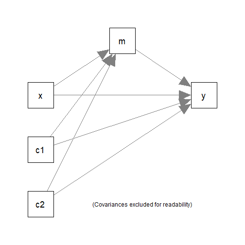

# Introduction

This article is a brief illustration of how
to use `do_mc()` from the package
[manymome](https://sfcheung.github.io/manymome/index.html)
([Cheung & Cheung, 2024](https://doi.org/10.3758/s13428-023-02224-z))
to generate Monte Carlo estimates for
`indirect_effect()` and `cond_indirect_effects()` to
form Monte Carlo confidence intervals.

Although `indirect_effect()` and `cond_indirect_effects()`
can also be used to generate Monte Carlo estimates
when they are called (see `vignette("manymome")`), there
may be situations in which users prefer generating
the Monte Carlo estimates first before calling `indirect_effect()`
and `cond_indirect_effects()`. `do_mc()` is for
this purpose.

Monte Carlo confidence intervals only support models
fitted by `lavaan::sem()` and (since version 0.1.9.8)
`semTools::sem.mi()` or `semTools::runMI()`.

# How It Works

The function `do_mc()` retrieves the variance-covariance
matrix of the parameter
estimates and then generates a number of sets of simulated
sample estimates using a multivariate normal distribution.
Other parameters and implied variances, covariances, and
means of variables are then generated from these simulated
estimates.

When a $(1 - \alpha)$% Monte Carlo confidence interval is requested, the
$100(\alpha/2)$^th^ percentile and the $100(1 - \alpha/2)$^th^
percentile are used to form the confidence interval. For
a 95% Monte Carlo confidence interval, the 2.5^th^ percentile
and 97.5^th^ percentile will be used.

# The Workflow

The following workflow will be demonstrated;

1. Fit the model as usual.

2. Use `do_mc()` to generate the Monte Carlo estimates.

3. Call other functions (e.g, `indirect_effect()`
   and `cond_indirect_effects()`) to compute the desired
   effects and form Monte Carlo confidence intervals.

# Demonstration

## Fit a Model by `lavaan::sem()`

The data set for illustration:


``` r
library(manymome)
dat <- data_med
head(dat)
#>           x        m        y       c1       c2
#> 1  9.931992 17.89644 20.73893 1.426513 6.103290
#> 2  8.331493 17.92150 22.91594 2.940388 3.832698
#> 3 10.327471 17.83178 22.14201 3.012678 5.770532
#> 4 11.196969 20.01750 25.05038 3.120056 4.654931
#> 5 11.887811 22.08645 28.47312 4.440018 3.959033
#> 6  8.198297 16.95198 20.73549 2.495083 3.763712
```

It has one predictor (`x`), one mediator (`m`),
one outcome variable (`y`), and two control
variables (`c1` and `c2`).

The following simple mediation model with two
control variables (`c1` and `c2`)
will be fitted:



Fit the model by `lavaan::sem()`:


``` r
mod <-
"
m ~ x + c1 + c2
y ~ m + x + c1 + c2
"
fit_lavaan <- sem(model = mod, data = dat,
                  fixed.x = FALSE,
                  estimator = "MLR")
summary(fit_lavaan)
#> lavaan 0.6-19 ended normally after 1 iteration
#> 
#>   Estimator                                         ML
#>   Optimization method                           NLMINB
#>   Number of model parameters                        15
#> 
#>   Number of observations                           100
#> 
#> Model Test User Model:
#>                                               Standard      Scaled
#>   Test Statistic                                 0.000       0.000
#>   Degrees of freedom                                 0           0
#> 
#> Parameter Estimates:
#> 
#>   Standard errors                             Sandwich
#>   Information bread                           Observed
#>   Observed information based on                Hessian
#> 
#> Regressions:
#>                    Estimate  Std.Err  z-value  P(>|z|)
#>   m ~                                                 
#>     x                 0.935    0.075   12.437    0.000
#>     c1                0.198    0.079    2.507    0.012
#>     c2               -0.168    0.099   -1.703    0.089
#>   y ~                                                 
#>     m                 0.785    0.233    3.363    0.001
#>     x                 0.508    0.323    1.573    0.116
#>     c1                0.140    0.188    0.747    0.455
#>     c2               -0.154    0.214   -0.720    0.471
#> 
#> Covariances:
#>                    Estimate  Std.Err  z-value  P(>|z|)
#>   x ~~                                                
#>     c1                0.026    0.121    0.211    0.833
#>     c2                0.100    0.084    1.186    0.235
#>   c1 ~~                                               
#>     c2               -0.092    0.109   -0.841    0.400
#> 
#> Variances:
#>                    Estimate  Std.Err  z-value  P(>|z|)
#>    .m                 0.681    0.085    7.976    0.000
#>    .y                 4.030    0.580    6.944    0.000
#>     x                 1.102    0.150    7.338    0.000
#>     c1                1.218    0.161    7.540    0.000
#>     c2                0.685    0.073    9.340    0.000
```

Suppose we would like to use robust "sandwich"
standard errors and confidence intervals
provided by MLR for the free parameters,
but want to use Monte Carlo
confidence interval for the indirect effect.
In the call above, we used `estimator = "MLR"`
and did not set `se = "boot"`.

## Generate Monte Carlo Estimates

We can then call `do_mc()` on the output of
`lavaan::sem()` to generate the Monte Carlo
estimates of all free parameters *and*
the implied statistics, such as the variances
of `m` and `y`, which are not free parameters
but are needed to form the confidence
interval of the *standardized* indirect effect.


``` r
mc_out_lavaan <- do_mc(fit = fit_lavaan,
                       R = 10000,
                       seed = 4234)
#> Stage 1: Simulate estimates
#> Stage 2: Compute implied statistics
```

Usually, just three arguments are needed:

- `fit`: The output of `lavaan::sem()`.

- `R`: The number of Monte Carlo replications. Should
  be at least 10000 in real research.

- `seed`: The seed for the random number
  generator. To be used by `set.seed()`.
  It is recommended to set this argument
  such that the results are reproducible.

Parallel processing is not used. However,
the time taken is rarely long because there
is no need to refit the model many times.

## Using the Output of `do_mc()` in Other Functions of `manymome`

When calling `indirect_effect()` or
`cond_indirect_effects()`, the
argument `mc_out` can be assigned the
output of `do_mc()`. They will then
retrieve the stored simulated estimates
to form the Monte Carlo confidence
intervals, if requested.


``` r
out_lavaan <- indirect_effect(x = "x",
                              y = "y",
                              m = "m",
                              fit = fit_lavaan,
                              mc_ci = TRUE,
                              mc_out = mc_out_lavaan)
out_lavaan
#> 
#> == Indirect Effect  ==
#>                                        
#>  Path:                 x -> m -> y     
#>  Indirect Effect:      0.733           
#>  95.0% Monte Carlo CI: [0.301 to 1.180]
#> 
#> Computation Formula:
#>   (b.m~x)*(b.y~m)
#> 
#> Computation:
#>   (0.93469)*(0.78469)
#> 
#> 
#> Monte Carlo confidence interval with 10000 replications.
#> 
#> Coefficients of Component Paths:
#>  Path Coefficient
#>   m~x       0.935
#>   y~m       0.785
```

Reusing the simulated estimates can ensure that
all analyses with Monte Carlo confidence intervals
are based on the same set of simulated estimates,
without the need to generate these estimates again.

# Missing Data

Monte Carlo confidence intervals can be formed
when the variance-covariance matrix of the
parameter estimates can be retrieved. Therefore,
`do_mc()` can be used when missing data is
handled by full information maximum likelihood
in `lavaan` using `missing = "fiml"`. It also
supports multiple imputation if `semTools::sem.mi()`
or `semTools::runMI()` (since version 0.1.9.8).
See `vignette("do_mc_lavaan_mi")` for an
illustration.

# The Structure of the Output

The output of `do_mc()` in this case
is an object of the class `mc_out`,
which is a list of `R` lists, each with
two elements: `est` and `implied_stats`.

This is the content of `est` of the first list:


``` r
mc_out_lavaan[[1]]$est
#>    lhs op rhs    est
#> 1    m  ~   x  0.909
#> 2    m  ~  c1  0.198
#> 3    m  ~  c2 -0.163
#> 4    y  ~   m  0.641
#> 5    y  ~   x  0.921
#> 6    y  ~  c1  0.010
#> 7    y  ~  c2  0.141
#> 8    m ~~   m  0.641
#> 9    y ~~   y  3.432
#> 10   x ~~   x  1.023
#> 11   x ~~  c1  0.074
#> 12   x ~~  c2  0.028
#> 13  c1 ~~  c1  1.180
#> 14  c1 ~~  c2 -0.261
#> 15  c2 ~~  c2  0.718
```

The content is just the first four columns of
the output of `lavaan::parameterEstimates()`.
Note that only fixed and free parameters are used
so other rows, if any, are not used even if present.

This is the content of `implied_stats` of the
first list:


``` r
mc_out_lavaan[[1]]$implied_stats
#> $cov
#>         m      y      x     c1     c2
#> m   1.586                            
#> y   1.864  6.059                     
#> x   0.939  1.548  1.023              
#> c1  0.344  0.263  0.074  1.180       
#> c2 -0.143  0.033  0.028 -0.261  0.718
#> 
#> $mean
#>  m  y  x c1 c2 
#> NA NA NA NA NA
```

It has three elements. `cov` is the implied
variances and covariances of all variables.
If a model has latent variables, they will
be included too. The other elements,
`mean` and `mean_lv`, are the implied
means of the observed variables and
the latent variables (if any), respectively.
The elements are `NA` if mean structure is
not in the fitted model.

# Limitations

Monte Carlo confidence intervals require
the variance-covariance matrix of all free parameters.
Therefore, only models fitted by `lavaan::sem()`
and (since 0.1.9.8) `semTools::sem.mi()` or
`semTools::runMI()`
are supported. Models fitted by `stats::lm()`
do not have a variance-covariance matrix for the
regression coefficients from two or more
regression models and so are not supported
by `do_mc()`.

# Further Information

For further information on `do_mc()`,
please refer to its help page.

# Reference

Cheung, S. F., & Cheung, S.-H. (2024).
*manymome*: An R package for computing
the indirect effects, conditional
effects, and conditional indirect
effects, standardized or unstandardized,
and their bootstrap confidence intervals,
in many (though not all) models.
*Behavior Research Methods, 56*(5),
4862--4882.
https://doi.org/10.3758/s13428-023-02224-z
