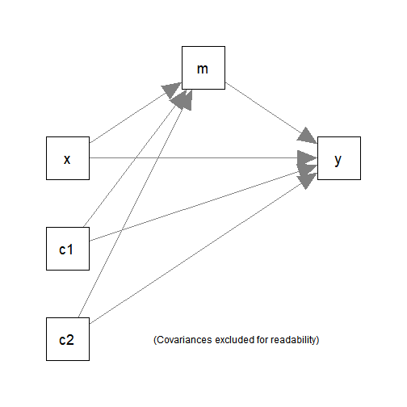

# Introduction

This article is a brief illustration of how
to use `do_mc()` in the package
[manymome](https://sfcheung.github.io/manymome/)
for a model fitted using multiple
imputation to generate Monte Carlo estimates for use
by `indirect_effect()` and `cond_indirect_effects()` to
form Monte Carlo confidence intervals in the presence
of missing data.

For the details of using `do_mc()`, please refer
to `vignette("do_mc")`. This article assumes that readers
know how to use `do_mc()` and will focus on using it
with a model estimated by multiple imputation.

It only supports a model fitted by `semTools::sem.mi()`
or `semTools::runMI()`.

# How It Works

When used with multiple imputation, it retrieves the
pooled point estimates and variance-covariance matrix of
model parameter and then generate a number of sets of simulated
sample estimates using a multivariate normal distribution.
Other parameters and implied variances, covariances, and
means of variables are then generated from these simulated
estimates.

When a $(1 - \alpha)$% Monte Carlo confidence interval is requested, the
$100(\alpha/2)$^th^ percentile and the $100(1 - \alpha/2)$^th^
percentile are used to form the confidence interval. For
a 95% Monte Carlo confidence interval, the 2.5^th^ percentile
and 97.5^th^ percentile will be used.

# Data Set and Model

This data set will be used for illustration. For illustration,
some cells are set to missing (`NA`):


```r
library(manymome)
dat <- data_med
dat[1, 1] <- dat[2, 3] <- dat[3, 5] <- dat[4, 3] <- dat[5, 2] <- NA
head(dat)
#>           x        m        y       c1       c2
#> 1        NA 17.89644 20.73893 1.426513 6.103290
#> 2  8.331493 17.92150       NA 2.940388 3.832698
#> 3 10.327471 17.83178 22.14201 3.012678       NA
#> 4 11.196969 20.01750       NA 3.120056 4.654931
#> 5 11.887811       NA 28.47312 4.440018 3.959033
#> 6  8.198297 16.95198 20.73549 2.495083 3.763712
```

It has one predictors (`x`), one mediator (`m`),
one outcome variable (`y`), and two control
variables (`c1` and `c2`).

This simple mediation model with two
control variables (`c1` and `c2`)
will be fitted:



# Multiple Imputation

In practice, the imputation model needs
to decided and the plausibility of the
imputed datasets need to be examined.
For the sake of illustration, we just
use the default of `mice::mice()` to
do the imputation:


```r
library(mice)
set.seed(26245)
out_mice <- mice(dat, m = 5, printFlag = FALSE)
dat_mi <- complete(out_mice, action = "all")
# The first imputed dataset
head(dat_mi[[1]])
#>           x        m        y       c1       c2
#> 1  9.762412 17.89644 20.73893 1.426513 6.103290
#> 2  8.331493 17.92150 25.68452 2.940388 3.832698
#> 3 10.327471 17.83178 22.14201 3.012678 3.969419
#> 4 11.196969 20.01750 24.87107 3.120056 4.654931
#> 5 11.887811 20.82502 28.47312 4.440018 3.959033
#> 6  8.198297 16.95198 20.73549 2.495083 3.763712
# The last imputed dataset
head(dat_mi[[5]])
#>           x        m        y       c1       c2
#> 1  8.301276 17.89644 20.73893 1.426513 6.103290
#> 2  8.331493 17.92150 22.93143 2.940388 3.832698
#> 3 10.327471 17.83178 22.14201 3.012678 6.238426
#> 4 11.196969 20.01750 26.90840 3.120056 4.654931
#> 5 11.887811 20.82502 28.47312 4.440018 3.959033
#> 6  8.198297 16.95198 20.73549 2.495083 3.763712
```

# Models Fitted by `semTools::sem.mi()`

We then fit the model by `semTools::sem.mi()`:


```r
library(semTools)
mod <-
"
m ~ x + c1 + c2
y ~ m + x + c1 + c2
"
fit_lavaan <- sem.mi(model = mod,
                     data = dat_mi,
                     fixed.x = FALSE,
                     meanstructure = TRUE)
summary(fit_lavaan)
#> lavaan.mi object based on 5 imputed data sets. 
#> See class?lavaan.mi help page for available methods. 
#> 
#> Convergence information:
#> The model converged on 5 imputed data sets 
#> 
#> Rubin's (1987) rules were used to pool point and SE estimates across 5 imputed data sets, and to calculate degrees of freedom for each parameter's t test and CI.
#> 
#> Parameter Estimates:
#> 
#>   Standard errors                             Standard
#>   Information                                 Expected
#>   Information saturated (h1) model          Structured
#> 
#> Regressions:
#>                    Estimate  Std.Err  t-value       df  P(>|t|)
#>   m ~                                                          
#>     x                 0.891    0.080   11.182      Inf    0.000
#>     c1                0.162    0.076    2.131 5182.949    0.033
#>     c2               -0.114    0.102   -1.124 6281.324    0.261
#>   y ~                                                          
#>     m                 0.736    0.249    2.952 3642.614    0.003
#>     x                 0.616    0.297    2.077  383.680    0.038
#>     c1                0.181    0.192    0.944      Inf    0.345
#>     c2               -0.156    0.252   -0.620 3050.069    0.535
#> 
#> Covariances:
#>                    Estimate  Std.Err  t-value       df  P(>|t|)
#>   x ~~                                                         
#>     c1                0.029    0.117    0.250      Inf    0.802
#>     c2                0.090    0.089    1.014      Inf    0.311
#>   c1 ~~                                                        
#>     c2               -0.100    0.093   -1.071      Inf    0.284
#> 
#> Intercepts:
#>                    Estimate  Std.Err  t-value       df  P(>|t|)
#>    .m                 9.913    0.912   10.870 7316.289    0.000
#>    .y                 4.195    3.341    1.256      Inf    0.209
#>     x                 9.909    0.106   93.165      Inf    0.000
#>     c1                2.154    0.111   19.324      Inf    0.000
#>     c2                4.908    0.084   58.515 6102.050    0.000
#> 
#> Variances:
#>                    Estimate  Std.Err  t-value       df  P(>|t|)
#>    .m                 0.682    0.097    7.000      Inf    0.000
#>    .y                 4.151    0.593    6.999 8812.144    0.000
#>     x                 1.109    0.158    7.000      Inf    0.000
#>     c1                1.218    0.174    7.000      Inf    0.000
#>     c2                0.689    0.098    7.000      Inf    0.000
```

The other steps are identical to those illustrated
in `vignette("do_mc")`. It and other functions will
used the pooled point estimates and variance-covariance
matrix when they detects that the model is fitted
by `semTools::sem.mi()` or `semTools::runMI()`.

We can then call `do_mc()` on the output of
`semTools::sem.mi()` to generate the Monte Carlo
estimates of all free parameters *and*
the implied statistics, such as the variances
of `m` and `y`, which are not free parameters
but are needed to form the confidence
interval of the *standardized* indirect effect.


```r
mc_out_lavaan <- do_mc(fit = fit_lavaan,
                       R = 10000,
                       seed = 4234)
```

Usually, just three arguments are needed:

- `fit`: The output of `lavaan::sem()`.

- `R`: The number of Monte Carlo replications. Should
  be at least 10000 in real research.

- `seed`: The seed for the random number
  generator. To be used by `set.seed()`.
  It is recommended to set this argument
  such that the results are reproducible.

Parallel processing is not used. However,
the time taken is rarely long because there
is no need to refit the model many times.

For the structure of the output, please
refer to `vignette("do_mc")`.

## Using the Output of `do_mc()`

When calling `indirect_effect()` or
`cond_indirect_effects()`, the
argument `mc_out` can be assigned the
output of `do_mc()`. They will then
retrieve the stored simulated estimates
to form the Monte Carlo confidence
intervals, if requested.


```r
out_lavaan <- indirect_effect(x = "x",
                              y = "y",
                              m = "m",
                              fit = fit_lavaan,
                              mc_ci = TRUE,
                              mc_out = mc_out_lavaan)
out_lavaan
#> 
#> == Indirect Effect ==
#>                                        
#>  Path:                 x -> m -> y     
#>  Indirect Effect       0.656           
#>  95.0% Monte Carlo CI: [0.219 to 1.125]
#> 
#> Computation Formula:
#>   (b.m~x)*(b.y~m)
#> Computation:
#>   (0.89141)*(0.73569)
#> 
#> Monte Carlo confidence interval with 10000 replications.
#> 
#> Coefficients of Component Paths:
#>  Path Coefficient
#>   m~x       0.891
#>   y~m       0.736
```

Reusing the simulated estimates can ensure that
all analysis with Monte Carlo confidence intervals
are based on the same set of simulated estimates.

# Limitation

Monte Carlo confidence intervals require
the variance-covariance matrix of all free parameters.
Therefore, with multiple imputation, only
models fitted by `semTools::sem.mi()`
or `semTools::runMI()` are supported.
Models fitted by `stats::lm()`
do not have a variance-covariance matrix for the
regression coefficients from two or more
regression models.

# Further Information

For further information on `do_mc()`,
please refer to its help page.
