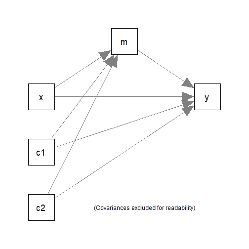

# Introduction

This article is a brief illustration of how
to use `do_mc()` from the package
[manymome](https://sfcheung.github.io/manymome/)
([Cheung & Cheung, 2023](https://doi.org/10.3758/s13428-023-02224-z))
for a model fitted to multiple
imputation datasets to generate Monte Carlo estimates,
which can be used by `indirect_effect()` and
`cond_indirect_effects()` to
form Monte Carlo confidence intervals in the presence
of missing data.

For the details of using `do_mc()`, please refer
to `vignette("do_mc")`. This article assumes that readers
know how to use `do_mc()` and will focus on using it
with a model estimated by multiple imputation.

It only supports a model fitted by `semTools::sem.mi()`
or `semTools::runMI()`.

# How It Works

When used with multiple imputation, `do_mc()` retrieves the
pooled point estimates and variance-covariance matrix of
free model parameters and then generates a number of sets
of simulated
sample estimates using a multivariate normal distribution.
Other parameters and implied variances, covariances, and
means of variables are then generated from these simulated
estimates.

When a $(1 - \alpha)$% Monte Carlo confidence interval is requested, the
$100(\alpha/2)$^th^ percentile and the $100(1 - \alpha/2)$^th^
percentile are used to form the confidence interval. For
a 95% Monte Carlo confidence interval, the 2.5^th^ percentile
and 97.5^th^ percentile will be used.

# The Workflow

The following workflow will be demonstrated;

1. Generate datasets using multiple imputation,
  not covered here (please refer to guides on
  `mice` or `Amelia`, the two packages supported by
  `semTools::sem.mi()` and `semTools::runMI()`).

2. Fit the model using `semTools::sem.mi()` or
  `semTools::runMI()`.

3. Use `do_mc()` to generate the Monte Carlo estimates.

4. Call other functions (e.g, `indirect_effect()`
   and `cond_indirect_effects()`) to compute the desired
   effects and form Monte Carlo confidence intervals.

# Demonstration

## Multiple Imputation

This data set, with missing data introduced,
will be used for illustration.


``` r
library(manymome)
dat <- data_med
dat[1, 1] <- dat[2, 3] <- dat[3, 5] <- dat[4, 3] <- dat[5, 2] <- NA
head(dat)
#>           x        m        y       c1       c2
#> 1        NA 17.89644 20.73893 1.426513 6.103290
#> 2  8.331493 17.92150       NA 2.940388 3.832698
#> 3 10.327471 17.83178 22.14201 3.012678       NA
#> 4 11.196969 20.01750       NA 3.120056 4.654931
#> 5 11.887811       NA 28.47312 4.440018 3.959033
#> 6  8.198297 16.95198 20.73549 2.495083 3.763712
```

It has one predictor (`x`), one mediator (`m`),
one outcome variable (`y`), and two control
variables (`c1` and `c2`).

The following simple mediation model with two
control variables (`c1` and `c2`)
will be fitted:



In practice, the imputation model needs
to be decided and checked (van Buuren, 2018).
For the sake of illustration, we just
use the default of `mice::mice()` to
do the imputation:


``` r
library(mice)
#> 
#> Attaching package: 'mice'
#> The following object is masked from 'package:stats':
#> 
#>     filter
#> The following objects are masked from 'package:base':
#> 
#>     cbind, rbind
set.seed(26245)
out_mice <- mice(dat, m = 5, printFlag = FALSE)
dat_mi <- complete(out_mice, action = "all")
# The first imputed dataset
head(dat_mi[[1]])
#>           x        m        y       c1       c2
#> 1  9.762412 17.89644 20.73893 1.426513 6.103290
#> 2  8.331493 17.92150 25.68452 2.940388 3.832698
#> 3 10.327471 17.83178 22.14201 3.012678 3.969419
#> 4 11.196969 20.01750 24.87107 3.120056 4.654931
#> 5 11.887811 20.82502 28.47312 4.440018 3.959033
#> 6  8.198297 16.95198 20.73549 2.495083 3.763712
# The last imputed dataset
head(dat_mi[[5]])
#>           x        m        y       c1       c2
#> 1  8.301276 17.89644 20.73893 1.426513 6.103290
#> 2  8.331493 17.92150 22.93143 2.940388 3.832698
#> 3 10.327471 17.83178 22.14201 3.012678 6.238426
#> 4 11.196969 20.01750 26.90840 3.120056 4.654931
#> 5 11.887811 20.82502 28.47312 4.440018 3.959033
#> 6  8.198297 16.95198 20.73549 2.495083 3.763712
```

## Fit a Model by `semTools::sem.mi()`

We then fit the model by `semTools::sem.mi()`:


``` r
library(semTools)
#> 
#> ###############################################################################
#> This is semTools 0.5-6
#> All users of R (or SEM) are invited to submit functions or ideas for functions.
#> ###############################################################################
mod <-
"
m ~ x + c1 + c2
y ~ m + x + c1 + c2
"
fit_lavaan <- sem.mi(model = mod,
                     data = dat_mi)
summary(fit_lavaan)
#> lavaan.mi object based on 5 imputed data sets. 
#> See class?lavaan.mi help page for available methods. 
#> 
#> Convergence information:
#> The model converged on 5 imputed data sets 
#> 
#> Rubin's (1987) rules were used to pool point and SE estimates across 5 imputed data sets, and to calculate degrees of freedom for each parameter's t test and CI.
#> 
#> Parameter Estimates:
#> Error in if (categorical.flag) {: argument is of length zero
```

## Generate Monte Carlo Estimates

The other steps are identical to those illustrated
in `vignette("do_mc")`. It and related functions will
use the pooled point estimates and variance-covariance
matrix when they detect that the model is fitted
by `semTools::sem.mi()` or `semTools::runMI()`
(i.e., the fit object is of the class `lavaan.mi`).

We call `do_mc()` on the output of
`semTools::sem.mi()` to generate the Monte Carlo
estimates of all free parameters *and*
the implied statistics, such as the variances
of `m` and `y`, which are not free parameters
but are needed to form the confidence
interval of the *standardized* indirect effect.


``` r
mc_out_lavaan <- do_mc(fit = fit_lavaan,
                       R = 10000,
                       seed = 4234)
#> Stage 1: Simulate estimates
#> Stage 2: Compute implied statistics
```

Usually, just three arguments are needed:

- `fit`: The output of `lavaan::sem()`.

- `R`: The number of Monte Carlo replications. Should
  be at least 10000 in real research.

- `seed`: The seed for the random number
  generator. To be used by `set.seed()`.
  It is recommended to set this argument
  such that the results are reproducible.

Parallel processing is not used. However,
the time taken is rarely long because there
is no need to refit the model many times.

For the structure of the output, please
refer to `vignette("do_mc")`.

## Using the Output of `do_mc()` in Other Functions of `manymome`

When calling `indirect_effect()` or
`cond_indirect_effects()`, the
argument `mc_out` can be assigned the
output of `do_mc()`. They will then
retrieve the stored simulated estimates
to form the Monte Carlo confidence
intervals, if requested.


``` r
out_lavaan <- indirect_effect(x = "x",
                              y = "y",
                              m = "m",
                              fit = fit_lavaan,
                              mc_ci = TRUE,
                              mc_out = mc_out_lavaan)
out_lavaan
#> 
#> == Indirect Effect  ==
#>                                        
#>  Path:                 x -> m -> y     
#>  Indirect Effect:      0.656           
#>  95.0% Monte Carlo CI: [0.213 to 1.124]
#> 
#> Computation Formula:
#>   (b.m~x)*(b.y~m)
#> 
#> Computation:
#>   (0.89141)*(0.73569)
#> 
#> 
#> Monte Carlo confidence interval with 10000 replications.
#> 
#> Coefficients of Component Paths:
#>  Path Coefficient
#>   m~x       0.891
#>   y~m       0.736
```

Reusing the simulated estimates can ensure that
all analysis with Monte Carlo confidence intervals
are based on the same set of simulated estimates.

# Limitation

Monte Carlo confidence intervals require
the variance-covariance matrix of all free parameters.
Therefore, only models fitted by `lavaan::sem()`
and (since 0.1.9.8) `semTools::sem.mi()` or
`semTools::runMI()`
are supported. Models fitted by `stats::lm()`
do not have a variance-covariance matrix for the
regression coefficients from two or more
regression models and so are not supported
by `do_mc()`.

# Further Information

For further information on `do_mc()`,
please refer to its help page.

# Reference

Cheung, S. F., & Cheung, S.-H. (2023). *manymome*: An R
package for computing the indirect effects, conditional
effects, and conditional indirect effects, standardized or
unstandardized, and their bootstrap confidence intervals,
in many (though not all) models. *Behavior Research Methods*.
https://doi.org/10.3758/s13428-023-02224-z

van Buuren, S. (2018).
*Flexible imputation of missing data* (2^nd^ Ed.).
CRC Press, Taylor and Francis Group.

