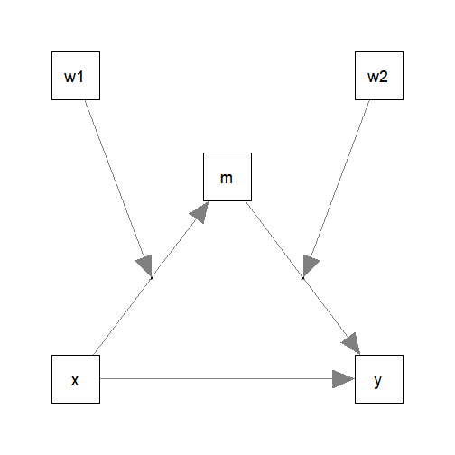
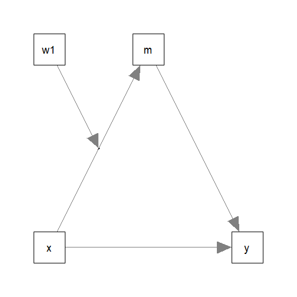
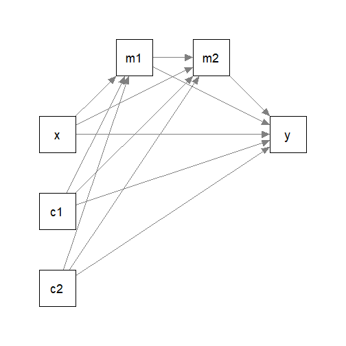

# Introduction

This article is a brief illustration of how main functions
from the package
[manymome](https://sfcheung.github.io/manymome/index.html)
([Cheung & Cheung, 2023](https://doi.org/10.3758/s13428-023-02224-z))
can be
used in some typical cases. It assumes that readers have
basic understanding of mediation, moderation, moderated
mediation, structural equation modeling (SEM), and bootstrapping.

## Workflow

The use of `manymome` adopts a two-stage workflow:

- Stage 1: **Fit the model**

    - This can be done by SEM (using `lavaan::sem()`) or a series of regression
  (using `lm()`).

    - When `lavaan::sem()` is used, no need to label any parameters
    or denote any variables
  as the predictors, mediators, moderators, or outcome variables for
  computing indirect effects or conditional indirect effects. Stage
  2 will take care of this.

- Stage 2: **Compute the indirect effects and conditional indirect effects**

    -  This can be done along
       nearly any path in the model for any levels
       of the moderators.

    -  Just specify the start (`x`), the mediator(s)
   (`m`, if any), and the end (`y`) for indirect effects. The
    functions will find the coefficients automatically.

     - If a path has one or more moderators, conditional
   indirect effects can be computed. Product terms will be
   identified automatically.

     - The levels of the moderators can be decided in this stage
    and can be changed as often as needed.

**Bootstrapping confidence intervals**: All main functions
support bootstrap confidence
intervals for the effects. Bootstrapping can done in Stage 1
(e.g., by `lavaan::sem()` using `se = "boot"`) or in Stage 2
in the first call to the main functions, and only needs
to be conducted once. Alternatively, `do_boot()` can be use
(see `vignette("do_boot")`). The bootstrap estimates can be
reused by
most main functions of `manymome` for any path and any level
of the moderators.

**Monte Carlo confidence intervals**: Initial support for
Monte Carlo confidence interval has been added to all main
functions for the effects in a model fitted by
`lavaan::sem()`. The recommended workflow
is to use `do_mc()` to generate
the simulated sampling estimates. The simulated estimates
can be reused by
most main functions of `manymome` for any path and any level
of the moderators. To keep the length of this vignette short,
it only covers bootstrapping confidence intervals.
Please see `vignette("do_mc")` for an illustration on how
to form Monte Carlo confidence intervals.

**Standardized effects**: All main functions in Stage 2 support
standardized effects and form their bootstrap confidence
interval correctly (Cheung, 2009; Friedrich, 1982).
No need to standardize the
variables in advance in Stage 1, even for paths with moderators.

## What Will Be Covered In This Get-Started Article

- Use `cond_indirect_effects()` to compute *conditional*
   *indirect* *effects*, with bootstrap confidence intervals.

- Use `indirect_effect()` to compute an *indirect* *effect*,
   with bootstrap confidence interval.

- Use `+` and `-` to compute a *function* of effects,
  such as total indirect effects or total effects.

- Use `do_boot()` to generate bootstrap estimates for
   `cond_indirect_effects()`, `indirect_effect()`,
   and some other functions in `manymome`.

- Use `index_of_mome()` and `index_of_momome()` to
   compute the index of moderated mediation and the
   index of moderated moderated mediation, respectively,
   with bootstrap confidence intervals.

- Compute *standardized* conditional indirect effects
   and *standardized* indirect effect using
   `cond_indirect_effects()` and `indirect_effect()`,
   respectively.

# Moderated Mediation by SEM using `lavaan`

This is the sample data set comes with the package:


``` r
library(manymome)
dat <- data_med_mod_ab
print(head(dat), digits = 3)
#>       x   w1   w2    m    y    c1   c2
#> 1  9.27 4.97 2.66 3.46 8.80  9.26 3.14
#> 2 10.79 4.13 3.33 4.05 7.37 10.71 5.80
#> 3 11.10 5.91 3.32 4.04 8.24 10.60 5.45
#> 4  9.53 4.78 2.32 3.54 8.37  9.22 3.83
#> 5 10.00 4.38 2.95 4.65 8.39  9.58 4.26
#> 6 12.25 5.81 4.04 4.73 9.65  9.51 4.01
```

Suppose this is the model being fitted:



The models are intended to be simple enough for
illustration but complicated enough to
show the flexibility of `manymome`. More
complicated models are also supported, discussed later.

## Fitting the Model

The model fitted above is a moderated mediation model with

  - a mediation path `x -> m -> y`, and

  - two moderators:

      - `x -> m` moderated by `w1`

      - `m -> y` moderated by `w2`.

The effects of interest are the *conditional*
*indirect* *effects*: the indirect effects

   - from `x` to `y`

   - through `m`

   - for different levels of `w1` and `w2`.

`cond_indirect_effects()` can estimate
these effects in the model fitted by
`lavaan::sem()`. There is no need to
label any path coefficients or define any user parameters
(but users can, if so desired; they have no impact
on the functions in `manymome`).
To illustrate a more realistic scenario,
two control variables, `c1` and `c2`, are also included.


``` r
library(lavaan)
# Form the product terms
dat$w1x <- dat$w1 * dat$x
dat$w2m <- dat$w2 * dat$m
mod <-
"
m ~ x + w1 + w1x + c1 + c2
y ~ m + w2 + w2m + x + c1 + c2
# Covariances of the error term of m with w2m and w2
m ~~ w2m + w2
# Covariance between other variables
# They need to be added due to the covariances added above
# See Kwan and Chan (2018) and Miles et al. (2015)
w2m ~~ w2 + x + w1 + w1x + c1 + c2
w2  ~~ x + w1 + w1x + c1 + c2
x   ~~ w1 + w1x + c1 + c2
w1  ~~ w1x + c1 + c2
w1x ~~ c1 + c2
c1  ~~ c2
"
fit <- sem(model = mod,
           data = dat,
           fixed.x = FALSE,
           estimator = "MLR")
```

`MLR` is used to take into account probable nonnormality
due to the product terms. `fixed.x = FALSE` is used
to allow the predictors to be random variables. This is
usually necessary when the values of the predictor are also
sampled from the populations, and so their standard
deviations are sample statistics.

These are the parameter estimates of the paths:


``` r
parameterEstimates(fit)[parameterEstimates(fit)$op == "~", ]
#>    lhs op rhs    est    se      z pvalue ci.lower ci.upper
#> 1    m  ~   x -0.663 0.533 -1.244  0.213   -1.707    0.381
#> 2    m  ~  w1 -2.290 1.010 -2.267  0.023   -4.269   -0.310
#> 3    m  ~ w1x  0.204 0.101  2.023  0.043    0.006    0.401
#> 4    m  ~  c1 -0.020 0.079 -0.251  0.801   -0.175    0.135
#> 5    m  ~  c2 -0.130 0.090 -1.444  0.149   -0.306    0.046
#> 6    y  ~   m -0.153 0.248 -0.616  0.538   -0.638    0.333
#> 7    y  ~  w2 -0.921 0.401 -2.300  0.021   -1.706   -0.136
#> 8    y  ~ w2m  0.204 0.079  2.579  0.010    0.049    0.359
#> 9    y  ~   x  0.056 0.086  0.653  0.514   -0.113    0.225
#> 10   y  ~  c1 -0.102 0.081 -1.261  0.207   -0.261    0.056
#> 11   y  ~  c2 -0.108 0.087 -1.249  0.212   -0.279    0.062
```

The moderation effects of both `w1` and  `w2`
are significant. The indirect effect from `x` to `y` through
`m` depends on the level of `w1` and `w2`.

## Conditional Indirect Effects

To form bootstrap confidence intervals, bootstrapping needs
to be done. There are several ways to do this. We first illustrate
using `do_boot()`.

### Do Bootstrapping (Once)

Using `do_boot()` instead of setting `se` to `"boot"`
when calling `lavaan::sem()`
allows users to use other
method for standard errors and confidence intervals for other parameters,
such as the various types of robust standard errors provided by `lavaan::sem()`.

The function `do_boot()` is used to generate and store bootstrap
estimates as well as implied variances of variables, which are needed
to estimate standardized effects.


``` r
fit_boot <- do_boot(fit = fit,
                    R = 500,
                    seed = 53253,
                    ncores = 1)
```

These are the major arguments:

- `fit`: The output of `lavaan::sem()`.

- `R`: The number of bootstrap samples, which should be 2000
  or even 5000 in real research. `R` is set to 500 here just
  for illustration.

- `seed`: The seed to reproduce the results.

- `ncores`: The number of processes in parallel processing.
   The default number is the number of detected physical cores
   minus 1. Can be omitted in real studies. Set to 1 here for
   illustration.

By default, parallel processing is used,
and so the results are reproducible with the same seed
only if the number of processes is the same.
See `do_boot()` for other options and `vignette("do_boot")`
on the output of `do_boot()`.

The output, `fit_boot` in this case, can then be used for
all subsequent analyses on this model.

### Estimate Conditional Indirect Effects

To compute conditional indirect effects and form bootstrap confidence
intervals, we can use `cond_indirect_effects()`.


``` r
out_cond <- cond_indirect_effects(wlevels =c("w1", "w2"),
                                  x = "x",
                                  y = "y",
                                  m = "m",
                                  fit = fit,
                                  boot_ci = TRUE,
                                  boot_out = fit_boot)
```

These are the major arguments:

- `wlevels`: The vector of the names of the moderators.
             Order does not matter. If the
             default levels are not suitable, custom levels
             can be created by functions like `mod_levels()`
             and `merge_mod_levels()`
             (see `vignette("mod_levels")`).
- `x`: The name of the predictor.
- `y`: The name of the outcome variable.
- `m`: The name of the mediator, or a vector of names
       if the path has more than one mediator
       (see [this example](#est_indirect)).
- `fit`: The output of `lavaan::sem()`.
- `boot_ci`: Set to `TRUE` to request bootstrap confidence intervals.
             Default is `FALSE`.
- `boot_out`: The pregenerated bootstrap estimates generated
              by `do_boot()` or previous call to
              `cond_indirect_effects()` or `indirect_effect()`.

This is the output:


``` r
out_cond
#> 
#> == Conditional indirect effects ==
#> 
#>  Path: x -> m -> y
#>  Conditional on moderator(s): w1, w2
#>  Moderator(s) represented by: w1, w2
#> 
#>      [w1]    [w2]  (w1)  (w2)   ind  CI.lo CI.hi Sig   m~x   y~m
#> 1 M+1.0SD M+1.0SD 6.173 4.040 0.399  0.139 0.705 Sig 0.596 0.671
#> 2 M+1.0SD M-1.0SD 6.173 2.055 0.158 -0.025 0.381     0.596 0.266
#> 3 M-1.0SD M+1.0SD 4.038 4.040 0.107 -0.148 0.358     0.160 0.671
#> 4 M-1.0SD M-1.0SD 4.038 2.055 0.043 -0.062 0.191     0.160 0.266
#> 
#>  - [CI.lo to CI.hi] are 95.0% percentile confidence intervals by
#>    nonparametric bootstrapping with 500 samples.
#>  - The 'ind' column shows the conditional indirect effects.
#>  - 'm~x','y~m' is/are the path coefficient(s) along the path conditional
#>    on the moderator(s).
```

For two or more moderators, the default levels for numeric moderators
are one standard deviation (SD) below mean and one SD above
mean. For two moderators, there are four combinations.

As shown
above, among these four sets of levels, the indirect effect from `x` to `y` through
`m` is significant only when both `w1` and `w2` are one SD
above their means. The indirect effect at these levels of `w1` and `w2` are
0.399, with
95% bootstrap confidence interval
[0.139, 0.705].

The function `cond_indirect_effects()`,
as well as other functions described below,
also supports bias-corrected (BC)
confidence interval, which can be requested
by adding `boot_type = "bc"` to the call.
However, authors
in some recent work do not advocate this
method (e.g., Falk & Biesanz, 2015;
Hayes, 2022; Tofighi & Kelley, 2020).
Therefore, this option is provided merely
for research purpose.

#### Examine the Effect at a Particular Set of Levels of the Moderators

To learn more about the conditional effect for one combination
of the levels of the moderators, `get_one_cond_indirect_effect()`
can be used, with the first argument the output of
`cond_indirect_effects()` and the second argument the row number.
For example, this shows the details on the computation of the
indirect effect when both `w1` and `w2` are one SD above their means (row 1):


``` r
get_one_cond_indirect_effect(out_cond, 1)
#> 
#> == Conditional Indirect Effect   ==
#>                                                     
#>  Path:                        x -> m -> y           
#>  Moderators:                  w1, w2                
#>  Conditional Indirect Effect: 0.399                 
#>  95.0% Bootstrap CI:          [0.139 to 0.705]      
#>  When:                        w1 = 6.173, w2 = 4.040
#> 
#> Computation Formula:
#>   (b.m~x + (b.w1x)*(w1))*(b.y~m + (b.w2m)*(w2))
#> Computation:
#>   ((-0.66304) + (0.20389)*(6.17316))*((-0.15271) + (0.20376)*(4.04049))
#> 
#> Percentile confidence interval formed by nonparametric bootstrapping
#> with 500 bootstrap samples.
#> 
#> Coefficients of Component Paths:
#>  Path Conditional Effect Original Coefficient
#>   m~x              0.596               -0.663
#>   y~m              0.671               -0.153
```

#### Changing the Levels of the Moderators

The levels of the moderators, `w1` and `w2` in this example, can be
controlled directly by users. For examples, percentiles or exact values
of the moderators can be used. See `vignette("mod_levels")`
on how to specify other levels of the moderators, and the arguments
`w_method`, `sd_from_mean`, and `percentiles` of `cond_indirect_effects()`.

## Standardized Conditional Indirect Effects

To compute the standardized conditional indirect effects, we can
standardize
only the predictor (`x`), only the outcome (`y`), or both.

To standardize `x`, set `standardized_x` to `TRUE`. To standardize
`y`, set `standardized_y` to `TRUE`. To standardize both,
set both `standardized_x` and `standardized_y` to `TRUE`.

This is the result when both `x` and `y` are standardized:


``` r
out_cond_stdxy <- cond_indirect_effects(wlevels =c("w1", "w2"),
                                        x = "x",
                                        y = "y",
                                        m = "m",
                                        fit = fit,
                                        boot_ci = TRUE,
                                        boot_out = fit_boot,
                                        standardized_x = TRUE,
                                        standardized_y = TRUE)
```

Note that `fit_boot` is used so that there is no need to
do bootstrapping again.

This is the output:


``` r
out_cond_stdxy
#> 
#> == Conditional indirect effects ==
#> 
#>  Path: x -> m -> y
#>  Conditional on moderator(s): w1, w2
#>  Moderator(s) represented by: w1, w2
#> 
#>      [w1]    [w2]  (w1)  (w2)   std  CI.lo CI.hi Sig   m~x   y~m   ind
#> 1 M+1.0SD M+1.0SD 6.173 4.040 0.401  0.154 0.655 Sig 0.596 0.671 0.399
#> 2 M+1.0SD M-1.0SD 6.173 2.055 0.159 -0.029 0.363     0.596 0.266 0.158
#> 3 M-1.0SD M+1.0SD 4.038 4.040 0.108 -0.145 0.370     0.160 0.671 0.107
#> 4 M-1.0SD M-1.0SD 4.038 2.055 0.043 -0.062 0.190     0.160 0.266 0.043
#> 
#>  - [CI.lo to CI.hi] are 95.0% percentile confidence intervals by
#>    nonparametric bootstrapping with 500 samples.
#>  - std: The standardized conditional indirect effects. 
#>  - ind: The unstandardized conditional indirect effects.
#>  - 'm~x','y~m' is/are the path coefficient(s) along the path conditional
#>    on the moderator(s).
```

The standardized indirect effect when both `w1` and `w2` are
one SD above mean is
0.401, with
95% bootstrap confidence interval
[0.154, 0.655].

That is, when both `w1` and `w2` are one SD above their
means, if `x` increases by one SD, it leads to an increase
of 0.401
SD of `y` through `m`.

## Index of Moderated Moderated Mediation

The index of moderated moderated mediation (Hayes, 2018) can
be estimated, along with bootstrap confidence interval, using
the function `index_of_momome()`:


``` r
out_momome <- index_of_momome(x = "x",
                              y = "y",
                              m = "m",
                              w = "w1",
                              z = "w2",
                              fit = fit,
                              boot_ci = TRUE,
                              boot_out = fit_boot)
```

These are the major arguments:

- `x`: The name of the predictor.
- `y`: The name of the outcome variable.
- `m`: The name of the mediator, or a vector of names
       if the path has more than one mediator
       (see [this example](#est_indirect)).
- `w`: The name of one of the moderator.
- `z`: The name of the other moderator. The order of `w`
       and `z` does not matter.
- `fit`: The output of `lavaan::sem()`.
- `boot_ci`: Set to `TRUE` to request bootstrap confidence intervals.
             Default is `FALSE`.
- `boot_out`: The pregenerated bootstrap estimates generated
              by `do_boot()` or previous call to
              `cond_indirect_effects()` and `indirect_effect()`.


This is the result:


``` r
out_momome
#> 
#> == Conditional indirect effects ==
#> 
#>  Path: x -> m -> y
#>  Conditional on moderator(s): w1, w2
#>  Moderator(s) represented by: w1, w2
#> 
#>   [w1] [w2] (w1) (w2)    ind  CI.lo CI.hi Sig    m~x    y~m
#> 1    1    1    1    1 -0.023 -0.276 0.312     -0.459  0.051
#> 2    1    0    1    0  0.070 -0.206 0.649     -0.459 -0.153
#> 3    0    1    0    1 -0.034 -0.364 0.383     -0.663  0.051
#> 4    0    0    0    0  0.101 -0.252 0.868     -0.663 -0.153
#> 
#> == Index of Moderated Moderated Mediation ==
#> 
#> Levels compared:
#> (Row 1 - Row 2) - (Row 3 - Row 4)
#> 
#>       x y Index  CI.lo CI.hi
#> Index x y 0.042 -0.003 0.116
#> 
#>  - [CI.lo, CI.hi]: 95% percentile confidence interval.
```

The index of moderated moderated mediation is
0.042,
with 95% bootstrap confidence interval
[-0.003, 0.116].

Note that this index is specifically for the change when
`w1` or `w2` increases by one unit.

## Index of Moderated Mediation

The `manymome` package also has a function to compute the *index of
moderated mediation* (Hayes, 2015). Suppose we modify the model and remove
one of the moderators:



This is the `lavaan` model:


``` r
library(lavaan)
dat$w1x <- dat$w1 * dat$x
mod2 <-
"
m ~ x + w1 + w1x + c1 + c2
y ~ m + x + c1 + c2
"
fit2 <- sem(model = mod2,
           data = dat,
           fixed.x = FALSE,
           estimator = "MLR")
```

These are the parameter estimates of the paths:


``` r
parameterEstimates(fit2)[parameterEstimates(fit2)$op == "~", ]
#>   lhs op rhs    est    se      z pvalue ci.lower ci.upper
#> 1   m  ~   x -0.663 0.533 -1.244  0.213   -1.707    0.381
#> 2   m  ~  w1 -2.290 1.010 -2.267  0.023   -4.269   -0.310
#> 3   m  ~ w1x  0.204 0.101  2.023  0.043    0.006    0.401
#> 4   m  ~  c1 -0.020 0.079 -0.251  0.801   -0.175    0.135
#> 5   m  ~  c2 -0.130 0.090 -1.444  0.149   -0.306    0.046
#> 6   y  ~   m  0.434 0.114  3.815  0.000    0.211    0.657
#> 7   y  ~   x  0.053 0.093  0.570  0.569   -0.130    0.237
#> 8   y  ~  c1 -0.108 0.080 -1.352  0.177   -0.265    0.049
#> 9   y  ~  c2 -0.077 0.085 -0.904  0.366   -0.243    0.090
```

We generate the bootstrap estimates first (`R` should be
2000 or even 5000 in real research):


``` r
fit2_boot <- do_boot(fit = fit2,
                    R = 500,
                    seed = 53253,
                    ncores = 1)
```

The function `index_of_mome()` can be used to compute
the index of moderated mediation of `w1` on the
path `x -> m -> y`:


``` r
out_mome <- index_of_mome(x = "x",
                          y = "y",
                          m = "m",
                          w = "w1",
                          fit = fit2,
                          boot_ci = TRUE,
                          boot_out = fit2_boot)
```

The arguments are nearly identical to those of `index_of_momome()`,
except that only `w` needs to be specified. This is the output:


``` r
out_mome
#> 
#> == Conditional indirect effects ==
#> 
#>  Path: x -> m -> y
#>  Conditional on moderator(s): w1
#>  Moderator(s) represented by: w1
#> 
#>   [w1] (w1)    ind  CI.lo CI.hi Sig    m~x   y~m
#> 1    1    1 -0.199 -0.762 0.230     -0.459 0.434
#> 2    0    0 -0.288 -0.998 0.222     -0.663 0.434
#> 
#> == Index of Moderated Mediation ==
#> 
#> Levels compared: Row 1 - Row 2
#> 
#>       x y Index  CI.lo CI.hi
#> Index x y 0.088 -0.006 0.223
#> 
#>  - [CI.lo, CI.hi]: 95% percentile confidence interval.
```

In this model, the index of moderated mediation is
0.088,
with 95% bootstrap confidence interval
[-0.006, 0.223].
The indirect effect of `x` on `y` through `m` does
not significantly change when
`w1` increases by one unit.

Note that this index is specifically for the change when
`w1` increases by one unit. The index being not significant
does not contradict with the significant moderation effect
suggested by the product term.

# Mediation Only

The package can also be used for a mediation model.

This is the sample data set that comes with the package:


``` r
library(manymome)
dat <- data_serial
print(head(dat), digits = 3)
#>       x   m1    m2     y        c1   c2
#> 1 12.12 20.6  9.33  9.00  0.109262 6.01
#> 2  9.81 18.2  9.47 11.56 -0.124014 6.42
#> 3 10.11 20.3 10.05  9.35  4.278608 5.34
#> 4 10.07 19.7 10.17 11.41  1.245356 5.59
#> 5 11.91 20.5 10.05 14.26 -0.000932 5.34
#> 6  9.13 16.5  8.93 10.01  1.802727 5.91
```

Suppose this is the model being fitted, with `c1` and
`c2` the control variables.



## Fitting the Model

Fitting this model in `lavaan::sem()` is very simple.
With `manymome`, there is no need to label paths
or define user parameters for the indirect effects.


``` r
mod_med <- "
m1 ~ x + c1 + c2
m2 ~ m1 + x + c1 + c2
y ~ m2 + m1 + x + c1 + c2
"
fit_med <- sem(model = mod_med,
               data = dat,
               fixed.x = TRUE)
```

These are the estimates of the paths:


``` r
parameterEstimates(fit_med)[parameterEstimates(fit_med)$op == "~", ]
#>    lhs op rhs    est    se      z pvalue ci.lower ci.upper
#> 1   m1  ~   x  0.822 0.092  8.907  0.000    0.641    1.003
#> 2   m1  ~  c1  0.171 0.089  1.930  0.054   -0.003    0.346
#> 3   m1  ~  c2 -0.189 0.091 -2.078  0.038   -0.367   -0.011
#> 4   m2  ~  m1  0.421 0.099  4.237  0.000    0.226    0.615
#> 5   m2  ~   x -0.116 0.123 -0.946  0.344   -0.357    0.125
#> 6   m2  ~  c1  0.278 0.090  3.088  0.002    0.101    0.454
#> 7   m2  ~  c2 -0.162 0.092 -1.756  0.079   -0.343    0.019
#> 8    y  ~  m2  0.521 0.221  2.361  0.018    0.088    0.953
#> 9    y  ~  m1 -0.435 0.238 -1.830  0.067   -0.902    0.031
#> 10   y  ~   x  0.493 0.272  1.811  0.070   -0.040    1.026
#> 11   y  ~  c1  0.099 0.208  0.476  0.634   -0.308    0.506
#> 12   y  ~  c2 -0.096 0.207 -0.465  0.642   -0.501    0.309
```

## Estimate Indirect Effects {#est_indirect}

`indirect_effect()` can be used to estimate an indirect effect
and form its bootstrapping confidence interval along a path
in a model
that starts with any numeric variable, ends with
any numeric variable, through any numeric variable(s).

We illustrate another approach to
generate bootstrap estimates: using `indirect_effect()`
to do both bootstrapping and estimate the indirect effect.

For example, this is the call for the indirect effect
from `x` to `y` through `m1` and `m2`:


``` r
out_med <- indirect_effect(x = "x",
                           y = "y",
                           m = c("m1", "m2"),
                           fit = fit_med,
                           boot_ci = TRUE,
                           R = 500,
                           seed = 43143,
                           ncores = 1)
```

The main arguments are:

- `x`: The name of the predictor. The start of the path.
- `y`: The name of the outcome variable. The end of the path.
- `m`: The name of the mediator, or the vector of names of the
        mediators if the path has more than one mediator,
        as in this example. The path moves from the first
        mediator to the last mediator. In this example,
        the correct order is `c("m1", "m2")`.
- `fit`: The output of `lavaan::sem()`.
- `boot_ci`: Set to `TRUE` to request bootstrapping confidence intervals.
             Default is `FALSE`.
- `R`: The number of bootstrap samples. Only 500 bootstrap samples
        for illustration. Set `R` to 2000 or even 5000 in real research.
- `seed`: The seed for the random number generator.
- `ncores`: The number of processes in parallel processing.
   The default number is the number of detected physical cores
   minus 1. Can be omitted in real studies. Set to 1 here for
   illustration.

Like `do_boot()`, by default, parallel processing is used,
and so the results are reproducible with the same seed
only if the number of processes (cores) is the same.

This is the output:


``` r
out_med
#> 
#> == Indirect Effect  ==
#>                                        
#>  Path:               x -> m1 -> m2 -> y
#>  Indirect Effect:    0.180             
#>  95.0% Bootstrap CI: [0.034 to 0.396]  
#> 
#> Computation Formula:
#>   (b.m1~x)*(b.m2~m1)*(b.y~m2)
#> Computation:
#>   (0.82244)*(0.42078)*(0.52077)
#> 
#> Percentile confidence interval formed by nonparametric bootstrapping
#> with 500 bootstrap samples.
#> 
#> Coefficients of Component Paths:
#>   Path Coefficient
#>   m1~x       0.822
#>  m2~m1       0.421
#>   y~m2       0.521
```

The indirect effect from `x` to `y` through `m1` and `m2`
is 0.180,
with a 95% confidence interval of
[0.034, 0.396],
significantly different from zero (*p* < .05).

Because bootstrap confidence interval is requested, the
bootstrap estimates are stored in `out_med`. This output
from `indirect_effect()` can also be used in the
argument `boot_out` of other functions.

## Standardized Indirect Effect

To compute the indirect effect with the predictor standardized,
set `standardized_x` to `TRUE`. To compute the indirect effect
with the outcome variable standardized, set `standardized_y`
to `TRUE`. To compute the (completely) standardized
indirect effect, set both `standardized_x` and
`standardized_y` to `TRUE`.

This is the call to compute the (completely) standardized
indirect effect:


``` r
out_med_stdxy <- indirect_effect(x = "x",
                                 y = "y",
                                 m = c("m1", "m2"),
                                 fit = fit_med,
                                 boot_ci = TRUE,
                                 boot_out = out_med,
                                 standardized_x = TRUE,
                                 standardized_y = TRUE)
out_med_stdxy
#> 
#> == Indirect Effect (Both 'x' and 'y' Standardized) ==
#>                                        
#>  Path:               x -> m1 -> m2 -> y
#>  Indirect Effect:    0.086             
#>  95.0% Bootstrap CI: [0.017 to 0.183]  
#> 
#> Computation Formula:
#>   (b.m1~x)*(b.m2~m1)*(b.y~m2)*sd_x/sd_y
#> Computation:
#>   (0.82244)*(0.42078)*(0.52077)*(0.95010)/(1.99960)
#> 
#> Percentile confidence interval formed by nonparametric bootstrapping
#> with 500 bootstrap samples.
#> 
#> Coefficients of Component Paths:
#>   Path Coefficient
#>   m1~x       0.822
#>  m2~m1       0.421
#>   y~m2       0.521
#> 
#> NOTE:
#> - The effects of the component paths are from the model, not
#>   standardized.
```

The indirect effect from `x` to `y` through `m1` and `m2`
is 0.086,
with a 95% confidence interval of
[0.017, 0.183],
significantly different from zero (*p* < .05).
One SD increase of `x` leads to 0.086
increase in SD of `y` through `m1` and `m2`.

## Estimating Indirect Effects For *Any* Paths

`indirect_effect()` can be used for the indirect effect
in *any* path in a path model.

For example, to estimate and test the
indirect effect from `x` through `m2` to `y`, bypassing
`m1`, simply set `x` to `"x"`, `y` to `"y"`, and `m` to `"m2"`:


``` r
out_x_m2_y <- indirect_effect(x = "x",
                              y = "y",
                              m = "m2",
                              fit = fit_med,
                              boot_ci = TRUE,
                              boot_out = out_med)
out_x_m2_y
#> 
#> == Indirect Effect  ==
#>                                       
#>  Path:               x -> m2 -> y     
#>  Indirect Effect:    -0.060           
#>  95.0% Bootstrap CI: [-0.232 to 0.097]
#> 
#> Computation Formula:
#>   (b.m2~x)*(b.y~m2)
#> Computation:
#>   (-0.11610)*(0.52077)
#> 
#> Percentile confidence interval formed by nonparametric bootstrapping
#> with 500 bootstrap samples.
#> 
#> Coefficients of Component Paths:
#>  Path Coefficient
#>  m2~x      -0.116
#>  y~m2       0.521
```

The indirect effect along this path is not significant.

Similarly, indirect effects from `m1` through `m2`  to `y`
or from `x` through `m1` to `y` can also be tested
by setting the three arguments accordingly. Although `c1`
and `c2` are labelled as control variables, if appropriate,
their indirect effects on `y` through `m1` and/or `m2` can
also be computed and tested.

## Total Indirect Effects and Total Effects

Addition (`+`) and subtraction (`-`) can be applied to the outputs of
`indirect_effect()`. For example, the total *indirect* effect
from `x` to `y` is the sum of these indirect effects:

- `x -> m1 -> m2 -> y`

- `x -> m1 -> y`

- `x -> m2 -> y`

Two of them have been computed above (`out_med`
and `out_x_m2_y`). We compute the indirect
effect in `x -> m1 -> y`


``` r
out_x_m1_y <- indirect_effect(x = "x",
                              y = "y",
                              m = "m1",
                              fit = fit_med,
                              boot_ci = TRUE,
                              boot_out = out_med)
out_x_m1_y
#> 
#> == Indirect Effect  ==
#>                                        
#>  Path:               x -> m1 -> y      
#>  Indirect Effect:    -0.358            
#>  95.0% Bootstrap CI: [-0.747 to -0.017]
#> 
#> Computation Formula:
#>   (b.m1~x)*(b.y~m1)
#> Computation:
#>   (0.82244)*(-0.43534)
#> 
#> Percentile confidence interval formed by nonparametric bootstrapping
#> with 500 bootstrap samples.
#> 
#> Coefficients of Component Paths:
#>  Path Coefficient
#>  m1~x       0.822
#>  y~m1      -0.435
```

We can then "add" the indirect effects to get the total
indirect effect:


``` r
total_ind <- out_med + out_x_m1_y + out_x_m2_y
total_ind
#> 
#> == Indirect Effect  ==
#>                                         
#>  Path:                x -> m1 -> m2 -> y
#>  Path:                x -> m1 -> y      
#>  Path:                x -> m2 -> y      
#>  Function of Effects: -0.238            
#>  95.0% Bootstrap CI:  [-0.596 to 0.092] 
#> 
#> Computation of the Function of Effects:
#>  ((x->m1->m2->y)
#> +(x->m1->y))
#> +(x->m2->y) 
#> 
#> 
#> Percentile confidence interval formed by nonparametric bootstrapping
#> with 500 bootstrap samples.
```

The total indirect effect is
-0.238,
not significant. This is an example
of inconsistent mediation: some of the indirect Effects
are positive and some are negative:


``` r
coef(out_med)
#>       y~x 
#> 0.1802238
coef(out_x_m1_y)
#>        y~x 
#> -0.3580391
coef(out_x_m2_y)
#>       y~x 
#> -0.060461
```

Similarly, the total effect of `x` on `y` can be computed by adding
all the effects, direct or indirect. The direct effect can
be computed with `m` not set:


``` r
out_x_direct <- indirect_effect(x = "x",
                                y = "y",
                                fit = fit_med,
                                boot_ci = TRUE,
                                boot_out = out_med)
out_x_direct
#> 
#> ==  Effect  ==
#>                                       
#>  Path:               x -> y           
#>  Effect:             0.493            
#>  95.0% Bootstrap CI: [-0.041 to 1.045]
#> 
#> Computation Formula:
#>   (b.y~x)
#> Computation:
#>   (0.49285)
#> 
#> Percentile confidence interval formed by nonparametric bootstrapping
#> with 500 bootstrap samples.
```

This is the total effect:


``` r
total_effect <- out_med + out_x_m1_y + out_x_m2_y + out_x_direct
total_effect
#> 
#> == Indirect Effect  ==
#>                                         
#>  Path:                x -> m1 -> m2 -> y
#>  Path:                x -> m1 -> y      
#>  Path:                x -> m2 -> y      
#>  Path:                x -> y            
#>  Function of Effects: 0.255             
#>  95.0% Bootstrap CI:  [-0.200 to 0.731] 
#> 
#> Computation of the Function of Effects:
#>  (((x->m1->m2->y)
#> +(x->m1->y))
#> +(x->m2->y))
#> +(x->y) 
#> 
#> 
#> Percentile confidence interval formed by nonparametric bootstrapping
#> with 500 bootstrap samples.
```

The total effect is
0.255,
not significant. This illustrates that total effect can be misleading
when the component paths are of different signs.

See `help(math_indirect)` for more information of addition
and subtraction for the output of `indirect_effect()`.

# Summary

## Advantages

- The model fitting stage is easier. No need to label
  any parameters or define any effects. Users can also
  use other methods for confidence interval and use
  bootstrapping only for indirect effects and conditional
  indirect effects.

- Missing data can be be handled by `missing = "fiml"`
  in calling
  `lavaan::sem()`. Because bootstrapping estimates are used in
  Stage 2, indirect effects and conditional
  indirect effects can also be computed with bootstrap
  confidence intervals, just like defining them in
  `lavaan`, in the presence of missing data.

- Missing data handled by multiple imputation
  is also supported since version 0.1.9.8. Models fitted
  by `semTools::sem.mi()`
  or `semTools::runMI()` to multiple imputation datasets
  can be used just like the output of `lavaan::sem()`.
  Monte Carlo confidence intervals cna be formed for
  effects computed for these models
  (see `vignette("do_mc_lavaan_mi")`).

- Bootstrapping only needs to be done once. The bootstrap
  estimates can be reused in computing indirect effects
  and conditional indirect effects. This is particularly
  useful when the sample size is large and there is
  missing data.

- Users can explore any path for any levels of the moderators
  without respecifying and refitting the model.

- Flexibility makes it difficult to test all possible
  scenarios. Therefore, the print methods will also
  print the details of the computation (e.g., how an indirect
  effect is computed) so that users can (a) understand how
  each effect is computed, and (b) verify the computation
  if necessary.

See
[this section](https://sfcheung.github.io/manymome/index.html#advantages)
for other advantages.

## Limitations

The package `manymome` supports "many" models ... but
certainly not all.
There are models that it does not yet support. For example,
it does not support a path that starts with a nominal
categorical variable.
Other tools
need to be used for these cases. See
[this section](https://sfcheung.github.io/manymome/index.html#limitations)
for other limitations.

## Other Uses and Scenarios

There are other options available in `manymome`. For example,
it can be used for categorical moderators and models fitted
by multiple regression. Please
refer to the help page and examples of the functions, or
other [articles](https://sfcheung.github.io/manymome/articles/).
More articles will be added in the future for other scenarios.

## Monte Carlo Confidence Intervals

Monte Carlo confidence intervals can also
be formed using the functions illustrated
above. First use `do_mc()` instead of
`do_boot()` to generate simulated sample
estimates. When calling other main
functions, use `mc_ci = TRUE` and set
`mc_out` to the output of `do_mc()`.
Please refer to `vignette("do_mc")`
for an illustration, and `vignette("do_mc_lavaan_mi")`
on how to form Monte Carlo confidence intervals
for models fitted to multiple imputation datasets.

# References

Cheung, M. W.-L. (2009). Comparison of methods for constructing
confidence intervals of standardized indirect effects.
*Behavior Research Methods, 41*(2), 425-438.
https://doi.org/10.3758/BRM.41.2.425

Cheung, S. F., & Cheung, S.-H. (2023). *manymome*: An R
package for computing the indirect effects, conditional
effects, and conditional indirect effects, standardized or
unstandardized, and their bootstrap confidence intervals,
in many (though not all) models. *Behavior Research Methods*.
https://doi.org/10.3758/s13428-023-02224-z

Falk, C. F., & Biesanz, J. C. (2015). Inference and interval estimation methods for indirect effects with latent variable models. *Structural Equation Modeling: A Multidisciplinary Journal, 22*(1), 24--38. https://doi.org/10.1080/10705511.2014.935266

Friedrich, R. J. (1982). In defense of multiplicative terms
in multiple regression equations.
*American Journal of Political Science, 26*(4), 797-833.
https://doi.org/10.2307/2110973

Hayes, A. F. (2015). An index and test of linear moderated
mediation. *Multivariate Behavioral Research, 50*(1),
1-22. https://doi.org/10.1080/00273171.2014.962683


Hayes, A. F. (2018). Partial, conditional, and moderated moderated
mediation: Quantification, inference, and interpretation.
*Communication Monographs, 85*(1), 4-40.
https://doi.org/10.1080/03637751.2017.1352100

Hayes, A. F. (2022). *Introduction to mediation, moderation, and conditional process analysis: A regression-based approach* (Third Edition). The Guilford Press.

Kwan, J. L. Y., & Chan, W. (2018). Variable system:
An alternative approach for the analysis of mediated moderation.
*Psychological Methods, 23*(2), 262-277.
https://doi.org/10.1037/met0000160

Miles, J. N. V., Kulesza, M., Ewing, B., Shih, R. A.,
Tucker, J. S., & D'Amico, E. J. (2015). Moderated
mediation analysis: An illustration using the association
of gender with delinquency and mental health.
*Journal of Criminal Psychology, 5*(2), 99-123.
https://doi.org/10.1108/JCP-02-2015-0010

Tofighi, D., & Kelley, K. (2020). Indirect effects in sequential mediation models: Evaluating methods for hypothesis testing and confidence interval formation. *Multivariate Behavioral Research, 55*(2), 188--210. https://doi.org/10.1080/00273171.2019.1618545


