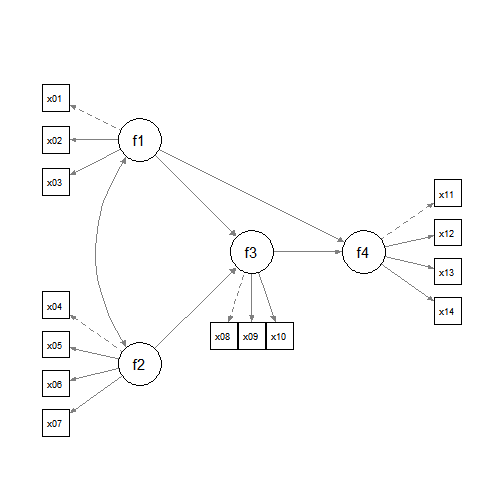

# Introduction

This article is a brief illustration of how `indirect_effect()`
from the package
[manymome](https://sfcheung.github.io/manymome/)
can be used to estimate the indirect effects among
latent variables and form bootstrap confidence
intervals for these effects.

# Data Set and Model

This is the sample dataset used for
illustration:


```r
library(manymome)
dat <- data_sem
print(round(head(dat), 1))
#>    x01  x02  x03  x04  x05  x06  x07  x08  x09  x10  x11  x12  x13  x14
#> 1  0.2 -1.1 -0.2  2.7 -0.1  2.2  1.7  0.2 -1.9 -2.1 -0.9 -0.5 -0.6 -1.5
#> 2  0.1  0.3  0.9 -0.5 -1.0  0.8 -0.3 -0.9  0.8 -1.5 -0.7  1.0 -0.8 -1.4
#> 3 -0.1 -0.1  2.4 -0.2 -0.1 -1.6 -1.9 -2.4 -0.3 -0.2  0.5 -0.7  0.2 -0.7
#> 4 -0.5  1.1 -0.7 -0.5  1.0 -0.6 -0.9 -1.5 -1.5 -0.5 -2.2 -1.6 -0.8 -0.2
#> 5 -0.8 -0.3 -0.9 -0.2  0.3 -2.1 -0.5 -1.8 -0.1 -2.7 -0.4 -1.2  0.3 -2.6
#> 6  0.9  0.3  0.3  1.0 -1.8 -0.4  0.8 -0.4 -1.1 -2.1  0.4  0.0 -0.3  2.2
```

This dataset has 14 variables, which
are indicators of four latent factors:
`f1`, `f2`, `f3`, and `f4`.

Suppose this is the model to be fitted:



This model can be fitted by `lavaan::sem()`:


```r
mod <-
"
f1 =~ x01 + x02 + x03
f2 =~ x04 + x05 + x06 + x07
f3 =~ x08 + x09 + x10
f4 =~ x11 + x12 + x13 + x14
f3 ~  f1 + f2
f4 ~  f1 + f3
"
fit_med <- sem(model = mod,
               data = dat)
```

These are the estimates of
the paths between the latent variables:


```r
est <- parameterEstimates(fit_med)
est[est$op == "~", ]
#>    lhs op rhs   est    se     z pvalue ci.lower ci.upper
#> 15  f3  ~  f1 0.243 0.120 2.018  0.044    0.007    0.479
#> 16  f3  ~  f2 0.326 0.102 3.186  0.001    0.125    0.526
#> 17  f4  ~  f1 0.447 0.125 3.592  0.000    0.203    0.692
#> 18  f4  ~  f3 0.402 0.090 4.445  0.000    0.225    0.579
```

Suppose that for the free parameters,
we would like to use ML to form the
confidence intervals. For indirect
effects, we want to use bootstrapping.

# Generating Bootstrap Estimates

Although bootstrap estimates can
be generated and stored the first time
we call `indirect_effect()`, we illustrate
using `do_boot()` to generate the
bootstrap estimates to be used by
`indirect_effect()`:


```r
boot_out_med <- do_boot(fit_med,
                        R = 100,
                        seed = 98171,
                        ncores = 1)
```

Please see `vignette("do_boot")` or
the help page of `do_boot()` on how
to use this function. In real research,
`R`, the number of bootstrap samples,
should be set to 2000 or even 5000.
The argument `ncores` can usually be omitted
unless users want to manually control
the number of CPU cores to be used in
parallel processing.

# Indirect Effects

Even though path coefficients are not labelled,
we can still use `indirect_effect()` to
estimate the indirect effect and form its
bootstrap confidence interval for any path
in the model. By reusing the generated bootstrap
estimates, there is no need to repeat the
resampling and estimation.

Suppose we want to estimate the indirect
effect from `f1` to `f4` through `f3`:


```r
out_f1f3f4 <- indirect_effect(x = "f1",
                              y = "f4",
                              m = "f3",
                              fit = fit_med,
                              boot_ci = TRUE,
                              boot_out = boot_out_med)
out_f1f3f4
#> 
#> == Indirect Effect ==
#>                                       
#>  Path:               f1 -> f3 -> f4   
#>  Indirect Effect     0.098            
#>  95.0% Bootstrap CI: [-0.007 to 0.216]
#> 
#> Computation Formula:
#>   (b.f3~f1)*(b.f4~f3)
#> Computation:
#>   (0.24307)*(0.40186)
#> 
#> Percentile confidence interval formed by nonparametric bootstrapping
#> with 100 bootstrap samples.
#> 
#> Coefficients of Component Paths:
#>   Path Coefficient
#>  f3~f1       0.243
#>  f4~f3       0.402
```

The indirect effect is
0.098,
with 95% confidence interval
[-0.007, 0.216].

Similarly, we can estimate the indirect
effect from `f2` to `f4` through `f3`:


```r
out_f2f3f4 <- indirect_effect(x = "f2",
                              y = "f4",
                              m = "f3",
                              fit = fit_med,
                              boot_ci = TRUE,
                              boot_out = boot_out_med)
out_f2f3f4
#> 
#> == Indirect Effect ==
#>                                      
#>  Path:               f2 -> f3 -> f4  
#>  Indirect Effect     0.131           
#>  95.0% Bootstrap CI: [0.049 to 0.254]
#> 
#> Computation Formula:
#>   (b.f3~f2)*(b.f4~f3)
#> Computation:
#>   (0.32561)*(0.40186)
#> 
#> Percentile confidence interval formed by nonparametric bootstrapping
#> with 100 bootstrap samples.
#> 
#> Coefficients of Component Paths:
#>   Path Coefficient
#>  f3~f2       0.326
#>  f4~f3       0.402
```

The indirect effect is
0.131,
with 95% confidence interval
[0.049, 0.254].

# Standardized Indirect effects

The standardized indirect
effect from `f1` to `f4` through `f3`
can be estimated by setting
`standardized_x` and `standardized_y` to `TRUE:


```r
std_f1f3f4 <- indirect_effect(x = "f1",
                              y = "f4",
                              m = "f3",
                              fit = fit_med,
                              boot_ci = TRUE,
                              boot_out = boot_out_med,
                              standardized_x = TRUE,
                              standardized_y = TRUE)
std_f1f3f4
#> 
#> == Indirect Effect ==
#>                                       
#>  Path:               f1 -> f3 -> f4   
#>  Indirect Effect     0.073            
#>  95.0% Bootstrap CI: [-0.005 to 0.157]
#> 
#> Computation Formula:
#>   (b.f3~f1)*(b.f4~f3)*sd_f1/sd_f4
#> Computation:
#>   (0.24307)*(0.40186)*(0.87470)/(1.17421)
#> 
#> Percentile confidence interval formed by nonparametric bootstrapping
#> with 100 bootstrap samples.
#> 
#> Coefficients of Component Paths:
#>   Path Coefficient
#>  f3~f1       0.243
#>  f4~f3       0.402
#> 
#> NOTE: The effects of the component paths are from the model, not standardized.
```

The standardized indirect effect is
0.073,
with 95% confidence interval
[-0.005, 0.157].

Similarly, we can estimate the standardized indirect
effect from `f2` to `f4` through `f3`:


```r
std_f2f3f4 <- indirect_effect(x = "f2",
                              y = "f4",
                              m = "f3",
                              fit = fit_med,
                              boot_ci = TRUE,
                              boot_out = boot_out_med,
                              standardized_x = TRUE,
                              standardized_y = TRUE)
std_f2f3f4
#> 
#> == Indirect Effect ==
#>                                      
#>  Path:               f2 -> f3 -> f4  
#>  Indirect Effect     0.116           
#>  95.0% Bootstrap CI: [0.044 to 0.204]
#> 
#> Computation Formula:
#>   (b.f3~f2)*(b.f4~f3)*sd_f2/sd_f4
#> Computation:
#>   (0.32561)*(0.40186)*(1.03782)/(1.17421)
#> 
#> Percentile confidence interval formed by nonparametric bootstrapping
#> with 100 bootstrap samples.
#> 
#> Coefficients of Component Paths:
#>   Path Coefficient
#>  f3~f2       0.326
#>  f4~f3       0.402
#> 
#> NOTE: The effects of the component paths are from the model, not standardized.
```

The standardized indirect effect is
0.116,
with 95% confidence interval
[0.044, 0.204].

Note that, unlike the confidence intervals in
`lavaan::standardizedSolution()`, the confidence
intervals formed by `indirect_effect()`
are the bootstrap confidence intervals formed
based on the bootstrap estimates, rather than
intervals based on the delta method.

# Adding Effects

Note that the results of `indirect_effect()`
can be added using `+`.

For example, to find the total effect of
`f1` on `f4`, we also need to compute
the direct effect from `f1` to `f4`. Although
it is already available in the `lavaan` output,
we still use `indirect_effect()` to compute it
so that it can be added to the indirect effect
computed above with bootstrap confidence
interval:


```r
out_f1f4 <- indirect_effect(x = "f1",
                            y = "f4",
                            fit = fit_med,
                            boot_ci = TRUE,
                            boot_out = boot_out_med)
out_f1f4
#> 
#> ==  Effect ==
#>                                      
#>  Path:               f1 -> f4        
#>  Effect              0.447           
#>  95.0% Bootstrap CI: [0.203 to 0.753]
#> 
#> Computation Formula:
#>   (b.f4~f1)
#> Computation:
#>   (0.44749)
#> 
#> Percentile confidence interval formed by nonparametric bootstrapping
#> with 100 bootstrap samples.
```

We can now compute the total effect:


```r
out_f1_total <- out_f1f3f4 + out_f1f4
out_f1_total
#> 
#> == Indirect Effect ==
#>                                       
#>  Path:                f1 -> f3 -> f4  
#>  Path:                f1 -> f4        
#>  Function of Effects: 0.545           
#>  95.0% Bootstrap CI:  [0.318 to 0.858]
#> 
#> Computation of the Function of Effects:
#>  (f1->f3->f4)
#> +(f1->f4) 
#> 
#> 
#> Percentile confidence interval formed by nonparametric bootstrapping
#> with 100 bootstrap samples.
```

The total effect of `f1` on `f4` is
0.545,
with 95% confidence interval
[0.318, 0.858].

# Differences in Effects

Subtraction can also be conducted using `-`. For
example, we can compute the difference between
the indirect effect of `f1` on `f4` and the
direct effect of `f1` on `f4`:


```r
out_f1_diff <- out_f1f4 - out_f1f3f4
out_f1_diff
#> 
#> == Indirect Effect ==
#>                                        
#>  Path:                f1 -> f4         
#>  Path:                f1 -> f3 -> f4   
#>  Function of Effects: 0.350            
#>  95.0% Bootstrap CI:  [-0.027 to 0.700]
#> 
#> Computation of the Function of Effects:
#>  (f1->f4)
#> -(f1->f3->f4) 
#> 
#> 
#> Percentile confidence interval formed by nonparametric bootstrapping
#> with 100 bootstrap samples.
```

The difference in effects is
0.350,
with 95% confidence interval
[-0.027, 0.700].

# Identifying All Indirect paths

If there are several indirect paths in
a model, the function `all_indirect_paths()`
can
be used to automatically identify all
indirect paths (a path with at least
one mediator) in a model:


```r
all_paths <- all_indirect_paths(fit = fit_med)
all_paths
#> Call: 
#> all_indirect_paths(fit = fit_med)
#> Path(s): 
#>   path          
#> 1 f1 -> f3 -> f4
#> 2 f2 -> f3 -> f4
```

The output is a `all_paths`-class object.
It can be used in `many_indirect_effects()`


```r
out_all <- many_indirect_effects(paths = all_paths,
                                 fit = fit_med,
                                 boot_ci = TRUE,
                                 boot_out = boot_out_med)
```

The first argument, `paths`, is the output
of `all_indirect_paths()`. The other arguments
will be passed to `indirect_effect()`.

The output is an `indirect_list`-class
object, which is a list of the outputs
of `indirect_effects()`. If printed,
a summary of the indirect effects will
be printed:


```r
out_all
#> 
#> ==  Indirect Effect(s)   ==
#>                  ind  CI.lo CI.hi Sig
#> f1 -> f3 -> f4 0.098 -0.007 0.216    
#> f2 -> f3 -> f4 0.131  0.049 0.254 Sig
#> 
#>  - [CI.lo to CI.hi] are 95.0% percentile confidence intervals by
#>    nonparametric bootstrapping with 100 samples.
#>  - The 'ind' column shows the indirect effects.
#> 
```

The output of `many_indirect_effects()`
is a named list, names being the path
name as appeared in the output.
Individual indirect
effects can be extracted using either
the indices or the path names

An example using index:


```r
out1 <- out_all[[1]]
out1
#> 
#> == Indirect Effect ==
#>                                       
#>  Path:               f1 -> f3 -> f4   
#>  Indirect Effect     0.098            
#>  95.0% Bootstrap CI: [-0.007 to 0.216]
#> 
#> Computation Formula:
#>   (b.f3~f1)*(b.f4~f3)
#> Computation:
#>   (0.24307)*(0.40186)
#> 
#> Percentile confidence interval formed by nonparametric bootstrapping
#> with 100 bootstrap samples.
#> 
#> Coefficients of Component Paths:
#>   Path Coefficient
#>  f3~f1       0.243
#>  f4~f3       0.402
```

An example using path name (though not
recommended because the name is usually
long):


```r
out2 <- out_all[["f2 -> f3 -> f4"]]
out2
#> 
#> == Indirect Effect ==
#>                                      
#>  Path:               f2 -> f3 -> f4  
#>  Indirect Effect     0.131           
#>  95.0% Bootstrap CI: [0.049 to 0.254]
#> 
#> Computation Formula:
#>   (b.f3~f2)*(b.f4~f3)
#> Computation:
#>   (0.32561)*(0.40186)
#> 
#> Percentile confidence interval formed by nonparametric bootstrapping
#> with 100 bootstrap samples.
#> 
#> Coefficients of Component Paths:
#>   Path Coefficient
#>  f3~f2       0.326
#>  f4~f3       0.402
```

The extracted element can be used just
like the outputs of `indirect_effect()`
in previous section.

Users can customize the search.
For example, if
a model has control variables, they can
be excluded in the search for indirect
paths. Users can also limit the search
to paths that start from or end at
selected variables.
See the help page of `all_indirect_paths()`
and `many_indirect_effects()` for the
arguments available.

Not demonstrated in this document,
total indirect effect can be computed
by `total_indirect_effect()` from the
output of `many_indirect_effects()`.
Please refer to `vignette("med_lm")`
for an example and the help page of
`total_indirect_effect()`.

# Further Information

For further information on `do_boot()`
and `indirect_effect()`,
please refer to their help pages,
or `vignette("manymome")` and
`vignette("do_boot")`.

Monte Carlo confidence intervals can also
be formed using the functions illustrated
above. First use `do_mc()` instead of
`do_boot()` to generate simulated sample
estimates. When calling other main
functions, use `mc_ci = TRUE` and set
`mc_out` to the output of `do_mc()`.
Please refer to `vignette("do_mc")`
for an illustration.
