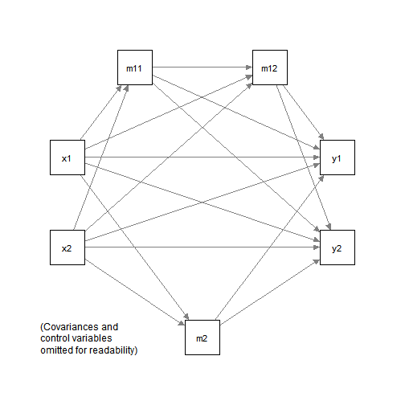

# Introduction

This article is a brief illustration of how
to use `indirect_effect()`
from the package
[manymome](https://sfcheung.github.io/manymome/)
to estimate the indirect effects
when the model parameters are estimated by
ordinary least squares (OLS) multiple regression
using `lm()`.

# Data Set and Model

This is the sample dataset used for
illustration:


```r
library(manymome)
dat <- data_med_complicated
print(round(head(dat), 2))
#>      x1   x2  m11  m12   m2   y1    y2   c1    c2
#> 1 10.16 4.00 5.84 6.78 7.11 6.06 10.38 5.01  8.20
#> 2 10.89 4.79 4.95 5.81 7.92 5.15  8.52 3.92  9.90
#> 3  9.99 5.79 4.95 4.47 8.21 3.25  7.81 5.91 11.36
#> 4 12.36 4.80 5.56 6.21 8.88 6.27  9.41 6.06 10.49
#> 5 10.85 6.39 6.19 5.39 8.76 5.36  9.84 4.28  9.81
#> 6 10.28 4.58 4.88 4.28 8.50 4.57 10.42 4.71 11.38
```

This dataset has 9 variables: 2
predictors (`x1` and `x2`),
three mediators (`m11`, `m12`, and `m2`),
two outcome variables (`y1` and `y2`),
and two control variables (`c1` and `c2`).

Suppose this is the model to be fitted:



Despite the apparent complexity, the path parameters
can be estimated by five multiple regression models:


```r
lm_m11 <- lm(m11 ~ x1 + x2 + c1 + c2, dat)
lm_m12 <- lm(m12 ~ m11 + x1 + x2 + c1 + c2, dat)
lm_m2 <- lm(m2 ~ x1 + x2 + c1 + c2, dat)
lm_y1 <- lm(y1 ~ m12 + m2 + m11 + x1 + x2 + c1 + c2, dat)
lm_y2 <- lm(y2 ~ m12 + m2 + m11 + x1 + x2 + c1 + c2, dat)
```

These are the regression coefficient estimates of
the paths (those of control variables omitted):


```
#>        m11    m12    m2     y1     y2
#> x1   0.352 -0.212 0.022 -0.078  0.115
#> x2  -0.045 -0.072 0.289  0.003  0.062
#> m11         0.454        0.147  0.024
#> m12                      0.234  0.135
#> m2                      -0.433 -0.436
```

Although not mandatory, it is recommended to combine these
five models into one object (a system of regression models)
using `lm2list()`:


```r
fit_lm <- lm2list(lm_m11, lm_m12, lm_m2, lm_y1, lm_y2)
fit_lm
#> 
#> The models:
#> m11 ~ x1 + x2 + c1 + c2
#> m12 ~ m11 + x1 + x2 + c1 + c2
#> m2 ~ x1 + x2 + c1 + c2
#> y1 ~ m12 + m2 + m11 + x1 + x2 + c1 + c2
#> y2 ~ m12 + m2 + m11 + x1 + x2 + c1 + c2
```

Simply use the `lm()` outputs as arguments. Order does not
matter. To ensure that
the regression outputs can be validly combined,
`lm2list()` will also check:

a. whether the same
sample is used in all regression analysis (not just
same sample size, but the same set of cases), and

b. whether the models are "connected", to ensure that
the regression outputs can be validly combined.

# Generating Bootstrap Estimates

To form nonparametric bootstrap confidence interval for
indirect effects to be computed, `do_boot()` can be used
to generate bootstrap estimates for all regression
coefficients first. These estimates can be reused for
any indirect effects to be estimated.


```r
boot_out_lm <- do_boot(fit_lm,
                       R = 100,
                       seed = 54532,
                       ncores = 1)
```

Please see `vignette("do_boot")` or
the help page of `do_boot()` on how
to use this function. In real research,
`R`, the number of bootstrap samples,
should be set to 2000 or even 5000.
The argument `ncores` can usually be omitted
unless users want to manually control
the number of CPU cores used in
parallel processing.

# Indirect Effects

We can now use `indirect_effect()` to
estimate the indirect effect and form its
bootstrap confidence interval for any path
in the model. By reusing the generated bootstrap
estimates, there is no need to repeat the
resampling.

Suppose we want to estimate the indirect
effect from `x1` to `y1` through `m11` and `m12`:

(Refer to `vignette("manymome")` and the help page
of `indirect_effect()` on the arguments.)


```r
out_x1m11m12y1 <- indirect_effect(x = "x1",
                                  y = "y1",
                                  m = c("m11", "m12"),
                                  fit = fit_lm,
                                  boot_ci = TRUE,
                                  boot_out = boot_out_lm)
out_x1m11m12y1
#> 
#> == Indirect Effect ==
#>                                            
#>  Path:               x1 -> m11 -> m12 -> y1
#>  Indirect Effect     0.037                 
#>  95.0% Bootstrap CI: [0.003 to 0.077]      
#> 
#> Computation Formula:
#>   (b.m11~x1)*(b.m12~m11)*(b.y1~m12)
#> Computation:
#>   (0.35204)*(0.45408)*(0.23402)
#> 
#> Percentile confidence interval formed by nonparametric bootstrapping
#> with 100 bootstrap samples.
#> 
#> Coefficients of Component Paths:
#>     Path Coefficient
#>   m11~x1       0.352
#>  m12~m11       0.454
#>   y1~m12       0.234
```

The indirect effect is
0.037,
with 95% confidence interval
[0.003, 0.077].

Similarly, we can estimate the indirect
effect from `x2` to `y2` through `m2`:


```r
out_x2m2y2 <- indirect_effect(x = "x2",
                              y = "y2",
                              m = "m2",
                              fit = fit_lm,
                              boot_ci = TRUE,
                              boot_out = boot_out_lm)
out_x2m2y2
#> 
#> == Indirect Effect ==
#>                                        
#>  Path:               x2 -> m2 -> y2    
#>  Indirect Effect     -0.126            
#>  95.0% Bootstrap CI: [-0.233 to -0.043]
#> 
#> Computation Formula:
#>   (b.m2~x2)*(b.y2~m2)
#> Computation:
#>   (0.28901)*(-0.43598)
#> 
#> Percentile confidence interval formed by nonparametric bootstrapping
#> with 100 bootstrap samples.
#> 
#> Coefficients of Component Paths:
#>   Path Coefficient
#>  m2~x2       0.289
#>  y2~m2      -0.436
```

The indirect effect is
-0.126,
with 95% confidence interval
[-0.233, -0.043].

Note that any indirect path in the model can be
estimated this way. Suppose, after doing the regression analysis,
we want to estimate the indirect effect from `x2` to `m12`
through `m11`, we just call `indirect_effect()`:


```r
out_x2m11m12 <- indirect_effect(x = "x2",
                                y = "m12",
                                m = "m11",
                                fit = fit_lm,
                                boot_ci = TRUE,
                                boot_out = boot_out_lm)
out_x2m11m12
#> 
#> == Indirect Effect ==
#>                                       
#>  Path:               x2 -> m11 -> m12 
#>  Indirect Effect     -0.020           
#>  95.0% Bootstrap CI: [-0.139 to 0.110]
#> 
#> Computation Formula:
#>   (b.m11~x2)*(b.m12~m11)
#> Computation:
#>   (-0.04471)*(0.45408)
#> 
#> Percentile confidence interval formed by nonparametric bootstrapping
#> with 100 bootstrap samples.
#> 
#> Coefficients of Component Paths:
#>     Path Coefficient
#>   m11~x2     -0.0447
#>  m12~m11      0.4541
```

The indirect effect is
-0.020,
with 95% confidence interval
[-0.139, 0.110].

There is no limit on the path to be estimated, as long
as all required path coefficients are in the model.
`indirect_effect()` will also check whether a path is valid.
Therefore, estimating the effect from `x1` to `m2` through
`m11` will result in an error because this path does not
exist in the model defined by the regression outputs.

# Standardized Indirect effects

The standardized indirect
effect from `x1` to `y1` through `m11` and `m12`
can be estimated by setting
`standardized_x` and `standardized_y` to `TRUE:


```r
std_x1m11m12y1 <- indirect_effect(x = "x1",
                                  y = "y1",
                                  m = c("m11", "m12"),
                                  fit = fit_lm,
                                  boot_ci = TRUE,
                                  boot_out = boot_out_lm,
                                  standardized_x = TRUE,
                                  standardized_y = TRUE)
std_x1m11m12y1
#> 
#> == Indirect Effect ==
#>                                            
#>  Path:               x1 -> m11 -> m12 -> y1
#>  Indirect Effect     0.039                 
#>  95.0% Bootstrap CI: [0.004 to 0.085]      
#> 
#> Computation Formula:
#>   (b.m11~x1)*(b.m12~m11)*(b.y1~m12)*sd_x1/sd_y1
#> Computation:
#>   (0.35204)*(0.45408)*(0.23402)*(1.11605)/(1.06579)
#> 
#> Percentile confidence interval formed by nonparametric bootstrapping
#> with 100 bootstrap samples.
#> 
#> Coefficients of Component Paths:
#>     Path Coefficient
#>   m11~x1       0.352
#>  m12~m11       0.454
#>   y1~m12       0.234
#> 
#> NOTE: The effects of the component paths are from the model, not standardized.
```

The standardized indirect effect is
0.039,
with 95% confidence interval
[0.004,0.085].

Similarly, we can estimate the standardized indirect
effect from `x1` to `y1` through `m2`:


```r
std_x1m2y1 <- indirect_effect(x = "x1",
                              y = "y1",
                              m = "m2",
                              fit = fit_lm,
                              boot_ci = TRUE,
                              boot_out = boot_out_lm,
                              standardized_x = TRUE,
                              standardized_y = TRUE)
std_x1m2y1
#> 
#> == Indirect Effect ==
#>                                       
#>  Path:               x1 -> m2 -> y1   
#>  Indirect Effect     -0.010           
#>  95.0% Bootstrap CI: [-0.069 to 0.067]
#> 
#> Computation Formula:
#>   (b.m2~x1)*(b.y1~m2)*sd_x1/sd_y1
#> Computation:
#>   (0.02233)*(-0.43300)*(1.11605)/(1.06579)
#> 
#> Percentile confidence interval formed by nonparametric bootstrapping
#> with 100 bootstrap samples.
#> 
#> Coefficients of Component Paths:
#>   Path Coefficient
#>  m2~x1      0.0223
#>  y1~m2     -0.4330
#> 
#> NOTE: The effects of the component paths are from the model, not standardized.
```

The standardized indirect effect is
-0.010,
with 95% confidence interval
[-0.069, 0.067].

# Adding Effects

Note that the results of `indirect_effect()`
can be added using `+`.

For example, to find the *total* *indirect* effect of
`x1` on `y1`, we need to compute
the indirect effects along the following paths:

a. `x1` to `m11` to `m12` to `y1`
b. `x1` to `m11` to `y1`
c. `x1` to `m12` to `y1`
d. `x1` to `m2` to `y1`

The indirect effects along Path a has
already been computed. We compute
the indirect effects along Paths b, c, and d below:


```r
out_x1m11y1 <- indirect_effect(x = "x1",
                               y = "y1",
                               m = "m11",
                               fit = fit_lm,
                               boot_ci = TRUE,
                               boot_out = boot_out_lm)
out_x1m11y1
#> 
#> == Indirect Effect ==
#>                                       
#>  Path:               x1 -> m11 -> y1  
#>  Indirect Effect     0.052            
#>  95.0% Bootstrap CI: [-0.036 to 0.103]
#> 
#> Computation Formula:
#>   (b.m11~x1)*(b.y1~m11)
#> Computation:
#>   (0.35204)*(0.14694)
#> 
#> Percentile confidence interval formed by nonparametric bootstrapping
#> with 100 bootstrap samples.
#> 
#> Coefficients of Component Paths:
#>    Path Coefficient
#>  m11~x1       0.352
#>  y1~m11       0.147
```


```r
out_x1m12y1 <- indirect_effect(x = "x1",
                               y = "y1",
                               m = "m12",
                               fit = fit_lm,
                               boot_ci = TRUE,
                               boot_out = boot_out_lm)
out_x1m12y1
#> 
#> == Indirect Effect ==
#>                                        
#>  Path:               x1 -> m12 -> y1   
#>  Indirect Effect     -0.050            
#>  95.0% Bootstrap CI: [-0.125 to -0.000]
#> 
#> Computation Formula:
#>   (b.m12~x1)*(b.y1~m12)
#> Computation:
#>   (-0.21182)*(0.23402)
#> 
#> Percentile confidence interval formed by nonparametric bootstrapping
#> with 100 bootstrap samples.
#> 
#> Coefficients of Component Paths:
#>    Path Coefficient
#>  m12~x1      -0.212
#>  y1~m12       0.234
```


```r
out_x1m2y1 <- indirect_effect(x = "x1",
                               y = "y1",
                               m = "m2",
                               fit = fit_lm,
                               boot_ci = TRUE,
                               boot_out = boot_out_lm)
out_x1m2y1
#> 
#> == Indirect Effect ==
#>                                       
#>  Path:               x1 -> m2 -> y1   
#>  Indirect Effect     -0.010           
#>  95.0% Bootstrap CI: [-0.077 to 0.064]
#> 
#> Computation Formula:
#>   (b.m2~x1)*(b.y1~m2)
#> Computation:
#>   (0.02233)*(-0.43300)
#> 
#> Percentile confidence interval formed by nonparametric bootstrapping
#> with 100 bootstrap samples.
#> 
#> Coefficients of Component Paths:
#>   Path Coefficient
#>  m2~x1      0.0223
#>  y1~m2     -0.4330
```

We can now compute the total *indirect* effect:


```r
out_x1y1_total <- out_x1m11m12y1 + out_x1m11y1 + out_x1m12y1 + out_x1m2y1
out_x1y1_total
#> 
#> == Indirect Effect ==
#>                                             
#>  Path:                x1 -> m11 -> m12 -> y1
#>  Path:                x1 -> m11 -> y1       
#>  Path:                x1 -> m12 -> y1       
#>  Path:                x1 -> m2 -> y1        
#>  Function of Effects: 0.030                 
#>  95.0% Bootstrap CI:  [-0.088 to 0.132]     
#> 
#> Computation of the Function of Effects:
#>  (((x1->m11->m12->y1)
#> +(x1->m11->y1))
#> +(x1->m12->y1))
#> +(x1->m2->y1) 
#> 
#> 
#> Percentile confidence interval formed by nonparametric bootstrapping
#> with 100 bootstrap samples.
```

The total effect of `f1` on `f4` is
0.030,
with 95% confidence interval
[-0.088, 0.132].

See `help("math_indirect")` for further details on addition
for `indirect_effect()` outputs.

# Differences in Effects

Subtraction can also be conducted using `-`. For
example, we can compute the difference between
the indirect effect of `x1` on `y1` through `m11` and `m12`
and the indirect effect of `x1` on `y1` through `m2`:


```r
out_x1_diff <- out_x1m11m12y1 - out_x1m2y1
out_x1_diff
#> 
#> == Indirect Effect ==
#>                                             
#>  Path:                x1 -> m11 -> m12 -> y1
#>  Path:                x1 -> m2 -> y1        
#>  Function of Effects: 0.047                 
#>  95.0% Bootstrap CI:  [-0.038 to 0.118]     
#> 
#> Computation of the Function of Effects:
#>  (x1->m11->m12->y1)
#> -(x1->m2->y1) 
#> 
#> 
#> Percentile confidence interval formed by nonparametric bootstrapping
#> with 100 bootstrap samples.
```

The difference in effects is
0.047,
with 95% confidence interval
[-0.038, 0.118].

See `help("math_indirect")` for further details on subtraction
for `indirect_effect()` outputs.

# Identifying All Indirect paths

If there are several indirect paths in
a model, the function `all_indirect_paths()`
can
be used to automatically identify all
indirect paths (a path with at least
one mediator) in a model:


```r
all_paths <- all_indirect_paths(fit = fit_lm)
all_paths
#> Call: 
#> all_indirect_paths(fit = fit_lm)
#> Path(s): 
#>    path                  
#> 1  m11 -> m12 -> y1      
#> 2  m11 -> m12 -> y2      
#> 3  x1 -> m11 -> m12      
#> 4  x1 -> m11 -> m12 -> y1
#> 5  x1 -> m11 -> y1       
#> 6  x1 -> m12 -> y1       
#> 7  x1 -> m2 -> y1        
#> 8  x1 -> m11 -> m12 -> y2
#> 9  x1 -> m11 -> y2       
#> 10 x1 -> m12 -> y2       
#> 11 x1 -> m2 -> y2        
#> 12 x2 -> m11 -> m12      
#> 13 x2 -> m11 -> m12 -> y1
#> 14 x2 -> m11 -> y1       
#> 15 x2 -> m12 -> y1       
#> 16 x2 -> m2 -> y1        
#> 17 x2 -> m11 -> m12 -> y2
#> 18 x2 -> m11 -> y2       
#> 19 x2 -> m12 -> y2       
#> 20 x2 -> m2 -> y2        
#> 21 c1 -> m11 -> m12      
#> 22 c1 -> m11 -> m12 -> y1
#> 23 c1 -> m11 -> y1       
#> 24 c1 -> m12 -> y1       
#> 25 c1 -> m2 -> y1        
#> 26 c1 -> m11 -> m12 -> y2
#> 27 c1 -> m11 -> y2       
#> 28 c1 -> m12 -> y2       
#> 29 c1 -> m2 -> y2        
#> 30 c2 -> m11 -> m12      
#> 31 c2 -> m11 -> m12 -> y1
#> 32 c2 -> m11 -> y1       
#> 33 c2 -> m12 -> y1       
#> 34 c2 -> m2 -> y1        
#> 35 c2 -> m11 -> m12 -> y2
#> 36 c2 -> m11 -> y2       
#> 37 c2 -> m12 -> y2       
#> 38 c2 -> m2 -> y2
```

The initial list is very long because
control variables (`c1` and `c2`) are
included in the search. Moreover, paths
that start from a mediator or end at
a mediator are also included.
Users can customize the search:


```r
all_paths <- all_indirect_paths(fit = fit_lm,
                                x = c("x1", "x2"),
                                y = c("y1", "y2"),
                                exclude = c("c1", "c2"))
all_paths
#> Call: 
#> all_indirect_paths(fit = fit_lm, exclude = c("c1", "c2"), x = c("x1", 
#>     "x2"), y = c("y1", "y2"))
#> Path(s): 
#>    path                  
#> 1  x1 -> m11 -> m12 -> y1
#> 2  x1 -> m11 -> y1       
#> 3  x1 -> m12 -> y1       
#> 4  x1 -> m2 -> y1        
#> 5  x1 -> m11 -> m12 -> y2
#> 6  x1 -> m11 -> y2       
#> 7  x1 -> m12 -> y2       
#> 8  x1 -> m2 -> y2        
#> 9  x2 -> m11 -> m12 -> y1
#> 10 x2 -> m11 -> y1       
#> 11 x2 -> m12 -> y1       
#> 12 x2 -> m2 -> y1        
#> 13 x2 -> m11 -> m12 -> y2
#> 14 x2 -> m11 -> y2       
#> 15 x2 -> m12 -> y2       
#> 16 x2 -> m2 -> y2
```

- `x` is a vector of names. Only paths
  start from these variables will be
  included.

- `y` is a vector of names. Only paths
  end at these variables will be
  included.

- `exclude` is a vector of names. Paths
  that involve these variables will be
  excluded.

The output is a `all_paths`-class object.
It can be used in `many_indirect_effects()`


```r
out_all <- many_indirect_effects(paths = all_paths,
                                 fit = fit_lm,
                                 boot_ci = TRUE,
                                 boot_out = boot_out_lm)
```

The first argument, `paths`, is the output
of `all_indirect_paths()`. The other
arguments
will be passed to `indirect_effect()`.

The output is an `indirect_list`-class
object, which is a list of the outputs
of `indirect_effects()`. If printed,
a summary of the indirect effects will
be printed:


```r
out_all
#> 
#> ==  Indirect Effect(s)   ==
#>                           ind  CI.lo  CI.hi Sig
#> x1 -> m11 -> m12 -> y1  0.037  0.003  0.077 Sig
#> x1 -> m11 -> y1         0.052 -0.036  0.103    
#> x1 -> m12 -> y1        -0.050 -0.125 -0.000 Sig
#> x1 -> m2 -> y1         -0.010 -0.077  0.064    
#> x1 -> m11 -> m12 -> y2  0.022 -0.015  0.065    
#> x1 -> m11 -> y2         0.009 -0.086  0.093    
#> x1 -> m12 -> y2        -0.029 -0.089  0.014    
#> x1 -> m2 -> y2         -0.010 -0.074  0.068    
#> x2 -> m11 -> m12 -> y1 -0.005 -0.044  0.017    
#> x2 -> m11 -> y1        -0.007 -0.055  0.034    
#> x2 -> m12 -> y1        -0.017 -0.054  0.049    
#> x2 -> m2 -> y1         -0.125 -0.258 -0.031 Sig
#> x2 -> m11 -> m12 -> y2 -0.003 -0.021  0.022    
#> x2 -> m11 -> y2        -0.001 -0.021  0.052    
#> x2 -> m12 -> y2        -0.010 -0.056  0.045    
#> x2 -> m2 -> y2         -0.126 -0.233 -0.043 Sig
#> 
#>  - [CI.lo to CI.hi] are 95.0% percentile confidence intervals by
#>    nonparametric bootstrapping with 100 samples.
#>  - The 'ind' column shows the indirect effects.
#> 
```

The output of `many_indirect_effects()`
is a named list, names being the path
name as appeared in the output.
Individual indirect
effects can be extracted using either
the indices or the path names

An example using index:


```r
out1 <- out_all[[1]]
out1
#> 
#> == Indirect Effect ==
#>                                            
#>  Path:               x1 -> m11 -> m12 -> y1
#>  Indirect Effect     0.037                 
#>  95.0% Bootstrap CI: [0.003 to 0.077]      
#> 
#> Computation Formula:
#>   (b.m11~x1)*(b.m12~m11)*(b.y1~m12)
#> Computation:
#>   (0.35204)*(0.45408)*(0.23402)
#> 
#> Percentile confidence interval formed by nonparametric bootstrapping
#> with 100 bootstrap samples.
#> 
#> Coefficients of Component Paths:
#>     Path Coefficient
#>   m11~x1       0.352
#>  m12~m11       0.454
#>   y1~m12       0.234
```

An example using path name (though not
recommended because the name is usually
long):


```r
out2 <- out_all[["x2 -> m2 -> y2"]]
out2
#> 
#> == Indirect Effect ==
#>                                        
#>  Path:               x2 -> m2 -> y2    
#>  Indirect Effect     -0.126            
#>  95.0% Bootstrap CI: [-0.233 to -0.043]
#> 
#> Computation Formula:
#>   (b.m2~x2)*(b.y2~m2)
#> Computation:
#>   (0.28901)*(-0.43598)
#> 
#> Percentile confidence interval formed by nonparametric bootstrapping
#> with 100 bootstrap samples.
#> 
#> Coefficients of Component Paths:
#>   Path Coefficient
#>  m2~x2       0.289
#>  y2~m2      -0.436
```

The extracted element can be used just
like the outputs of `indirect_effect()`
in previous section.


See the help page of `all_indirect_paths()`
and `many_indirect_effects()` for other
arguments available.

## Total Indirect Effect

The total indirect effect between two
variables in a list of paths can be
computed by `total_indirect_effect()`.


```r
total_x1_y1 <- total_indirect_effect(out_all,
                                     x = "x1",
                                     y = "y1")
total_x1_y1
#> 
#> == Indirect Effect ==
#>                                             
#>  Path:                x1 -> m11 -> m12 -> y1
#>  Path:                x1 -> m11 -> y1       
#>  Path:                x1 -> m12 -> y1       
#>  Path:                x1 -> m2 -> y1        
#>  Function of Effects: 0.030                 
#>  95.0% Bootstrap CI:  [-0.088 to 0.132]     
#> 
#> Computation of the Function of Effects:
#>  (((x1->m11->m12->y1)
#> +(x1->m11->y1))
#> +(x1->m12->y1))
#> +(x1->m2->y1) 
#> 
#> 
#> Percentile confidence interval formed by nonparametric bootstrapping
#> with 100 bootstrap samples.
```

The first argument is the output
of `many_indirect_effects()` or a list
of `indirect`-class object. `x` is the
name of the variable that starts the paths.
`y` is the name of the variable that
ends the paths.

# Further Information

For further information on `do_boot()`
and `indirect_effect()`,
please refer to their help pages.
