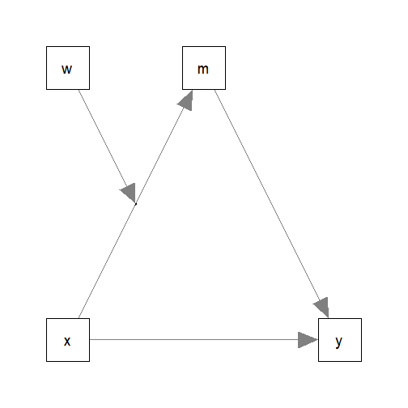

# Introduction

This article is a brief illustration of how
to use
`cond_indirect_effects()`
from the package
[manymome](https://sfcheung.github.io/manymome/)
([Cheung & Cheung, 2023](https://doi.org/10.3758/s13428-023-02224-z))
to estimate the conditional
indirect effects
when the model parameters are estimate by
ordinary least squares (OLS) multiple regression
using `lm()`.

# Data Set and Model

This is the sample data set used for
illustration:


``` r
library(manymome)
dat <- data_med_mod_a
print(head(dat), digits = 3)
#>       x    w    m    y   c1   c2
#> 1  8.58 1.57 28.9 36.9 6.03 4.82
#> 2 10.36 1.10 24.8 24.5 5.19 5.34
#> 3 10.38 2.88 37.3 38.1 4.63 5.02
#> 4  9.53 3.16 32.6 37.9 2.94 6.01
#> 5 11.34 3.84 49.2 59.0 6.12 5.05
#> 6  9.66 2.22 26.4 35.4 4.02 5.03
```

This dataset has 6 variables:
one predictor (`x`),
one mediators (`m`),
one outcome variable (`y`),
one moderator (`w`)
and two control variables (`c1` and `c2`).

Suppose this is the model being fitted:



The path parameters
can be estimated by two multiple regression models:


``` r
lm_m <- lm(m ~ x*w + c1 + c2, dat)
lm_y <- lm(y ~ m + x + c1 + c2, dat)
```

These are the estimates of the regression coefficient
of the paths:


``` r
# ###### Predict m ######
#
summary(lm_m)
#> 
#> Call:
#> lm(formula = m ~ x * w + c1 + c2, data = dat)
#> 
#> Residuals:
#>     Min      1Q  Median      3Q     Max 
#> -8.5621 -2.0065 -0.2142  1.7618 10.4270 
#> 
#> Coefficients:
#>             Estimate Std. Error t value Pr(>|t|)  
#> (Intercept)  16.4910    12.1039   1.362   0.1763  
#> x             0.0959     1.1958   0.080   0.9362  
#> w            -3.4871     4.7907  -0.728   0.4685  
#> c1            0.5372     0.4162   1.291   0.2000  
#> c2           -0.1533     0.4211  -0.364   0.7165  
#> x:w           0.9785     0.4794   2.041   0.0441 *
#> ---
#> Signif. codes:  0 '***' 0.001 '**' 0.01 '*' 0.05 '.' 0.1 ' ' 1
#> 
#> Residual standard error: 3.998 on 94 degrees of freedom
#> Multiple R-squared:  0.7479,	Adjusted R-squared:  0.7345 
#> F-statistic: 55.79 on 5 and 94 DF,  p-value: < 2.2e-16
#
# ###### Predict y ######
#
summary(lm_y)
#> 
#> Call:
#> lm(formula = y ~ m + x + c1 + c2, data = dat)
#> 
#> Residuals:
#>     Min      1Q  Median      3Q     Max 
#> -9.4396 -2.8156 -0.3145  2.3231 11.2849 
#> 
#> Coefficients:
#>             Estimate Std. Error t value Pr(>|t|)    
#> (Intercept)  4.50635    5.40625   0.834    0.407    
#> m            0.95867    0.05806  16.512   <2e-16 ***
#> x           -0.01980    0.50578  -0.039    0.969    
#> c1           0.68241    0.44110   1.547    0.125    
#> c2          -0.49573    0.44565  -1.112    0.269    
#> ---
#> Signif. codes:  0 '***' 0.001 '**' 0.01 '*' 0.05 '.' 0.1 ' ' 1
#> 
#> Residual standard error: 4.229 on 95 degrees of freedom
#> Multiple R-squared:  0.7669,	Adjusted R-squared:  0.7571 
#> F-statistic: 78.15 on 4 and 95 DF,  p-value: < 2.2e-16
```

Although not mandatory, it is recommended to combine the
models into one object (a system of regression models)
using `lm2list()`:


``` r
fit_lm <- lm2list(lm_m, lm_y)
fit_lm
#> 
#> The model(s):
#> m ~ x * w + c1 + c2
#> y ~ m + x + c1 + c2
```

Simply use the `lm()` outputs as arguments. Order does not
matter. To ensure that
the regression outputs can be validly combined,
`lm2list()` will also check:

a. whether the same
sample is used in all regression analysis (not just
same sample size, but the same set of cases), and

b. whether the models are "connected", to ensure that
the regression outputs can be validly combined.

# Generating Bootstrap Estimates

To form nonparametric bootstrap confidence interval for
effects to be computed, `do_boot()` can be used
to generate bootstrap estimates for all regression
coefficients first. These estimates can be reused for
any effects to be estimated.


``` r
boot_out_lm <- do_boot(fit_lm,
                       R = 100,
                       seed = 54532,
                       ncores = 1)
```

Please see `vignette("do_boot")` or
the help page of `do_boot()` on how
to use this function. In real research,
`R`, the number of bootstrap samples,
should be set to 2000 or even 5000.
The argument `ncores` can usually be omitted
unless users want to manually control
the number of CPU cores used in
parallel processing.

# Conditional Indirect Effects

We can now use `cond_indirect_effects()` to
estimate the indirect effects for
different levels of the moderator (`w`) and
form their
bootstrap confidence interval. By reusing
the generated bootstrap
estimates, there is no need to repeat the
resampling.

Suppose we want to estimate the indirect
effect from `x` to `y` through `m`,
conditional on `w`:

(Refer to `vignette("manymome")` and the help page
of `cond_indirect_effects()` on the arguments.)


``` r
out_xmy_on_w <- cond_indirect_effects(wlevels = "w",
                                      x = "x",
                                      y = "y",
                                      m = "m",
                                      fit = fit_lm,
                                      boot_ci = TRUE,
                                      boot_out = boot_out_lm)
out_xmy_on_w
#> 
#> == Conditional indirect effects ==
#> 
#>  Path: x -> m -> y
#>  Conditional on moderator(s): w
#>  Moderator(s) represented by: w
#> 
#>       [w]   (w)   ind  CI.lo CI.hi Sig   m~x   y~m
#> 1 M+1.0SD 3.164 3.060  2.168 4.039 Sig 3.192 0.959
#> 2 Mean    2.179 2.136  1.407 2.925 Sig 2.228 0.959
#> 3 M-1.0SD 1.194 1.212 -0.288 2.564     1.265 0.959
#> 
#>  - [CI.lo to CI.hi] are 95.0% percentile confidence intervals by
#>    nonparametric bootstrapping with 100 samples.
#>  - The 'ind' column shows the conditional indirect effects.
#>  - 'm~x','y~m' is/are the path coefficient(s) along the path conditional
#>    on the moderator(s).
```

When `w` is one standard deviation
below mean, the indirect effect is
1.212,
with 95% confidence interval
[-0.288, 2.564].

When `w` is one standard deviation
above mean, the indirect effect is
3.060,
with 95% confidence interval
[2.168, 4.039].

Note that any conditional indirect path in the model can be
estimated this way. There is no limit on the path
to be estimated, as long
as all required path coefficients are in the model.
`cond_indirect_effects()` will also check whether a path is valid.
However, for complicated models, structural
equation modelling may be a more flexible approach
than multiple regression.

Not covered here, but the index of moderated moderated mediation
can also be estimated in models with two moderators on the same
path, estimated by regression. See `vignette("manymome")`
for an example.

# Index of Moderated Mediation

The function `index_of_mome()` can be used to compute
the index of moderated mediation of `w` on the
path `x -> m -> y`:

(Refer to `vignette("manymome")` and the help page
of `index_of_mome()` on the arguments.)


``` r
out_mome <- index_of_mome(x = "x",
                          y = "y",
                          m = "m",
                          w = "w",
                          fit = fit_lm,
                          boot_ci = TRUE,
                          boot_out = boot_out_lm)
out_mome
#> 
#> == Conditional indirect effects ==
#> 
#>  Path: x -> m -> y
#>  Conditional on moderator(s): w
#>  Moderator(s) represented by: w
#> 
#>   [w] (w)   ind  CI.lo CI.hi Sig   m~x   y~m
#> 1   1   1 1.030 -0.622 2.543     1.074 0.959
#> 2   0   0 0.092 -2.389 2.434     0.096 0.959
#> 
#> == Index of Moderated Mediation ==
#> 
#> Levels compared: Row 1 - Row 2
#> 
#>       x y Index CI.lo CI.hi
#> Index x y 0.938 0.178 1.732
#> 
#>  - [CI.lo, CI.hi]: 95% percentile confidence interval.
```

In this model, the index of moderated mediation is
0.938,
with 95% bootstrap confidence interval
[0.178, 1.732].
The indirect effect of `x` on `y` through `m`
significantly changes when
`w` increases by one unit.

# Standardized Conditional Indirect effects

The standardized conditional indirect
effect from `x` to `y` through `m` conditional
on `w`
can be estimated by setting
`standardized_x` and `standardized_y` to `TRUE`:


``` r
std_xmy_on_w <- cond_indirect_effects(wlevels = "w",
                                      x = "x",
                                      y = "y",
                                      m = "m",
                                      fit = fit_lm,
                                      boot_ci = TRUE,
                                      boot_out = boot_out_lm,
                                      standardized_x = TRUE,
                                      standardized_y = TRUE)
std_xmy_on_w
#> 
#> == Conditional indirect effects ==
#> 
#>  Path: x -> m -> y
#>  Conditional on moderator(s): w
#>  Moderator(s) represented by: w
#> 
#>       [w]   (w)   std  CI.lo CI.hi Sig   m~x   y~m   ind
#> 1 M+1.0SD 3.164 0.318  0.220 0.437 Sig 3.192 0.959 3.060
#> 2 Mean    2.179 0.222  0.134 0.309 Sig 2.228 0.959 2.136
#> 3 M-1.0SD 1.194 0.126 -0.031 0.260     1.265 0.959 1.212
#> 
#>  - [CI.lo to CI.hi] are 95.0% percentile confidence intervals by
#>    nonparametric bootstrapping with 100 samples.
#>  - std: The standardized conditional indirect effects. 
#>  - ind: The unstandardized conditional indirect effects.
#>  - 'm~x','y~m' is/are the path coefficient(s) along the path conditional
#>    on the moderator(s).
```

The standardized indirect effect is
0.126,
with 95% confidence interval
[-0.031, 0.260].

# More Complicated Models

After the regression coefficients are estimated, `cond_indirect_effects()`,
`indirect_effect()`,
and related functions are used in the same way as
for models fitted by `lavaan::sem()`. The levels
for the moderators are controlled by `mod_levels()`
and related functions in the same way whether a
model is fitted by `lavaan::sem()` or `lm()`.
Pplease refer to other articles (e.g.,
`vignette("manymome")` and `vignette("mod_levels")`)
on how to estimate effects in other model analyzed by
multiple regression.

# Reference

Cheung, S. F., & Cheung, S.-H. (2023). *manymome*: An R
package for computing the indirect effects, conditional
effects, and conditional indirect effects, standardized or
unstandardized, and their bootstrap confidence intervals,
in many (though not all) models. *Behavior Research Methods*.
https://doi.org/10.3758/s13428-023-02224-z
